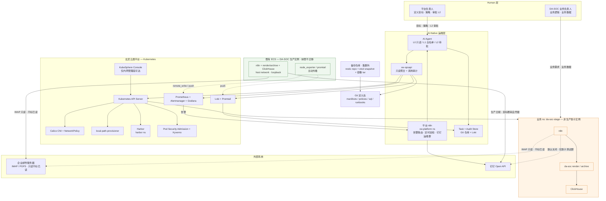
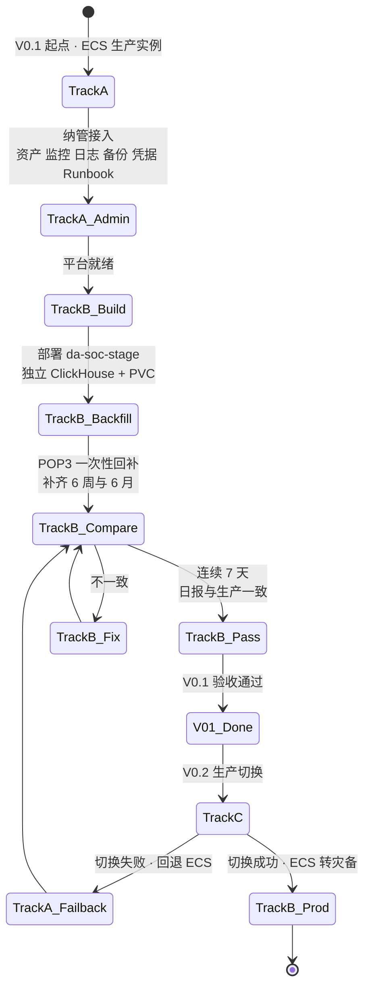
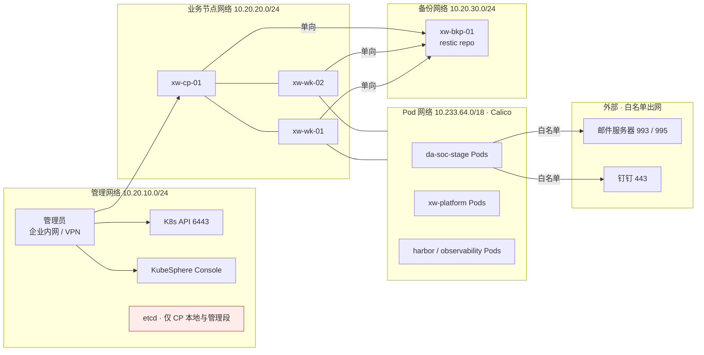

# 玄武云盾 V0.1 独立架构设计

> **文档性质：** 候选 V0.1 架构方案（Candidate，非 Baseline）
> **设计者角色：** 玄武云盾 V0.1 首席架构师（独立设计）
> **设计依据：** `README.md` / `TODO.md` / DA-SOC v0.1（prompt v6.5）业务约束 / 独立架构判断
> **未参考：** 任何其他 Agent 的输出、评审记录、Git 历史或临时文件

---

## 1. Executive Summary

玄武云盾 V0.1 的唯一核心目标是：

> **让 DA-SOC v0.1 在玄武云盾上稳定运行，并验证 AI-Native 运维模式。**

我的核心判断是：**V0.1 不应该把 DA-SOC 生产实例迁移进 Kubernetes。**

理由很简单：DA-SOC v0.1 是一条**已经在产、且对「确定性」有硬要求的日报链路**（数字只能来自 ClickHouse SQL，图只能来自 render 服务，失败即不入库/不出图/不发送）。它的三个组件（ClickHouse / render+archive / n8n）今天通过 `127.0.0.1` loopback 在 host network 上通信，镜像靠离线 `docker save/load` 交付。在 V0.1 同时完成「从零建集群 + 迁移生产业务 + 建 AI Ops」这三件事，等于把一个已验证的确定性系统，交给一个尚未验证的平台去赌。

因此我推荐的 V0.1 是：

> **平台先行、纳管先行、迁移后置、影子对照。**

即一套 **双轨承载（Two-Track Hosting）** 架构：

| 轨道 | 内容 | V0.1 状态 |
|---|---|---|
| **Track A｜生产实例** | DA-SOC v0.1 继续运行在既有 ECS，**业务实现零改动** | 纳入平台**纳管**（资产/监控/日志/备份/凭据/Runbook/AI Ops） |
| **Track B｜影子实例** | DA-SOC 全链路在 K8s `da-soc-stage` 命名空间复刻（独立 ClickHouse、独立 PVC、DingTalk 默认关闭） | **必须建成**，连续 7 天与生产实例输出一致即通过 V0.1 验收 |
| **Track C｜生产切换** | Track A 退役、Track B 转正，ECS 转为回滚备份 | **V0.2 执行，不在 V0.1** |

平台侧 V0.1 只建**一套**能力，不建第二套：

- 3 节点 KubeSphere/Kubernetes 集群（1 CP + 2 Worker）+ 1 台集群外备份/中转节点
- 集群内 Harbor（精简部署，不开漏洞扫描门禁）
- Prometheus + Loki：一套监控、一套日志
- restic + etcd snapshot + Git 化清单的备份/恢复体系（不上 Velero）
- Kubernetes 原生 Audit + 最小 AI Ops 闭环（Agent → 只读聚合层 → L0/L1 自动、L2 人工审批 → 审计入 Git）

一句话概括我的架构立场：

> **V0.1 不追求「DA-SOC 跑在 K8s 上」，而追求「DA-SOC 已经在玄武云盾的治理、可观测、备份、审计和 AI Ops 闭环之内，并且我们已经证明它能跑在 K8s 上」。**

---

## 2. Understanding of Project Goals

### 2.1 我从 README.md 读到的真实目标

README 表面在描述一个企业级私有云，但真正决定 V0.1 形态的是这几句话：

1. **「企业内部缺少成熟、专职的 Kubernetes / 云原生运维团队」**
   → 这意味着：**任何需要专家才能排障的技术，都是负资产。** 技术选型的首要标准不是「先进」，而是「资料多、可检索、可 AI 辅助排障、失败模式可理解」。

2. **「即使没有某个专家长期驻场，其他人员也能够按照文档、策略、Runbook 和 AI Agent 的指导完成标准化运维」**
   → 这意味着：**平台的定义态（Git）比平台的运行态更重要。** 如果集群可以从 Git 重建，「集群坏了找谁」这个问题就被结构性消解了。

3. **「V0.1 唯一核心目标：让 DA-SOC v0.1 在玄武云盾上稳定运行，并验证 AI-Native 运维模式」**
   → 这是两个目标，不是三个。**稳定运行**是约束，**验证 AI-Native** 是实验。V0.1 所有建设都必须能追溯到这两点之一。

4. **「安全优先，但不过度复杂化」「V0.1 解决实际问题，不追求一次性完美」**
   → 这是对我最直接的授权：**主动砍东西是我的职责，不是失职。**

### 2.2 最终目标（V1.0）与 V0.1 的关系

README 描述的 V1.0 是「AI 完成绝大部分标准化平台运维、所有高风险操作可审批可审计可回滚」。这是一个**长期运营状态**，不是一个**可安装的功能集**。

V0.1 的任务不是实现它的 20%，而是**验证它的可行性**：证明「人定义策略 → Agent 观察 → 分析 → 计划 → 审批 → 执行 → 验证 → 审计」这条闭环在本企业环境里真的能跑通一次。

### 2.3 我对「成功标准」的理解

README §22 的成功标准很好，但我认为 V0.1 的**判定性成功标准**只有 4 条：

| # | 判定标准 | 为什么是判定性的 |
|---|---|---|
| S1 | DA-SOC 生产日报**一天没断**，且数字与历史一致 | 业务底线，断一天即 V0.1 失败 |
| S2 | DA-SOC 影子实例在 K8s 上**连续 7 天产出与生产一致的日报** | 证明承载可行，V0.2 可切换 |
| S3 | 从 Git 定义态**完整重建一次集群**（或隔离环境演练），DA-SOC 影子实例恢复成功 | 证明「可恢复」不是口号 |
| S4 | Agent 完成至少一次 **L0 巡检 → 发现异常 → 生成 Task → 通知 → L2 人工审批 → 执行 → 验证 → 审计入 Git** 的完整闭环 | 证明 AI-Native 模式成立 |

任何不满足 S1–S4 的 V0.1，即使组件全部装完，也不应宣布完成。

---

## 3. DA-SOC v0.1 Constraints

### 3.1 已确定的业务实现（不可改）

| 项 | 现状 | 平台设计含义 |
|---|---|---|
| 一次性回补 | `POP3 → /data/da-soc/raw → HTTP INSERT → ClickHouse` | 数据**可从邮件重放**，这是最重要的可恢复性资产 |
| 日常流程 | `IMAP(ALL,不标已读) → Filter → POST /archive → 解析入库 → HTTP SQL → POST /render → 钉钉测试群` | 全链路串行，任一环节失败即中断 |
| ClickHouse | Docker `clickhouse/clickhouse-server`，host network，`127.0.0.1:8123` HTTP | 有状态单实例；当前**仅监听 loopback**，是最强的安全属性之一 |
| render/archive | `da-soc-render:0.1`，`127.0.0.1:8091` | 无状态，可多副本（V0.1 不必） |
| n8n | `ghcr.io/deluxebear/n8n:chs` 2.15.0，host network | 编排权归属；工作流 JSON 由 `tools/build_workflow.py` 生成 |
| 镜像交付 | ECS 不能直连 Registry，`docker save → 上传 → docker load` | **离线导入通道必须长期保留**，不能假设集群能连公网 Registry |
| SQL | 源在 `v0.1/sql/`，由 `build_workflow.py` 嵌入 JSON（路径 A）；禁止 n8n UI 改 SQL、禁止社区 ClickHouse 节点 | SQL 是**代码资产**，必须进 Git；平台不得提供「绕过路径 A」的便利 |
| 6 个 Python 脚本 | 日常禁用，仅作对照；`run_pipeline.py` 不承担生产编排 | 平台不得把它们重新拉起来当编排器 |

### 3.2 核心纪律（必须上升为平台约束）

| 纪律 | 平台侧落地方式 |
|---|---|
| **数据确定性**：数字只来自 ClickHouse SQL → `v_daily_winner`；LLM 不得出数、不得出图 | 写入 `04-security/` 与 `07-aiops/` 策略：**Agent 对 DA-SOC 业务数据只有「引用」权，没有「生成」权**。Agent 输出中出现的任何 DA-SOC 统计数字，必须附带 SQL 执行证据（时间+语句+返回），否则视为违规 |
| **无数据 = null / 暂无数据，不得填 0** | 平台不干预数值；但在可观测性上，DA-SOC「空结果」与「链路失败」必须是**两个不同的告警**，禁止混 |
| **/archive 失败 → 不入库、不出图、不发送** | 平台把 `archive` 成功率作为 DA-SOC 的**一等业务 SLI**，生产与影子都要采集 |
| **钉钉目标群只能来自凭据** | 平台统一凭据托管；**禁止**任何 Agent 或工作流硬编码群 ID/机器人 token；影子实例默认不发钉钉 |
| **不得对生产收件箱 Mark as Read** | 平台侧增加邮件操作审计项：只监控是否出现 `STORE`/`SEEN` 类操作，不干预读取 |
| **不得覆盖「监测bjfz邮箱广电报送信息」** | 影子实例使用**独立的 ClickHouse 实例与独立 PVC**，物理上不可能覆盖生产数据；这是我把影子设计成「独立库」而非「共享库只读副本」的首要原因 |

### 3.3 我对 DA-SOC 规模的事实判断

- 数据量：邮件正文 + 附件 + ClickHouse 表，**GB 级，不是 TB 级**
- 并发：每日一次批处理，**无在线并发压力**
- 可用性要求：日报延迟可容忍（小时级），**中断不可容忍**
- 组件数：3 个（CH / render-archive / n8n）

**结论：DA-SOC v0.1 对平台的需求是「稳定 + 可恢复 + 可审计」，不是「弹性 + 高性能 + 多租户」。** 这一点直接决定了后文几乎所有技术选型。

---

## 4. V0.1 Design Principles

我为本设计确立 8 条原则，冲突时按顺序优先：

| # | 原则 | 含义 |
|---|---|---|
| **P1** | **不破坏已验证的确定性** | DA-SOC 生产链路零改动优先于平台一致性 |
| **P2** | **Definition First，运行时可重建** | 集群、策略、DA-SOC 清单、SQL 全部 Git 化；「能重建」优先于「不坏」 |
| **P3** | **一套能力，不建第二套** | 一套监控、一套日志、一个 Registry、一个编排总线；出现第二套即视为设计失败 |
| **P4** | **最小权限 + 默认拒绝** | 网络、RBAC、Pod 权限三处同时落地，任何例外必须登记 ADR |
| **P5** | **可恢复优先于可靠性** | 接受单点（单 CP、本地存储），但必须证明恢复路径真实可用 |
| **P6** | **为无专家团队选型** | 技术成熟度与资料密度 > 技术先进性 |
| **P7** | **IT / Business 用 Namespace 硬隔离** | 边界靠机制落地，不靠约定 |
| **P8** | **AI 有权限边界，无判断垄断** | Agent 能读全、能建议、能执行白名单；L2 一律人工；所有动作留证 |

### 4.1 三个「不因为」

- **不因为**「未来要承载企业核心业务」就现在建企业级私有云 → 多租户、服务目录、SLA 体系全部延后
- **不因为**某种存储/网络技术「更企业级」就采用 → 分布式存储、Service Mesh、Cilium L7 全部延后
- **不因为** README 的 V0.1 列表里写了 Harbor/CIS/EDR 就照单全收 → 见 §21 削减清单与理由

---

## 5. Recommended V0.1 Architecture

### 5.1 一句话定义

> **一套 3 节点的 KubeSphere/Kubernetes 平台（含集群内 Harbor、Prometheus+Loki 观测、restic/etcd 备份、K8s 原生审计、最小 AI Ops 闭环），以「纳管」方式把既有 ECS 上的 DA-SOC 生产实例纳入平台治理，并以「影子实例」方式在 K8s 内完整复刻并验证 DA-SOC 全链路，为 V0.2 的生产切换提供已验证路径与回滚保障。**

### 5.2 能力清单（V0.1 只做这些）

```text
玄武云盾 V0.1
│
├── 01 基础设施
│   ├── 3 × VM（1 Control Plane + 2 Worker）      Ubuntu 22.04 LTS
│   ├── 1 × 备份/中转节点（集群外）                 restic repo + 离线镜像中转
│   ├── 静态 IP / 内网 DNS / NTP（复用企业现有）
│   └── Linux 安全基线（SSH key、防火墙、补丁、auditd、时间同步）
│
├── 02 Kubernetes 平台
│   ├── Kubernetes 1.27.x（containerd）           via KubeKey 3.1.x
│   ├── KubeSphere 3.4.x（最小组件集）             禁用 日志/DevOps/Mesh/应用商店
│   ├── Calico CNI + NetworkPolicy
│   ├── local-path-provisioner（CSI）
│   └── Namespace / RBAC / ResourceQuota / Pod Security Admission
│
├── 03 Registry
│   └── Harbor（集群内，精简：不开漏洞扫描门禁 / 不开 Notary）
│
├── 04 Observability
│   ├── Prometheus + Alertmanager + Grafana（KubeSphere 可插拔监控）
│   ├── Loki + Promtail（含 Kube Events）
│   └── Alertmanager → 平台 n8n → 钉钉运维群
│
├── 05 Backup & Recovery
│   ├── etcd snapshot（每 6h）
│   ├── 集群资源 Git 化 + 定时全量导出
│   ├── restic 文件级备份（CH 数据 / raw 归档 / Harbor / n8n）
│   └── 3 项强制恢复演练
│
├── 06 Security
│   ├── K8s 原生 Audit Policy → Loki
│   ├── Secret 静态加密（EncryptionConfiguration）
│   ├── 四类身份 + 最小 RBAC
│   ├── Pod Security Admission（restricted/baseline + 例外登记）
│   └── Kyverno（建议项，4 条策略）
│
├── 07 AI Ops MVP
│   ├── xw-opsapi：只读聚合层（K8s/Prom/Loki/Git）+ 审计
│   ├── Agent（IDE/CLI 型）+ 受限 kubeconfig
│   ├── L0/L1/L2 分级与审批
│   └── 审计日志入 Git
│
└── 08 DA-SOC 承载
    ├── Track A：ECS 生产实例（纳管不迁移）
    └── Track B：K8s 影子实例（da-soc-stage，非生产）
```

---

## 6. Logical Architecture Diagram



### 6.1 DA-SOC 承载双轨状态机



### 6.2 网络分区示意



---

## 7. Infrastructure Architecture

### 7.1 VM 规划

| 节点 | 角色 | 数量 | vCPU | 内存 | 系统盘 | 数据盘 | 说明 |
|---|---|---:|---:|---:|---:|---:|---|
| `xw-cp-01` | Control Plane + etcd | 1 | 8 | 16 GB | 200 GB SSD | 100 GB SSD（etcd 专用） | 打 `NoSchedule` 污点；运行 KubeSphere 核心 |
| `xw-wk-01` | Worker（平台服务） | 1 | 8 | 32 GB | 300 GB SSD | 500 GB（local-path + Harbor） | Harbor、Prometheus、Loki、`xw-platform` |
| `xw-wk-02` | Worker（业务） | 1 | 8 | 32 GB | 300 GB SSD | 500 GB（local-path） | `da-soc-stage`（V0.2 转生产） |
| `xw-bkp-01` | 备份仓库 / 离线镜像中转 | 1 | 4 | 8 GB | 200 GB | 2 TB | restic repo、etcd snapshot、镜像 tar；**独立于集群故障域** |
| （既有）ECS | DA-SOC 生产实例 | 1 | — | — | — | — | **纳管对象，不改配置** |

合计新增：**4 台 VM，28 vCPU / 88 GB 内存 / 约 3.1 TB 存储**。

**降级方案：** 若资源紧张可压到 3 台（1 CP + 2 Worker），但**必须保住独立的备份节点**（哪怕是一台小规格 VM 或企业现有 NAS/对象存储）——备份与集群同故障域会直接破坏 P5。若必须削减，优先把 Harbor 移到备份节点，而不是砍掉备份隔离。

**为什么不建 3 个 Control Plane：** V0.1 接受单 CP 单点，前提是 §14 的「集群可重建」已演练通过。3 CP 会把 VM 数从 4 涨到 6，且 etcd 调优与排障门槛显著上升，与 P6 冲突。**V0.2 扩到 3 CP** 是既定演进项。

### 7.2 操作系统与基础依赖

| 项 | 选择 | 理由 |
|---|---|---|
| OS | **Ubuntu 22.04 LTS**（备选 Rocky Linux 9） | 资料密度最高、AI 检索最准、KubeKey 支持成熟（P6） |
| 容器运行时 | containerd（KubeKey 默认） | K8s 1.27 标准选择，KubeSphere 生态一致 |
| 文件系统 | 系统 ext4 / 数据盘 xfs | 不引入特殊 FS 依赖 |
| Swap | 关闭 | kubelet 要求 |
| 内核参数 | `ip_forward=1`、bridge-nf-call-iptables、`vm.max_map_count`（ClickHouse 需要） | CNI 与 CH 依赖 |
| 时间同步 | chrony → 企业内网 NTP（**复用现有，不新建**） | 时间漂移会破坏审计与 ClickHouse 时间口径 |
| DNS | 内网 DNS 解析 `*.xw.internal`；集群内 CoreDNS | 复用企业 DNS，不新建 DNS 服务器 |
| 主机名规范 | `xw-<role>-<seq>` | 便于资产表与 Agent 检索 |
| 基础包 | curl / jq / git / rsync / restic / kubectl / helm | Agent 与运维脚本依赖 |

### 7.3 Linux 安全基线（V0.1 必做）

- 禁止 root SSH 直登；仅 SSH 公钥；`sudo` 需授权
- 主机防火墙：仅放行管理段 → 22；集群内部端口；出方向按需
- 最小化安装，关闭无用服务；`auditd` 开启（记录 `/etc/kubernetes`、kubelet 配置变更）
- AppArmor 保持默认启用（Ubuntu）
- 系统补丁：月度窗口 + 记录；紧急补丁走例外流程
- 所有基线操作以脚本 + Git 记录，禁止纯手工

---

## 8. Kubernetes / KubeSphere Architecture

### 8.1 版本与安装方式

| 项 | 选择 | 理由 |
|---|---|---|
| 安装器 | **KubeKey 3.1.x** | 同时装 K8s + KubeSphere，一个配置文件、可重复执行、可进 Git（P2） |
| Kubernetes | **1.27.x**（补丁取当前稳定次新版） | 仍在维护窗口，生态兼容好；不追最新大版本的新特性 |
| KubeSphere | **3.4.x** | 成熟稳定、文档与社区资料最充分；**KS 4.x（LuBan）架构变化大，对无专家团队风险过高** |
| CNI | **Calico**（KubeKey 默认） | NetworkPolicy 支持成熟、排障资料密度最高、无 eBPF 内核依赖 |
| CSI | **local-path-provisioner** | 见 §10 |
| Ingress Controller | **不部署**（V0.1） | 见 §9.5 |

### 8.2 KubeSphere 组件开关（关键的范围控制动作）

| 组件 | V0.1 | 理由 |
|---|---|---|
| Monitoring（Prometheus） | 开 | 唯一监控栈 |
| **Logging（Fluent Bit + ES/OpenSearch）** | **关** | ES 资源消耗大、运维重；改用 Loki（P3） |
| **Auditing（KS 审计组件）** | **关**（若强依赖 ES） | 用 Kubernetes 原生 Audit 覆盖，避免引入 ES |
| DevOps（Jenkins） | 关 | DA-SOC 的 CI 需求为零；V0.3 再评估 |
| Service Mesh（Istio） | 关 | 明确禁止过早 Service Mesh |
| App Store / OpenPitrix | 关 | V0.5 多租户时再说 |
| Edge / Multicluster | 关 | V0.4+ |
| Alerting / Notification | 部分 | 告警走 Alertmanager → 平台 n8n，避免两套通知机制（P3） |

> **这张表本身就是 V0.1 范围控制的核心交付物。** KubeSphere 默认「全量安装」会直接把 V0.1 变成 V1.0。

### 8.3 Namespace 设计

| Namespace | 归属 | 用途 | Pod Security | ResourceQuota |
|---|---|---|---|---|
| `kube-system` | IT | CNI / CoreDNS / CSI | baseline（例外登记） | 无 |
| `kubesphere-system` / `kubesphere-controls-system` / `kubesphere-monitoring-system` | IT | 平台控制面与监控 | baseline | 有（防平台组件吃掉业务资源） |
| `harbor` | IT | Harbor | baseline | 有 |
| `xw-platform` | IT | 平台运维 n8n、`xw-opsapi`、备份 Job | **restricted** | 有 |
| `xw-observability` | IT | Loki / Promtail / Grafana | baseline / restricted | 有 |
| `da-soc-stage` | **Business** | DA-SOC 影子实例 | restricted（CH 例外登记） | 有 |
| `da-soc`（预留） | Business | V0.2 生产切换目标 | restricted | 有 |
| `xw-agent` | IT | Agent ServiceAccount 所在 | restricted | 有 |

**命名原则：** `xw-*` = 平台（IT）；`<业务名>*` = 业务。Agent 可据此自动判断边界。

### 8.4 RBAC 设计

| 身份 | 类型 | 范围 | 权限 |
|---|---|---|---|
| `platform-admin` | 人 | cluster | cluster-admin，**仅 1–2 人，禁止日常使用**，仅用于 break-glass（双人 + 记录） |
| `platform-operator` | 人 | cluster（不含 `da-soc*` 的 Secret） | 节点/平台组件管理；**不能读业务 Secret** |
| `da-soc-owner` | 人（业务） | `da-soc-stage` / `da-soc` | Deployment/ConfigMap/Service/PVC/Job 管理；**不能改 NetworkPolicy、Quota、RBAC** |
| `auditor` | 人 / 系统 | cluster | 只读 + 审计日志读 |
| `sa/xw-agent-read` | SA | cluster | **只读**（get/list/watch），**无 Secret 读权限** |
| `sa/xw-agent-exec` | SA | `xw-platform`、`da-soc-stage`（受限 verbs） | 仅白名单动作：pod delete、deployment scale、job create；**不含** Secret / NetworkPolicy / RBAC / Node |
| `sa/da-soc-app` | SA | `da-soc-stage` | 业务自身；不需要时 `automountServiceAccountToken: false` |

**强制约束：**
- `default` ServiceAccount 禁止自动挂载 token（Namespace 级默认）
- 禁止为业务 ServiceAccount 绑定 cluster-admin；违反即 Kyverno/审计拦截
- 所有权限申请与变更走 Git 记录（ADR + Change）

### 8.5 ResourceQuota / LimitRange

每个业务 Namespace 强制设置：

```yaml
ResourceQuota: requests.cpu 4 / requests.memory 8Gi / limits.cpu 8 / limits.memory 16Gi
               persistentvolumeclaims 6 / services.loadbalancers 0 / services.nodeports 0
LimitRange:    default request 100m/128Mi, default limit 1/1Gi, max 4/8Gi
```

**`services.loadbalancers: 0` 与 `services.nodeports: 0` 是硬约束**——直接堵死「业务绕过 Ingress 策略私自暴露端口」的路径。

### 8.6 集群生命周期

- 安装/升级/扩缩容**只通过 KubeKey + Git 中的配置文件**执行，禁止手工 `kubeadm`
- 集群「定义态」包含：KubeKey config、Helm values、Namespace/RBAC/Quota/NetworkPolicy 清单、Harbor 项目配置
- **V0.1 必须完成一次「从 Git 定义态重建集群」的演练**（隔离网段或影子环境），否则 P2 不成立
- 节点上下线走 Runbook + 变更记录

---

## 9. Network Architecture

### 9.1 网络分区

| 网络 | 网段示例 | 承载 | 可达性 |
|---|---|---|---|
| 管理网络（管理面） | `10.20.10.0/24` | SSH、K8s API 6443、KubeSphere Console | **仅企业内网管理段 / VPN**；禁止公网 |
| 业务（节点）网络 | `10.20.20.0/24` | 节点间通信、出网 | 内网互通 + 受限出网 |
| Pod 网络 | `10.233.64.0/18`（Calico） | Pod ↔ Pod | 集群内 |
| Service 网络 | `10.233.0.0/18` | ClusterIP | 集群内 |
| 备份/中转网络 | `10.20.30.0/24` | restic、etcd snapshot、镜像中转 | **仅允许集群 → 备份节点单向** |
| 外部网络 | — | 邮件服务器、钉钉 | **白名单出网**（见 §9.4） |

> 网段为企业实际网段的占位示例，实施时替换并登记到 `12-assets/`。

### 9.2 访问控制矩阵（关键）

| 源 \\ 目的 | 管理段 | K8s API | KubeSphere | Pod 网络 | 备份节点 | 邮件服务器 | 钉钉 | 公网通用 |
|---|---|---|---|---|---|---|---|---|
| 管理员（内网） | 允许 | 允许 | 允许 | 拒绝 | 允许 | 拒绝 | 拒绝 | 拒绝 |
| K8s 节点 | 拒绝 | 允许 | 允许 | 允许 | 允许（单向） | — | — | 拒绝 |
| 平台 Pod | 拒绝 | 按需 | — | 允许 | 拒绝 | — | — | 拒绝 |
| `da-soc-stage` Pod | 拒绝 | 拒绝 | 拒绝 | 受限 | 拒绝 | 允许 993/995 | 允许 443 | 拒绝 |
| ECS（DA-SOC 生产） | 允许（SSH） | 拒绝 | 拒绝 | 拒绝 | 允许 | 允许 | 允许 | 拒绝 |
| 备份节点 | 拒绝 | 拒绝 | 拒绝 | 拒绝 | — | 拒绝 | 拒绝 | 拒绝 |
| 互联网 | 拒绝 | 拒绝 | 拒绝 | 拒绝 | 拒绝 | 拒绝 | 拒绝 | 拒绝 |

### 9.3 管理面

- **Kubernetes API 6443 只在管理网络监听**，绝不暴露公网（README 红线）
- **etcd 只在 `xw-cp-01` 本地 / 管理网段内监听**，不出业务网络
- KubeSphere Console 通过内网 NodePort/LB 暴露到管理段，**不上公网域名**
- 管理访问链路：管理员 → 企业内网/VPN → 管理段 → K8s API / SSH
- **V0.1 不新建堡垒机**（延后 V0.2），但所有 SSH 必须走密钥 + 独立账号，禁止共享账号

### 9.4 DA-SOC 出网

DA-SOC 只需要 3 类出网：

| 目标 | 协议/端口 | 用途 | 控制方式 |
|---|---|---|---|
| 企业邮件服务器 | IMAP 993 / POP3 995 | 日常（IMAP，不标已读）/ 一次性回补（POP3） | 边界防火墙白名单（IP + 端口） |
| `oapi.dingtalk.com` | HTTPS 443 | 钉钉发送 | 边界防火墙白名单（域名，由出口网关解析） |
| 内网 DNS / NTP | 53 / 123 | 基础 | 内网 |

**关键专业判断：NetworkPolicy 无法可靠地做「出网域名白名单」**（钉钉 API 是动态 IP）。因此：

> **东西向隔离用 NetworkPolicy（集群内），南北向出网用边界防火墙/出口网关（集群外）。两者职责不重叠、不互相替代。**

NetworkPolicy 只负责集群内的「默认拒绝 + 明确允许」；出网白名单在边界防火墙上配置并登记到 `12-assets`。

### 9.5 Ingress：V0.1 明确不做

DA-SOC 是**内部批处理**，没有对外 HTTP 服务。因此：

**V0.1 不部署 Ingress Controller，不提供南北向业务入口。**
- KubeSphere Console 用 NodePort 在管理段访问
- Harbor 用 NodePort/内网域名在管理段访问
- 若确需内部 HTTP 暴露，走 ClusterIP + 管理段跳板访问，**不开 NodePort**（Quota 已设为 0）

这是 V0.1 最直接的攻击面削减动作之一。

### 9.6 NetworkPolicy 设计

**基线：每个业务/平台 Namespace 默认 `default-deny` Ingress + Egress**，然后逐条放行。

| Namespace | 放行规则 |
|---|---|
| `da-soc-stage` | ① Egress → `kube-dns` 53；② Ingress ← `xw-observability`（抓取）；③ 内部：n8n → render/archive:8091 → ClickHouse:8123；④ Egress → 邮件/钉钉（**边界防火墙兜底**，NP 侧按端口放行并注明理由） |
| `xw-platform` | Egress → K8s API、Prometheus、Loki、钉钉；Ingress ← 管理员段（n8n UI） |
| `harbor` | Ingress ← 所有节点的 containerd；Egress → 备份（Job） |
| `xw-observability` | Ingress ← 全网（抓取）；Egress → 备份、钉钉 |

**验收标准（硬）：**「允许的流量必须通，**禁止的流量必须真的不通**」，用 `nc`/`curl` 逐条验证并形成 `V0.1 NetworkPolicy Validation Report`。

---

## 10. Storage Architecture

### 10.1 DA-SOC 实际需要什么

| 数据 | 形态 | 量级 | 读写模式 | 共享需求 |
|---|---|---|---|---|
| ClickHouse 数据 | 有状态单实例 | GB 级 | 单 Pod 读写 | **无**（单实例） |
| `/data/da-soc/raw` 邮件归档 | 文件 | GB 级 | 追加写 / 回补读 | 无 |
| n8n 数据（workflow + credentials DB） | 有状态 | MB–GB | 单 Pod 读写 | **无** |
| 平台数据（Prometheus TSDB、Loki chunks、Harbor） | 有状态 | 10–100 GB | 单 Pod 读写 | 无 |
| 备份 | 文件 | 100 GB+ | 写多读少 | **需异地副本** |

**结论：DA-SOC v0.1 零共享存储需求。**

### 10.2 因此：V0.1 不做分布式存储

**明确不采用**：Ceph / Rook / Longhorn / GlusterFS / 分布式 MinIO。

理由：
- 无共享读写需求 → 分布式的核心价值用不上
- 分布式存储是**运维复杂度最高的组件之一**，与 P6（无专家团队）直接冲突
- 分布式存储的故障模式最难被 Agent 可靠诊断

**V0.1 采用：`local-path-provisioner`（hostPath 类 CSI）**

| 项 | 设计 |
|---|---|
| StorageClass | `local-path`（默认）+ `local-path-retain`（用于 CH / n8n，`reclaimPolicy: Retain`） |
| 数据位置 | Worker 节点数据盘 `/data/xw-pv/<ns>/<pvc>` |
| 调度 | 有状态 Pod 由 PV 节点亲和固定（local-path 自动处理） |
| 限制 | **Pod 不能跨节点漂移**；节点故障需恢复而非漂移 |
| 应对 | CH 数据可从**邮件重放**恢复（DA-SOC 的独特优势）+ restic 备份 |

> **这是一个刻意接受的限制。** 我把「不可漂移」换成「可重建 + 可重放」，因为后者对无专家团队更可靠：漂移失败需要现场判断，重放只是执行一个已验证的脚本。

### 10.3 Harbor 存储

Harbor 使用 `local-path` PVC，固定在 `xw-wk-01`，并额外做：
- 镜像清单由 Git 记录（服务 → Harbor 路径 → 版本 → 来源 → 审核人 → 日期，`12-assets/images.yaml`）
- 定期 `docker save` 关键镜像 → 备份节点（保留离线导入能力，对应 ECS 不能连 Registry 的现实）

### 10.4 V0.2+ 演进触发条件

出现以下任一情况才引入 Longhorn/Ceph：
1. 出现需要**跨节点共享读写**的业务
2. 出现要求**节点故障自动漂移**的业务 SLA
3. 集群 Worker ≥ 5 且本地存储运维成本显著上升

---

## 11. Registry Architecture

### 11.1 是否需要？——需要，且是刚需

| 需求 | 说明 |
|---|---|
| **离线镜像中转** | ECS 不能连公网 Registry；集群节点同样可能受限。Harbor 是 `docker save → load → push` 的落地点 |
| **镜像来源管控** | README 红线：「生产镜像必须来自企业认可的 Registry」 |
| **版本与清单可审计** | Agent 需要知道「集群里跑的到底是什么镜像/什么版本」 |
| **集群重建的镜像依赖** | 集群可重建的前提是镜像可重建 |

### 11.2 V0.1 用什么？

**Harbor（集群内 `harbor` 命名空间），精简部署。**

| 能力 | V0.1 | 理由 |
|---|---|---|
| 项目 / 权限 / 机器人账号 | 是 | 最小权限拉镜像 |
| TLS（内网 CA 签发证书） | 是 | 避免 insecure-registry 配置漂移 |
| 保留策略（保留最近 N 个 tag） | 是 | 防磁盘爆 |
| **Trivy 漏洞扫描** | 部署但**不开门禁** | README 把漏洞运营放在 V0.3；V0.1 只做「能扫、有报告」 |
| Notary / 镜像签名 | 否 | V0.3+ |
| 跨集群复制 | 否 | 单集群 |
| 多实例 HA | 否 | V0.2+ |

**为什么选 Harbor 而不是裸 `registry:2`：** 差异只有一个组件，但 Harbor 提供 Web UI + API + 项目权限 + 机器人账号，可操作性与**可审计性**显著更好；对无专家团队来说「看得见」比「更轻」更重要（P6）。同时 Harbor 必须**精简**——开启全套（Trivy + Notary）会把 Harbor 变成 10+ Pod 的重组件。

### 11.3 镜像管理流程

```text
镜像来源
  ├── 官方/上游（离线）：能出网的跳板机 docker pull → docker save
  │                     → 传入隔离区 → docker load → docker tag → push Harbor
  ├── 自建（da-soc-render、xw-opsapi）：构建 → push Harbor（tag = 语义版本 + git sha）
  └── 禁止：直接使用未经审核的未知镜像 / 使用 latest tag
```

- **禁止 `latest`**：所有镜像必须带明确版本 tag
- **镜像清单进 Git**：`12-assets/images.yaml` 记录服务 → Harbor 路径 → 版本 → 来源 → 审核人 → 日期
- **集群集成**：containerd 配置 Harbor 为镜像源；每个 Namespace 配置 `imagePullSecret`（Harbor 机器人账号，最小权限）

### 11.4 与 Kubernetes 集成

- `imagePullPolicy: IfNotPresent`（离线/内网环境，减少对外依赖）
- 每个业务 Namespace 一个 Harbor 机器人账号（只 pull 自己项目）
- Kyverno 策略（建议项）：`image` 必须匹配 `<harbor-host>/xw-*/*` 或白名单前缀

---

## 12. Security Architecture

### 12.1 身份与权限

见 §8.4。补充：

| 控制 | V0.1 |
|---|---|
| 管理员账号数 | ≤ 2，禁止共享；break-glass 使用需双人 + 记录 |
| `platform-admin` 日常使用 | **禁止**，日常用 `platform-operator` |
| 业务账号越权测试 | **必做**（尝试改 NetworkPolicy/RBAC/读他人 Secret，必须失败） |
| SA token 自动挂载 | Namespace 级默认关闭 |
| 权限变更 | 全部走 Git（ADR + Change 记录） |

### 12.2 网络安全

见 §9。要点：管理面隔离（API/etcd/Console 不出管理段）、Namespace 默认拒绝、出网白名单在边界防火墙、**不部署 Ingress Controller**。

### 12.3 容器与 Pod 安全

| 控制 | 机制 | V0.1 |
|---|---|---|
| Pod Security | Pod Security Admission | 业务/平台 ns = `restricted`；`kube-system`/监控 = `baseline` + 例外登记 |
| privileged / hostNetwork / hostPID / hostIPC | PSA + Kyverno（建议） | **默认禁止**；例外必须 ADR + 命名空间标注 |
| hostPath | Kyverno 限制只允许 `local-path` 前缀 | 默认禁止其他 hostPath |
| 非 root | PSA `runAsNonRoot` | 强制（CH 镜像例外登记） |
| requests / limits | LimitRange + Kyverno | 强制 |
| 健康检查 | Kyverno 或人工检查 | 强制 liveness/readiness |
| 只读根文件系统 | 建议，非强制 | 影子实例先验证 |
| 能力降权 | `drop: ["ALL"]` | 强制（例外登记） |

**DA-SOC 影子实例的例外登记（诚实披露）：**
ClickHouse 官方镜像在 `restricted` 下可能需要调整（文件系统权限、CAP、ulimit）。V0.1 允许 **1 条已登记例外**（`da-soc-stage` 的 CH Pod 使用 `baseline` + 显式 ADR），V0.2 收敛。**绝不因为一个例外而把整个 Namespace 降到 baseline。**

### 12.4 Secret 与凭证管理

| 项 | V0.1 方案 |
|---|---|
| Secret 存储 | Kubernetes Secret + **EncryptionConfiguration 静态加密**（aescbc） |
| 凭据清单 | 邮箱账号、DingTalk token/群 ID、Harbor 机器人账号、Agent token |
| 入 Git | **禁止明文**。Git 只存「凭据清单 + 位置 + 负责人 + 轮换周期」 |
| 注入方式 | 离线注入（`kubectl create secret` 或 sealed 文件），清单里不写值 |
| 轮换 | 邮箱/钉钉凭据每季度轮换，走变更记录 |
| Vault / External Secrets | **V0.3+** |
| DingTalk 目标群 | **只能来自凭据**（DA-SOC 纪律）；影子实例的钉钉凭据为独立条目，默认**禁用发送** |

### 12.5 审计

| 层 | 方案 | V0.1 |
|---|---|---|
| Kubernetes Audit | Audit Policy：Metadata 级记录所有请求；RequestResponse 级记录写操作与 Secret/RBAC/NetworkPolicy | **必须** |
| Audit 日志去向 | 落 `xw-cp-01` 文件 → Promtail → Loki（保留 ≥ 90 天） | 必须 |
| KubeSphere 审计 | 关闭 KS Auditing 组件（避免依赖 ES）；控制台操作由 K8s Audit 覆盖 | 可选 |
| Agent 操作审计 | 每次 Agent 调用经 `xw-opsapi` 落审计日志；每次会话产出 Git 记录（证据/结论/动作/结果/批准人） | **必须** |
| 变更审计 | 所有平台变更走 Git（ADR/Change），禁止「先改后补」 | 必须 |

### 12.6 V0.1 / V0.2 / V0.3 分层

| 能力 | V0.1 必须 | V0.1 建议 | V0.2 | V0.3 |
|---|---|---|---|---|
| K8s 审计 | 是 | | | |
| RBAC + 最小权限 | 是 | | | |
| NetworkPolicy 默认拒绝 | 是 | | | |
| PSA restricted | 是 | | | |
| Secret 静态加密 | 是 | | | |
| 主机安全基线 | 是 | | | |
| 镜像来源策略（Kyverno） | | 是 | | |
| 漏洞扫描（Trivy 报告） | | 是 | | |
| 镜像漏洞门禁 | | | | 是 |
| Runtime Security（Falco 等） | | | | 是 |
| EDR | | | | 是 |
| SIEM / 安全事件管理 | | | 轻量 | 是 |
| Vault / External Secrets | | | | 是 |
| 堡垒机 | | | 是 | |

---

## 13. Observability Architecture

### 13.1 一套监控 + 一套日志（P3 硬约束）

| 能力 | 技术 | 说明 |
|---|---|---|
| Metrics | **Prometheus**（KubeSphere 可插拔监控）+ node-exporter + kube-state-metrics + Alertmanager + Grafana | 唯一监控栈 |
| Logs | **Loki + Promtail** | 唯一日志栈；**禁用 KubeSphere Logging（ES）** |
| Events | `kubernetes-event-exporter` → Loki | K8s Event 是 Agent 排障的高价值输入 |
| Audit | K8s Audit → 文件 → Promtail → Loki | 见 §12.5 |
| Traces | V0.1 不做 | DA-SOC 链路短，链路追踪无收益 |

### 13.2 监控什么

| 层 | 指标 |
|---|---|
| Infrastructure | Node CPU / 内存 / 磁盘（含 24h 满盘预测）/ Disk IO / Node NotReady / NTP 偏移 |
| Kubernetes | API Server 可用性与延迟 / etcd 健康与快照成功 / 调度失败 / PVC Pending / 证书到期（apiserver、kubelet、Harbor） |
| KubeSphere | Console 可用 / ks-apiserver / ks-controller-manager |
| Pod | CPU、内存 vs limit / Restart / CrashLoop / Pending / OOMKilled / ImagePullBackOff |
| Platform | Harbor 可用与磁盘 / Loki 写入成功率 / Prometheus 自身 / 备份 Job 成功与时效 |
| **DA-SOC（业务）** | `archive` 成功率、`render` 成功率、日报按时完成率、空结果（null/暂无数据）次数、n8n execution 失败数、ClickHouse 可用与表行数 |

**DA-SOC 业务指标的边界：** 由**业务侧定义并暴露**（n8n 结束节点 push 到 Pushgateway 或写结构化日志），**平台只负责采集、存储、告警**。这是 IT/Business 边界在可观测性上的具体落地（§17）。

### 13.3 日志在哪里

| 来源 | 采集 | 保留 |
|---|---|---|
| Node 系统日志 | Promtail（`/var/log`） | 30 天 |
| Kubernetes 组件 / Audit | Promtail | 90 天 |
| 容器 stdout | Promtail（K8s 服务发现） | 30 天 |
| K8s Events | event-exporter | 30 天 |
| **ECS 上 DA-SOC 生产实例** | ECS 上部署 Promtail，**主动 push 到 Loki 网关**（避免为 Prometheus 开入站口） | 30 天 |
| DA-SOC 业务结构化日志 | 容器 stdout + 业务自写 | 30 天 |
| Agent 审计 | Git + 可选入 Loki | 永久（Git） |

### 13.4 告警如何产生、发到哪里

```text
Prometheus Rules
      ↓
Alertmanager（分级 + 抑制 + 静默）
      ↓  webhook
平台 n8n（xw-platform ns）
      ↓
钉钉「玄武云盾运维群」   ← 与 DA-SOC 业务群严格分离
      ↓  同时
xw-opsapi / Agent 可查询当前告警列表（AI Ops 输入）
```

V0.1 第一批告警（**只做这 9 条，不加**）：

| # | 告警 | 级别 |
|---|---|---|
| A1 | Node NotReady | Critical |
| A2 | 磁盘 24h 内将满 | Critical |
| A3 | etcd 不健康 / 快照失败 | Critical |
| A4 | API Server 不可用 | Critical |
| A5 | Pod CrashLoopBackOff / OOMKilled | High |
| A6 | 备份失败或备份超龄（> 26h） | High |
| A7 | 证书 < 30 天到期 | High |
| A8 | **DA-SOC archive 失败 / 日报未按时产出** | High（业务） |
| A9 | Harbor / Loki / Prometheus 不可用 | Medium |

**告警纪律：** 每新增一条告警必须回答「谁处理、怎么处理（Runbook 链接）、能不能自动化」。无 Runbook 的告警不允许上线。

### 13.5 Agent 如何获取这些信息

通过 **`xw-opsapi`**（§15），Agent **不直接持有** Prometheus/Loki/K8s 的凭据。

---

## 14. Backup & Recovery Architecture

### 14.1 备份什么

| 对象 | 方式 | 频率 | 保留 | 目标 |
|---|---|---|---|---|
| etcd | `etcdctl snapshot save`（CronJob 或 systemd timer） | 每 6h | 7 天本地 + 30 天远端 | 备份节点 |
| K8s 资源定义 | **Git（唯一事实来源）** + 定时 `kubectl get -A -o yaml` 全量导出 | 每次变更 + 每日 | Git 永久 + 30 天导出 | Git + 备份节点 |
| ClickHouse 数据（影子） | restic（CH 数据目录，或 `BACKUP TO` 到挂载点） | 每日 | 14 天 | 备份节点 |
| `/data/da-soc/raw` 归档 | restic | 每日 | 30 天 | 备份节点 |
| n8n 数据 | restic | 每日 | 14 天 | 备份节点 |
| Harbor 数据 + 关键镜像 tar | restic + `docker save` | 每周 | 8 周 | 备份节点 |
| **ECS 生产 DA-SOC 数据** | restic（ECS agent push） | 每日 | 30 天 | 备份节点 |
| SQL / 工作流 JSON / 平台配置 | **Git** | 每次变更 | 永久 | Git |

### 14.2 为什么不上 Velero

Velero 需要对象存储（MinIO）或兼容 S3，会引入 2 个组件和一个新的运维面。V0.1：
- 无多集群、无跨集群迁移需求
- 无 CSI 快照能力（local-path 不支持快照），Velero 核心价值（快照 + PV 迁移）用不上
- Git 化清单 + etcd 快照 + restic 已覆盖全部恢复场景

**触发条件：** 引入支持快照的 CSI，或需要跨集群迁移 → V0.2/V0.3 上 Velero。

### 14.3 恢复策略（按对象）

| 场景 | 恢复路径 | RTO 目标 |
|---|---|---|
| 单个 Pod 异常 | 控制器自愈；无需备份 | 分钟 |
| 误删 K8s 资源 | `kubectl apply` 回 Git 定义态 | 分钟 |
| Namespace/配置大面积损坏 | Git 定义态重建 + etcd 快照（如需） | 1–2h |
| Control Plane / etcd 损坏 | 新建 CP → 恢复 etcd 快照；或 Git 重建集群 → 应用清单 | 4h |
| DA-SOC 数据丢失 | ① restic 恢复；② **兜底：POP3 一次性回补重放** | 4h |
| Worker 节点丢失（local PV） | 新节点 → Git 重建 → restic 恢复 PV 数据 | 4h |
| 整集群丢失 | 从 Git 定义态重建集群（KubeKey）→ Harbor 恢复 → 清单 apply → 数据 restic 恢复 | 8h |

**「DA-SOC 数据可从邮件重放」是本架构最被低估的资产**——它让 DA-SOC 成为少数「备份失败也不致命」的业务。这条必须写进 Runbook，并**实际演练一次 POP3 重放**。

### 14.4 强制恢复演练（V0.1 必须完成 3 项）

1. **D1：etcd 快照恢复**（隔离环境或影子集群）
2. **D2：从 Git 定义态重建 `da-soc-stage` 全栈**，restic 恢复数据后日报正确
3. **D3：DA-SOC 数据 POP3 重放**（验证兜底恢复路径）

> **没有做过恢复演练的备份，不算完成。** 我完全认同 TODO 的这条原则，并将其提升为 V0.1 的 DoD 硬门槛。

---

## 15. AI-Native Operations Architecture

### 15.1 闭环模型（落地版）

```text
Human（目标 / 策略）
      ↓
Goal / Policy（Git）
      ↓
Agent
      ↓
Observe  → xw-opsapi（K8s / Prometheus / Loki / Git / Runbook）
      ↓
Analyze  → 读取 Runbook + ADR + 资产表 + 告警上下文
      ↓
Plan     → 生成 Task（证据 / 影响 / 方案 / 风险 / 回滚）
      ↓
Risk     → L0 / L1 / L2
      ↓
Approval → L2：钉钉请求人工批准（平台 n8n）
      ↓
Execute  → xw-opsapi 白名单动作 / 受限 kubeconfig / Git
      ↓
Verify   → PromQL / Pod status / HTTP health / 业务 SLI
      ↓
Audit    → 审计日志（Loki）+ Git 记录（07-aiops/logs/YYYY-MM/）
```

### 15.2 Agent 如何获取状态：`xw-opsapi`

**设计：一个极简只读聚合服务（`xw-opsapi`，FastAPI，约 300–500 行）。**

| 端点 | 数据源 | 用途 |
|---|---|---|
| `GET /cluster/nodes` `/pods` `/events` | K8s API（只读 SA） | 资源状态 |
| `GET /metrics/query?promql=` | Prometheus HTTP API | 指标（白名单前缀 + 限流） |
| `GET /logs/query?logql=` | Loki HTTP API | 日志 |
| `GET /alerts` | Alertmanager API | 当前告警 |
| `GET /assets` `/runbooks` | Git 工作区 | 资产、Runbook、ADR |
| `GET /da-soc/status` | 业务暴露的 SLI | 日报状态（**只读引用，禁止 Agent 生成数字**） |

**为什么建它，而不是让 Agent 直接用 kubectl + curl：**
1. **最小权限**：Agent 只拿一个 token，平台侧凭据不落地到 Agent 环境
2. **可审计**：Agent 的「观察」本身可记录（谁在什么时候看了什么）——这对「Agent 是否基于充分证据决策」的复盘至关重要
3. **AI 友好**：统一 JSON 输出，避免 Agent 解析 kubectl 表格文本
4. 成本可控：单 Deployment，无状态

**V0.1 范围：** 只做只读 + 少量 L1 白名单动作；不做通用命令执行。

### 15.3 Agent 如何执行

| 通道 | 用途 | 约束 |
|---|---|---|
| `xw-opsapi` 白名单动作 | L1：restart pod / scale 非生产 / 清理 Completed Job | 每个动作有 dry-run、有审计、有 rollback 定义 |
| Git（写 ADR/Change/Task/Audit） | 所有变更的定义态写入 | Commit 记录即审计 |
| 受限 kubeconfig（只读） | L0 补充查询 | 无写权限 |
| 平台 n8n（webhook） | 告警路由、定时巡检触发、钉钉通知/审批 | 凭据只在 n8n |
| MCP / CLI | V0.2 评估 | — |

**明确不做：** Agent 不得 `kubectl exec` 进业务 Pod 执行写操作；不得直接修改生产 DA-SOC 工作流；不得读写业务 Secret。

### 15.4 Agent 如何验证

| 动作 | 验证 |
|---|---|
| restart pod | Pod Ready 且 `up == 1` 持续 3 分钟 |
| scale | 副本数达标 + 无 Pending + 业务 SLI 无劣化 |
| 清理 Job | Job 列表符合预期（label 选择器 + dry-run 先跑） |
| 配置变更 | apply 成功 + `observedGeneration` 更新 + 相关告警清除 |

验证失败 → 自动执行预定义回滚 → 生成 Incident → 通知人。

### 15.5 Agent 如何回滚

| 变更类型 | 回滚方式 |
|---|---|
| 声明式配置变更 | `git revert` + 重新 apply（**首选：回到定义态，而非反向操作**） |
| Pod 类操作 | 控制器自愈 / 恢复变更前副本数 |
| 数据类 | restic 恢复；DA-SOC 额外可用 POP3 重放 |
| 集群级 | etcd 快照恢复；兜底为集群重建 |

**关键原则：** 所有 Agent 执行的变更必须**先进入 Git**（哪怕是自动 commit），否则不存在回滚基线。这是 P2 在 AI Ops 上的直接推论。

### 15.6 Agent 如何审计

- 每次 Agent 会话产出一条 `07-aiops/logs/YYYY-MM/YYYYMMDD-<task-id>.md`，含：
  `请求 / 读取的上下文 / 证据（PromQL、日志片段、K8s 对象）/ 结论 / 风险等级 / 方案 / 执行动作 / 执行结果 / 验证结果 / 批准人 / 回滚方式`
- `xw-opsapi` 记录每一次调用（时间、身份、参数、响应摘要）→ Loki
- K8s Audit 覆盖所有通过该 SA 的集群写操作
- **可复盘性要求：** 事后任何人（或审计 Agent）仅凭 Git + Loki，能完整重建「Agent 当时为什么这么做」

### 15.7 Agent 形态（V0.1）

**不自建常驻 Agent 平台。** 使用 IDE/CLI 型 Agent（CodeBuddy/同类）+ 项目 Git 工作区 + `xw-opsapi` + 受限 kubeconfig，由人工触发或平台 n8n 定时触发。

理由：常驻 Planner/Executor/Auditor 多 Agent 编排是 README 的 **V0.4** 内容。V0.1 应验证「闭环是否成立」，而不是「闭环是否自动化」。

### 15.8 DA-SOC 纪律向 Agent 的延伸（重要）

| 约束 | 平台策略 |
|---|---|
| LLM 不得出数 | Agent 引用 DA-SOC 数字必须附 SQL 执行证据；**策略级禁止** Agent 自行计算/估算涉案号码统计 |
| LLM 不得出图 | Agent 不得生成日报图；不得改写 `/render` 产物 |
| 无数据不得填 0 | Agent 报告中出现「0」必须能追溯到查询结果；否则按违规处理 |
| `/archive` 失败不发送 | Agent 不得「补发」或手工触发以绕过失败路径 |
| 不得改生产邮箱状态 | Agent 对邮件账号只有只读监控权限 |
| 工作流与 SQL 唯一来源 | Agent 修改 SQL/工作流必须改 `v0.1/sql/` 与 `build_workflow.py`，**禁止 n8n UI 改**；禁止引入社区 ClickHouse 节点 |

---

## 16. Human / AI Responsibility Boundary

### 16.1 权限分级（结合本架构）

| 级别 | 定义 | 本架构中的具体动作 |
|---|---|---|
| **L0 自动读取/检查/报告** | 只读，无需批准 | 查询 Node/Pod/告警/日志；健康检查；生成巡检报告；读取资产与 Runbook；**生成日报状态摘要（仅引用，不出数）**；证书/磁盘/备份状态检查 |
| **L1 策略范围内自动执行** | 预定义白名单 + dry-run + 自动验证 + 自动回滚 | 重启 `da-soc-stage` / `xw-platform` Pod；扩容非生产 Deployment（在 Quota 内）；按 label 清理 Completed/Failed Job；清理过期日志 |
| **L2 必须人工审批** | 生成提案 → 钉钉请求批准 → 批准后执行 | 修改 RBAC / ServiceAccount；修改 NetworkPolicy；修改 CNI/CSI；修改 ResourceQuota；修改 Secret；节点增删；集群升级；etcd 恢复；删除任何 PVC / 生产数据；修改 DA-SOC 生产工作流或 SQL；**任何触及 Track A（ECS 生产实例）的操作**；关闭任何安全控制 |
| **L3 人类专属** | 不建议交给 Agent | 架构决策；业务优先级；安全红线例外；重大 Incident 定级与对外沟通 |

### 16.2 人类负责 / AI 负责

| 人类 | AI |
|---|---|
| 定义目标与策略 | 信息收集与状态检查 |
| 定义安全红线 | 分析与根因推断（附证据） |
| 确定业务优先级 | 生成处理方案与风险评级 |
| 批准 L2/L3 | 执行 L0/L1 并验证 |
| 处理重大例外 | 生成 Task、通知、创建待办 |
| 最终业务决策 | 记录审计、更新知识库 |

### 16.3 Agent 不能越过的一条线

> **Agent 可以改变平台的运行态，但不能单方面改变平台的定义态。**
> 定义态（架构、策略、RBAC、NetworkPolicy、Quota、SQL、工作流）的任何变更，必须经人批准并留下 Git 记录。

---

## 17. IT / Business Boundary

### 17.1 职责划分

| IT / 平台负责 | 业务（DA-SOC）负责 |
|---|---|
| VM / OS / 节点生命周期 | DA-SOC 应用代码与镜像 |
| Kubernetes / KubeSphere 及其升级 | 业务逻辑（解析、入库、SQL、渲染） |
| CNI / NetworkPolicy / 出网白名单 | 业务数据正确性与口径 |
| CSI / StorageClass / PV 供给 | 业务配置（ConfigMap 内容） |
| Harbor 与镜像分发 | 业务指标定义与暴露（SLI） |
| Namespace / RBAC / Quota | 业务日志内容 |
| 平台监控（采集、存储、告警） | 业务 SLA 与验收 |
| 平台日志与审计 | 工作流与 SQL（路径 A） |
| Backup / Restore 机制与演练 | 业务数据的备份内容确认 |
| 安全基线 | 钉钉目标群与凭据的业务确认 |
| Runbook / Incident | 业务故障定位配合 |

### 17.2 边界如何真正落地（机制，不是约定）

| 边界 | 落地机制 |
|---|---|
| 业务不能改集群级资源 | RBAC：业务账号仅有 Namespace 级角色，**不含** NetworkPolicy / ResourceQuota / RBAC / Node / CRD |
| 业务不能绕过网络策略 | ResourceQuota `nodeports: 0`、`loadbalancers: 0`；NetworkPolicy 变更权只在平台 |
| 业务不能无限制吃资源 | ResourceQuota + LimitRange（强制） |
| 业务不能破坏 Pod 安全基线 | PSA `restricted` + Kyverno；业务无法创建 privileged Pod |
| 平台不能碰业务数据与凭据 | 平台账号对 `da-soc*` 的 **Secret 无读权限**；平台只读业务指标，不改业务逻辑 |
| 平台与业务的编排不混用 | **两套 n8n 实例**：`xw-platform`（平台运维）与 DA-SOC 业务 n8n（ECS / `da-soc` ns），互不共享凭据与执行历史 |
| 业务不能绕过镜像仓库 | Kyverno 镜像来源策略 + Harbor 机器人账号 |
| 边界可见可查 | Namespace 命名规范 `xw-*` vs 业务名；资产表登记归属与负责人 |

### 17.3 RACI（关键项）

| 事项 | 平台负责人 | DA-SOC 业务负责人 | Agent |
|---|---|---|---|
| 集群升级 | A/R | I | 提案（L2） |
| NetworkPolicy 变更 | A/R | C | 提案（L2） |
| DA-SOC 应用发布 | C | A/R | 无（V0.1） |
| DA-SOC SQL 与工作流 | I | A/R | 提案（L2，且必须走路径 A） |
| 备份策略 | A/R | C | L0 检查 |
| DA-SOC 数据恢复 | C | A/R | L1 执行（在批准方案内） |
| 告警规则（平台） | A/R | I | 提案（L1/L2） |
| 告警规则（业务 SLI） | C | A/R | L0 引用 |
| 安全例外 | A/R | C | 检测并报告 |

（A=批准/负责，R=执行，C=需咨询，I=需知会）

---

## 18. DA-SOC Hosting Architecture

### 18.1 核心决策：先纳管、后迁移、影子对照

```text
既有 ECS（Track A · 生产 · 零改动）
        │
        ├── 资产登记（12-assets/）        ← 谁负责、跑什么、依赖什么
        ├── 监控接入（node_exporter + CH/render 健康 → 主动 push）
        ├── 日志接入（Promtail → Loki）
        ├── 备份接入（restic → 备份节点）
        ├── 凭据登记（邮箱 / 钉钉，值不入 Git）
        ├── Runbook（DA-SOC 故障处理）
        └── AI Ops（Agent 可观察、可诊断、可提案；L2 才动）

K8s da-soc-stage（Track B · 非生产影子 · V0.1 必须建成）
        │
        ├── 独立 ClickHouse（独立 PVC / 独立库）→ 物理不可能覆盖生产数据
        ├── 独立 n8n（同一工作流 JSON，由 build_workflow.py 生成）
        ├── 独立 render/archive（镜像来自 Harbor）
        ├── 独立 raw 归档 PVC
        ├── 先执行一次性 POP3 回补（补齐 6 周 / 6 月）
        ├── 钉钉发送默认禁用（凭据条目独立且为空/影子群）
        └── 连续 7 天与生产日报比对 → 通过即 V0.1 验收
```

### 18.2 组件归属判断表（明确回答「哪些进 K8s」）

| 组件 | V0.1 决策 | 理由 |
|---|---|---|
| DA-SOC 生产实例（CH + render/archive + n8n） | **留在 ECS，不迁移** | 已验证的确定性链路；V0.1 同时建平台 + 迁移风险不可接受（P1） |
| DA-SOC 影子实例（全套） | **进 K8s（`da-soc-stage`）** | 验证承载可行性；独立库确保不碰生产数据 |
| ClickHouse（生产） | 留 ECS | 同上；且其当前仅监听 loopback 是最强安全属性，迁移过程会临时削弱 |
| n8n（业务编排） | 生产留 ECS；影子在 K8s | 编排权属于 n8n（DA-SOC 纪律），不改为平台组件 |
| Harbor | **进 K8s（`harbor` ns）** | 统一运维域：一套监控/日志/备份/审计（P3）；独占节点避免争抢；镜像 tar 备份保留离线导入兜底 |
| Prometheus / Loki / Grafana | 进 K8s | 平台服务 |
| 平台运维 n8n | **进 K8s（`xw-platform`）** | 与业务 n8n 分离，避免「业务编排器成为平台大脑」 |
| `xw-opsapi` | 进 K8s（`xw-platform`） | 无状态，平台服务 |
| 备份 Job（restic / etcd snapshot） | 进 K8s（CronJob）+ 备份节点 repo | 统一调度与告警 |
| 备份仓库 | **集群外（备份节点）** | 故障域隔离（P5） |
| 6 个 Python 脚本 / `run_pipeline.py` | **不迁移、不启用** | DA-SOC 纪律：日常禁用，仅作对照 |

### 18.3 影子实例的合规设计（对应 DA-SOC 纪律）

| 风险 | 设计对策 |
|---|---|
| 影子实例误发生产钉钉群 | 影子使用**独立凭据条目**，默认值为「禁用发送」；开启仅指向独立影子测试群，且需变更记录 |
| 影子实例 Mark as Read 生产邮箱 | 工作流沿用 `IMAP ALL + 不标已读`；平台侧增加**邮件操作审计**（检测 STORE/SEEN） |
| 影子实例覆盖生产数据 | **独立 ClickHouse 实例 + 独立 PVC**；网络上禁止访问 ECS 的 CH/服务 |
| 影子实例改生产 SQL | SQL 源同一 Git 路径，但影子工作流由独立配置生成，产物打 `-stage` 标记 |
| 影子实例耗尽资源 | ResourceQuota 限制；节点资源已预留 |
| 影子实例被误认为生产 | Namespace 名 `da-soc-stage`；资源打 `xuanwu/track: stage`、`xuanwu/production: "false"` 标签；告警与通知独立 |

### 18.4 V0.2 生产切换的预设条件（V0.1 就要准备好）

1. 影子实例连续 7 天日报与生产一致
2. 节点出网白名单（邮件 + 钉钉）已在切换前开通并验证
3. CH 数据迁移或 POP3 重放已演练成功
4. 生产切换 Runbook 含**明确的回退点**（任一失败 → 切回 ECS，ECS 保持热备 ≥ 2 周）
5. 旧的 `127.0.0.1:8123 / :8091` 硬编码已改为服务名/环境变量（在影子实例中完成改造并验证）

> **第 5 条是迁移前唯一必须改的业务代码。** 它由影子实例承载并完成验证，不影响生产。这正是「影子对照」设计的最大价值：**把迁移期唯一的代码改造风险，隔离在非生产环境。**

---

## 19. Technology Stack

| 能力 | 推荐技术 | V0.1 | 原因 | 复杂度 | AI 可操作性 |
|---|---|---|---|:---:|:---:|
| OS | Ubuntu 22.04 LTS | 是 | 资料密度最高、KubeKey 支持成熟、无专家团队友好 | 低 | 高 |
| 集群安装 | KubeKey 3.1.x | 是 | 一个配置文件装 K8s+KS，可重复、可 Git 化 | 低 | 高 |
| Kubernetes | 1.27.x | 是 | 稳定维护窗口，生态兼容好 | 中 | 高 |
| Management | KubeSphere 3.4.x（最小组件集） | 是 | 中文友好、UI 降低门槛、可对接 RBAC/审计；禁用日志/DevOps/Mesh | 中 | 高 |
| CNI | Calico | 是 | NetworkPolicy 成熟、排障资料多、无 eBPF 门槛 | 中 | 高 |
| CSI | local-path-provisioner | 是 | 零共享需求，最简；以「可重建+可重放」换「不可漂移」 | 低 | 高 |
| Ingress | **不部署** | 否 | DA-SOC 无对外 HTTP 服务；直接削减攻击面 | — | — |
| Registry | Harbor（精简：无 Notary、扫描不开门禁） | 是 | UI/API/权限/机器人账号，可审计性显著优于裸 registry | 中 | 高 |
| Monitoring | Prometheus + Alertmanager + Grafana（KS 可插拔） | 是 | 唯一监控栈，PromQL 生态与资料最丰富 | 中 | 高 |
| Logging | Loki + Promtail | 是 | 轻量、与 Grafana 一体、LogQL 直观；避免 ES 资源开销 | 中 | 高 |
| Events | kubernetes-event-exporter → Loki | 是 | Event 是 Agent 排障高价值输入 | 低 | 高 |
| Backup | restic + etcd snapshot + Git | 是 | 单二进制、去重加密、无额外组件；Git 即定义态 | 低 | 高 |
| Velero | — | 否 | 无 CSI 快照/跨集群需求，避免引入 MinIO | — | — |
| Security（Pod） | Pod Security Admission | 是 | 内置、零成本 | 低 | 高 |
| Security（策略） | Kyverno（4 条策略） | 建议 | 策略即代码；镜像来源/hostNetwork/resources 强制；AI 可读写 | 中 | 高 |
| Security（审计） | Kubernetes Audit → Loki | 是 | 覆盖 KS Auditing 需求且不引入 ES | 中 | 高 |
| Secret | K8s Secret + EncryptionConfiguration | 是 | 够用；Vault 复杂度不匹配 V0.1 | 低 | 中 |
| AI Ops（感知） | `xw-opsapi`（自研只读聚合） | 是 | 最小权限 + 可审计 + AI 友好的统一入口 | 中 | 高 |
| AI Ops（Agent） | IDE/CLI 型 Agent + Git 工作区 | 是 | 不建常驻 Agent 平台（那是 V0.4）；验证闭环优先 | 低 | 高 |
| AI Ops（编排/通知） | 平台 n8n（`xw-platform`） | 是 | 复用已有资产；与业务 n8n 分离 | 低 | 高 |
| 钉钉 | n8n → DingTalk Native API（POC-06A/06C 模式） | 是 | 与 DA-SOC 已验证方式一致；凭据集中管理 | 低 | 中 |
| 分布式存储 | Ceph / Longhorn | 否 | 零共享需求 → V0.2+ 按触发条件引入 | — | — |
| Service Mesh | Istio | 否 | 明确禁止过早 | — | — |
| 堡垒机 | — | 否 | V0.2 | — | — |

**累计 V0.1 自建/部署组件：** Kubernetes + KubeSphere(最小) + Calico + local-path + Harbor + Prometheus + Loki + Kyverno(建议) + restic + `xw-opsapi` + 平台 n8n = **11 个**，其中自研仅 1 个（`xw-opsapi`，约 300–500 行）。

---

## 20. V0.1 Scope

### 20.1 必做（DoD 硬门槛）

| # | 项 |
|---|---|
| S1 | 4 台 VM 就位 + Linux 安全基线 + 静态 IP/DNS/NTP |
| S2 | Kubernetes 1.27 + KubeSphere 3.4 最小组件集（KubeKey，Git 化配置） |
| S3 | Calico + 全 Namespace default-deny NetworkPolicy + 访问控制矩阵验证 |
| S4 | local-path StorageClass + PV/PVC 供给验证 + Retain 策略 |
| S5 | Harbor（精简）+ 镜像导入/拉取流程 + 镜像清单入 Git |
| S6 | Prometheus + Loki + 9 条告警 + 钉钉运维群 |
| S7 | K8s Audit 开启并入 Loki；Secret 静态加密 |
| S8 | RBAC 四类身份 + 越权测试通过；PSA restricted + 例外登记 |
| S9 | 备份体系（etcd / Git / restic）+ **3 项恢复演练全部通过** |
| S10 | **DA-SOC Track A 纳管完成**（资产/监控/日志/备份/凭据/Runbook 六项齐全） |
| S11 | **DA-SOC Track B 影子实例建成**，连续 7 天与生产日报一致 |
| S12 | `xw-opsapi` + Agent 完成一次完整闭环（L0 巡检 → Task → L2 审批 → 执行 → 验证 → 审计） |
| S13 | V0.1 Runbook ≥ 8 篇；ADR ≥ 10 篇；架构文档与实际状态一致 |
| S14 | V0.1 验收报告 + 安全验证报告 + 恢复演练报告 |

### 20.2 建议做（时间允许）

- Kyverno 4 条策略
- Trivy 扫描报告（不开门禁）
- 证书到期告警自动化
- Configuration Drift 检测（**只发现 + 告警 + 建 Task，不自动修复**）
- 平台每日健康报告（Agent 生成）

---

## 21. V0.1 Non-Goals

我主动从 README/TODO 的 V0.1 清单中削减以下内容，并给出理由：

| 削减项 | 来源 | 为什么 V0.1 不做 |
|---|---|---|
| **DA-SOC 生产实例迁移进 K8s** | TODO P2 隐含 | 已验证的确定性链路；V0.1 同时建平台+迁移风险不可接受 → **V0.2，且需影子验证** |
| **分布式存储（Ceph/Longhorn）** | README §5.5 | DA-SOC 零共享需求 → 触发条件出现时再引入 |
| **Ingress Controller** | 常规 K8s 实践 | DA-SOC 无对外 HTTP 服务 → 直接削减攻击面 |
| **Service Mesh** | README §5.2 | 明确禁止过早 |
| **KubeSphere Logging（ES/OpenSearch）** | KS 默认 | 资源重、运维重 → Loki 替代 |
| **KubeSphere Auditing 组件** | KS 可选 | 若依赖 ES 则延后 → K8s Audit 覆盖 |
| **KubeSphere DevOps（Jenkins）** | KS 可选 | DA-SOC 无 CI 需求 |
| **镜像漏洞扫描门禁** | README §8 | README 自身把漏洞运营放 V0.3；V0.1 只做报告 |
| **Notary / 镜像签名** | README §8 | 供应链安全 V0.3+ |
| **EDR / Runtime Security** | TODO TASK-009 | **与 README 冲突**（README 明确 EDR 在 V0.3）→ 移出 V0.1 |
| **SIEM / 完整安全事件管理** | README §16 | README 明确 V0.1 不强制 |
| **多租户 / 服务目录 / SLA 体系** | README V0.5 | V0.5 |
| **多集群** | README §16 | V0.4+ |
| **常驻多 Agent 平台（Planner/Executor/Auditor）** | README V0.4 / TODO | V0.4；V0.1 验证闭环，不自动化闭环 |
| **Vault / External Secrets** | 常见实践 | Secret 静态加密够用 → V0.3 |
| **堡垒机** | README §5.3 | V0.2 |
| **完整 CMDB** | README | 用 Git 资产表（`12-assets/`）替代 → V0.4+ |
| **完整自动修复体系** | README V0.4 | V0.1 只做 L1 白名单 |
| **链路追踪（Tracing）** | README §5.6 | DA-SOC 链路短，无收益 |
| **CIS Benchmark 全量通过** | TODO P1.4 / §19 | V0.1 只做「CIS 关键项检查 + 例外登记」，全量达标是 V0.2/V0.3 目标 |

---

## 22. V0.1 → V1.0 Evolution

| 版本 | 新增什么 | 为什么新增 | 为什么不是 V0.1 做 |
|---|---|---|---|
| **V0.1** | 最小 KubeSphere 平台 + Harbor + Prom/Loki + restic 备份 + K8s Audit + 最小 AI Ops 闭环 + **DA-SOC 纳管 + 影子对照** | 承载与验证 | — |
| **V0.2** | **DA-SOC 生产切换进 K8s**（ECS 转灾备）；Control Plane 扩到 3（去单点）；堡垒机；Velero（若引入可快照 CSI）；CIS 关键项达标；自动巡检常规化；AI Task Center 正式化 | V0.1 已用影子实例证明承载可行，此时切换风险可控；单点在 V0.1 是「已知且可恢复」，V0.2 后业务变重要则不可接受 | V0.1 做迁移会赌上唯一的生产确定性链路；3 CP 在 V0.1 是资源与复杂度的浪费 |
| **V0.3** | 镜像漏洞扫描**门禁**；Runtime Security（Falco）；EDR 接入；轻量 SIEM/安全事件管理；Vault/External Secrets；完整审计留存策略 | 平台从「能跑」走向「能防」；此时已有稳定基线可供比对，安全控制不会误伤业务 | V0.1 引入会同时增加误拦截风险与运维面；安全产品需要稳定基线才能产生有效信号 |
| **V0.4** | 常驻多 Agent 平台（Planner/Executor/Verifier/Auditor）；Policy Engine；自动修复扩大；变更审批工作流化；Configuration Drift 自动收敛；多集群（若需要） | 闭环已被验证，此时才有意义把它自动化与规模化 | V0.1 自动化一个未验证的闭环 = 自动化错误 |
| **V0.5** | 多业务承载；Workspace/多租户；ResourceQuota 精细化；服务目录；标准化业务接入流程；SLA 与生命周期管理 | 出现第二个、第三个业务，平台从「单业务底座」变成「企业平台」 | V0.1 只有一个业务，租户/目录/接入流程都是无对象的过度设计 |
| **V1.0** | 完整 AI-Native SecureOps：AI 完成绝大部分标准化运维；安全运营闭环；完整灾备与演练体系；治理与审计成熟 | 达成 README 最终目标 | 由 V0.1–V0.5 逐步长成，不可能一步到位 |

**演进的一条主线：** 每个版本只解决「上一版本证明存在的真实问题」，不解决「想象中未来会有的问题」。

---

## 23. TODO.md Gap Analysis

### 23.1 保留（架构认可，可直接执行）

| 任务 | 备注 |
|---|---|
| P0.1 项目仓库初始化 | 保留；建议增加「资产表模板」与「镜像清单模板」 |
| P0.2 项目基础文档 | 保留（当前是占位，必须真正填充） |
| P0.3 / P0.4 / P0.5 / P0.6 架构文档 | 保留，但**需修改内容要求**（见 23.2） |
| P0.7 平台治理 | 保留 |
| P0.8 IT / 业务边界 | 保留，**强化**：要求产出 Namespace/RBAC/Quota/NetworkPolicy 落地矩阵，而非仅 RACI |
| P0.9 平台使用规范 | 保留 |
| P0.10 安全基线 | 保留，**分层**为「V0.1 必须 / 建议 / 延后」 |
| P1.1 VM 准备 | 保留，**需补规格与数量**（当前只有动作没有规格） |
| P1.2 Linux 安全基线 | 保留 |
| P1.3 / P1.4 Kubernetes 安装与安全检查 | 保留，CIS 改为「关键项 + 例外登记」 |
| P1.5 CNI | 保留，**结论前置**：V0.1 定 Calico，不必再「评估 Cilium」 |
| P1.6 NetworkPolicy | 保留，**验收标准加硬** |
| P1.7 / P1.8 KubeSphere 安装与安全 | 保留，**必须增加「组件开关清单」** |
| P1.9 Harbor | 保留，**精简**（去 Notary、扫描不开门禁） |
| P1.10 Monitoring / P1.11 Logging | 保留，**锁定一套**：Prometheus + Loki |
| P1.12 Alerting | 保留，**限制为 9 条**，每条必须有 Runbook |
| P1.13 Backup | 保留，**明确不用 Velero**，用 restic + etcd + Git |
| P1.14 Restore | 保留，**提升为 DoD 硬门槛**，且必须含 POP3 重放演练 |
| P2.2 DA-SOC 部署 | 保留，**但改为「影子实例」**，并新增独立 ClickHouse/PVC/关闭钉钉 |
| P2.3 DA-SOC 验收 | 保留，**新增「7 天一致性比对」** |
| P2.4 / P2.5 Workflow 基础与标准事件流 | 保留，**明确为平台运维 n8n，与业务 n8n 分离** |
| P2.6 通知 | 保留，**运维群与业务群分离** |
| P2.7 自然语言运维 / P2.8 高风险审批 | 保留 |
| §16 Runbook / §17 AI 审计 / §19 安全验证 | 保留 |
| §20 故障演练 | 保留，**从 8 项精简为 4 项** |
| §21 最终验收 / §22 DoD | 保留，**需重写** |

### 23.2 修改（需改内容或范围）

| 任务 | 问题 | 修改建议 |
|---|---|---|
| **P2.1 / P2.2 DA-SOC 部署** | 隐含「DA-SOC 直接部署到 K8s 并成为生产」，**没有迁移风险评估、没有回滚路径、没有影子验证** | 改为三阶段：**纳管（Track A）→ 影子实例（Track B）→ V0.2 生产切换**；明确「生产实例 V0.1 不迁移」 |
| **P0.3 总体架构** | 只问「有哪些 VM、谁是 CP」，**不问「DA-SOC 承载策略」** | 增加必答项：DA-SOC 是纳管还是迁移？迁移的前提与回退点？如何证明承载可行？ |
| **P0.4 基础设施架构** | 无 VM 规格与数量，无法执行 | 补齐：4 台 VM 的 CPU/内存/磁盘/OS/网络接口，见 §7.1 |
| **P0.5 网络架构** | 列了「存储网络 / DMZ」，V0.1 用不上；未区分 NP 与防火墙职责 | 删除「存储网络 / DMZ」；增加「**出网白名单由边界防火墙承担，NetworkPolicy 不做域名出网控制**」这一关键判断 |
| **P0.6 K8s / KubeSphere 架构** | 未涉及 KubeSphere 组件开关 | 增加「**KubeSphere 最小组件集**」必答项（禁用日志/DevOps/Mesh/应用商店） |
| **P1.3 Kubernetes 安装** | 未指定版本与安装器 | 明确 KubeKey 3.1.x + K8s 1.27.x + KubeSphere 3.4.x |
| **P1.4 CIS 基础检查** | 定义模糊，易变成无限任务 | 改为「CIS 关键项检查 + 例外登记 ADR」，全量达标移至 V0.2 |
| **P1.9 Harbor** | 未区分部署 / 扫描 / 签名 / 复制 | 明确 V0.1：部署 + 权限 + 保留策略；扫描只出报告不开门禁；Notary/复制不做 |
| **P1.11 Logging** | 未指定技术，易默认走 KubeSphere ES 方案 | 明确「**禁用 KS Logging 组件**，使用 Loki + Promtail」 |
| **P1.13 Backup** | 未指定技术，未区分「平台配置」与「业务数据」 | 明确 restic + etcd snapshot + Git；并增加「**ECS 生产 DA-SOC 数据**」这一备份对象 |
| **§16 Runbook** | 列了 11 篇，部分与 V0.1 无关 | 精简为 8 篇必做：Node Down / Pod CrashLoop / Disk Full / 证书过期 / K8s API 故障 / etcd 故障 / DA-SOC 日报失败 / Backup 失败 |
| **§20 故障演练** | 8 项，其中 KubeSphere/Harbor/etcd 演练成本高 | 精简为 4 项必做：Worker 故障、Pod CrashLoop、磁盘满、**DA-SOC 恢复（含 POP3 重放）**；其余 V0.2 |
| **§22 DoD** | 16 条里混入了 V0.2/V0.3 内容（如 Multi-Agent Audit 完成最小验证） | 重写为以 S1–S4 为核心的判定性 DoD（见 §2.3），其余降级为「建议完成」 |
| **§4 AI Ops 第一批任务 TASK-009 EDR** | **与 README 冲突**（README 明确 EDR 在 V0.3） | 移出 V0.1，改到 V0.3 |
| **§4 TASK-010 每日平台报告** | 合理但优先级过高 | 降为「建议做」 |
| **§5 AI Ops 架构（P2.1）** | 计划 Planner/Executor/Auditor/Security Agent/Operations Agent 全套 | V0.1 只建「Agent + `xw-opsapi` + 平台 n8n」，多 Agent 编排移至 V0.4 |

### 23.3 删除

| 任务 | 删除理由 |
|---|---|
| **TASK-009 EDR / Security Event** | README 明确 EDR 属 V0.3；V0.1 无 EDR 可接 |
| **§19 安全验证中的「etcd 暴露测试 / Kubernetes API 暴露测试」作为独立项** | 属于部署后的扫描动作，合入「安全验证报告」，无需独立任务 |
| **P0.5 中的「存储网络」「DMZ」** | V0.1 无分布式存储、无 DMZ（不部署对外 Ingress） |
| **§20 演练 4/5/6（KubeSphere 异常、Harbor 异常、etcd 恢复）** | 保留 etcd 恢复（合入 D1），KubeSphere/Harbor 演练成本高且 V0.1 非关键路径 |
| **README §5.4 中 V0.1 隐含的「漏洞管理」「Endpoint Security」** | V0.3 |
| **「CIS 全量通过」作为验收项** | 与「V0.1 不追求一次性建设完整安全体系」自相矛盾 |

### 23.4 新增（架构要求但 TODO 未覆盖）

| # | 新增任务 | 对应章节 |
|---|---|---|
| N1 | **DA-SOC 承载策略决策（ADR）**：纳管 vs 迁移，影子对照方案，V0.2 切换条件 | §18 |
| N2 | **DA-SOC Track A 纳管实施**：资产登记、Promtail/node_exporter 外推接入、restic 备份接入、凭据登记、Runbook | §18.1 |
| N3 | **DA-SOC Track B 影子实例部署**：独立 CH/PVC、POP3 一次性回补、钉钉禁用、7 天一致性比对 | §18.1 |
| N4 | **KubeSphere 组件开关清单**（禁用日志/DevOps/Mesh/应用商店） | §8.2 |
| N5 | **出网白名单配置**（邮件 993/995、钉钉 443）与边界防火墙变更申请 | §9.4 |
| N6 | **离线镜像通道建设**：跳板机 pull → save → load → push Harbor 的标准化脚本 | §11.3 |
| N7 | **`xw-opsapi` 设计与实现**（只读聚合 + 调用审计 + L1 白名单动作） | §15.2 |
| N8 | **Agent 凭据与权限配置**：`xw-agent-read` / `xw-agent-exec` SA、受限 kubeconfig、opsapi token | §8.4 / §15.3 |
| N9 | **AI Ops 审计日志规范**：`07-aiops/logs/` 目录结构与单次会话记录模板 | §15.6 |
| N10 | **DA-SOC 纪律向 Agent 的策略化**：LLM 不得出数/出图、无数据不填 0、路径 A 强制 | §15.8 |
| N11 | **POP3 一次性回补重放演练**（D3） | §14.4 |
| N12 | **集群重建演练**：从 Git 定义态用 KubeKey 重建一次 | §8.6 |
| N13 | **L0/L1/L2 动作白名单表**（可机读，作为 Agent 执行边界的唯一依据） | §16.1 |
| N14 | **Namespace / ResourceQuota / LimitRange 落地清单** | §8.5 |
| N15 | **业务 SLI 接入规范**：DA-SOC 暴露 archive/render/日报完成率，平台只采集 | §13.2 |
| N16 | **平台 n8n 与业务 n8n 分离规范**（两套实例、凭据隔离、告警群隔离） | §17.2 |
| N17 | **镜像清单与版本管理**（`12-assets/images.yaml`） | §11.3 |
| N18 | **V0.1 例外登记表**（PSA 例外、CAP 例外、出网例外，每条一个 ADR） | §12.3 |

### 23.5 调整顺序

| 现状 | 问题 | 调整 |
|---|---|---|
| P2（DA-SOC 部署）在 P1（K8s/KS/Harbor/Observability）之后 | 大方向对，但**缺少「纳管」这一步** | 顺序改为：**P0 设计 → P1 平台 → P1.5 DA-SOC 纳管（Track A）→ P1.6 影子实例（Track B）→ P2 AI Ops MVP → P3 验收** |
| DA-SOC 部署在 AI Ops 之前 | 合理，但**纳管应先于影子实例**，因为纳管不改变生产、可并行启动 | **纳管（N2）可提前到 P1.1 VM 准备之后立即启动**，与集群建设并行 |
| §16 Runbook 在 P3 | Runbook 太晚；Agent 与运维在 P1 就需要 | **提前**：Node Down / Pod CrashLoop / DA-SOC 日报失败 3 篇在 P1 就产出，其余 P3 |
| §18 Configuration Drift 在 P3 | 与「Git 定义态」依赖强 | 保持 P3，但**依赖 N12 集群重建演练**（先证明定义态可用，再谈漂移） |
| P1.9 Harbor 在 Observability 之前 | 合理 | 保持；但**离线镜像通道（N6）必须与 Harbor 同期完成**，否则影子实例无法部署 |
| 恢复演练 P1.14 | 位置对，但**依赖 DA-SOC 影子实例存在** | **D2/D3 必须在 Track B 建成之后**，即顺序上移到 P2 之后；D1（etcd）可在 P1 完成 |

---

## 24. Major Risks

| # | 风险 | 影响 | 概率 | 应对 |
|---|---|---|---|---|
| R1 | **影子实例被误当生产或误发钉钉**，污染业务 | 业务信任受损 | 中 | 独立凭据条目默认禁用发送；资源打 `production: "false"` 标签；通知群独立；变更前双人确认 |
| R2 | **出网白名单未及时开通**（邮件/钉钉），影子实例链路不通 | 影子验证延期 | **高** | **最前置的依赖**：在 VM 阶段就提交防火墙变更申请；先做纯连通性验证再做全链路 |
| R3 | **离线镜像导入链路不通**（跳板机 → 隔离区 → Harbor） | 集群与影子实例无法部署 | 中 | N6 标准化脚本 + 在 P1 早期用 1 个镜像端到端验证；保留 `docker save` 镜像 tar 在备份节点 |
| R4 | **ClickHouse 在 PSA restricted 下无法运行**，被迫整体降基线 | 安全基线破口 | 中 | 单条已登记 ADR 例外（仅 CH Pod 用 baseline + 显式能力/ulimit）；V0.2 收敛 |
| R5 | **KubeSphere 默认全量安装**，把 V0.1 变成 V1.0 | 范围失控、资源不足 | **高** | KubeKey config 中显式声明组件开关并进 Git（N4）；安装后立即核对组件清单 |
| R6 | **local-path 导致节点故障后业务不可漂移** | 恢复时间变长 | 中 | 已用「备份 + 邮件重放」对冲；D3 演练验证；写入 Runbook |
| R7 | **单 Control Plane 故障导致平台不可管** | 平台管理中断 | 中 | etcd 快照每 6h + 集群重建演练（N12）；业务（DA-SOC 生产）在 ECS 不受影响 |
| R8 | **Agent 执行 L1 动作误伤 `da-soc-stage` 或平台组件** | 平台/影子中断 | 中 | 白名单表（N13）+ dry-run + 自动验证 + 自动回滚；L1 仅限非生产 |
| R9 | **AI Ops 闭环走形式**（只演示一次，无真实价值） | V0.1 核心目标未达成 | 中 | S4 要求闭环由**真实告警**触发，而非手工编排；必须产出可复盘的 Git 审计记录 |
| R10 | **ECS 生产实例在纳管过程中被误改配置** | **生产日报中断（最严重）** | 低 | 纳管原则：**只接入不改动**；ECS 上任何操作均为 L2；Agent 对 ECS 无执行通道 |
| R11 | **备份节点与集群同故障域**（若资源紧张被合并） | 备份与业务同时丢失 | 中 | 明确为不可妥协项；最低可接受方案是企业现有 NAS/对象存储 |
| R12 | **文档与实际状态漂移**（最常见问题） | 架构失去意义 | **高** | 所有变更先改 Git 再改平台；Drift 检测（建议项）；V0.1 验收包含「架构与实际一致」核对 |

---

## 25. Important Architecture Decisions

| # | 决策 | 备选方案 | 为什么选它 | 代价 |
|---|---|---|---|---|
| **D1** | **DA-SOC 生产实例 V0.1 不迁移，采用纳管 + 影子对照** | 直接迁移到 K8s | 保护已验证的确定性链路；把迁移风险隔离到非生产 | V0.1 结束时 DA-SOC 生产仍不在 K8s 上（需向业务方解释） |
| **D2** | **KubeSphere 3.4 + KubeKey，最小组件集** | KS 4.x / 全量组件 / kubeadm+Helm 手工 | 成熟稳定、资料密度、一键可重复 | 放弃 KS 4.x 新特性 |
| **D3** | **Calico 而非 Cilium** | Cilium | 排障门槛低、无 eBPF 依赖、资料多 | 放弃 L7 策略与 Hubble 可观测 |
| **D4** | **local-path 而非分布式存储** | Longhorn / Ceph | 零共享需求；复杂度最低；可用备份+重放对冲 | Pod 不可跨节点漂移 |
| **D5** | **Loki 而非 ES/OpenSearch** | KubeSphere 内置日志（ES） | 资源占用、运维复杂度、与 Grafana 一体 | 全文检索能力弱于 ES |
| **D6** | **Harbor 集群内、精简部署** | 集群外 / 裸 registry / 全套 Harbor | 统一运维域（一套监控/备份/审计）；可审计性优于裸 registry | Harbor 是 V0.1 最重的单个组件 |
| **D7** | **不部署 Ingress Controller** | Nginx Ingress | DA-SOC 无对外 HTTP 需求；直接削减攻击面 | 未来首个对外业务需补建 |
| **D8** | **不上 Velero，用 restic + etcd + Git** | Velero + MinIO | 无快照/跨集群需求；少 2 个组件 | 无声明式集群级备份编排 |
| **D9** | **自研 `xw-opsapi` 作为 Agent 唯一感知入口** | Agent 直接用 kubectl/curl MCP | 最小权限、可审计、AI 友好 | 增加约 300–500 行自研代码 |
| **D10** | **平台 n8n 与业务 n8n 分离** | 共用一个 n8n | 避免业务编排器成为平台大脑；凭据与执行历史隔离 | 多一个 n8n 实例的运维成本 |
| **D11** | **出网白名单由边界防火墙承担，NP 只管东西向** | 用 NetworkPolicy 管出网 | NetworkPolicy 无法可靠做域名白名单 | 依赖边界防火墙团队配合（跨团队协作） |
| **D12** | **单 Control Plane，V0.2 扩到 3** | V0.1 就 3 CP | 资源与复杂度；可恢复性已用 etcd 快照+重建演练对冲 | 存在管理面单点 |
| **D13** | **Kyverno 为建议项，PSA 为必须项** | 两者都必做 / 都不做 | PSA 零成本覆盖大部分；Kyverno 仅补镜像来源这一缺口 | 若不做，镜像来源管控靠人工 |
| **D14** | **V0.1 不建常驻多 Agent 平台** | 建 Planner/Executor/Auditor | V0.4 的内容；V0.1 应验证闭环而非自动化闭环 | AI-Native 的「自动化」程度在 V0.1 看起来较低 |

---

## 26. Recommended ADRs

| ADR | 主题 | 关键结论 |
|---|---|---|
| ADR-001 | DA-SOC V0.1 承载策略 | 纳管 + 影子对照，生产实例 V0.1 不迁移 |
| ADR-002 | Kubernetes 发行版与安装方式 | KubeKey 3.1.x + K8s 1.27.x，禁止手工 kubeadm |
| ADR-003 | KubeSphere 版本与组件开关 | KS 3.4.x，最小组件集，禁用日志/DevOps/Mesh/应用商店 |
| ADR-004 | CNI 选型 | Calico；Cilium 延后至 V0.3 评估 |
| ADR-005 | 存储选型 | local-path-provisioner；分布式存储按触发条件引入 |
| ADR-006 | 日志栈选型 | Loki + Promtail；禁用 KubeSphere Logging（ES） |
| ADR-007 | Registry 选型与精简范围 | Harbor 集群内精简；无 Notary、扫描不开门禁 |
| ADR-008 | Ingress 策略 | V0.1 不部署 Ingress Controller；禁止 NodePort/LB（Quota 为 0） |
| ADR-009 | 备份与恢复方案 | restic + etcd snapshot + Git；不上 Velero |
| ADR-010 | 出网控制职责划分 | 东西向 NetworkPolicy；南北向出网边界防火墙 |
| ADR-011 | 网络安全分区与管理面隔离 | 管理段/节点段/Pod 段/备份段；API 与 etcd 不出管理段 |
| ADR-012 | RBAC 与身份模型 | 四类身份 + 两个 Agent SA；禁止业务 SA 绑定 cluster-admin |
| ADR-013 | Pod 安全基线与例外管理 | PSA restricted；例外必须单条 ADR + 命名空间标注 |
| ADR-014 | Secret 管理 | K8s Secret + 静态加密；值不入 Git；Vault 延后 |
| ADR-015 | AI Ops 感知与执行通道 | `xw-opsapi` 为唯一入口；Agent 无直接平台凭据 |
| ADR-016 | L0/L1/L2 权限分级与白名单 | 可机读白名单表；L2 必须人工批准 |
| ADR-017 | Agent 审计规范 | 每次会话 Git 记录 + opsapi 调用日志入 Loki |
| ADR-018 | DA-SOC 纪律在平台的延伸 | LLM 不得出数/出图；无数据不填 0；路径 A 强制 |
| ADR-019 | IT / Business 边界落地机制 | Namespace/RBAC/Quota/NetworkPolicy 四机制；两套 n8n 分离 |
| ADR-020 | 集群可重建性要求 | 定义态 Git 化；V0.1 必须完成一次重建演练 |

---

## 27. Recommended Implementation Sequence

| 阶段 | 内容 | 出口条件 |
|---|---|---|
| **阶段 0：定义** | ADR-001～020 评审通过；架构文档、治理、安全基线、IT/Business 边界、L0/L1/L2 白名单入 Git | 有 ADR 才能动手 |
| **阶段 1：基础设施** | 4 台 VM 就位；OS 基线；静态 IP/DNS/NTP；**提交出网白名单与防火墙变更申请**（R2 最前置） | 节点可达、时间同步、出网验证通过 |
| **阶段 2：集群** | KubeKey 安装 K8s + KubeSphere（最小组件集）；Calico；local-path；Namespace/RBAC/Quota/PSA | 集群健康；组件清单符合 ADR-003 |
| **阶段 3：平台服务** | Harbor（精简）+ **离线镜像通道**（端到端验证 1 个镜像）；Prometheus + Loki + 9 条告警；K8s Audit；Secret 加密 | 镜像可推可拉；告警能到钉钉运维群 |
| **阶段 4：DA-SOC 纳管（Track A）** | 资产登记；ECS 上 node_exporter + Promtail 外推；restic 备份接入；凭据登记；3 篇关键 Runbook | **DA-SOC 生产零改动**且已在平台可观测/可备份 |
| **阶段 5：影子实例（Track B）** | 部署 `da-soc-stage`（独立 CH/PVC/n8n/render）；POP3 一次性回补；钉钉禁用；开始 7 天比对 | 连续 7 天与生产日报一致 |
| **阶段 6：AI Ops MVP** | `xw-opsapi`；Agent SA 与受限凭据；白名单动作 + dry-run + 验证 + 回滚；审计日志规范；**由真实告警触发一次完整闭环** | S4 达成，且产出可复盘的 Git 审计记录 |
| **阶段 7：备份演练与验收** | D1 etcd 恢复；D2 影子栈重建 + restic 恢复；D3 POP3 重放；安全验证；NetworkPolicy 验证；架构与实际一致性核对 | S1–S4 全部达成，V0.1 验收报告完成 |

**并行建议：** 阶段 4（纳管）可与阶段 2/3 并行启动，因为它不依赖集群、且不改动生产。

---

## 28. Final Architecture Recommendation

**推荐：双轨承载的最小 KubeSphere 平台。**

1. **建一个 3 节点的 KubeSphere 3.4 / Kubernetes 1.27 最小平台**（Calico + local-path + 集群内 Harbor + Prometheus/Loki + restic/etcd/Git 备份 + K8s 原生审计）。
2. **把 ECS 上 DA-SOC 生产实例纳入纳管**（资产、监控、日志、备份、凭据、Runbook、AI Ops），**业务实现零改动**。
3. **在 `da-soc-stage` 建一个完整影子实例**（独立 ClickHouse、独立 PVC、钉钉默认禁用），连续 7 天与生产日报一致即证明承载可行。
4. **建最小 AI Ops 闭环**（`xw-opsapi` 只读聚合 + Agent + L0/L1/L2 分级 + Git 审计），用一次真实告警验证闭环。
5. **V0.2 才做生产切换**，且切换前必须满足 §18.4 的 5 个预设条件。

---

## 29. 评分

| 维度 | 1-10 | 说明 |
|---|---:|---|
| 架构合理性 | 9 | 双轨承载把「业务确定性」与「平台建设」解耦，逻辑自洽 |
| V0.1 范围控制 | 9 | 主动削减 20 项；KubeSphere 组件开关是关键动作 |
| 技术选型 | 8 | 全部为成熟技术，但 KS 3.4 与 Harbor 精简范围仍需实测校准 |
| 安全性 | 8 | 管理面隔离、默认拒绝、PSA、审计齐全；单 CP 与 CH 例外是已知弱点 |
| 可实施性 | 8 | 无自研重组件（仅 300–500 行）；主要外部依赖是防火墙与离线镜像通道 |
| 长期运维性 | 8 | 一套监控/日志/Registry/编排总线；但持续存在 ECS 与 K8s 两套运行环境（V0.2 收敛） |
| AI-Native 程度 | 8 | 有感知层、分级、验证、回滚、审计；但 V0.1 不做常驻 Agent，自动化程度看起来偏低 |
| 可审计性 | 8 | K8s Audit + opsapi 调用日志 + Git 会话记录三层；Agent 侧审计依赖流程纪律 |
| 可恢复性 | 9 | 备份 + 邮件重放双路径；3 项演练为硬门槛 |
| DA-SOC 适配性 | 9 | 完全尊重 DA-SOC 已定业务实现与六条核心纪律，生产零改动 |
| V0.1 → V1.0 演进性 | 8 | 演进触发条件明确；但 V0.2 的迁移与 3 CP 扩容需预留资源 |
| **Overall Score** | **8.4** | |

---

## 30. 最终结论

### 1. 你推荐的 V0.1 是什么？

一套**双轨承载的最小 KubeSphere 平台**：3 节点 Kubernetes/KubeSphere + 集群内 Harbor + Prometheus/Loki + restic/etcd/Git 备份 + K8s 原生审计 + 最小 AI Ops 闭环；**DA-SOC 生产实例纳管不迁移，同时在 K8s 内建影子实例并完成 7 天一致性验证**，为 V0.2 生产切换提供已验证路径与回滚保障。

### 2. V0.1 最重要的 5 个能力

1. **DA-SOC 生产零中断**（纳管不迁移，保护已验证的确定性链路）
2. **集群可重建**（定义态 Git 化 + KubeKey + 镜像 tar 备份）
3. **备份可恢复且有演练**（restic + etcd + **POP3 邮件重放兜底**）
4. **最小权限 + 默认拒绝**（RBAC / NetworkPolicy / PSA 三处同时落地）
5. **AI Ops 闭环可复盘**（`xw-opsapi` + L0/L1/L2 + Git 审计）

### 3. V0.1 最应该避免的 5 个东西

1. **DA-SOC 生产实例直接迁移进 K8s**（拿唯一的生产确定性去赌一个未验证的平台）
2. **分布式存储**（零共享需求，复杂度极高的负资产）
3. **KubeSphere 全量组件**（一套集群里塞进 ES + Jenkins + Istio）
4. **多套监控/日志/安全/Agent 平台**（出现第二套即设计失败）
5. **为 V1.0 提前建设**（多租户、服务目录、EDR、SIEM、常驻多 Agent）

### 4. 当前 TODO.md 最大的问题是什么？

> **它把 V0.1 写成了 V1.0 的缩略版，而且缺失了 V0.1 最重要的那个决策。**

具体三点：
1. **缺失「DA-SOC 承载策略」这一核心决策**——TODO 默认 DA-SOC 直接部署到 K8s 成为生产，没有迁移风险评估、没有影子验证、没有回滚路径。这是 V0.1 唯一真正重要的架构问题，却完全没有被问出来。
2. **内容分布失衡**——大量篇幅在「文档产出、验收清单、演练列表、Multi-Agent 流程」，真正的技术决策（VM 规格、组件开关、存储选型、日志栈、备份技术）要么缺失，要么只写了动作没写结论。
3. **与 README 自相矛盾**——TASK-009 把 EDR 放进 V0.1，而 README 明确 EDR 在 V0.3；CIS 全量验收与「V0.1 不追求一次性建设完整安全体系」冲突。此外任务编号重复（`P2.1` 出现两次）。

### 5. DA-SOC v0.1 对玄武云盾平台提出的最重要约束是什么？

> **数据确定性与生产日报零中断。**

DA-SOC 的数字只能来自 ClickHouse SQL、图只能来自 render、失败即不入库不出图不发送——这意味着**平台不允许存在任何"尽力而为"的环节**。这条约束直接推导出了本设计最核心的判断：**V0.1 纳管不迁移 + 影子对照**，因为把一条确定性链路交给一个尚未验证的平台，是 V0.1 唯一不可承受的风险。

（次重要约束：**数据可从邮件重放**——它反过来给了平台极大的恢复冗余，是本架构可恢复性设计的基石。）

### 6. 如果只能做一次架构决策，你最看重什么？

> **一切以 Git 中的定义态为唯一事实来源，集群与平台必须可从 Git 重建。**

理由：这个项目最本质的困难不是"搭不出 K8s"，而是**"搭完之后没人能长期维护它"**。如果集群可以从 Git 重建、策略可以从 Git 追溯、AI 可以从 Git 获得全部上下文，那么"缺少专职运维团队"这个根本约束就被结构性消解了。其他所有决策（单点 CP、本地存储、不做 HA、不做分布式存储）之所以可以接受，都是因为这一条成立；如果它不成立，那些妥协全部会变成事故。

### 7. 是否建议进入下一阶段？

> **A. 可以进入多 Agent 综合评审**

补充两点前置确认（不阻塞评审，但会影响实施排期）：
1. **资源确认**：4 台 VM（28 vCPU / 88 GB / ~3.1 TB）是否可获批；若不可，需先确认降级方案。
2. **跨团队依赖确认**：出网白名单（邮件 993/995、钉钉 443）与离线镜像通道的防火墙/跳板机支持——这是本方案**最前置、最容易被卡住**的外部依赖（R2、R3）。

---

**文档结束 · 候选方案 · 待综合评审**

