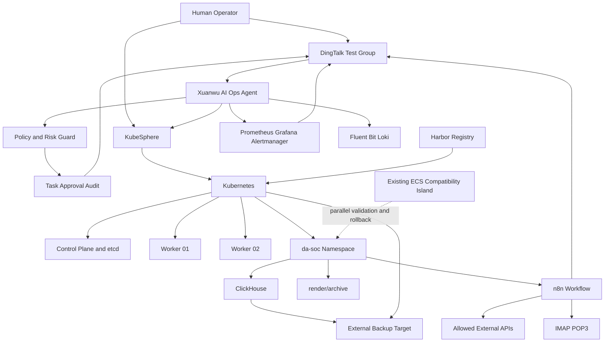

# 玄武云盾 V0.1 独立架构设计

> 文档性质：候选 V0.1 架构方案，不是最终 Architecture Baseline。  
> 设计日期：2026-10-08  
> 设计依据：`README.md`、`TODO.md`、`00-project/` 正式资料，以及给定的 DA-SOC v0.1 约束。

## 1. Executive Summary

推荐的 V0.1 不是完整企业私有云，而是一套**单站点、小规模、可恢复、可审计的 KubeSphere Kubernetes 平台**，先稳定承载 DA-SOC v0.1，再验证 AI-Native 运维闭环。

核心方案：

- 1 个 Kubernetes Control Plane、2 个 Worker；V0.1 明确接受 Control Plane 非高可用，以控制复杂度。
- KubeSphere 作为管理入口，Calico 作为 CNI，Harbor 作为企业镜像入口。
- KubeSphere Prometheus/Grafana/Alertmanager 负责监控，Fluent Bit + Loki 负责轻量日志，不建设 SIEM 或多套观测平台。
- ClickHouse、render/archive、n8n 进入独立 `da-soc` Namespace，但采用 ECS 保留、Kubernetes 并行验证、人工批准后切换的迁移策略。
- ClickHouse 使用单实例持久卷；不引入 Ceph、Longhorn、分布式 ClickHouse、Service Mesh 或多租户平台。
- AI Agent 通过只读 API 和白名单 Runbook Gateway 获取状态和执行受控操作；L0 自动、L1 策略内执行、L2 人工审批。
- 备份覆盖 etcd、Kubernetes 资源、DA-SOC 配置和业务数据，V0.1 至少完成一次真实恢复演练。

## 2. Understanding of Project Goals

玄武云盾与 DA-SOC 的关系是：

```text
玄武云盾 = 平台
DA-SOC   = 第一个核心业务应用
```

V0.1 的唯一核心目标是：**让 DA-SOC v0.1 在平台上稳定、可观察、可备份、可恢复地运行，并验证 AI-Native Platform Operations 的最小闭环。**

平台运行闭环应为：

```text
目标/策略 → 观察 → 分析 → 计划 → 审批 → 执行 → 验证 → 审计 → 复盘
```

成功标准不只是 Kubernetes 安装成功，还包括：业务链路未被破坏；网络和权限边界清楚；故障可以定位和恢复；AI 能读取真实上下文并受控执行；变更、审批、执行和恢复均可追溯。

## 3. DA-SOC v0.1 Constraints

### 3.1 固定业务链路

日常流程固定为：

```text
IMAP（ALL，不标已读）
  → Filter（From 包含 10099.com.cn 且主题包含“码号处置情况”）
  → POST /archive
  → 解析入库
  → HTTP 查询 SQL
  → POST /render
  → 测试钉钉群
```

一次性回补为：

```text
POP3 → /data/da-soc/raw → HTTP INSERT → ClickHouse
```

当前组件包括 ClickHouse、`da-soc-render:0.1` 和 n8n 2.15.0。ECS 当前不能直接连接 Docker Registry，必须支持 `docker save`、上传和 `docker load` 的离线方式。

### 3.2 确定性约束

- 数字只能由 ClickHouse SQL 产生，并经既定视图/查询生成结果。
- LLM 不得参与出数、出图或统计口径判断。
- 无数据必须保留为 `null` 或“暂无数据”，不能填充为 `0`。
- `/archive` 失败时，必须“不入库、不出图、不发送”。
- SQL 源码在 `v0.1/sql/`，由 `tools/build_workflow.py` 嵌入工作流 JSON。
- 禁止通过 n8n UI 修改 SQL，禁止用社区 ClickHouse 节点替代既定路径。

### 3.3 邮箱与钉钉约束

- 不能覆盖“监测bjfz邮箱广电报送信息”生产邮箱。
- 不得对生产收件箱执行 Mark as Read。
- 钉钉使用既定 Native API，目标群只能来自凭据，不能由模型或用户输入自由覆盖。
- 平台只允许必要的 IMAP/POP3、钉钉 HTTPS 和外部 API 出口。

### 3.4 平台约束

V0.1 必须覆盖基础设施、网络、Kubernetes、KubeSphere、存储、Registry、安全、观测、备份、AI Ops 和 DA-SOC，但必须主动避免组件堆砌、Service Mesh、SIEM、CMDB、复杂分布式存储、多租户和多套 Agent 平台。

## 4. V0.1 Design Principles

1. **业务先于平台美观**：不得为容器化整齐而破坏 DA-SOC 既有纪律。
2. **单一实现路径**：监控、日志、镜像、告警和任务中心各保留一套主路径。
3. **默认拒绝**：管理面、业务面、东西向流量和外部出口均最小放行。
4. **可恢复优先**：先把备份、恢复、演练和证据做真，再追求高可用。
5. **声明式和可审计**：配置、SQL、策略、Runbook 和清单进入 Git。
6. **AI 受策略约束**：Agent 不是集群管理员，写操作必须经过白名单工具。
7. **确定性业务与概率性 AI 隔离**：AI 不改写 DA-SOC 统计和输出。
8. **小步迁移**：先并行验证，再人工批准切换，失败回到 ECS。
9. **版本固定**：组件、镜像和 Helm Chart 固定版本与 digest，不使用浮动 `latest`。
10. **文档就是运行知识**：高风险能力必须有策略、Runbook、证据和回滚方式。

## 5. Recommended V0.1 Architecture

### 5.1 总体形态

| 类别 | V0.1 形态 | 主要职责 |
|---|---|---|
| Control Plane | 1 台 VM | Kubernetes API、scheduler、controller、单实例 etcd、KubeSphere |
| Worker | 2 台 VM | DA-SOC、Ingress、监控和日志 Agent |
| Registry | 1 台独立 VM 或现有企业 Registry | Harbor、HTTPS、镜像权限和基础扫描 |
| Backup Target | 集群外 NAS/S3；无现成资源时使用独立备份 VM | 备份和恢复数据 |

Control Plane 不承载 DA-SOC。Worker 通过标签、污点和亲和性区分平台工作负载与业务工作负载；ClickHouse 数据固定到一台 Worker 的独立数据盘。

### 5.2 平台服务与业务服务

平台服务包括 Kubernetes、KubeSphere、Calico、Ingress、监控、日志、Harbor、备份工具以及 AI Ops 的采集和 Runbook Gateway。

业务服务包括 n8n、`da-soc-render`、ClickHouse、ConfigMap、Secret、PVC 和 DA-SOC 告警规则。

### 5.3 ECS 兼容岛与迁移策略

采用三个阶段：

1. **保留**：ECS 继续承载现有链路，平台采集状态并建立备份证据。
2. **并行**：K8s `da-soc` Namespace 使用同版本镜像、同 SQL 和测试邮箱，独立测试数据，不连接生产邮箱、不发送生产群。
3. **切换**：完成 golden data、网络、归档失败门禁、备份恢复、钉钉目标和回滚验证后，人工批准切换；失败立即回退 ECS。

如果 host network、文件路径或邮件行为无法证明兼容，V0.1 允许 DA-SOC 暂留 ECS，同时由玄武云盾管理其主机安全、监控、备份和访问边界。

## 6. Logical Architecture Diagram



DA-SOC 内部服务优先使用 ClusterIP；KubeSphere 只通过管理 VPN/堡垒机访问，不向公网暴露 Kubernetes API。

## 7. Infrastructure Architecture

### 7.1 推荐 VM 规格

| 主机名 | 角色 | vCPU | 内存 | 系统盘 | 数据盘 |
|---|---|---:|---:|---:|---:|
| `xw-cp-01` | Control Plane、etcd、KubeSphere | 4 | 8 GiB | 120 GiB | 50 GiB |
| `xw-wk-01` | 通用 Worker、n8n/render | 6 | 12 GiB | 120 GiB | 150 GiB |
| `xw-wk-02` | DA-SOC 数据 Worker、ClickHouse | 8 | 16 GiB | 120 GiB | 400 GiB |
| `xw-reg-01` | Harbor | 4 | 8 GiB | 100 GiB | 500 GiB |
| `xw-bak-01` | 临时备份目标，可选 | 4 | 8 GiB | 80 GiB | 按数据量 |

前三台加集群外备份目标是最低可运行形态。Harbor 可复用现有企业 Registry，但不能把公共 Registry 作为生产依赖。

### 7.2 主机基线

- 使用受支持的 Linux LTS，按 KubeSphere/Kubernetes 兼容矩阵锁定版本。
- 使用 containerd；禁止以 Docker Engine 作为 Kubernetes 运行时依赖。
- 禁止 root SSH，使用堡垒机/管理 VPN、个人密钥和最小 sudo。
- 启用主机防火墙、补丁、时间同步、磁盘水位、审计和日志转发。
- 主机名、静态 IP、DNS、NTP、节点标签、镜像 digest 和凭据责任人进入 Git/资产清单。

### 7.3 容量原则

为系统组件预留 CPU/内存；`da-soc` 必须有 requests/limits；ClickHouse 数据盘与容器运行时盘分离；磁盘 70% 告警、80% 处置、90% 紧急。V0.1 只承诺单站点、单集群。

## 8. Kubernetes / KubeSphere Architecture

### 8.1 Kubernetes

- 使用 KubeSphere 支持矩阵中的固定 Kubernetes minor 版本。
- `xw-cp-01` 运行 API Server、controller-manager、scheduler 和 etcd。
- Worker 使用 containerd，按 `platform`/`da-soc` 标签与污点管理。
- CNI 选 Calico，启用 NetworkPolicy；不引入 Service Mesh 或额外 eBPF 平台。
- Ingress 只承载 KubeSphere 控制台和必要业务 HTTP；ClickHouse、n8n API、render/archive 默认不对外。
- 使用 readiness/liveness/startup probe、滚动更新和必要的 PodDisruptionBudget；单副本业务不伪装成 HA。

### 8.2 KubeSphere

建立 Workspace `xuanwu`，至少建立 `xw-platform` 和 `da-soc` Project/Namespace。KubeSphere 负责管理、项目、权限和基础观测，不承载 DA-SOC 业务逻辑。

控制台只允许管理 VPN/堡垒机访问；不向互联网开放 6443、30880、30881 或 etcd 端口。

### 8.3 RBAC 与资源边界

| 身份 | 权限 |
|---|---|
| 平台管理员 | 集群治理和高风险变更，人工账户 |
| 平台运维 | 只读集群和受限维护 |
| DA-SOC 维护者 | 仅 `da-soc` Namespace 资源 |
| 审计者 | 只读 K8s、监控、日志、任务和审计 |
| Agent ReadOnly | K8s、Prometheus、Loki、Harbor 只读 |
| Agent Executor | 只能调用白名单 Runbook Gateway |
| DA-SOC ServiceAccount | 业务所需最小权限 |

禁止把长期管理员 kubeconfig 放入 n8n 或 Agent；默认 ServiceAccount 不绑定高权限；业务 Namespace 必须有 ResourceQuota、LimitRange、默认拒绝 NetworkPolicy 和标准标签。

### 8.4 DA-SOC Namespace

只放置 n8n、`da-soc-render`、ClickHouse、必要 ConfigMap/Secret/PVC、NetworkPolicy、配额和业务监控规则。Harbor、KubeSphere、监控和 Agent 不混入业务 Namespace。

## 9. Network Architecture

### 9.1 网络分区

| 分区 | 示例网段 | 用途 |
|---|---|---|
| 管理网 | `10.20.10.0/24` | 堡垒机、K8s API、KubeSphere、SSH |
| 节点网 | `10.20.20.0/24` | Control Plane、Worker、必要节点端口 |
| Registry/备份网 | `10.20.30.0/24` | Harbor、备份目标、镜像和备份流量 |
| Pod 网 | `10.244.0.0/16` | Calico Pod 网络 |
| Service 网 | `10.96.0.0/12` | Kubernetes ClusterIP |

网段只是设计示例，实施时必须形成正式 IP 规划表。

### 9.2 访问矩阵

| 来源 | 目标 | 端口/协议 | 结果 |
|---|---|---|---|
| 管理 VPN/堡垒机 | K8s API、KubeSphere | 6443、HTTPS | 允许 |
| Control Plane | etcd | 2379/2380 | 仅必要路径 |
| Worker | Harbor | 443 | 允许，必须 HTTPS |
| n8n | render/archive | 8091/TCP | 仅 Namespace 内 |
| n8n/render | ClickHouse | 8123/TCP | 仅业务必要路径 |
| n8n | IMAP/POP3 | 993/995 | 指定外部地址 |
| n8n | DingTalk/必要 API | 443 | 出口白名单 |
| Agent | K8s/Prometheus/Loki | API/HTTPS | 只读 |
| 业务 Pod | etcd、Kubelet、管理 API | — | 拒绝 |
| 互联网 | K8s API、KubeSphere、ClickHouse | — | 拒绝 |

### 9.3 NetworkPolicy

`da-soc` 使用 default-deny ingress/egress，只放行 DNS、n8n 到 render/archive、业务到 ClickHouse、监控抓取和必要外部出口。外部域名白名单还需由出口防火墙或安全组实现；若只能按 IP，必须记录更新责任人和风险。

## 10. Storage Architecture

V0.1 使用**本地块存储 + 外部备份目标**，不部署分布式存储。理由是当前主要风险是正确恢复，而非跨节点在线复制。

- 使用 local PV 或受控 local-path StorageClass。
- ClickHouse PVC 固定到 `xw-wk-02` 的独立数据盘。
- n8n 状态 PVC 可固定到 `xw-wk-01`；raw 文件使用独立 PVC。
- 生产业务不使用 `emptyDir` 保存持久数据。
- 不用 hostPath 任意暴露主机目录；通过声明式 PV、亲和性和权限控制。

| 数据 | 位置 | 保护方式 |
|---|---|---|
| ClickHouse 数据 | 单实例 PVC | ClickHouse 原生备份 + 外部目标 |
| `/data/da-soc/raw` | 独立 PVC | 文件归档、校验、外部备份 |
| n8n 状态 | PVC/数据库 | 配置导出、加密备份 |
| SQL/构建脚本 | Git | Review、标签、digest |
| K8s 清单/策略 | Git | 声明式恢复 |
| Secret | K8s + 加密备份 | 最小权限、轮换 |

不采用 Ceph、Longhorn、GlusterFS、分布式 ClickHouse 或多副本事务数据库；V0.2 根据实际规模、RPO/RTO 和节点数量重新评估。

## 11. Registry Architecture

推荐 Harbor 部署在独立 VM 或复用企业 Harbor，启用内部 CA/HTTPS、项目级权限、审计和基础漏洞扫描。

- `xuanwu/platform`、`xuanwu/da-soc` 分项目管理。
- 镜像使用不可变 tag 或 digest，禁止 `latest`。
- Worker 只信任企业 CA，并使用 imagePullSecret/KubeSphere Registry Secret。
- 离线流程为：导出 → 校验和 → 上传 → Harbor 导入/推送 → 节点拉取验证。
- 并行迁移阶段允许本地 `docker load`，但必须有截止时间和发布记录。

## 12. Security Architecture

### 12.1 身份与权限

人类管理员使用个人账号、MFA/堡垒机和短时授权，不共享 kubeconfig。Agent 的只读采集凭据与执行凭据分离。n8n 凭据使用加密密钥保存，不写入工作流 JSON、日志或 Git。业务 Secret 只允许指定 Namespace 服务读取。

### 12.2 容器与节点

- Harbor 是生产镜像的唯一认可来源，镜像固定 digest 并基础扫描。
- Pod Security 采用受限基线；默认禁止 privileged、hostPID、hostIPC、hostNetwork。
- 容器尽量使用非 root、只读根文件系统、明确 capabilities 和资源限制。
- etcd、kubelet 和 API Server 只在必要网络开放；etcd 不暴露业务网和互联网。
- 定期检查证书、补丁、磁盘权限、运行时和节点状态。

### 12.3 审计

审计包括 Kubernetes Audit、KubeSphere 操作审计、主机审计和 Agent/Runbook 任务审计。每条 Agent 变更记录请求人、Agent、任务 ID、风险等级、证据、计划、审批人、工具调用、变更摘要、结果、验证和回滚信息。

### 12.4 分阶段能力

| 时段 | 能力 |
|---|---|
| V0.1 必须 | 管理隔离、RBAC、NetworkPolicy、Pod 安全、Harbor HTTPS、Secret 最小权限、审计、备份恢复、主机防火墙、基础扫描 |
| V0.1 建议 | 凭据轮换、CIS 基础检查、出口防火墙、漂移发现、恢复证据自动汇总 |
| V0.2 | 集群 HA、集中身份、密钥服务、策略即代码、供应链签名 |
| V0.3 | SIEM、EDR 深度联动、运行时检测、完整安全事件管理 |

## 13. Observability Architecture

### 13.1 Monitoring

只保留 KubeSphere/Prometheus/Grafana/Alertmanager 主路径，监控节点 CPU/内存/磁盘、节点状态、API Server、etcd、KubeSphere、Pod Pending/CrashLoop/重启、PVC 水位、Harbor、DA-SOC 健康、归档失败、最近成功运行、备份状态和证书剩余时间。

### 13.2 Logging

Fluent Bit 收集节点 journald、容器 stdout/stderr、Kubernetes/KubeSphere 和 DA-SOC 日志，写入单实例 Loki。V0.1 不建设完整 SIEM；日志必须脱敏，不能把生产邮箱原文、Token、Secret 和业务数据直接送入 AI 上下文。

### 13.3 Alerting

Alertmanager 通过受控 webhook 交给 n8n，再发送 DingTalk。告警必须带对象、影响、证据、Runbook、风险等级和是否需要审批。n8n 负责通知传输，不代替 Agent 判断根因。DA-SOC 业务日报与平台告警分开。

### 13.4 Agent 访问

Agent 通过只读 Prometheus、Loki、Kubernetes API、Harbor 扫描结果、审计索引和 Git/Runbook 获取结构化上下文，并引用时间范围和证据。

## 14. Backup & Recovery Architecture

### 14.1 备份层次

1. etcd 快照，平台变更前额外快照，备份到集群外并加密。
2. Git 保存 Kubernetes 清单、Helm values、RBAC、NetworkPolicy、监控规则和 KubeSphere 关键配置；必要时用 Velero/同类工具备份资源对象。
3. 备份 n8n 工作流 JSON、`tools/build_workflow.py`、SQL、镜像 digest、ConfigMap 和 Secret 加密导出。
4. 使用 ClickHouse 原生备份/恢复保存业务数据，raw 文件单独归档，n8n 状态单独备份；不能只复制正在写入的 PVC。

### 14.2 目标

- RPO：DA-SOC 数据不超过 24 小时。
- RTO：单节点/Pod 故障分钟级，单集群 Control Plane 恢复不超过 4 小时。
- 建议保留 7 个日备、4 个周备和 1 个离线/不可变副本。
- 备份必须有成功校验、年龄告警、容量告警和责任人。
- V0.1 完成前必须真实演练 etcd/资源、ClickHouse、DA-SOC 配置和业务恢复。

### 14.3 恢复顺序

```text
冻结变更
  → 恢复/重建 Control Plane
  → 恢复 K8s 资源和 Secret
  → 恢复 Registry
  → 恢复 ClickHouse 与 raw 数据
  → 恢复 render/archive 与 n8n
  → 验证 SQL、归档失败门禁、日报图和测试钉钉
  → 记录证据并解除冻结
```

## 15. AI-Native Operations Architecture

### 15.1 逻辑组件

- Observer/Collector：读取 K8s、Prometheus、Loki、Harbor、审计和 Git。
- Planner：基于事实、策略和 Runbook 生成诊断与计划，并引用证据。
- Policy/Risk Guard：判断范围、前置条件、风险等级和审批要求。
- Runbook Gateway：只执行版本化、参数校验、幂等、可回滚的白名单动作。
- Verifier：检查指标、日志、业务探针和变更后差异。
- Auditor：写入任务、审批、工具调用、验证和回滚证据。

V0.1 可把这些角色实现为一个 Agent Manager 的逻辑模块，不急于建设多 Agent 平台。

### 15.2 n8n 与 Agent 分工

| n8n | Agent |
|---|---|
| 定时、邮件、Webhook、DingTalk、HTTP、重试和通知 | 理解问题、关联证据、分析、规划、工具选择、验证和复盘 |
| 执行 DA-SOC 既定工作流 | 不改 DA-SOC SQL、统计口径和出图逻辑 |
| 传输事件和审批结果 | 受策略约束调用 Runbook Gateway |

n8n 不是整个系统的大脑，Agent 也不是所有流程的替代品。

### 15.3 L0/L1/L2

| 等级 | 示例 | 控制 |
|---|---|---|
| L0 | 查询、健康检查、日志/指标查询、日报、证书检查 | 自动执行，只读，自动留痕 |
| L1 | 重启非生产 Pod、清理已确认临时文件、同步非生产配置 | 白名单、范围、前置条件、自动验证 |
| L2 | 修改 RBAC/NetworkPolicy/CNI、删节点、改存储、生产重启、删数据 | 人工审批、短时授权、diff、回滚 |

### 15.4 V0.1 MVP

优先实现 Node Health、Pod Health、Disk、Certificate、Backup Check、Resource Check、Daily Platform Report 和配置漂移“发现+建任务”。没有现成 EDR 时不引入 EDR 依赖。自然语言入口先支持查询、汇总和建议，不开放任意命令执行。

## 16. Human / AI Responsibility Boundary

人负责安全红线、业务口径、生产窗口、邮箱和钉钉凭据、风险接受、L2 审批、架构决策、恢复目标和重大例外。

AI 负责状态采集、证据整理、异常关联、Runbook 检索、计划生成、L0、限定 L1、验证、任务创建、通知和复盘草稿。

AI 不得：

- 使用 cluster-admin 或主机 root。
- 修改 DA-SOC SQL、统计口径、图片规则或目标群凭据。
- 对生产邮箱 Mark as Read 或改变生产邮箱筛选规则。
- 绕过审批、NetworkPolicy、Registry、审计或备份策略。
- 在没有证据和回滚方案时执行高风险变更。

## 17. IT / Business Boundary

| 领域 | IT/平台负责 | 业务/DA-SOC 负责 |
|---|---|---|
| 基础设施 | VM、OS、DNS、NTP、节点、磁盘、主机安全 | 容量和业务窗口需求 |
| Kubernetes | 集群、CNI、Ingress、StorageClass、RBAC、配额 | Namespace 内应用声明和资源需求 |
| 安全 | 网络边界、镜像、Pod 安全、审计、备份、证书 | 业务 Secret、账号和数据分类 |
| 观测 | 平台监控、日志管道、告警路由 | 应用日志、业务指标、SLA 阈值 |
| DA-SOC | 承载、网络、存储、恢复和运行工具 | n8n、SQL、解析、render、邮件规则和钉钉业务逻辑 |
| 变更 | 平台高风险变更、审批和回滚 | 业务版本、工作流和统计口径 |

边界通过 Namespace、RBAC、ResourceQuota、LimitRange、NetworkPolicy、Registry 权限和 Secret 权限真正落地。

## 18. DA-SOC Hosting Architecture

### 18.1 组件映射

| 组件 | V0.1 部署 | 访问方式 |
|---|---|---|
| n8n 2.15.0 | `da-soc` 单副本 Deployment | 管理 VPN UI，业务 API 内部访问 |
| `da-soc-render:0.1` | 单副本 Deployment | ClusterIP `8091` |
| ClickHouse | 单副本 StatefulSet/Deployment + 固定 PVC | ClusterIP `8123` |
| raw 文件 | 独立 PVC | 仅 render/archive 和恢复任务 |
| SQL/构建脚本 | Git/构建过程 | 不在 n8n UI 编辑 |
| DingTalk | n8n 凭据和受控出口 | 测试群凭据，平台告警独立 |

### 18.2 关键适配

- 维持 ALL、不标已读和既定 Filter。
- `/archive` 失败时后续节点不得查询、渲染或发送。
- render/archive 和 ClickHouse 使用 Service 地址，不写死 Pod IP。
- ClickHouse 使用独立数据盘和资源预留；查询、写入和磁盘失败必须告警。
- 测试阶段使用独立邮箱、数据和钉钉群；切换必须人工批准且可回退 ECS。
- 迁移不能改变 SQL、工作流生成方式、无数据语义、邮箱已读行为和目标凭据来源。

## 19. Technology Stack

| 能力 | 推荐技术 | V0.1 | 原因 | 复杂度 | AI 可操作性 |
|---|---|---|---|---|---|
| Kubernetes | Kubernetes + containerd | 固定兼容版本 | 声明式、可恢复 | 中 | 高 |
| Management | KubeSphere | 必须 | 项目、RBAC、控制台 | 中 | 高 |
| CNI | Calico | 必须 | NetworkPolicy 成熟 | 中 | 高 |
| Storage | local PV/local-path + 外部备份 | 必须 | 适配单实例，少组件 | 低 | 高 |
| Registry | Harbor | 必须或复用企业 Harbor | HTTPS、权限、扫描、离线 | 中 | 中高 |
| Monitoring | KubeSphere Prometheus/Grafana/Alertmanager | 必须 | 单一监控路径 | 中 | 高 |
| Logging | Fluent Bit + Loki | 必须 | 轻量可查询，不是 SIEM | 中 | 高 |
| Backup | etcd snapshot + Git + 资源备份 + ClickHouse native backup | 必须 | 分层、可单独恢复 | 中 | 中高 |
| Security | RBAC、Calico Policy、Pod Security、Harbor scan、Audit | 必须 | 覆盖最小安全边界 | 中 | 高 |
| AI Ops | 单 Agent Manager + Runbook Gateway + n8n 通知 | MVP | 先验证闭环，避免平台膨胀 | 中 | 高 |

## 20. V0.1 Scope

必须完成：

- 小型 Kubernetes/KubeSphere 集群、DNS、NTP、主机基线。
- 管理网、节点网、Pod/Service 网、外部出口和 Calico default-deny。
- Harbor HTTPS、权限、基础扫描和离线镜像导入。
- Prometheus/Grafana/Alertmanager、Fluent Bit/Loki 和 DingTalk 告警。
- etcd、Kubernetes 资源、DA-SOC 配置、ClickHouse/raw 数据备份。
- 至少一次真实恢复演练。
- DA-SOC 并行部署、业务验证、失败门禁和可回退切换。
- AI L0、有限 L1、L2 审批、Task/Audit 记录和平台日报。

验收必须覆盖允许流量、禁止流量、RBAC 越权、privileged/hostNetwork、API/etcd 暴露、未授权镜像、数据恢复、归档失败和 AI 授权边界。

## 21. V0.1 Non-Goals

V0.1 不做：

1. 三控制面 HA、跨可用区、跨地域容灾和自动故障转移。
2. Ceph/Longhorn、分布式 ClickHouse、多副本事务数据库。
3. Service Mesh、复杂 API Gateway、完整 CMDB 和多租户商业化平台。
4. 完整 SIEM、EDR 深度联动和全量安全运营中心。
5. 完整供应链签名、SBOM 治理和运行时强制策略平台。
6. AI 任意 shell、root 或 cluster-admin 执行。
7. LLM 参与 DA-SOC 出数、出图、SQL 修改或生产邮箱操作。
8. 多套监控、日志或 Agent 框架。

## 22. V0.1 → V1.0 Evolution

| 版本 | 新增 | 为什么新增 | 为什么不是 V0.1 |
|---|---|---|---|
| V0.2 | 3 控制面 HA、集中身份、密钥服务、受控漂移修复 | 降低单控制面风险 | V0.1 先验证恢复，HA 增加资源和故障面 |
| V0.3 | 运行时安全、EDR/SIEM、SBOM、策略即代码 | 扩展安全运营 | 当前业务不需要完整安全平台 |
| V0.4 | 多 Agent、事件关联、更多 L1 自动化 | 扩大 AI 运维覆盖 | 先证明单 Agent + Runbook 可控 |
| V0.5 | 多业务 Namespace、租户、分布式存储、容量管理 | 支撑更多应用 | V0.1 只有一个核心业务 |
| V1.0 | 企业级私有云、跨站点恢复、统一身份、安全运营、成熟 AI Ops | 达成长期愿景 | 需要真实规模、SLA、合规和运营数据 |

## 23. TODO.md Gap Analysis

### 保留

保留 P0 的项目文档、总体架构、基础设施、网络、Kubernetes/KubeSphere、治理、安全基线和 DA-SOC 接入标准；保留 P1 的主机安全、集群、CNI/NetworkPolicy、Harbor、监控、日志、告警、备份和恢复；保留 P2 的 DA-SOC、AI Ops、n8n/DingTalk、任务、审批和审计；保留 P3 的 Runbook、安全验证、漂移发现、故障演练和最终验收。

### 修改

- P1.5 CNI 不再长期评估，V0.1 直接选 Calico并做策略验收。
- P1.9 Harbor 明确独立部署、HTTPS、digest、离线导入、扫描和临时 `docker load` 例外。
- P1.10/P1.11 只使用一套监控和一套日志：KubeSphere Prometheus/Grafana/Alertmanager + Fluent Bit/Loki。
- P1.13/P1.14 按 etcd、资源、配置、ClickHouse/raw 分层备份，不能用普通 PVC 复制替代数据库一致性备份。
- P2.2 内部服务不强制 Ingress；n8n UI 只经管理 VPN，ClickHouse/render/archive 使用 ClusterIP。
- P2 AI Ops 先实现 Node/Pod/Disk/Certificate/Backup/Resource/日报和漂移发现；EDR 保持条件项。
- P3 演练必须绑定 RTO/RPO、证据、验证和回滚。

### 删除或延后

- 已存在仓库时，不把“创建 Git 仓库”作为 V0.1 阻塞项。
- 不把“所有任务必须多 Agent 逐层串行完成”作为硬性交付条件。
- 没有现成 EDR 时，延后 EDR/Security Event，不引入新依赖。
- 延后三控制面 HA、分布式存储、完整 SIEM、CMDB、Service Mesh、供应链安全和多租户。

### 新增

1. ECS → K8s 兼容性、双轨运行、切换和回滚 Runbook。
2. DA-SOC golden data、archive 失败门禁、重复消息、无数据语义和不得 Mark as Read 的自动化验收。
3. 镜像 digest、离线导入校验、Harbor CA 和未授权 Registry 测试。
4. n8n 加密密钥、凭据轮换、工作流/SQL 版本化和恢复验证。
5. 外部出口白名单、DNS 依赖和更新责任人。
6. 备份不可变/离线副本、恢复证据模板和数据校验。
7. Agent Runbook Gateway、工具白名单、审批 Token、任务 Schema、幂等和回滚约束。
8. 架构声明与实际状态的周期性漂移报告。

### 调整顺序

```text
项目/目标基线
  → 候选架构与 ADR
  → 网络、身份、安全和备份设计
  → VM/OS/Registry
  → Kubernetes/CNI/KubeSphere
  → 监控/日志/审计
  → 恢复演练
  → DA-SOC 并行部署与 golden test
  → AI L0/L1/L2 闭环
  → 故障演练与最终验收
```

DA-SOC 不应早于网络、Registry、Secret、监控、备份和恢复路径；AI 不应早于真实状态采集、Runbook 和风险模型。

## 24. Major Risks

| 风险 | 影响 | 处理 |
|---|---|---|
| 单 Control Plane 故障 | 管理面中断 | etcd/资源备份、重建 Runbook，V0.2 做 HA |
| ClickHouse 本地盘损坏 | 数据丢失 | 原生备份、外部副本、恢复演练 |
| ECS 到 K8s 行为差异 | 邮件/出图/发送异常 | 并行测试、golden data、ECS 回滚 |
| 外部邮箱/钉钉变化 | 日报失败 | Secret/出口监控和业务 Runbook |
| Harbor/备份目标不可用 | 发布或恢复受阻 | 独立资源、容量/证书监控、离线副本 |
| NetworkPolicy 误配 | 业务中断 | Git review、连通性测试和回滚 |
| AI 误操作 | 平台/业务损坏 | 只读默认、Runbook Gateway、L2 审批、审计 |
| 日志/备份泄露 Secret | 安全事件 | 脱敏、最小权限、加密和审计 |
| 资源不足 | ClickHouse/n8n 不稳定 | requests/limits、容量告警和压测 |

## 25. Important Architecture Decisions

1. V0.1 采用 1 CP + 2 Worker，而不是 3 CP HA；接受明确的管理面单点风险，先把恢复做真。
2. DA-SOC 采用 ECS 与 Kubernetes 双轨迁移，不强制一次性脱离 ECS。
3. Calico 作为 V0.1 CNI，优先保证 NetworkPolicy 的成熟度和可审计性。
4. 采用 local PV + 外部备份，不部署分布式存储。
5. 只保留一套监控和一套日志。
6. Agent 不直接获得高权限，所有写操作通过 Runbook Gateway。
7. n8n 继续负责 DA-SOC 的确定性编排，Agent 负责平台分析和受控运维。

## 26. Recommended ADRs

- ADR-001 V0.1 集群规模、非 HA 边界与 RTO/RPO。
- ADR-002 ECS 与 Kubernetes 双轨部署、切换和回滚。
- ADR-003 Kubernetes/KubeSphere/Calico 版本锁定。
- ADR-004 网络分区、外部出口和 NetworkPolicy。
- ADR-005 local PV、ClickHouse 数据保护与外部备份。
- ADR-006 Harbor 离线导入、digest 和扫描门禁。
- ADR-007 DA-SOC Namespace、RBAC、Secret 和资源配额。
- ADR-008 监控、日志、审计和 DingTalk 路由。
- ADR-009 AI Ops Task Schema、L0/L1/L2、审批和 Runbook Gateway。
- ADR-010 DA-SOC golden test 与业务验收。
- ADR-011 备份恢复演练、证据保留和业务校验。
- ADR-012 V0.1 不引入的组件和推迟条件。

## 27. Recommended Implementation Sequence

### Phase 0：基线冻结

补齐 `00-project/` 文档，冻结范围、RTO/RPO、职责和红线；将候选方案转为 ADR 草案；清理 TODO 依赖并建立验收证据目录。

### Phase 1：基础设施与安全

准备 VM、OS、DNS、NTP、IP、主机防火墙和 SSH 基线；准备 Harbor/备份目标；安装 Kubernetes、containerd、Calico 和 KubeSphere；配置 Workspace、Project、角色和审计。

### Phase 2：观测、备份与恢复

启用监控、日志、告警和 DingTalk；建立 etcd、资源、配置、ClickHouse/raw 备份；在业务接入前完成一次真实恢复演练。

### Phase 3：DA-SOC 并行接入

创建 Namespace、配额、Secret、NetworkPolicy、PVC 和镜像拉取策略；部署 ClickHouse、render/archive、n8n 测试副本；执行 golden data、SQL、无数据、archive 失败、不标已读、钉钉和恢复测试；形成切换/回滚手册。

### Phase 4：AI Ops MVP

接通只读 K8s/Prometheus/Loki/Harbor/Git/Runbook 上下文；实现健康、磁盘、证书、备份、资源、日报和漂移发现；建立任务、审批、通知、验证和审计；只开放已验证的 L1 Runbook。

### Phase 5：故障演练与验收

依次演练 Node Down、Pod CrashLoop、磁盘不足、KubeSphere/Harbor 异常、Control Plane 恢复、DA-SOC 恢复和 Backup Restore；每次记录影响、证据、处理、验证、回滚和改进项；最后核对架构与实际状态。

## 28. Final Architecture Recommendation

### 评分

| 维度 | 评分（1-10） |
|---|---:|
| 架构合理性 | 9 |
| V0.1 范围控制 | 9 |
| 技术选型 | 8 |
| 安全性 | 8 |
| 可实施性 | 9 |
| 长期运维性 | 8 |
| AI-Native 程度 | 8 |
| 可审计性 | 9 |
| 可恢复性 | 8 |
| DA-SOC 适配性 | 9 |
| V0.1 → V1.0 演进性 | 9 |
| **Overall Score** | **8.6** |

### 1. 我推荐的 V0.1 是什么？

单站点、1 Control Plane + 2 Worker 的 KubeSphere 私有云测试平台：Calico 负责隔离，Harbor 负责镜像，KubeSphere 监控和 Fluent Bit/Loki 负责观测，外部目标负责分层备份；DA-SOC 在独立 Namespace 中并行验证，必要时保留 ECS 回滚；Agent 通过只读采集和白名单 Runbook 参与运维。

### 2. V0.1 最重要的 5 个能力是什么？

1. 不改变 SQL、邮箱、无数据语义和钉钉纪律地稳定运行 DA-SOC。
2. 管理面、业务面、数据面和外部出口的最小网络与权限边界。
3. 真实可用的监控、日志、审计、告警和故障定位。
4. 分层备份、真实恢复演练和明确 RPO/RTO。
5. 受 L0/L1/L2 约束的 AI 观察—计划—审批—执行—验证闭环。

### 3. V0.1 最应该避免的 5 个东西是什么？

1. 为了“企业级”提前引入 HA 控制面、分布式存储和多租户复杂度。
2. 让 LLM 参与 DA-SOC 出数、出图、SQL 修改或生产邮箱操作。
3. 把 n8n、Agent、平台脚本和人工命令混成没有边界的大脑。
4. 通过 hostNetwork、NodePort、共享管理员账号或公网暴露绕过安全策略。
5. 用备份文件存在、组件安装完成或 AI 能聊天替代真实恢复、业务验收和审计证据。

### 4. 当前 TODO.md 最大的问题是什么？

最大问题不是任务缺失，而是把未来平台能力、实施步骤和多 Agent 流程混在同一层，并默认所有能力都必须在 V0.1 完成。这掩盖了恢复先于业务接入、迁移需要双轨回滚、AI 写操作需要工具边界和审批等关键依赖。

### 5. DA-SOC v0.1 对玄武云盾最重要的约束是什么？

平台不能改变 DA-SOC 的确定性业务语义和生产邮箱纪律：SQL 负责出数，LLM 不参与出数/出图，archive 失败不入库不出图不发送，无数据不能填 0，不得对生产收件箱 Mark as Read，钉钉目标只能来自凭据。

### 6. 如果只能做一次架构决策，最看重什么？

最看重**可恢复且可回滚的边界**。关键组件、数据、配置和变更都必须知道如何备份、如何恢复、谁批准、如何验证，以及失败时如何回到 ECS 或上一个已知良好版本。

### 7. 是否建议进入下一阶段？

选择：**A. 可以进入多 Agent 综合评审**。

综合评审应重点审查单 Control Plane 风险、外部备份目标、KubeSphere/Calico 兼容性、ECS 到 K8s 的切换条件，以及 DA-SOC 确定性验收用例。评审和人工确认通过后，才能生成 `01-architecture/V0.1-Architecture-Baseline.md`；本文件不是最终 Baseline。