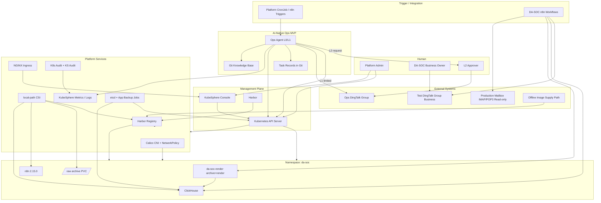

# 玄武云盾 V0.1 独立架构设计

> **文档性质：** 候选 V0.1 架构方案（非 Architecture Baseline）  
> **设计立场：** 独立设计；仅基于 README.md、TODO.md、`00-project/` 正式资料占位、以及本任务给定的 DA-SOC v0.1 约束  
> **当前项目状态：** Planning / Architecture；除 README / TODO / 占位文档外，尚无已批准的平台架构基线

---

## 1. Executive Summary

玄武云盾 V0.1 应建成一套**最小可运行、边界清晰、可审计、可恢复**的 KubeSphere 私有云测试平台，用于：

1. **安全承载 DA-SOC v0.1**（不改生产通报、不破坏既定业务纪律）；
2. **验证 AI-Native 运维最小闭环**（Observe → Analyze → Plan → Approval → Execute → Verify → Audit）。

核心判断：

- **平台 ≠ DA-SOC。** 玄武云盾提供基础设施与运维能力；DA-SOC 保留业务编排权与出数确定性。
- **V0.1 必须克制。** 不为“企业级完整私有云”提前建设 Ceph、Service Mesh、SIEM、完整多租户、完整 Multi-Agent 运行时。
- **DA-SOC 迁移采用“受控入仓”，而非“推倒重来”。** ClickHouse / render-archive / n8n 进入 Kubernetes Namespace，但保留本地盘持久化、离线镜像供给、SQL Path A、n8n 日常编排、生产邮箱只读纪律。
- **AI Ops 先做可读可报可审，再做可写。** V0.1 以 L0 自动巡检 + 钉钉通知 + L2 审批雏形为主，少量 L1；不做完整自动修复与多 Agent 生产运行时。

**一句话推荐：**  
3 节点单控制面 KubeSphere 集群 + Calico + local-path 存储 + Harbor 离线仓库 + 单 Namespace 承载 DA-SOC + KubeSphere 内建可观测性 + etcd/业务数据脚本备份 + n8n 触发 / Agent 分析的 AI Ops MVP。

---

## 2. Understanding of Project Goals

### 2.1 项目真正要解决的问题

企业内部缺少成熟专职 Kubernetes / 云原生运维团队。玄武云盾的目标不是“堆一套组件”，而是建设：

> 安全、可控、可审计、可恢复、可持续演进、可自动化运维、可由 AI 辅助长期维护的企业业务承载平台。

### 2.2 V0.1 与 V1.0 的关系

| 层级 | 目标 |
|---|---|
| V0.1 | 安全稳定承载 DA-SOC v0.1，并验证 AI-Native 运维最小模式 |
| V1.0 | 长期承载企业核心业务，AI 完成绝大部分标准化运维，高风险操作可审批/审计/回滚 |

V0.1 是**验证平台形态与运维模式**的第一刀，不是缩略版 V1.0。

### 2.3 成功标准（架构视角）

V0.1 成功不看“装了多少组件”，而看：

- DA-SOC 日报链路可稳定运行（入库 → 出数 → 出图 → 测试钉钉群）；
- 平台具备最小监控、日志、备份、恢复、RBAC、NetworkPolicy、镜像治理；
- AI 能读取平台上下文、发现异常、创建 Task、通知人、在 L2 时请求批准；
- IT / Business 边界可用 Namespace / RBAC / Quota / NetworkPolicy 落地；
- 架构、策略、实际状态可对照，重要变更可审计。

### 2.4 正式资料现状

`00-project/` 下 VISION / GOALS / SCOPE / PRINCIPLES / VERSIONING 均为占位。  
因此本方案以根目录 `README.md` 为最高约束，结合 TODO.md 做反向校验，并独立补齐 V0.1 技术决策。

---

## 3. DA-SOC v0.1 Constraints

以下约束是平台设计的**固定业务输入**，平台不得以“架构漂亮”为由破坏。

### 3.1 业务目标

在不改生产通报的前提下，用一张确定性日报图覆盖「当天 + 近 6 周 + 近 6 月」涉案号码统计，并发送到**测试钉钉群**。

### 3.2 运行形态（当前）

| 流程 | 形态 |
|---|---|
| 一次性回补 | POP3 → `/data/da-soc/raw` → HTTP INSERT → ClickHouse；ECS 本机脚本；不发钉钉 |
| 日常流程 | n8n 2.15.0：IMAP(ALL，不标已读) → Filter → POST `/archive` → 解析入库 → HTTP SQL → POST `/render` → 测试钉钉群 |

### 3.3 组件约束

| 组件 | 当前形态 | 地址 / 约束 |
|---|---|---|
| ClickHouse | Docker `clickhouse/clickhouse-server`，离线 load，host network | `127.0.0.1:8123` HTTP |
| 本地服务 | `da-soc-render:0.1`（render + archive） | `127.0.0.1:8091` |
| n8n | 已有 `ghcr.io/deluxebear/n8n:chs`，host network | 日常编排权属于 n8n |
| 镜像供给 | ECS 不能直连 Registry | `docker save → 上传 → docker load` |

### 3.4 SQL / 脚本纪律

- SQL 位于 `v0.1/sql/`，由 `tools/build_workflow.py` 嵌入工作流 JSON；
- **路径 A**：禁止通过 n8n UI 改 SQL；禁止社区 ClickHouse 节点；
- 6 个本机 Python 脚本日常禁用但保留对照；`run_pipeline.py` 不承担生产编排。

### 3.5 核心业务纪律（平台必须尊重）

1. **数据确定性：** 数字 → ClickHouse SQL → `v_daily_winner`；LLM 不得出数、不得出图。
2. **无数据：** `null` / `暂无数据`，禁止用 `0` 填充。
3. **Archive 失败：** 不入库、不出图、不发送。
4. **钉钉：** POC-06A / POC-06C Native API；目标群只能来自凭据。
5. **生产邮箱：** 不得覆盖「监测bjfz邮箱广电报送信息」；不得对生产收件箱 Mark as Read。

### 3.6 对平台的真实能力需求（最小集）

DA-SOC v0.1 **真正需要**玄武云盾提供的是：

1. 可调度的计算与容器运行时（稳定跑 ClickHouse / render / n8n）；
2. 可靠本地持久化（ClickHouse 数据、n8n 数据、raw 归档）；
3. 受控出站网络（IMAP/POP3/HTTPS 钉钉）与入站管理访问隔离；
4. 离线可信镜像供给（Harbor / 离线导入）；
5. Secret / 凭据管理（邮箱、钉钉 webhook/token）；
6. 监控与告警（节点磁盘、Pod 重启、备份失败）；
7. 备份与恢复演练（etcd + ClickHouse + 关键配置）；
8. 可被 Agent 读取的平台状态与知识（Git + API + 指标/日志）。

**不需要**在 V0.1 为 DA-SOC 建设：分布式存储、Service Mesh、完整 SIEM、多租户门户、GPU 池、跨地域灾备。

---

## 4. V0.1 Design Principles

1. **业务纪律优先于平台洁癖。** 不破坏 DA-SOC Path A、邮箱只读、出数确定性。
2. **最小可运行，不为 V1.0 预建。** 每增加一个组件都要回答：是否阻碍 DA-SOC 运行或 AI Ops 验证？
3. **默认拒绝，明确允许。** NetworkPolicy / RBAC / 镜像来源均如此。
4. **平台与业务解耦。** Namespace、角色、配额、网络策略落地边界。
5. **状态定义先于运行时。** Git 中的架构 / Policy / Manifest 是期望状态。
6. **可恢复优先于“相信不会坏”。** 没有恢复演练的备份不算完成。
7. **AI 可观察、可建议、受限执行。** LLM 不进入 DA-SOC 出数/出图链路。
8. **n8n 负责触发与集成，Agent 负责理解与判断。** n8n 不是大脑。
9. **例外必须显性化。** 若需 hostPath / 特殊出站 / 临时 NodePort，必须 ADR + 到期日。
10. **先验证模式，再扩展规模。** 单控制面可接受；高可用留给后续版本。

---

## 5. Recommended V0.1 Architecture

### 5.1 总体形态

```text
玄武云盾 V0.1 = 单集群测试私有云底座 + 第一个业务租户（DA-SOC）+ AI Ops MVP
```

物理上 3 台 VM；逻辑上 4 个平面：

| 平面 | 内容 |
|---|---|
| 管理面 | Kubernetes API、KubeSphere Console、Harbor Admin、SSH 堡垒路径 |
| 平台面 | CNI、Ingress、local-path、Harbor、监控/日志、备份 Job、AI Ops 组件 |
| 业务面 | `da-soc` Namespace：ClickHouse、render/archive、n8n、业务 Secret |
| 数据面 | 节点本地盘 PV：ClickHouse / n8n / raw archive / Harbor / 备份落盘 |

### 5.2 关键拓扑决策

| 决策 | 选择 |
|---|---|
| 集群规模 | 1 Control Plane + 2 Worker |
| 管理 UI | KubeSphere（单集群） |
| CNI | Calico（NetworkPolicy 原生、复杂度可控） |
| 存储 | local-path-provisioner + 节点专用数据盘 |
| Registry | Harbor（离线安装 / 离线镜像导入） |
| Ingress | NGINX Ingress Controller（或 KubeSphere 自带 Ingress） |
| 可观测性 | 优先复用 KubeSphere Monitoring / Logging；不足处补 PrometheusRule + 钉钉 |
| 备份 | etcd 定时快照 + Velero（资源）或脚本化 `kubectl` 导出 + ClickHouse backup |
| AI Ops | Git 知识库 + 只读 Agent + n8n/Cron 触发 + 钉钉审批雏形 |
| DA-SOC | 进入 `da-soc` Namespace；**不**在 V0.1 强行消灭其既定业务流程 |

### 5.3 明确不采用（V0.1）

- 多控制面 / 多集群
- Ceph / Longhorn / 分布式块存储（除非后续磁盘故障演练证明必要）
- Istio / Linkerd
- ELK 全家桶 + 独立 SIEM
- 完整 OPA/Gatekeeper 策略中台（可用 Pod Security 基线替代）
- 独立 CMDB / 完整 ITSM
- 让 LLM 参与 DA-SOC 出数或出图

---

## 6. Logical Architecture Diagram



---

## 7. Infrastructure Architecture

### 7.1 VM 规划（测试环境）

| 主机名 | 角色 | 建议规格 | 系统盘 | 数据盘 | 说明 |
|---|---|---:|---:|---:|---|
| `xw-cp-01` | Control Plane + etcd | 8C16G | 100Gi | 100Gi（etcd/日志可选） | 不调度业务 Pod（taint） |
| `xw-wk-01` | Worker / Platform | 8C32G | 100Gi | 300Gi | Harbor、监控、平台组件 |
| `xw-wk-02` | Worker / DA-SOC | 8C32G | 100Gi | 500Gi | ClickHouse、n8n、render、raw |

> 若资源紧张，可降至 cp 4C8G / worker 8C16G，但 ClickHouse 与 Harbor 磁盘不可再砍。

### 7.2 OS 与基础依赖

- **OS：** Ubuntu 22.04 LTS（或与现网一致的稳定发行版；全节点统一）
- **时间同步：** chrony → 企业 NTP；全节点强制时区 `Asia/Shanghai`
- **DNS：** 内网 DNS；解析 Harbor / KubeSphere / 内部服务名
- **主机名 /hosts：** 静态解析三节点
- **容器运行时：** containerd
- **内核参数：** 按 Kubernetes 要求关闭 swap；桥接转发开启
- **SSH：** 禁 root 密码登录；密钥 + 管理网 ACL
- **防火墙：** 主机层仅放行管理网必要端口；业务出站按需

### 7.3 IP / 命名（示例，实施时按现网调整）

| 用途 | CIDR / 地址示例 |
|---|---|
| 管理网 | `10.10.10.0/24` |
| 业务/节点网（可与管理网合一，若环境简单） | `10.10.20.0/24` 或同网段 ACL 隔离 |
| Pod CIDR | `10.233.64.0/18` |
| Service CIDR | `10.233.0.0/18` |
| `xw-cp-01` | `10.10.10.11` |
| `xw-wk-01` | `10.10.10.21` |
| `xw-wk-02` | `10.10.10.22` |

V0.1 **允许**管理网与节点网物理合一，但必须用**安全组 / 主机防火墙 / NetworkPolicy** 做出逻辑隔离。不必为测试环境强上独立存储网。

### 7.4 基础依赖清单

- NTP / DNS / 证书（内网 CA 或自签，统一信任）
- 离线软件包源或本地 apt mirror（如环境无外网）
- 离线容器镜像包传输通道（与 DA-SOC 现网一致：`save/load`）
- 备份落盘目录（建议独立于数据盘的备份盘或远端目录挂载）

---

## 8. Kubernetes / KubeSphere Architecture

### 8.1 Kubernetes

| 项 | V0.1 选择 |
|---|---|
| 发行方式 | kubeadm 或 KubeKey（与 KubeSphere 安装路径一致者优先） |
| 版本策略 | 选择 KubeSphere 支持的稳定 K8s 小版本，锁定补丁策略 |
| Control Plane | 单节点；etcd 本地 |
| Worker | 2 节点；`xw-wk-02` 打 label `xuanwu.io/workload=da-soc` |
| Runtime | containerd |
| 调度 | Control Plane taint；DA-SOC 关键负载固定到 `xw-wk-02`（nodeSelector / affinity） |

### 8.2 Namespace 模型

| Namespace | 归属 | 用途 |
|---|---|---|
| `kubesphere-system` 等 | IT / Platform | KubeSphere 与平台组件 |
| `harbor` / `registry` | IT / Platform | Harbor |
| `xuanwu-system` | IT / Platform | 备份 CronJob、平台策略、AI Ops 只读组件 |
| `xuanwu-obs` | IT / Platform | 若监控组件独立部署 |
| `da-soc` | Business | DA-SOC 全部业务负载 |
| `da-soc-ops`（可选） | 共享但受限 | 仅当需要平台侧辅助 Job 且不想进业务 NS |

V0.1 **不做**多 Workspace 复杂多租户；KubeSphere 建 1 个 Workspace（如 `xuanwu`）+ 业务 Project `da-soc` 即可。

### 8.3 RBAC / 角色

| 角色 | 范围 | 权限 |
|---|---|---|
| Platform Admin | 集群 | 高权限；人数极少；有审计 |
| Platform Operator | 平台 NS | 部署平台组件、看监控、执行备份 |
| DA-SOC Developer | `da-soc` | 管理业务 Deployment/Config/Secret（受限）、读日志 |
| Auditor | 只读集群 | 审计与合规查看 |
| Agent SA `xuanwu-agent-l0` | 多 NS 只读 | get/list/watch |
| Agent SA `xuanwu-agent-l1` | 限定 NS | 重启 Pod、读写限定 Config（不含 RBAC/网络） |

生产禁止业务账号持有 `cluster-admin`。Agent 默认 L0。

### 8.4 ResourceQuota / LimitRange

`da-soc` 必须设置：

- ResourceQuota：CPU / Memory / PVC 数量与总量；
- LimitRange：默认 requests/limits，防止无限制容器；
- 强制探针：liveness/readiness（render / n8n / ClickHouse 按可支持程度配置）。

### 8.5 Pod Security

V0.1 基线：

- 默认 `restricted` 或至少 `baseline`；
- **禁止**业务负载随意 `privileged` / `hostPID` / `hostIPC`；
- **默认禁止 hostNetwork**；若 DA-SOC 迁移验证中某组件短期需要，必须走例外 ADR，并设定消除期限；
- 非 root 运行（镜像允许时）；
- 所有生产业务容器设 requests/limits。

### 8.6 KubeSphere

- 作为**管理面与多租户 UI / 审计入口**，不是业务运行时；
- 开启审计；
- Console 仅管理网可达；
- 用户与上述 RBAC 映射；
- V0.1 不启用所有可选组件（微服务治理、应用商店可关）。

### 8.7 Ingress

- 管理类：KubeSphere / Harbor 经 Ingress 或专有端口 + TLS，仅管理网；
- DA-SOC：render/archive **默认 ClusterIP**，仅 Namespace 内 n8n 访问；不暴露公网；
- 禁止随意 NodePort；确需调试时例外登记。

---

## 9. Network Architecture

### 9.1 分区

```text
[管理员/堡垒] --ACL--> 管理网 --> K8s API / KubeSphere / Harbor / SSH
                              |
                         Kubernetes Nodes
                              |
              +---------------+----------------+
              | Pod Network (Calico)           |
              | Service Network                |
              +---------------+----------------+
                              |
                         Egress Gateway/NAT
                              |
        +---------------------+---------------------+
        |                     |                     |
   IMAP/POP3 Mail      DingTalk HTTPS         (未来其他业务)
```

### 9.2 互通矩阵（V0.1）

| 源 | 目标 | 策略 |
|---|---|---|
| 管理员 | K8s API / KS / Harbor | 允许（管理网） |
| 互联网 | K8s API / etcd | **拒绝** |
| 业务 Pod | 其他业务 NS | **默认拒绝** |
| `da-soc` n8n | `da-soc` render:8091 | 允许 |
| `da-soc` n8n/render | `da-soc` ClickHouse:8123 | 允许 |
| `da-soc` | kube-dns | 允许 |
| `da-soc` | 外部 IMAP/POP3 | 允许（明确端口） |
| `da-soc` | 钉钉 API HTTPS | 允许 |
| `da-soc` | Harbor（拉镜像） | 节点/运行时拉取；Pod 运行期无需随意访问 Harbor API |
| Agent L0 | API / metrics / logs | 允许只读 |
| 业务人员 | 节点 SSH | **拒绝**（经平台流程） |

### 9.3 NetworkPolicy 设计要点

1. `da-soc`：`default-deny` ingress/egress；
2. 放行 DNS；
3. 放行 n8n → render → ClickHouse 所需端口；
4. 放行出站邮件协议与钉钉 HTTPS；
5. 平台 NS 与业务 NS 东西向默认不通；
6. 监控采集用明确 scrape 放行或节点级采集，避免“全开”。

### 9.4 DA-SOC 外部访问方式

- **入站：** 无公网业务入口；管理与排障走 KubeSphere / kubectl。
- **出站：** NAT 访问邮箱与钉钉；凭据仅存 Secret。
- **从 hostNetwork 迁移：** V0.1 目标是用 ClusterIP + Egress 替代 127.0.0.1/hostNetwork；若某一步阻塞业务验收，允许**临时例外**回到节点本地端口，但必须记录为技术债。

---

## 10. Storage Architecture

### 10.1 DA-SOC 真实存储需求

| 数据 | 特征 | V0.1 建议 |
|---|---|---|
| ClickHouse 数据 | 关键、可增长、需备份 | 单节点 local PV，绑定 `xw-wk-02` |
| `/data/da-soc/raw` | 邮件原文归档 | PVC 或 hostPath（优先 PVC） |
| n8n 数据 | 工作流与凭证 | PVC |
| render 无状态 | 可重建 | emptyDir / 无持久化 |
| Harbor | 镜像层 | `xw-wk-01` 本地盘 |
| etcd | 集群大脑 | cp 本地盘 + 定时快照外置 |

### 10.2 选型结论

| 问题 | 结论 |
|---|---|
| 是否需要分布式存储？ | **V0.1 不需要** |
| StorageClass | `local-path`（或等价 local PV） |
| PV 策略 | 关键数据 `Retain`；可丢数据可用 `Delete` |
| 为何不 Ceph/Longhorn？ | DA-SOC 单副本即可；分布式存储显著增加故障面与运维成本 |

### 10.3 数据放置

```text
xw-wk-02 data disk
├── clickhouse/
├── n8n/
└── da-soc-raw/

xw-wk-01 data disk
├── harbor/
└── (optional) loki/prometheus

backup target (独立路径或远端)
├── etcd/
├── k8s-resources/
└── clickhouse/
```

### 10.4 备份与恢复（存储视角）

- ClickHouse：定期 `BACKUP` / 表导出到备份路径；
- PVC 级：重要目录 rsync/快照（若虚拟化平台支持卷快照可作加分项，非必须）；
- 恢复演练：至少一次 ClickHouse 数据恢复 + 一次 Namespace 资源恢复。

---

## 11. Registry Architecture

### 11.1 是否需要？

**需要。** 原因：

1. 现网不能直连 Docker Registry，必须有可控镜像入口；
2. README 安全红线要求生产镜像来自企业认可仓库；
3. DA-SOC 的 `clickhouse` / `da-soc-render` / `n8n` 需要版本钉扎与可追溯；
4. AI / 人工运维需要知道“集群在跑什么镜像”。

### 11.2 V0.1 方案

| 项 | 选择 |
|---|---|
| 产品 | Harbor |
| 部署位置 | `xw-wk-01`，平台 Namespace |
| TLS | 内网证书 |
| 项目 | `xuanwu-platform`、`da-soc` |
| 供给链 | 构建机/跳板 `docker save` → 上传 → Harbor 导入或 `docker load` + push 到 Harbor |
| K8s 集成 | containerd 配置 mirror/insecure（按证书情况）+ 镜像拉取密钥 |
| 漏洞扫描 | **建议做基础扫描，但不阻塞 V0.1 首航**；强制门禁放到 V0.2/V0.3 |
| 生命周期 | 保留 DA-SOC 关键版本标签；禁止 `latest` 用于生产业务 |

### 11.3 镜像治理规则

- `da-soc` 仅允许从 Harbor `da-soc/*` 拉取；
- 平台组件从 `xuanwu-platform/*` 拉取；
- 未知 Registry：Admission/策略限制（V0.1 可用简单 Gate / Kyverno 单策略，或先运维制度 + 定期巡检，V0.2 强制）。

---

## 12. Security Architecture

### 12.1 分层

| 层 | V0.1 必须做 | V0.1 建议做 | V0.2+ |
|---|---|---|---|
| 身份 | 本地/LDAP 基本用户；区分 Admin/Operator/Biz/Auditor | SSO | 企业 IdP 深度集成 |
| 权限 | RBAC 最小权限；禁共享 cluster-admin | 定期权限评审 | 自动化权限漂移检测 |
| 网络 | default-deny NetworkPolicy；API/etcd 不暴露公网 | 管理网微隔离 | Zero Trust / 更细策略 |
| 容器 | Pod Security baseline/restricted；禁随意 hostNetwork | 镜像签名起步 | Runtime Security / EDR |
| Secret | K8s Secret + 权限收紧；钉钉/邮箱凭据不进 Git | Secret 加密 at rest | 外部 Vault |
| 审计 | K8s Audit 基础 + KubeSphere Audit + Agent 操作日志 | 审计日志外送 | SIEM |
| 供应链 | Harbor 私有化；离线导入 | Trivy 扫描报告 | 强制门禁 |
| 备份安全 | 备份访问控制；恢复演练 | 备份加密 | 异地拷贝 |

### 12.2 身份模型

- **Human Admin / Operator / Business / Approver**
- **Agent ServiceAccount：** L0 只读、L1 受限写
- **业务 Workload SA：** 各组件独立，禁止共用高权限 SA

### 12.3 与 DA-SOC 相关的安全红线

- Agent / LLM **禁止**改写出数 SQL、禁止替代 render 出图；
- 生产邮箱凭据最小权限；自动化账户不得 Mark as Read、不得删信；
- 钉钉目标群来自 Secret，禁止写死到镜像；
- Archive 失败即熔断发送（业务逻辑，平台保证其依赖可用并被监控）。

### 12.4 审计最小集

记录：

- 谁访问管理面；
- 谁改了 RBAC / NetworkPolicy / Secret；
- Agent 提出了什么计划、是否获批、执行了什么、结果如何；
- 备份成功/失败。

---

## 13. Observability Architecture

### 13.1 V0.1 目标

**一套**指标 + **一套**日志即可，避免多套并行。

优先路径：

1. 复用 KubeSphere 监控/日志能力；
2. 若不足，再加 kube-prometheus-stack（二选一，不要叠两套）。

### 13.2 监控什么

| 域 | 信号 |
|---|---|
| Infrastructure | Node Up、CPU、Memory、Disk（尤其 `xw-wk-02` 数据盘） |
| Kubernetes | API Server / etcd 健康、kubelet、NotReady、Pending |
| Pod / App | CrashLoop、Restart、ClickHouse 就绪、n8n 就绪、render 健康 |
| Security / Audit | 审计组件存活、异常 Privileged/hostNetwork 巡检结果 |
| Backup | 最近成功备份时间、失败告警 |

### 13.3 日志在哪里

- 节点系统日志：本机 journald + 可选采集；
- 容器日志：KubeSphere Logging 或 Loki 单副本；
- 审计日志：独立文件路径，权限收紧；
- DA-SOC 应用日志：标准输出 + 必要文件，保留业务侧排障字段（不落凭据）。

### 13.4 告警如何产生与发送

```text
Metrics / Checks
  → Alerting Rules / Cron Health Jobs
  → n8n Webhook 或 Alertmanager Webhook
  → Ops DingTalk
  → (可选) 创建 Task 记录
```

告警组与业务钉钉群**分离**：业务日报 → 测试业务群；平台告警 → 运维群。

### 13.5 Agent 如何获取

- Kubernetes API（事件、Pod、Node）；
- Metrics API / Prometheus HTTP（只读）；
- 日志查询 API 或最近日志摘录（注意脱敏）；
- Git 中的 Runbook / ADR / 架构文档；
- 备份 Job 状态。

---

## 14. Backup & Recovery Architecture

### 14.1 备份对象优先级

| 优先级 | 对象 | 方法 |
|---|---|---|
| P0 | etcd | 定时 snapshot，拷贝到备份路径 |
| P0 | ClickHouse | 定期备份到备份路径 |
| P0 | DA-SOC Secret/Config/Workflow 定义 | Git + 加密旁路备份（Secret 不进明文 Git） |
| P1 | Kubernetes 资源 | 定期导出或 Velero |
| P1 | Harbor | 数据盘备份 / 关键镜像可重建策略 |
| P2 | 平台监控数据 | 可丢失，不作为 V0.1 恢复目标 |

### 14.2 恢复目标（V0.1）

- RPO（业务数据）：≤ 24h（日报业务可接受）；
- RTO（DA-SOC 服务）：≤ 4h（测试环境目标）；
- **必须完成一次真实恢复演练**，否则备份项不得勾选完成。

### 14.3 恢复顺序

```text
基础设施节点可用
  → etcd / Control Plane
  → CNI / 核心插件
  → Harbor（如需拉镜像）
  → da-soc Namespace 资源
  → ClickHouse 数据恢复
  → n8n / render 验证
  → 用测试邮件/测试路径验证链路（不触碰生产通报）
```

---

## 15. AI-Native Operations Architecture

### 15.1 V0.1 AI Ops 形态（克制）

不做完整 Planner/Executor/Auditor 微服务网格。采用：

```text
Human Goal / Policy (Git)
        ↓
Trigger (CronJob / n8n)
        ↓
Ops Agent (LLM + Tools)
        ↓
Observe (K8s/Metrics/Logs/Git)
        ↓
Analyze + Plan
        ↓
Risk Classify L0/L1/L2
        ↓
Execute (only if allowed) / Request Approval
        ↓
Verify
        ↓
Audit Record + DingTalk Notify
```

### 15.2 Agent 如何获取状态

| 来源 | 用途 |
|---|---|
| Kubernetes API | Node/Pod/Event/资源状态 |
| KubeSphere API | 项目/成员/审计（若可用） |
| Monitoring | 资源与告警 |
| Logs | 故障证据 |
| Git | README、架构、Policy、Runbook、ADR |
| Backup Job 状态 | 可恢复性 |
| 安全巡检脚本输出 | privileged/hostNetwork/镜像来源 |

### 15.3 Agent 如何执行

| 方式 | V0.1 |
|---|---|
| Kubernetes API | 主路径（L0/L1） |
| kubectl via 受控执行器 | 可，但需命令白名单 |
| MCP | 可选；有则优先标准化工具接口 |
| n8n | 触发、钉钉、Webhook、通知；不负责复杂判断 |
| 直接 SSH 改节点 | **默认禁止**（L2 + 人工） |

### 15.4 验证 / 回滚 / 审计

- **验证：** 执行后再次拉取状态与探针；对比期望；失败则标记 Task Failed。
- **回滚：** V0.1 以 Git 声明式重施 + 备份恢复为主；不要求智能自动回滚引擎。
- **审计：** Task 记录（ID、证据、计划、批准人、diff、结果）写入 Git 或受控日志存储。

### 15.5 与 DA-SOC 的隔离

```text
AI Ops 可以：检查 da-soc Pod/磁盘/备份/证书，辅助平台故障
AI Ops 不可以：修改业务 SQL、改日报图逻辑、改钉钉业务目标群、对生产邮箱写操作
```

---

## 16. Human / AI Responsibility Boundary

### 16.1 权限等级

| 等级 | 含义 | 示例 |
|---|---|---|
| **L0** | 自动读取 / 检查 / 报告 | 查 Pod、健康检查、资源统计、日报平台状态、证书到期检查、备份成功检查 |
| **L1** | 策略范围内自动执行 | 重启非关键平台 Pod、重启 `da-soc` 非数据面 Pod（render）、清理明确临时资源 |
| **L2** | 必须人工审批 | 改 RBAC、NetworkPolicy、CNI、删除节点、删 PVC/生产数据、点 ClickHouse 破坏性操作、关安全控制、集群升级 |

### 16.2 补充映射（本架构）

| 操作 | 等级 |
|---|---|
| 生成平台日报 | L0 |
| 查询 ClickHouse **只读**健康 | L0 |
| 触发 DA-SOC 业务补数/改 SQL | **禁止（非 Agent 职责）** |
| 重启 n8n Pod | L1（非发送窗口可自动；发送窗口建议 L2/人工确认） |
| 扩容 ClickHouse 磁盘 | L2 |
| 恢复 etcd | L2 |
| 修改 Harbor 项目权限 | L2 |

### 16.3 人与 AI

- 人：目标、政策、红线、优先级、L2 决策、重大例外；
- AI：收集、分析、规划、标准执行、验证、通知、审计草稿；
- n8n：定时/Webhook/钉钉/邮件集成，不做最终风险判断。

---

## 17. IT / Business Boundary

### 17.1 职责

| IT / Platform | Business (DA-SOC) |
|---|---|
| VM / OS / K8s / KubeSphere | 反诈业务逻辑 |
| CNI / NetworkPolicy 模板 | 邮件过滤规则与业务流程 |
| StorageClass / 备份平台侧 | ClickHouse 表结构 / SQL / 视图 |
| Harbor / 镜像准入 | 业务镜像内容与版本发布申请 |
| 平台监控告警 | 业务指标与业务正确性 |
| 平台审计与 RBAC | 业务验收与业务 SLA |
| AI Ops 平台能力 | 不把出数交给 LLM |

### 17.2 落地机制

- Namespace：`da-soc` 业务自治边界；
- RBAC：业务角色不能改集群级对象；
- ResourceQuota：防止业务拖垮平台；
- NetworkPolicy：业务出站白名单；
- 变更：平台变更走平台流程；业务工作流变更走业务仓库与 Path A 构建，不在 n8n UI 私改 SQL。

### 17.3 禁止业务做的事

- 改 Node / CNI / 集群 RBAC；
- 自建公网 NodePort 旁路；
- 绕过 Harbor 用未知镜像；
- 在节点上手改生产容器网络绕过策略；
- 要求平台 Assumed hostNetwork 永久化而不给消除计划。

---

## 18. DA-SOC Hosting Architecture

### 18.1 部署判断

| 组件 | V0.1 位置 | 理由 |
|---|---|---|
| ClickHouse | **K8s `da-soc` StatefulSet**，本地 PV，固定 `xw-wk-02` | 需要平台托管与备份/监控；单副本足够 |
| da-soc-render | **K8s Deployment** ClusterIP:8091 | 无状态，适合入仓 |
| n8n | **K8s Deployment + PVC** | 日常编排权保持；配置来自构建产物 |
| 一次性回补脚本 | **Job / 节点运维脚本（保留）** | 非日常；不进入生产编排 |
| 6 个对照 Python 脚本 | 文档/仓库保留，**日常不调度** | 对照用 |
| 平台监控/Harbor/KS | 平台 Namespace | 非业务 |

### 18.2 不默认做的事

- **不**在 V0.1 把 DA-SOC 拆成微服务网格；
- **不**把业务 n8n 改造成 AI 大脑；
- **不**强制立即消灭离线 `docker load` 习惯——而是收敛到 Harbor；
- **不**为了“纯云原生”牺牲邮箱只读与 Path A。

### 18.3 目标运行流（入仓后）

```text
IMAP (ALL, no mark read)
  → n8n Filter (10099.com.cn + 主题)
  → POST http://da-soc-render:8091/archive
  → 解析入库 ClickHouse
  → HTTP SQL (Path A embedded)
  → POST /render
  → 测试钉钉群（凭据）
```

Archive 失败：停止后续（业务逻辑保持）。

### 18.4 迁移策略（推荐）

```text
阶段 A：平台集群建成（不含业务）
阶段 B：Harbor 导入镜像，暗部署 da-soc（不切流量）
阶段 C：用测试邮件/测试凭据验证全链路
阶段 D：切换日常编排到集群内 n8n
阶段 E：保留 ECS 旧环境只读对照一个观察期，再下线
```

若阶段 C 因网络模式失败：允许短期 **ECS 继续跑业务 + 平台先承载 AI Ops/管理面** 的双轨，但必须有截止版本（建议 V0.2 前完成入仓）。  
**双轨是应急，不是目标架构。**

### 18.5 逻辑视图

```text
玄武云盾
└── Kubernetes + KubeSphere
    ├── platform services (Harbor / Obs / Backup / Agent)
    └── Namespace da-soc
        ├── n8n
        ├── da-soc-render (archive + render)
        ├── ClickHouse
        └── PVC: raw / ch / n8n
```

---

## 19. Technology Stack

| 能力 | 推荐技术 | V0.1 | 原因 | 复杂度 | AI 可操作性 |
|---|---|---|---|---|---|
| Kubernetes | kubeadm/KubeKey 稳定版 | 必须 | 平台底座 | 中 | 高（API 成熟） |
| Management | KubeSphere | 必须 | 管理面/审计/多角色 UI | 中 | 中高 |
| CNI | Calico | 必须 | NetworkPolicy 直接、运维熟悉 | 中 | 高（策略可声明） |
| Storage | local-path + 节点数据盘 | 必须 | DA-SOC 单副本足够，避免分布式存储复杂度 | 低 | 中 |
| Registry | Harbor | 必须 | 离线与镜像治理刚需 | 中 | 中 |
| Ingress | NGINX Ingress | 必须 | 管理面入口简单 | 低 | 高 |
| Monitoring | KubeSphere Monitoring（或单套 Prometheus） | 必须 | 最小信号闭环 | 中 | 高 |
| Logging | KubeSphere Logging 或 Loki 单副本 | 必须 | 排障与 Agent 证据 | 中 | 中 |
| Backup | etcd snapshot + CH backup + 资源导出/Velero | 必须 | 可恢复性 | 中 | 中（结果可检查） |
| Security | RBAC + Pod Security + NetworkPolicy + Audit | 必须 | 红线落地 | 中 | 高（可巡检） |
| Policy Gate | 先制度+巡检；可选 Kyverno 单策略 | 建议 | 防未知镜像/hostNetwork | 低~中 | 高 |
| AI Ops | Git Knowledge + Ops Agent + Cron/n8n + DingTalk | 必须（MVP） | 验证 AI-Native 模式 | 中 | 高 |
| Workflow | 业务 n8n（DA-SOC）+ 平台触发器 | 必须 | 不夺业务编排权 | 低~中 | 中 |
| Secret Mgmt | K8s Secret（加密 at rest 建议） | 必须 | 足够支撑 V0.1 | 低 | 中 |
| Service Mesh | — | 不做 | 无收益 | 高 | — |
| Distributed Storage | — | 不做 | 过重 | 高 | — |
| SIEM / EDR | — | 延后 | V0.3 主线 | 高 | — |

---

## 20. V0.1 Scope

V0.1 **做这些**：

1. 3 节点基础设施与安全加固基线；
2. Kubernetes + KubeSphere 单集群；
3. Calico + default-deny NetworkPolicy（含 da-soc 白名单）；
4. Harbor 离线镜像供给；
5. local-path 存储与磁盘容量管理；
6. 最小监控 / 日志 / 告警（钉钉运维群）；
7. etcd + ClickHouse + 关键配置备份，并做恢复演练；
8. DA-SOC 入仓部署与业务验收（纪律不变）；
9. AI Ops MVP：L0 巡检、Task 记录、钉钉通知、L2 审批雏形、少量 L1；
10. 治理文档与 ADR 骨架（IT/Business、安全基线、使用规范）。

---

## 21. V0.1 Non-Goals

V0.1 **明确不做**：

1. 完整企业级多租户私有云与服务目录；
2. 分布式存储 / 多 AZ 强高可用控制面；
3. Service Mesh；
4. 完整 SIEM / Runtime Security / EDR 运营体系；
5. 完整软件供应链门禁（可有扫描报告，但不建完整体系）；
6. 完整 Multi-Agent 生产运行时与自动修复大闭环；
7. 让 LLM 介入 DA-SOC 出数/出图；
8. 重构 DA-SOC 业务为“更云原生”的另一套流水线；
9. 多集群 / 统一 CMDB / 完整 Zero Trust；
10. 为未来所有业务提前铺设复杂平台中台。

---

## 22. V0.1 → V1.0 Evolution

### V0.1 — DA-SOC 承载与模式验证

- **新增：** 最小平台 + DA-SOC 入仓 + AI Ops MVP  
- **为何现在做：** 没有它，项目没有真实锚点  
- **为何只做这些：** 资源与团队约束下必须先跑通

### V0.2 — 可运维平台

- **新增：** 自动巡检固化、证书/备份/资源检查产品化、Runbook 完善、镜像扫描日常化、钉钉运维交互增强、消除 hostNetwork 等例外  
- **为何不是 V0.1：** V0.1 只需证明能跑并能发现问题

### V0.3 — 安全平台

- **新增：** EDR 接入、容器运行时安全、更完整审计、安全事件 Task 化、初步 SIEM  
- **为何不是 V0.1：** 安全运营体系独立成阶段，避免组件堆砌阻塞首航

### V0.4 — AI 运维平台

- **新增：** Planner/Executor/Auditor 角色产品化、策略引擎、变更审批流、自动验证/回滚、配置漂移检测与有限自动修复  
- **为何不是 V0.1：** 需要先有稳定可观测与备份，否则 AI 执行不安全

### V0.5 — 企业私有云平台

- **新增：** 多业务接入标准、配额/租户模型、服务目录、SLA、生命周期  
- **为何不是 V0.1：** 现在只有一个业务锚点

### V1.0 — AI-Native SecureOps

- **达到：** 核心业务长期承载；标准化运维大部分由 AI 完成；重大操作可审批/审计/恢复  
- **依赖：** 前序版本的可信数据面、安全面与治理面

---

## 23. TODO.md Gap Analysis

### 保留

- P0 项目文档与治理基线（在实施前完成）的总体思路；
- 基础设施 → K8s → CNI/NetworkPolicy → KubeSphere → Harbor → Obs → Backup → DA-SOC → AI Ops 的主顺序；
- 恢复演练作为备份完成标准；
- IT/Business 边界与安全基线文档；
- AI Ops 的 L0 巡检类任务（Node/Pod/Disk/Cert/Backup/Daily Report）；
- 安全验证与故障演练的方向；
- Definition of Done 中与“能跑、能看、能备、能恢复、能审计”相关的条目。

### 修改

| 项 | 问题 | 修改建议 |
|---|---|---|
| Harbor 基础漏洞扫描作为硬验收 | 可能阻塞首航 | 改为“导入+权限+拉取策略必须；扫描建议，门禁 V0.2” |
| P1.5“评估 Cilium/Calico” | 易导致选型空转 | 直接默认 Calico，Cilium 列为 V0.3/V0.4 评估 |
| DA-SOC 部署假设全量标准 Deployment | 忽略 Stateful/本地盘/离线镜像/邮箱纪律 | 增补 StatefulSet、node 绑定、Secret、出站策略、Path A、禁止 Mark as Read |
| AI Ops TASK-007/008/010 并行过多 | MVP 过重 | V0.1 只强制 001/002/003/005/010；004 建议；007/008 简化为周检；009 延后 |
| Multi-Agent Audit 场景 A–D | 过早产品化 | V0.1 改为“角色提示词 + 人工 Reviewer”最小验证，不建多 Agent 运行时 |
| 自然语言运维 P2.7 | 易变演示导向 | 保留为验收加分项，不作为 DoD 必选项 |
| 存储网 / DMZ 在 P0.5 强制 | 测试环境可能过度设计 | 改为可选；V0.1 允许单网段 + ACL/NP 逻辑隔离 |
| DoD 含 Task Center / Multi-Agent Audit | 与最小闭环不完全匹配 | DoD 改为：Task 记录机制可用 + L2 审批雏形可用；多 Agent 运行时降级 |

### 删除

- 将“完整 CIS 一次性打满”作为 V0.1 阻塞项（改为基础检查清单）；
- 将 EDR 事件闭环列为 V0.1 必做（无 EDR 则删除 TASK-009 必做属性）；
- 为 TODO 而生成的过度模板化文档任务中，与 README 完全重复且无增量的部分可合并，避免文档空转；
- “明天第一批任务”里并行 12 个架构文档一次性写完——应先出**单一候选架构**再拆分（本次 review 即该步骤）。

### 新增

1. **离线镜像供应链 Runbook**（save/load/Harbor 导入/版本钉扎）；
2. **DA-SOC 业务纪律 ADR**（SQL Path A、无数据语义、Archive 熔断、邮箱只读、LLM 禁入出数出图）；
3. **DA-SOC 入仓迁移方案与回退开关**（含双轨应急条件）；
4. **NetworkPolicy 出站白名单清单**（IMAP/POP3/钉钉）；
5. **数据盘与 local PV 绑定设计**（含磁盘告警阈值）；
6. **业务钉钉群 vs 运维钉钉群分离**；
7. **Agent 工具白名单与 SA 权限矩阵**；
8. **备份恢复演练脚本与验收记录模板**；
9. **例外登记簿**（hostNetwork/NodePort/临时特权）；
10. **TODO 编号修复**（存在重复的 `P2.1`）。

### 调整顺序

推荐顺序：

```text
独立架构候选（本文件）
  → 多 Agent 综合评审 / 选定 Baseline
  → ADR 固化关键决策
  → 治理与安全基线文档（短而可执行）
  → DA-SOC 接入标准（含纪律）
  → 实施计划
  → VM/OS
  → K8s/Calico/KS
  → Harbor/Storage/Obs/Backup
  → DA-SOC 暗部署与切换
  → AI Ops MVP
  → 安全验证 + 恢复演练 + V0.1 验收
```

**不要**在 Baseline 未选定前并行实施 Kubernetes。  
**不要**把 AI Ops 完整任务集放在 DA-SOC 切换之前作为阻塞；可并行准备，但验收顺序应先业务稳定。

---

## 24. Major Risks

| 风险 | 影响 | 缓解 |
|---|---|---|
| 为“纯 K8s”强改 DA-SOC 网络模式导致日报中断 | 高 | 分阶段迁移；保留回退；例外有期限 |
| 单控制面 / 本地盘单点 | 中 | 接受 V0.1 风险；强化备份与恢复演练；磁盘监控 |
| Harbor/离线链路不畅导致无法发版 | 高 | 提前演练导入；保留应急 `ctr images import` 例外流程 |
| TODO 过重导致长期停留文档阶段 | 中 | 以本架构最小范围为裁剪基准 |
| AI 越权碰业务出数/邮箱 | 高 | 工具白名单；禁写邮箱；禁改 SQL；L2 审批 |
| 监控/日志多套并行 | 中 | 强制单套 |
| 备份未演练被勾选完成 | 高 | DoD 强制恢复演练 |
| 管理面暴露 | 高 | ACL + 不公网 + 审计 |
| ClickHouse 磁盘打满 | 高 | 专用盘 + 阈值告警 + 保留策略 |

---

## 25. Important Architecture Decisions

1. **V0.1 采用 1CP+2Worker 单集群，不建 HA 控制面。**
2. **CNI 选定 Calico；不在 V0.1 评估期内并行试 Cilium。**
3. **存储选定 local-path；明确拒绝 V0.1 上 Ceph/Longhorn。**
4. **Harbor 为唯一生产镜像源；离线导入是一等公民流程。**
5. **DA-SOC 进入 `da-soc` Namespace；业务编排权仍归 n8n；SQL Path A 不变。**
6. **默认禁止 hostNetwork；迁移期例外必须 ADR。**
7. **可观测性只保留一套（优先 KubeSphere 原生）。**
8. **AI Ops MVP 以 L0+通知+L2 审批为主；LLM 严禁进入出数/出图。**
9. **业务钉钉与运维钉钉分离。**
10. **Backup 以 etcd + ClickHouse + 声明式资源为主，并以恢复演练为完成标准。**

---

## 26. Recommended ADRs

建议在 `10-decisions/` 建立：

| ADR | 主题 |
|---|---|
| ADR-001 | V0.1 集群规模与非 HA 控制面接受风险 |
| ADR-002 | CNI 选择 Calico |
| ADR-003 | 存储选择 local-path，不用分布式存储 |
| ADR-004 | Harbor 作为唯一业务镜像源与离线供应链 |
| ADR-005 | DA-SOC 入仓拓扑与组件边界 |
| ADR-006 | DA-SOC 业务纪律（SQL/邮箱/无数据/Archive/LLM 禁入） |
| ADR-007 | NetworkPolicy default-deny 与出站白名单 |
| ADR-008 | Human/AI L0/L1/L2 权限模型 |
| ADR-009 | n8n 与 Agent 职责边界 |
| ADR-010 | 备份恢复范围与 RPO/RTO |
| ADR-011 | hostNetwork/NodePort 例外策略与消除期限 |
| ADR-012 | 可观测性单栈策略 |

---

## 27. Recommended Implementation Sequence

```text
S0  选定架构 Baseline（多方案评审后）
S1  写短治理文档 + ADR-001~012
S2  VM / OS / NTP / DNS / 磁盘 / SSH 基线
S3  Kubernetes + Calico + 基础 RBAC/Audit
S4  KubeSphere（精简组件）+ 角色
S5  local-path + 磁盘挂载与标签
S6  Harbor + 离线镜像导入演练
S7  Monitoring/Logging/Alert → 运维钉钉
S8  etcd/资源/ClickHouse 备份 Job + 恢复演练
S9  部署 da-soc（暗）+ NetworkPolicy + Quota
S10 业务链路验收（测试群）
S11 切换日常流量/编排；观察期
S12 AI Ops MVP（L0 巡检 + Task + 审批雏形）
S13 安全验证 + 故障演练 + V0.1 验收报告
```

---

## 28. Final Architecture Recommendation

### 评分

| 维度 | 1-10 |
|---|---:|
| 架构合理性 | 9 |
| V0.1 范围控制 | 9 |
| 技术选型 | 8 |
| 安全性 | 8 |
| 可实施性 | 9 |
| 长期运维性 | 8 |
| AI-Native 程度 | 7 |
| 可审计性 | 8 |
| 可恢复性 | 8 |
| DA-SOC 适配性 | 9 |
| V0.1 → V1.0 演进性 | 8 |
| **Overall Score** | **8.3** |

> 评分说明：AI-Native 刻意克制（7 分）是为了避免 V0.1 变成 Agent 平台工程；可恢复性与安全性给到 8 而非 10，因单控制面/本地盘是有意识接受的阶段风险。

---

### 最终结论

#### 1. 你推荐的 V0.1 是什么？

**3 节点单控制面 KubeSphere 集群**：Calico + local-path + Harbor + 单套可观测性 + 基础审计备份，将 DA-SOC（ClickHouse / render-archive / n8n）受控迁入 `da-soc` Namespace，并用 Cron/n8n 触发 + Ops Agent 验证 AI-Native 运维最小闭环。

#### 2. V0.1 最重要的 5 个能力是什么？

1. 可运行且边界清晰的 Kubernetes/KubeSphere 底座  
2. NetworkPolicy + RBAC 真正落地的安全边界  
3. Harbor 离线镜像治理  
4. 以恢复演练为证明的备份能力（尤其 etcd + ClickHouse）  
5. AI Ops MVP（L0 观察/报告 + L2 审批雏形），且不污染 DA-SOC 出数链路  

#### 3. V0.1 最应该避免的 5 个东西是什么？

1. 分布式存储 / Service Mesh / 多集群  
2. 多套监控日志与过早 SIEM/EDR 大而全  
3. 为 AI 而 AI：多 Agent 生产运行时、自动修复一切  
4. 破坏 DA-SOC Path A / 邮箱只读 / 出数确定性  
5. 在架构基线未定前直接大规模实施并堆文档空转  

#### 4. 当前 TODO.md 最大的问题是什么？

**把 V0.1 写成了“准 V0.4 能力清单”**：AI Ops 任务面过宽、Harbor 扫描/多 Agent 审计/自然语言运维等与首航耦合过紧，同时对 DA-SOC 既有离线与业务纪律约束吸收不足，容易导致实施失焦。

#### 5. DA-SOC v0.1 对玄武云盾平台提出的最重要约束是什么？

**平台必须在不改变业务确定性与生产邮箱纪律的前提下提供承载能力**——即：出数只来自 ClickHouse SQL/`v_daily_winner`，日常编排权归 n8n，LLM 不得出数出图；Archive 失败即熔断；邮箱只读且不 Mark as Read；镜像与凭据可离线、可审计地供给。

#### 6. 如果只能做一次架构决策，你最看重什么？

**平台与业务的硬边界 + 最小可恢复底座**（Namespace/RBAC/NetworkPolicy/Harbor/Backup Restore）。没有这条线，AI Ops 与后续演进都会建立在不可控系统上。

#### 7. 是否建议进入下一阶段？

**A. 可以进入多 Agent 综合评审**

理由：

- 项目目标清晰，README 约束足够；
- DA-SOC v0.1 业务约束已明确到可设计平台边界；
- 当前缺少的是多方案收敛为 Architecture Baseline，而不是继续等待更多未知信息；
- `00-project/` 占位文档可在 Baseline 选定后快速补齐，不阻塞综合评审。

---

**候选方案代号建议：** `XW-V0.1-CANDIDATE-MINIMAL-HYBRID-K8S`  
**下一步：** 与其他独立候选方案一并进入综合评审 → 固化 `01-architecture/V0.1-Architecture-Baseline.md`（由评审流程产出，本文件不直接写入）。
