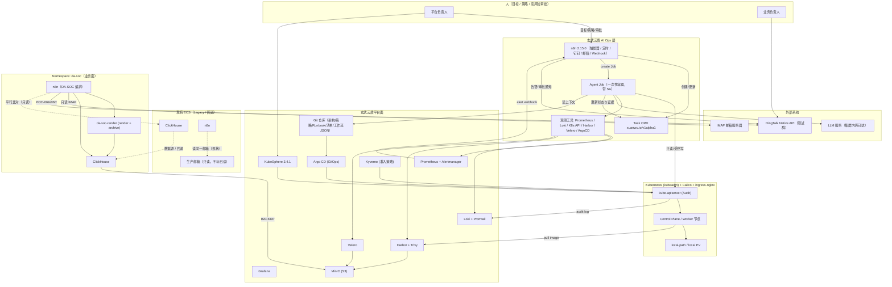
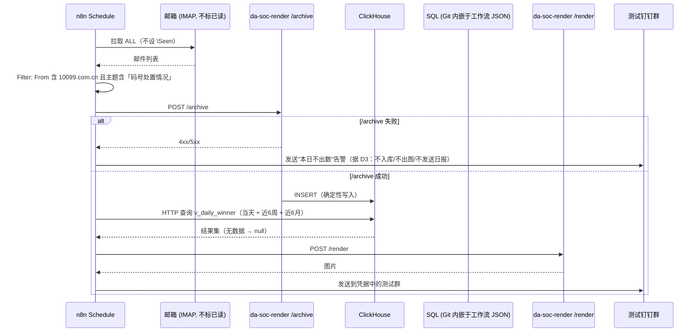

# 玄武云盾 V0.1 独立架构设计

> **文档性质：** 候选 V0.1 架构方案（Candidate Architecture Proposal），**不是** Architecture Baseline
> **作者：** 独立架构设计（未参考、未读取任何其他 Agent 输出）
> **输入依据：** 根目录 `README.md`、`TODO.md`、`00-project/*`、提示词中给定的 DA-SOC v0.1 约束
> **声明：** 本方案未读取 `09-implementation/00-architecture-review/` 下任何既有文件（撰写时该目录不存在），也未通过 git log / diff / history 间接获取他人方案
> **日期：** 2026-02（撰写时项目状态：V0.1 Planning / Architecture）

---

## 1. Executive Summary

### 1.1 一句话结论

> **玄武云盾 V0.1 应该是一套「4 台 VM、单集群、单管理面、单可观测栈」的最小 KubeSphere 私有云，它承载 DA-SOC v0.1 的**平行实例**（不迁移、不替换现有 ECS），并且第一次用「Task 即 CRD + n8n 只做触发器 + Agent 以 Kubernetes Job 形态运行 + GitOps 提供回滚」的方式，把 AI-Native 运维闭环跑通一遍。**

### 1.2 本方案的 7 个关键判断（与其他常见做法可能不同）

| # | 判断 | 说明 |
|---|---|---|
| J1 | **DA-SOC 不"迁入"集群，而是"平行部署 + 双跑比对 + 可一键回退"** | 现有 ECS 继续持有生产邮箱与历史数据，平台侧新建一套等价实例。只有双跑数字一致后人们才切换。这满足了「不得对生产收件箱 Mark as Read」「不改生产通报」的硬约束，也把不可逆风险降为零。 |
| J2 | **Task 不建独立服务，Task 就是 Kubernetes CRD（`xuanwu.io/v1alpha1 Task`）** | README/TODO 都要求 Task Center。V0.1 若为它再引入一套数据库 + API + 认证，就是典型过度建设。用 CRD + 集群既有 RBAC + 集群既有审计，一次拿到状态机、权限、审计、回滚、GitOps 全部能力。 |
| J3 | **Agent 运行形态 = Kubernetes Job（一次性、有镜像、有 SA、有日志、有 TTL）** | 不引入 Agent 平台（Dify/LangGraph 等）。Job 天然提供：身份（ServiceAccount）、最小权限（RoleBinding）、审计（API 审计 + 容器日志）、终止性（避免常驻 Agent 权限纠缠）、可复现（镜像版本化）。 |
| J4 | **V0.1 不建分布式存储，不建 Service Mesh，不建 SIEM，不建 CMDB，不建多租户** | 存储用 `local-path` + MinIO(S3) + ClickHouse 原生 `BACKUP`；DA-SOC 的确定性要求由「SQL 出数 + 原生备份 + 恢复演练」保证，而不是由存储冗余保证。 |
| J5 | **不建独立 Policy Engine，但把 L0/L1/L2 判定规则做成"资源分级 → 风险等级"的推导函数** | 「重启非生产 Pod 是 L1」这类按动作的清单会在 DA-SOC 这种"唯一业务、却是测试环境"的场景下失效。本方案改为先给资源打 tier，再由 tier 推导等级；**任何对 A 级边界（RBAC/NetworkPolicy/CNI/Node/Storage）的改动一律 L2**。 |
| J6 | **Platform 与 DA-SOC 的边界不是靠"约定"，而是靠 4 个可验证的机制落地** | Namespace + RoleBinding + ResourceQuota + NetworkPolicy（+ Pod Security/Kyverno）。凡无法用这 5 者表达的需求，视为边界设计缺陷，走例外流程。 |
| J7 | **离线镜像通路（`docker save` → `ctr images import`）是 V0.1 的一等公民，且必须收敛到 Harbor** | ECS 不能直连 Docker Registry 是既定事实。若不显式设计初次 seed 通路，Harbor 会陷入"要先有 Harbor 才能装 Harbor"的死循环。本方案给出明确的 Bootstrap 顺序与"镜像内容寻址"纪律。 |

### 1.3 本方案的 5 个最重要能力

1. **可恢复**：etcd 快照 + Velero + ClickHouse 原生备份 + 至少 3 类真实恢复演练。
2. **可审计**：Kubernetes Audit + Agent 操作记录 + Git 为唯一事实源 + 变更即 diff。
3. **边界可执行**：Namespace/RBAC/Quota/NetworkPolicy 真实落地，能通过越权测试证明。
4. **AI-Native 闭环可验证**：Observe → Analyze → Plan → Approve → Execute → Verify → Audit 每一步都有产物、有责任人、有回滚路径。
5. **DA-SOC 业务确定性不被平台破坏**：LLM 不参与出数出图；无数据不填 0；archive 失败即全链路中止。

### 1.4 评分（自评）

| 维度 | 1-10 | 理由 |
|---|---:|---|
| 架构合理性 | 9 | 规模与需求匹配，无孤立组件，每个组件都对应一条明确需求 |
| V0.1 范围控制 | 9 | 主动砍掉 10+ 项常被默认纳入的能力，并给出延后版本 |
| 技术选型 | 8 | 全部选主流、文档充分、可被 CLI/JSON 驱动的组件；KubeSphere 与 kubeadm 的组合需一次真机验证 |
| 安全性 | 8 | 管理面隔离、默认拒绝、Pod Security、Secret 静态加密、审计齐全；未做运行时安全与供应链签名 |
| 可实施性 | 9 | 4 台 VM、可分阶段上线（先 1 控制面后 3 控制面），有明确 Bootstrap 顺序 |
| 长期运维性 | 8 | kubeadm + GitOps + 声明式配置，升级路径清晰；升级本身对 Agent 仍需强约束 |
| AI-Native 程度 | 8 | Agent 有身份、有工具、有沙箱、有审批、有审计、有回滚；尚无自动多 Agent 交叉审计的强制执行 |
| 可审计性 | 9 | Task CRD + Git + K8s Audit + Loki 四源合一的证据链 |
| 可恢复性 | 8 | 备份面完整且有真实演练；跨节点存储冗余刻意不做，靠快照 + 演练补足 |
| DA-SOC 适配性 | 9 | 保存既有镜像、SQL 路径 A、n8n 编排权、不 Mark as Read、不覆盖生产邮箱全部满足 |
| V0.1 → V1.0 演进性 | 9 | 每一版新增项都可从 V0.1 的能力无缝生长，无需推倒重来 |
| **Overall Score** | **8.6** | 在"足够简单"与"真实可运行"之间取得了明确、可辩护的平衡 |

---

## 2. Understanding of Project Goals

### 2.1 玄武云盾是什么

玄武云盾（Xuanwu SecureOps Stack）是**面向企业内部业务的 AI 原生私有云与安全运营平台**。它的产出物不是"一套装好的 Kubernetes"，而是：

> **一套即使没有专家长期驻场，其他人也能依据文档、策略、Runbook 与 AI Agent 完成标准化运维的平台。**

### 2.2 从 README 提炼的 6 条不可妥协要素

| # | 要素 | README 依据 | 对架构的硬约束 |
|---|---|---|---|
| G1 | 安全、可控、可审计、可恢复、可演进、可由 AI 维护 | §1 | 架构必须自带审计面与恢复面，不能事后补 |
| G2 | 人定义目标与策略，AI 分析/执行/验证，高风险由人批准 | §3, §4.3, §6 | 必须有 L0/L1/L2 分级与审批通道，且审批产物可审计 |
| G3 | 平台与业务解耦（IT/业务边界） | §7 | 边界必须由 Namespace/RBAC/Quota/NetworkPolicy 落地 |
| G4 | 文档即平台知识，重要状态 Git 化 | §9, §13 | 所有平台定义必须能进 Git，运行时必须可与之比对 |
| G5 | 一切重要变更可回滚 | §4.7 | 必须有版本控制、快照、恢复演练 |
| G6 | 不以"组件安装完成"为成功标准 | §22 | V0.1 验收标准必须是能力验收（能监控/能备份/能恢复/能审计/能发现异常） |

### 2.3 从 README 提炼的 4 条安全红线（架构不得违反）

1. Kubernetes API 不暴露互联网；etcd 不暴露业务网络或互联网；KubeSphere 管理面仅授权路径可达。
2. 生产禁止无必要的 `cluster-admin`；ServiceAccount 不得无理由高权限。
3. 容器默认禁止 privileged / hostNetwork / hostPID / hostIPC / 不必要 hostPath；非 root；必须有 requests/limits 与健康检查。
4. 网络默认拒绝、明确允许；镜像必须来自受认可 Registry 且经过基本安全检查。

### 2.4 我对项目目标的独立判断（含对 README/TODO 的修正意见）

**认同的：** V0.1 的唯一核心目标（README §16）表述准确——"让 DA-SOC v0.1 在玄武云盾上稳定运行，并验证 AI-Native 运维模式"。这句话应当被当作 V0.1 唯一验收口径。

**我提出 3 点修正：**

1. **README §15 / TODO §0.1 把 "Harbor 镜像管理" 与 "KubeSphere" 列为 V0.1 必做，我同意；但把 "KubeSphere 私有云" 作为 V0.1 的自我定位（TODO §28）偏重**。V0.1 更准确的定位是 **Managed Kubernetes + 一个最小业务承载面**，KubeSphere 是**管理面视图**，而不是 V0.1 的价值主体。定位偏差会导致不必要的能力堆砌（多租户、服务目录、Workspace 层级设计等）。
2. **README §15 的 V0.1 清单缺少 3 个真正决定成败的能力**：① 离线镜像通路（现有 ECS 无 Registry 连通性）；② 时间同步与数据新鲜度监控（DA-SOC 是"每日确定性数字"，时间错位会直接产出错误通报）；③ **DA-SOC 与平台的接入契约（onboarding contract）**。这三项应在 V0.1 内补入（见 §23）。
3. **TODO 的整体节奏假设"先建平台，再上业务"是可行的，但忽略了"DA-SOC 当前已在生产邮箱链路上"这一事实**。因此待办清单必须增加一条前置任务：**确认平台侧平行实例期间，谁拥有生产邮箱**（见 §23.4 新增项 A9/A10 与 ADR-0013）。

---

## 3. DA-SOC v0.1 Constraints

### 3.1 我理解的 DA-SOC v0.1（作为固定输入，不重新设计）

**目标：** 在不改生产通报的前提下，用**一张确定性日报图**覆盖「当天 + 近 6 周 + 近 6 月」涉案号码统计，并发送到**测试**钉钉群。

**两条链路：**

| 链路 | 触发 | 路径 | 是否发钉钉 |
|---|---|---|---|
| 一次性回补 | 人工脚本 | POP3 → `/data/da-soc/raw` → HTTP INSERT → ClickHouse | 否 |
| 日常流程 | n8n 2.15.0 | IMAP(ALL，不标已读) → Filter(From 含 `10099.com.cn` 且主题含「码号处置情况」) → POST `/archive` → 解析入库 → HTTP 查询 SQL → POST `/render` → 测试钉钉群 | 是 |

**组件现实：**

- ClickHouse：`clickhouse/clickhouse-server` Docker 镜像，离线 `load`，**host network**，`127.0.0.1:8123`
- 本地服务：`da-soc-render:0.1`（render + archive 同镜像），`127.0.0.1:8091`
- n8n：`ghcr.io/deluxebear/n8n:chs`，**host network**
- ECS **不能直连 Docker Registry**：`docker save` → 上传 → `docker load`
- SQL 源在 `v0.1/sql/`，由 `tools/build_workflow.py` 嵌入工作流 JSON，**路径 A**：禁止 n8n UI 改 SQL、禁止社区 ClickHouse 节点
- 本机 6 个 Python 脚本日常禁用、仅作对照；`run_pipeline.py` 不承担生产编排；**日常编排权属于 n8n**

### 3.2 10 条业务纪律（平台必须"不破坏"它们）

| # | 纪律 | 平台侧的对应设计责任 |
|---|---|---|
| D1 | 数字只来自 ClickHouse SQL → `v_daily_winner`；**LLM 不得参与出数/出图** | Agent 的 RBAC **不授予**对 `da-soc` namespace 中 ClickHouse 数据的写权限；Agent 只能读、只能触发既有工作流 |
| D2 | 无数据时输出 `null` 或 `暂无数据`，**不得用 0 填充** | 平台侧不得引入任何"自动补数/补零"的自动化；巡检只能报警，不能修数 |
| D3 | `/archive` 失败 → 不入库、不出图、不发送 | 平台网络策略与 K8s Job 编排不得"绕过失败的 archive 直接跑 render"；巡检必须显式检测该中止语义是否被违反 |
| D4 | 钉钉走 POC-06A / POC-06C Native API；目标群**只能来自凭据** | 群 ID 只存于 Secret（Sealed Secret），不写入任何 ConfigMap、工作流 JSON 明文或 Agent Prompt |
| D5 | 绝不覆盖「监测bjfz邮箱广电报送信息」 | 该邮箱相关操作严格禁写；平台侧不部署任何会写该邮箱的组件 |
| D6 | **不得对生产收件箱 Mark as Read** | IMAP 必须以只读语义（不设 `\Seen`）访问；NetworkPolicy 允许 IMAP 出向，但巡检需比对"未读计数"是否有异常下降 |
| D7 | 不能用 UI 改 SQL；不能用社区 ClickHouse 节点 | 工作流 JSON 必须由 `build_workflow.py` 在构建机生成后进 Git；n8n 容器以只读方式加载工作流；配置漂移检测须覆盖"运行中工作流 ≠ Git 中工作流" |
| D8 | 本机 Python 脚本日常禁用；编排权归 n8n | 平台内同样**不得**为图方便引入 Python 编排脚本；巡检脚本若需要，只能是只读检查类，且必须登记 |
| D9 | 离线部署（save/load）是既定手段 | 平台必须设计离线镜像 seed 通路，并把它写入 Runbook（见 §11） |
| D10 | 当前 Docker / host network 的现实 | 平台红线默认禁 hostNetwork，因此 DA-SOC 入集群时必须**改造为 Service 化访问**，不得把 hostNetwork 带进集群 |

### 3.3 DA-SOC 资源画像（用于定 VM 规格）

| 组件 | CPU 请求/上限 | 内存请求/上限 | 存储 | 备注 |
|---|---|---|---|---|
| ClickHouse | 1 / 4 | 4Gi / 12Gi | 100–200Gi（local PV） | 数据可重建，但重建代价高，必须备份 |
| da-soc-render（render+archive） | 0.1 / 1 | 256Mi / 1Gi | 无（无状态） | 需要对小体量邮件正文做解析 |
| n8n | 0.5 / 2 | 1Gi / 4Gi | 10Gi（工作流与执行历史） | 已有镜像 `ghcr.io/deluxebear/n8n:chs` |
| 平台组件（Harbor/Prom/Grafana/Loki/Argo/KS/MinIO/Velero） | 合计 ~10 / 24 | 合计 ~24Gi / 48Gi | Harbor 100Gi、MinIO 200Gi、Prometheus 100Gi、Loki 50Gi | 已含预留 |

**结论：** 1 个 3 节点集群 + 1 个管理节点（4 VM）在 8C/32GB 量级即可承载 V0.1，且留有余量。

---

## 4. V0.1 Design Principles

在前述 README 原则基础上，我为本方案追加 9 条**可判定的**设计原则（每条都给出"如何判定违反"）：

| # | 原则 | 判定违反的方式 |
|---|---|---|
| P1 | **单栈原则**：同一能力域只允许存在一套实现 | 出现第二个监控/日志/Registry/Agent 运行时即为违反 |
| P2 | **可证伪原则**：任何安全或边界设计必须有**验证方法**，否则视为未设计 | 无法写出"允许的通、禁止的不通"测试用例，即为未设计 |
| P3 | **平行优先原则**：涉及生产链路的能力，先平行、后切换，永不原地改造 | 出现"直接改现有 ECS 上运行的链路"即为违反 |
| P4 | **证据优先原则**：Agent 的每个结论必须能指向具体数据源与查询 | 结论无证据引用，视为不满足 |
| P5 | **不可逆即 L2**：任何不可逆动作无论多小都是 L2 | 出现不可逆动作被判为 L0/L1 即为违反 |
| P6 | **默认拒绝**：网络、RBAC、镜像来源三者均默认拒绝 | 存在 default-allow 路径即为违反 |
| P7 | **Git 即事实源**：运行状态与 Git 定义不一致即为漂移，需产生 Task | 手工改集群且无对应 Git 提交即为漂移 |
| P8 | **Agent 不越业务边界**：平台 Agent 不修改业务数据、不生成业务数字、不代业务做业务决策 | Agent 出现 DA-SOC 数据写操作即为违反 |
| P9 | **最小组件数原则**：每新增一个组件必须回答"不做它会阻断哪项 V0.1 验收" | 答不出来即为应删组件 |

**P9 是本方案最重要的范围控制工具**，§5 的每个组件都在 §20 中被逐个质询过。

---

## 5. Recommended V0.1 Architecture

### 5.1 总体形态

```text
                          ┌──────────────────────────────────────┐
                          │  人（平台负责人 / 业务负责人）        │
                          │  DingTalk / CLI / KubeSphere Console │
                          └───────────────┬──────────────────────┘
                                          │ 目标 / 策略 / 审批
                                          ▼
   ┌──────────────────────────────────────────────────────────────────────┐
   │                    Xuanwu AI Ops Layer （V0.1 最小闭环）              │
   │                                                                      │
   │  n8n (触发器/定时/钉钉/邮箱/Webhook)  ──►  Agent Job (一次性)          │
   │        │                                        │                    │
   │        │ 创建 Task CR                           │ 只读观测 + 受控执行  │
   │        ▼                                        ▼                    │
   │   Task CRD (xuanwu.io/v1alpha1)  ◄──────  3 个 ServiceAccount         │
   │   （状态机 + 证据 + 审批 + 结果）           (observer/executor/audit)  │
   └────────────────────────┬─────────────────────────────────────────────┘
                            │ Kubernetes API（唯一执行通道）
   ┌────────────────────────▼─────────────────────────────────────────────┐
   │                     Xuanwu Platform Plane                            │
   │                                                                      │
   │   KubeSphere 3.4.1 (管理面视图 / RBAC / 审计视图)   Argo CD (GitOps)   │
   │   ────────────────────────────────────────────────────────────────   │
   │   Kubernetes  (kubeadm v1.26.x, 1~3 control-plane + 2~3 worker)      │
   │   Calico (CNI/NetPol) · ingress-nginx + MetalLB · Kyverno            │
   │   local-path (SC) · MinIO (S3) · Velero · Harbor + Trivy             │
   │   kube-prometheus-stack · Promtail + Loki + Grafana                  │
   └────────────────────────┬─────────────────────────────────────────────┘
                            │ Namespace / RBAC / Quota / NetworkPolicy
   ┌────────────────────────▼─────────────────────────────────────────────┐
   │              Business Plane — Namespace: da-soc                       │
   │   n8n (编排) ──► da-soc-render (render+archive) ──► ClickHouse        │
   │     │                                                 │              │
   │     └── 出向: IMAP(只读) / DingTalk HTTPS              └─ 备份: BACKUP │
   └──────────────────────────────────────────────────────────────────────┘
                            ▲
                            │ 平行双跑期间只读比对（不入库冲突）
   ┌────────────────────────┴─────────────────────────────────────────────┐
   │   现有 ECS（Legacy / 事实权威）  Docker + host network               │
   │   ClickHouse · da-soc-render · n8n · 生产邮箱访问权                   │
   │   —— V0.1 期间不动，作为回退与数据源                                 │
   └──────────────────────────────────────────────────────────────────────┘
```

### 5.2 V0.1 组件清单（**只有这 16 项**）

| 层 | 组件 | 为什么必须在 V0.1 |
|---|---|---|
| 基础设施 | 4 台 VM（1 管理 + 1~3 控制面 + 2~3 Worker，见 §7） | 无 |
| OS | 统一 Linux LTS + 安全基线 + chrony | 时间错位直接影响 DA-SOC 日报正确性 |
| Kubernetes | kubeadm v1.26.x | 承载面 |
| 管理面 | KubeSphere 3.4.1 | README/TODO 明确要求，且在 V0.1 提供 RBAC/审计/多用户视图 |
| CNI | Calico | NetworkPolicy 是边界落地机制之一 |
| Ingress | ingress-nginx + MetalLB（L2，小 VIP 池） | 管理面与 Grafana/Harbor 需要稳定入口；避免业务用 NodePort |
| 策略 | Kyverno | 让"默认禁 privileged/hostNetwork/非 root/无 limits"从文档变成强制 |
| 存储 | local-path StorageClass + local PV（ClickHouse）+ MinIO(S3) | 满足 K8s 动态卷、对象存储、备份三需求，且不做分布式存储 |
| Registry | Harbor + Trivy | 离线镜像收敛点 + 镜像来源强制点 + 基础扫描 |
| GitOps | Argo CD | 提供"定义即事实源"与"回滚 = 回退 Git 版本" |
| 监控 | kube-prometheus-stack（Prometheus/Alertmanager/Grafana/node-exporter/kube-state-metrics） | 能力域 06 的最小实现 |
| 日志 | Promtail + Loki（+ Grafana 同一入口） | 平台日志 + Pod 日志 + 审计日志统一检索 |
| 备份 | Velero + etcd snapshot CronJob + ClickHouse BACKUP | 可恢复性的唯一保证 |
| 安全 | RBAC + Kubernetes Audit + Secret 静态加密 + Sealed Secrets | 红线的可执行化 |
| AI Ops | n8n + Agent Job + Task CRD + 3 SA +（LLM 通过集群内网网关出口） | 验证 AI-Native 的要件 |
| DA-SOC | ClickHouse / da-soc-render / n8n（复用既有镜像） | 业务 |

### 5.3 明确"不做"（见 §21）

Service Mesh、多集群、分布式存储（Ceph/Longhorn）、SIEM、CMDB、多租户与自助服务目录、完整零信任、运行时安全（Falco）、Supply Chain（cosign/SBOM 强制执行）、完整灾备（异地双活）、自动修复体系、Velocity/混沌工程平台、独立 Task Center 服务、独立 Policy Engine 服务。

---

## 6. Logical Architecture Diagram

### 6.1 平台与业务逻辑架构



### 6.2 关键数据流（DA-SOC 日常流程在平台上的落地）



---

## 7. Infrastructure Architecture

### 7.1 VM 规划（V0.1 最小可运行）

| 主机名 | 角色 | vCPU | RAM | 系统盘 | 数据盘 | 推荐 IP（示例） | 备注 |
|---|---|---|---|---|---|---|---|
| `xw-mgmt-01` | 管理/跳板/运维入口；Argo CD、Grafana 入口；可托管 MinIO | 4 | 16G | 100G | 500G | 10.20.0.10 | 也可作为堡垒机替代（V0.1 不单独买堡垒机） |
| `xw-k8s-cp-01` | Control Plane + etcd（+ Worker） | 8 | 32G | 100G | 200G | 10.20.0.11 | **阶段一唯一控制面，含 Worker 角色** |
| `xw-k8s-w-01` | Worker | 8 | 32G | 100G | 500G | 10.20.0.21 | 承载 ClickHouse local PV |
| `xw-k8s-w-02` | Worker | 8 | 32G | 100G | 500G | 10.20.0.22 | 承载 Harbor / Prometheus / Loki PV |

**合计：28 vCPU / 112 GB RAM / 约 1.9 TB 可用数据盘。**

**HA 阶段二（V0.1 内可选，强烈建议在 DA-SOC 双跑前完成）：**

| 主机名 | 角色 | vCPU | RAM | IP |
|---|---|---|---|---|
| `xw-k8s-cp-02` | Control Plane + etcd | 8 | 32G | 10.20.0.12 |
| `xw-k8s-cp-03` | Control Plane + etcd | 8 | 32G | 10.20.0.13 |

**为什么这样切分：**

1. **为什么管理节点要独立于集群？** 因为 README 红线要求"管理面只允许授权管理路径访问"，而 KubeSphere/Argo CD/Grafana 若与业务 Pod 混布，业务侧网络策略的任何错误都可能暴露管理面。独立节点让管理面的网络策略可以极其简单（只允许来源于管理 VLAN 的 443）。
2. **为什么阶段一只有 1 个控制面？** 因为 3 控制面的 etcd 集群需要至少 3 台同时在线，早期调试期的反复重建会显著变慢。但**必须在双跑前扩到 3 控制面**，否则 DA-SOC 依赖单点。
3. **为什么 worker 带 500G 数据盘？** ClickHouse（100–200G）、Harbor（100G）、Prometheus（100G）、Loki（50G）之和已接近 450G，需要两块盘分摊 I/O。
4. **为什么不做 6+ 节点？** 见 P9：多出的节点不解除任何 V0.1 验收项的阻断。

### 7.2 OS 与基础依赖

| 项 | V0.1 选择 | 理由 |
|---|---|---|
| OS | Ubuntu Server 22.04 LTS（或同等企业 LTS） | containerd/kubeadm 生态支持最好；5 年维护窗口 |
| 内核参数 | 关闭 swap（或用 `kubelet --fail-swap-on=false` 显式记录为例外）、开启 `br_netfilter`、`ip_forward`、`overlay` | kubeadm 前置条件 |
| 时间同步 | chrony，指向内网 NTP 源，fallback 公网；时区统一 `Asia/Shanghai` | **DA-SOC 日报是按天的确定性产物，节点时间漂移会直接产出错误统计** |
| DNS | 内网 DNS 解析 `*.lab.xuanwu.local`；CoreDNS 转发至内网 DNS | 管理面域名稳定 |
| 包源 | 内网镜像站或离线仓库 | 与 Registry 离线约束同源 |
| 主机安全基线 | 禁 root SSH、仅密钥登录、主机防火墙（仅管理网段）、auditd、最小化服务、自动安全更新（分批次） | TODO P1.2 |
| 时钟/日志 | journald 持久化（`Storage=persistent`），日志轮转 | Promtail 需要读取 journald |
| 容器运行时 | containerd（K8s 内置路径） | 不引入 Docker daemon（Docker 仅用于构建机 `docker save`） |

### 7.3 命名规范

```text
VM:      xw-<role>-<nn>         例: xw-k8s-cp-01 / xw-k8s-w-01 / xw-mgmt-01
Namespace: <domain>-<name>      例: da-soc / platform-system / platform-obs / aiops
节点标签:  node-role.xuanwu.io/{control-plane,worker,business-critical}
资源标签:  xuanwu.io/tier=A|B|C   xuanwu.io/owner=platform|da-soc   xuanwu.io/backup=daily|weekly
```

`xuanwu.io/tier` 是**风险分级与备份策略的统一锚点**（见 §12.4、§16）。

---

## 8. Kubernetes / KubeSphere Architecture

### 8.1 Kubernetes 发行方式选择（本方案的核心选型之一）

| 候选 | 优点 | 缺点 | 判定 |
|---|---|---|---|
| **kubeadm（选定）** | 上游标准；配置可完全 YAML 化入 Git；升级路径官方明确（`kubeadm upgrade`）；社区文档最全；与 KubeSphere 3.4.1 官方支持矩阵一致 | 需自己管证书、etcd、HA VIP | ✅ **采用** |
| k3s | 单二进制、极简、自带 etcd HA 与 LB | 与 KubeSphere 兼容性需额外验证；自带 Traefik/ServicelB 需禁用，增加与 KubeSphere 抢 Ingress 的风险 | ❌ 兼容性风险不该在 V0.1 承担 |
| KubeKey 一键装 | 快 | 接管集群升级与节点管理，抽象层厚，漂移检测与增量升级更难被 Agent 精确控制 | ⚠️ 仅作为参考脚本，不作为事实源 |
| RKE2 | 安全默认好 | 生态与文档相对少，团队熟悉度低 | ❌ |

**决定：** kubeadm 安装，所有 kubeadm 配置（`InitConfiguration` / `ClusterConfiguration` / `JoinConfiguration` / `KubeletConfiguration`）以文件形式进 Git，节点初始化由一份幂等脚本（Ansible 或 Shell）执行，脚本本身也进 Git。

### 8.2 版本策略

| 组件 | V0.1 版本 | 策略 |
|---|---|---|
| Kubernetes | **v1.26.x**（固定小版本，如 v1.26.15） | KubeSphere 3.4.1 支持矩阵内的版本；V0.1 内**最多升级一个 minor**，且必须走 L2 审批 |
| containerd | 随 kubeadm 要求 | 跟随 K8s |
| Calico | 与 K8s 1.26 兼容的稳定版 | 固定版本 |
| KubeSphere | **3.4.1** | 见 §8.3 |
| ingress-nginx | 稳定版 | 固定版本 |
| Argo CD | 稳定版 | 固定版本 |

**版本固定纪律：** 所有版本写入 `01-architecture/version-matrix.md`（V0.1 需新增此文件），任何版本漂移即为 Configuration Drift，产生 Task。

### 8.3 KubeSphere 版本决策

| 候选 | 优点 | 缺点 | 判定 |
|---|---|---|---|
| **KubeSphere 3.4.1** | 成熟、文档充分、与 K8s 1.26 官方组合明确；RBAC/审计/多用户/监控视图开箱可用；`kk` 与非 kk 安装均有成熟路径 | 组件较重（需 min 8C/16G 起） | ✅ **采用** |
| KubeSphere 4.x（LuBan 扩展架构） | 更模块化、更轻 | 架构变化较大、扩展生态仍在演进，V0.1 不宜承担 | ❌ 延后到 V0.2/V0.3 评估 |

**部署方式：** 在已就绪的 kubeadm 集群上，以 **Helm / 官方 manifest** 方式安装 KubeSphere 核心组件（不启用 `kk` 对整个集群的接管），并**关闭 KubeSphere 自带的监控/日志/告警组件**，统一使用本方案的 kube-prometheus-stack + Loki。理由：

- 避免 §P1（单栈原则）被违反——否则会得到"两套监控、两套日志"；
- KubeSphere 的自带 Prometheus 与本方案 Prometheus 并存会带来双份资源占用与双份告警源，是典型的 V0.1 踩坑点。

### 8.4 Control Plane 设计

| 项 | 设计 |
|---|---|
| 拓扑 | 阶段一：单控制面（stacked etcd）；阶段二：3 控制面 stacked etcd（HA） |
| API Server 高可用 | 阶段二使用 **kube-vip**（ARP 模式，静态 Pod）提供 `10.20.0.100:6443` 的 VIP，避免引入外部 LB |
| kube-apiserver 关键参数 | `--audit-policy-file`、`--audit-log-path=/var/log/kubernetes/audit/audit.log`、`--audit-log-maxage=30`、`--audit-log-maxbackup=10`、`--audit-log-maxsize=100`、`--encryption-provider-config`（Secret 静态加密）、`--authorization-mode=Node,RBAC`（**不启用 AlwaysAllow**）、`--anonymous-auth=false`（若组件需要则显式记录例外）、`--enable-admission-plugins` 含 `NodeRestriction`、`PodSecurity` |
| etcd | stacked；每 6h 自动快照（`etcdctl snapshot save` CronJob）→ 落盘并同步至 MinIO/NFS；保留 14 天 |
| 证书 | kubeadm 管理；`kubeadm certs check-expiration` 纳入日常巡检（TASK-004）；续期走 Runbook（L2） |
| 控制面是否承载业务 | **阶段一允许（taint 保留但给业务 Pod 加 toleration 需 L2 审批）**；阶段二起控制面 taint 生效，业务只跑在 worker |
| 控制面隔离 | 控制面节点不暴露 kube-apiserver 到管理 VLAN 以外的网段；etcd 只监听 localhost/节点内网 |

### 8.5 Worker 设计

- 阶段一：`xw-k8s-cp-01`（+Worker 角色）+ `xw-k8s-w-01` + `xw-k8s-w-02`
- 关键业务（`da-soc`）通过 `nodeSelector` / 污点容忍固定在具备大容量数据盘的 worker 上（ClickHouse 使用 local PV，天然绑节点）
- 每节点预留：`system-reserved`（cpu 500m / mem 1Gi）、`kube-reserved`（cpu 500m / mem 1Gi）、`eviction-hard`（`memory.available<500Mi`、`nodefs.available<10%`、`imagefs.available<15%`）
- 镜像 GC：`imageGCHighThresholdPercent=80`、`imageGCLowThresholdPercent=70`

### 8.6 Namespace 规划（V0.1 全部，仅 7 个）

| Namespace | 归属 | 用途 | tier |
|---|---|---|---|
| `kube-system` | 平台 | K8s 自身、Calico、ingress-nginx、MetalLB、kube-vip | A |
| `platform-system` | 平台 | KubeSphere、Kyverno、Argo CD、Velero、cert 相关 | A |
| `platform-obs` | 平台 | Prometheus / Alertmanager / Grafana / Promtail / Loki | B |
| `platform-registry` | 平台 | Harbor（+ Trivy） | B |
| `platform-data` | 平台 | MinIO | B |
| `aiops` | 平台 | n8n（平台运维触发器）、Task CRD 实例、Agent Job、Agent SA | B |
| `da-soc` | 业务 | DA-SOC v0.1 全部组件 | **A（业务关键）** |

**刻意不设**的 Namespace：`monitoring`（重复）、`logging`（重复）、`security`（V0.1 无独立安全组件，Kyverno 已入 platform-system）、`default`（业务禁用）。

### 8.7 RBAC 模型

**主体（V0.1 全部人群与身份）：**

| 主体 | 类型 | 权限范围 | 备注 |
|---|---|---|---|
| `xw-platform-admin` | 人（KubeSphere 用户，1–2 人） | `cluster-admin`，但**仅通过管理 VLAN + KubeSphere/SSO 登录**；禁止在节点上直接用 admin kubeconfig 做日常操作 | 高权限账号不得当业务账号用 |
| `xw-platform-ops` | 人 | `platform-system`/`platform-obs`/`platform-registry` 命名空间 admin；集群级只读 | 日常运维主力 |
| `xw-business-da-soc` | 人 | `da-soc` 命名空间 admin（不含 Secret 读取到集群外的能力） | 业务侧 |
| `xw-auditor` | 人 | 集群级只读 + 审计日志读取（Loki 只读） | 审计 |
| `sa-agent-observer` | ServiceAccount | 集群级 `view`（只读）+ 所有命名空间 Pod 日志读取 | Agent 观测 |
| `sa-agent-executor` | ServiceAccount | `da-soc`/`aiops` 内受限写（具体动词白名单见 §12.5） | Agent 受控执行 |
| `sa-agent-auditor` | ServiceAccount | 只读 + Task CRD 写 + 审计日志读 | Agent 审计与记录 |
| `sa-n8n` | ServiceAccount | 仅 `aiops` 内 Job 创建/查询、Task CRD 读写 | 触发器的最小权限 |
| `sa-da-soc` | ServiceAccount | 仅 `da-soc` 内自身资源 | 业务 Pod 身份 |

**严禁：** 任何业务或 Agent 主体持有 `cluster-admin`；任何 `ClusterRoleBinding` 到 `system:authenticated`；ServiceAccount token 长期挂载在非必要 Pod（V0.1 统一开启 `automountServiceAccountToken: false`，按需显式开启）。

### 8.8 ResourceQuota 与 LimitRange

每个业务/平台命名空间都有 Quota，避免"一个业务把整集群吃掉"：

```yaml
# da-soc（业务配额，按 §3.3 资源画像 + 100% 余量）
apiVersion: v1
kind: ResourceQuota
metadata:
  name: da-soc-quota
  namespace: da-soc
spec:
  hard:
    requests.cpu: "6"
    requests.memory: 16Gi
    limits.cpu: "12"
    limits.memory: 32Gi
    persistentvolumeclaims: "6"
    requests.storage: 300Gi
    count/deployments.apps: "10"
    count/jobs.batch: "20"
    services.nodeports: "0"        # 业务禁止 NodePort（策略化，非口头）
    services.loadbalancers: "0"
---
apiVersion: v1
kind: LimitRange
metadata:
  name: da-soc-defaults
  namespace: da-soc
spec:
  limits:
    - type: Container
      default:        { cpu: 500m, memory: 512Mi }
      defaultRequest: { cpu: 100m, memory: 128Mi }
      max:            { cpu: "4",  memory: 12Gi }
      min:            { cpu: 10m,  memory: 32Mi }
```

> **特别注意：** `services.nodeports: "0"` 是 TODO P0.9「NodePort 禁止/例外规则」的**可执行化**。例外必须通过 ADR + 显式修改配额，且该修改是 L2。

### 8.9 Ingress

- **单一控制器**：`ingress-nginx`（Deployment，2 副本，分布在两个 worker）
- **入口 IP**：MetalLB L2 模式，VIP 池 `10.20.0.200–10.20.0.209`；`ingress-nginx` 的 Service 类型为 `LoadBalancer`
- **管理面域名（仅管理 VLAN 可达）**：`ks.lab.xuanwu.local`、`argocd.lab.xuanwu.local`、`grafana.lab.xuanwu.local`、`alertmanager.lab.xuanwu.local`
- **Registry 域名**：`harbor.lab.xuanwu.local`（供节点与构建机使用，管理 VLAN + 节点 VLAN 可达）
- **业务域名**：V0.1 **不对外开放任何 da-soc 入口**（DA-SOC 是内部编排型业务，无外部用户访问需求）。若未来需要，单独 ADR。
- **TLS**：内部 CA 签发，证书清单进 Git（证书本体入 Secret/Sealed Secret），到期巡检纳入 TASK-004

### 8.10 Pod Security

统一采用 **Pod Security Admission**（`restricted` 为默认，`baseline` 为例外）+ Kyverno 补充不能表达的部分：

| Namespace | PSA 标签 |
|---|---|
| `da-soc` | `pod-security.kubernetes.io/enforce: restricted`（`n8n`/`render`/`clickhouse` 均可满足） |
| `aiops` | `restricted`（Agent Job 必须非 root、只读根文件系统、无特权） |
| `platform-obs` / `platform-registry` / `platform-data` | `baseline`（部分官方 chart 需要） |
| `kube-system` / `platform-system` | `baseline` + 显式例外清单（CNI/Ingress/Velero node-agent 等需 hostPath 或特权，逐个记录并纳入审计） |

**KubeSphere 与 PSA 的关系：** KubeSphere 的 PSP/安全设置不作为事实源，PSA + Kyverno 才是。这一点必须写进文档，否则会出现"两套安全策略"。

### 8.11 Cluster Lifecycle

| 阶段 | 动作 | 风险等级 | 产物 |
|---|---|---|---|
| Day-0 | 节点 OS 基线、内核参数、containerd、kubeadm 配置入 Git | L1 | `manifests/` + 基线报告 |
| Day-1 | 单控制面初始化、Calico、MetalLB/kube-vip、ingress-nginx、local-path、Kyverno | L1 | 集群可用 |
| Day-2 | KubeSphere、Argo CD、Harbor、MinIO、Prom/Velero/Loki | L1 | 平台面完整 |
| Day-3 | Namespace/RBAC/Quota/NetPol/PSA 落地 + 越权测试 | L1/L2 | 边界验证报告 |
| 稳定期 | 扩到 3 控制面 | **L2** | HA 记录 |
| 升级 | K8s minor 升级 | **L2** | 升级 Runbook + 回滚（etcd 快照 + 节点快照） |
| 退役 | 节点下线 `kubectl drain` → 删节点 | **L2** | 变更记录 |

---

## 9. Network Architecture

### 9.1 网络分区（VLAN / 子网）

| 区域 | 用途 | 示例网段 | 说明 |
|---|---|---|---|
| VLAN 10 `MGMT` | 管理面访问（人 → KubeSphere/Argo/Grafana/Harbor） | 10.20.10.0/24 | 仅 IT 管理终端可达 |
| VLAN 20 `K8S` | 集群节点内网、kube-apiserver VIP、Pod/Service CIDR 上游 | 10.20.0.0/24 | 节点间通信 |
| VLAN 30 `DMZ` | 预留（V0.1 不放任何对外服务） | 10.20.30.0/24 | V0.1 空置 |
| VLAN 40 `DATA` | NFS / 备份目标（如需外置） | 10.20.40.0/24 | V0.1 可仅用集群内 MinIO |
| Egress | 出向代理/防火墙 | 经 egress gateway | IMAP / DingTalk / LLM / 时间同步 |

**Pod CIDR：** `10.244.0.0/16`；**Service CIDR：** `10.233.0.0/18`（与节点网段不重叠）。

### 9.2 网络可达矩阵（默认拒绝）

| 源 → 目的 | MGMT | K8S 节点 | Pod | apiserver:6443 | etcd:2379 | Harbor:443 | Internet | IMAP:993 | DingTalk:443 |
|---|---:|---:|---:|---:|---:|---:|---:|---:|---:|
| 管理终端（VLAN10） | — | ❌ | ❌ | ✅(VIP, 仅 6443) | ❌ | ✅ | ❌ | ❌ | ❌ |
| 节点（VLAN20） | ❌ | ✅ | ✅ | ✅ | ✅(仅节点间) | ✅ | 仅经代理 | ❌ | ❌ |
| `da-soc` Pod | ❌ | ❌ | ✅(策略内) | ❌ | ❌ | ✅ | ❌ | ✅ | ✅ |
| `aiops` Pod（Agent） | ❌ | ❌ | ✅(策略内) | ✅ | ❌ | ✅ | ❌ | ❌ | ✅(仅 n8n) |
| 业务人员终端 | ❌ | ❌ | ❌ | ❌ | ❌ | ❌ | ❌ | ❌ | — |

**核心结论三条：**

1. **Kubernetes API 只从管理 VLAN（人）与集群内（Agent/组件）可达，绝不出现在互联网。**
2. **etcd 永远不跨节点以外的网络暴露。**
3. **`da-soc` Pod 有且只有 3 类出向：集群内（CH/render）、IMAP、DingTalk。** 这直接实现了 D4/D6 与"最小出向"。

### 9.3 Kubernetes 网络与 NetworkPolicy 设计

**默认拒绝（每个命名空间成立）：**

```yaml
apiVersion: networking.k8s.io/v1
kind: NetworkPolicy
metadata: { name: default-deny-all, namespace: da-soc }
spec:
  podSelector: {}
  policyTypes: [Ingress, Egress]
```

**`da-soc` 命名空间显式放行清单（共 7 条，全部可测试）：**

| # | 方向 | 源/目的 | 端口 | 用途 |
|---|---|---|---|---|
| 1 | Egress | `kube-system` CoreDNS | 53 UDP/TCP | 域名解析 |
| 2 | Ingress | `da-soc/n8n` → `render` | 8091 | 调用 /archive /render |
| 3 | Ingress | `da-soc/n8n` → `clickhouse` | 8123, 9000 | 查询与写入 |
| 4 | Ingress | `platform-obs/prometheus` → 全 `da-soc` | 各 metrics 端口 | 抓取 |
| 5 | Egress | `n8n` → 邮箱服务器 IP | 993 | IMAP（**不标已读**） |
| 6 | Egress | `n8n` → DingTalk API IP/域名 | 443 | POC-06A/06C |
| 7 | Egress | `da-soc` → `platform-data/minio` | 9000 | ClickHouse BACKUP |

**测试方法（P2 可证伪原则）：**

- 允许的：`kubectl exec` 从 `n8n` Pod `curl render:8091/healthz` 必须成功
- 禁止的：从 `render` Pod 主动 `curl` 邮箱 IP:993 必须超时；从 `default` Namespace 建测试 Pod 访问 `clickhouse:8123` 必须失败；从业务人员终端访问 apiserver 必须失败

**`aiops` 命名空间放行：** Agent Job → apiserver（6443，仅经过 ServiceAccount）、→ Prometheus/Loki/Harbor/Velero API（HTTPS）、→ LLM 网关（内网 443）；Agent Job **禁止**访问 `da-soc` ClickHouse 的数据写入端口语义（允许 8123 只读连接用于"验证数字"是允许的，但 SA 无权 INSERT——见 §12.5）。

### 9.4 南北向与东西向

- **南北向**：V0.1 仅管理面（人 → KubeSphere/Argo/Grafana/Harbor）。无业务南北向入口。
- **东西向**：Pod↔Pod 由 NetworkPolicy 控制；节点↔节点由 Calico VXLAN 封装，宿主防火墙只放行 VXLAN（UDP 4789）、BGP/健康检查端口与 kubelet（仅节点网段）。
- **出向**：`da-soc` 与 `aiops` 的出向走节点 NAT 或显式 egress gateway。V0.1 采用**IP 白名单**而非 HTTP 代理，理由：白名单可由 NetworkPolicy 声明式表达且可被 Agent 验证，代理会额外引入一个高可用组件与凭据分发问题。

---

## 10. Storage Architecture

### 10.1 先回答"DA-SOC 真正需要什么"

| 需求 | 真实要求 | 结论 |
|---|---|---|
| ClickHouse 数据 | 单节点本地高速盘；数据量在 100–200Gi 量级；**可从源邮件重建**但代价高 | local PV 足够 |
| ClickHouse 备份 | 需要可恢复快照，且恢复必须被演练 | 原生 `BACKUP ... TO Disk('backups', 's3://...')` |
| n8n 工作流与执行历史 | 10Gi 级别，突然丢失影响编排（工作流 JSON 已在 Git，可重建） | local-path 动态卷 |
| 平台组件配置 | 可重建（定义在 Git） | local-path 动态卷 |
| Harbor 镜像 | 可重建（镜像源在构建机），但重建成本高 | local-path + 定期导出/复制 |
| MinIO 对象（备份） | **这是最后一道防线，最重要** | 放在管理节点独立盘，并可选复制到 NFS |

**关键判断：** V0.1 **不需要**分布式存储（Ceph）也**不需要**复制型块存储（Longhorn）。理由：

1. ClickHouse 的确定性要求已由"SQL 出数 + 原生 BACKUP"满足，不依赖存储冗余；
2. Longhorn 的最小可用形态（3 副本 + instance-manager）会吃掉 3 个 worker 各 1–2 vCPU / 2–4GB 内存，且引入"存储引擎本身故障"这一新故障域；
3. Ceph 的运维复杂度（OSD/MON/PG/MDS + 网络调优）与 V0.1 的团队规模（"缺少专职云原生运维团队"，README §2）严重不匹配；
4. 真正需要"能恢复"的部分，用**备份 + 演练**解决比用**冗余**解决更符合 README §4.7 与 §22 的成功标准。

### 10.2 StorageClass 设计（V0.1 只有 2 个）

| StorageClass | Provisioner | 回收策略 | 用途 | 说明 |
|---|---|---|---|---|
| `local-path` | Rancher local-path-provisioner | Delete | 默认 SC；平台组件、n8n、Harbor、Prometheus、Loki、MinIO | 简单、无额外组件（除 provisioner 本身） |
| `local-static` | `kubernetes.io/no-provisioner` | Retain | **ClickHouse 专用** | 手工创建 PV 并绑节点，`Retain` 保证误删 PVC 不丢数据 |

**ClickHouse PV 示例：**

```yaml
apiVersion: v1
kind: PersistentVolume
metadata:
  name: pv-clickhouse-01
  labels: { xuanwu.io/tier: A, xuanwu.io/backup: daily }
spec:
  capacity: { storage: 200Gi }
  accessModes: [ReadWriteOnce]
  persistentVolumeReclaimPolicy: Retain
  storageClassName: local-static
  local: { path: /data/clickhouse }
  nodeAffinity:
    required:
      nodeSelectorTerms:
        - matchExpressions:
            - { key: kubernetes.io/hostname, operator: In, values: [xw-k8s-w-01] }
```

### 10.3 数据备份与恢复（存储层）

| 数据 | 备份方式 | 频率 | 保留 | 恢复方式 |
|---|---|---|---|---|
| ClickHouse 数据 | 原生 `BACKUP TABLE ... TO Disk('backups', 's3://xw-backup/clickhouse/...')` | 每日 1 次（日报发送成功后） | 30 天 | `RESTORE TABLE ... FROM ...`，恢复到 `da_soc_restore` 库比对行数 |
| ClickHouse 表结构 | `SHOW CREATE TABLE` 导出（Git + MinIO） | 每日 | 永久 | Git 应用 |
| n8n 工作流 JSON | `build_workflow.py` 生成 → Git | 每次变更 | 永久（Git） | 重新导入（只读挂载） |
| n8n 运行数据（凭证、执行历史） | Velero PVC 备份 | 每日 | 14 天 | Velero restore |
| 平台组件卷 | Velero（node-agent 文件系统备份） | 每日 | 14 天 | Velero restore |
| 对象存储（MinIO 自身） | 若 V0.1 无第二存储，则对 MinIO 数据目录做 cron 同步到管理节点/NFS | 每日 | 30 天 | 目录级还原 |

**V0.1 明确不做：** 跨地域复制、异地灾备、存储级双活。

---

## 11. Registry Architecture

### 11.1 判断：是否需要 Registry？

**需要，且是 V0.1 的一等公民。** 三条硬理由：

1. **离线事实**：现有 ECS 不能直连 Docker Registry（提示词 §七）。若不建 Registry，集群里每一个组件的每一个镜像都要"人工 save/load/import"，V0.1 会退化为手工操作集合，且无法审计"这个镜像从哪来"。
2. **安全红线**：README §8「生产镜像必须来自企业认可的 Registry」——没有 Registry 就没有这条红线的落点。
3. **AI 可操作性**：Harbor 有完整 REST API（可扫描任务、可列 repository、可查漏洞），Agent 可以用 JSON 判断"镜像是否有高危漏洞""这个 tag 是否被覆盖"，这是纯"docker save"工作流无法提供的能力。

### 11.2 V0.1 选型：Harbor

| 候选 | 判定 |
|---|---|
| **Harbor（选定）** | 内置 Trivy 扫描、RBAC、项目隔离、镜像保留策略、GC、复制策略、完整 API；README 已点名 |
| CNCF Distribution (registry:2) | 太薄，无扫描、无 RBAC，V0.3 前仍需换成 Harbor |
| Zot / Quay | 生态与团队熟悉度不如 Harbor，无额外收益 |

**部署形态：** Harbor 部署在集群内（`platform-registry` 命名空间），使用 Helm chart，配置：

| 项 | 设置 |
|---|---|
| 存储后端 | 本地文件系统（local-path PVC，100Gi）+ 定期导出至 MinIO |
| 数据库 | Harbor 内置 PostgreSQL（**不引入集群级 PostgreSQL**，避免为 V0.1 增加一个有状态组件） |
| Redis | Harbor 内置 Redis |
| TLS | 内部 CA 签发，节点与构建机信任该 CA |
| 扫描 | Trivy，**推送时扫描 + 每周全量重扫** |
| 保留策略 | 每个项目保留最近 10 个 tag；`latest` 不特殊对待 |
| 垃圾回收 | 每周 1 次（Harbor GC CronJob） |
| 认证 | Harbor 本地账号 + 项目级 robot account（仅供集群拉取） |

### 11.3 镜像管理纪律（本方案的关键设计）

**纪律 1：镜像内容寻址。** 凡进入集群的镜像，必须以 **digest** 记录在 Git（`01-architecture/version-matrix.md` 或 `manifests/image-manifest.yaml`）。tag 可以重写，digest 不行。DA-SOC 的 `da-soc-render:0.1` 与 `ghcr.io/deluxebear/n8n:chs` 必须记录其 digest，保证"平台上跑的就是 ECS 上跑的那个字节"。

**纪律 2：Harbor 是唯一来源。** Kyverno 策略强制：除 `kube-system` 白名单外，任何 Pod 的 `image` 必须匹配 `harbor.lab.xuanwu.local/**`，否则拒绝创建。

**纪律 3：V0.1 不做签名验证。** cosign/SBOM 强制执行延后到 V0.3（README §15 V0.3 的"镜像漏洞扫描 + 供应链"）。V0.1 用 digest 固定 + 来源强制 + Trivy 扫描替代。

### 11.4 离线 Bootstrap 顺序（必须写成 Runbook，否则会陷入死循环）

```text
[构建机（有公网）]
 1. 收集 V0.1 全部镜像清单（version-matrix）
 2. docker pull / ctr pull → docker save 打包为 tar（按用途分卷，便于增量）
 3. 记录 sha256sum + 每个镜像的 digest → 写入 image-manifest.yaml（入 Git）
        │  物理介质 / 内网传输
        ▼
[目标节点]
 4. 分发 tar 到各节点
 5. ctr -n k8s.io images import <tar>       # 绕过 Harbor 的第一跳
 6. 打 Harbor 目标 tag 并 ctr push（或先把 Harbor 拉起来再 push）
        │
        ▼
[Harbor 就绪后]
 7. 之后所有组件从 Harbor 拉取；节点 kubelet 配置 registry 信任（insecure 或内部 CA）
 8. Kyverno 策略生效：非 Harbor 来源镜像被拒
 9. 固化 Runbook：新增镜像 = 构建机 save → 传输 → push 到 Harbor → 更新 image-manifest.yaml（PR 评审）
```

**关键点：** 第 5 步的 `ctr import` 是**唯一允许绕过 Harbor 的通道**，且必须限定在"平台自举阶段"，并记录在案。自举完成后该通道关闭（Runbook 中明确关闭条件）。

### 11.5 Kubernetes 集成

- `imagePullSecrets`：`da-soc` 与 `aiops` 使用 Harbor **项目级 robot account**（只读）
- 节点级 `registries.yaml`（containerd）配置 Harbor 为优先 mirror
- **不**给节点配 Docker daemon（containerd 直接拉取）
- Harbor 自身的高可用：V0.1 单副本 + Velero/导出备份，接受停机窗口；HA Harbor 属 V0.5 多租户阶段的议题

---

## 12. Security Architecture

### 12.1 身份（Identity）

| 类别 | V0.1 实现 | 说明 |
|---|---|---|
| 人类管理员 | KubeSphere 本地用户 + 强密码 + （建议）接企业 LDAP/AD | V0.1 至少 2 个管理员账号，禁止共享账号（TODO P1.8） |
| 普通运维 | KubeSphere 用户组 `platform-ops`，集群级只读 + 命名空间级 admin | 范围见 §8.7 |
| 业务用户 | KubeSphere 用户组 `business-da-soc`，仅 `da-soc` 命名空间 | 无法越权查看平台 |
| 审计用户 | 只读 + Loki 审计日志读 | 独立账号，不通用于日常操作 |
| Agent | **ServiceAccount**（3 个不同角色，见 §8.7） | Agent 不共享人类账号，Agent 操作在审计日志中可单独筛出 |
| 运维自动化（n8n） | `sa-n8n`，最小权限 | 只能创建 Job 与 Task CR |
| 平台组件 | 各自的 ServiceAccount（Helm 默认） | 逐一套用最小权限，禁止默认 SA 提权 |

**认证强化：** kube-apiserver `--anonymous-auth=false`；ServiceAccount token 采用短时效（`--service-account-token-...`）并 `automountServiceAccountToken: false` 默认关闭；KubeSphere 启用登录失败锁定。

### 12.2 权限（Authorization）

- **最小权限**：以 Role/RoleBinding（命名空间级）为主，ClusterRole/ClusterRoleBinding 只在必要时使用，且每个集群级绑定必须在 `02-governance/` 中有对应条目。
- **高权限账户治理**：`cluster-admin` 只通过管理 VLAN + KubeSphere（有审计）登录；节点上的 admin kubeconfig 存于管理节点受控路径（600 权限），使用即记录。
- **定期权限复核**：每月一次（V0.1 为人工 + Agent 辅助生成报告），产出 `V0.1 RBAC Review Report`。
- **禁止项**（Kyverno 或 CI 校验）：
  - 任何绑定到 `system:authenticated` / `system:unauthenticated` 的 RoleBinding
  - 业务命名空间中出现 `cluster-admin`
  - Secret 读取权限 + Pod 创建权限同时授予同一非管理员主体（提权组合）

### 12.3 网络安全

- **CNI 层**：Calico 提供 NetworkPolicy（已含 §9.3 全部策略）；V0.1 不开 Calico 的 GlobalNetworkPolicy 高级特性（保持简单）。
- **管理面隔离**：KubeSphere/Argo CD/Grafana/Harbor 的 Ingress 加 `whitelist-source-range` 限制为管理 VLAN；apiserver 只监听节点网段 + 管理 VLAN。
- **主机防火墙**：ufw/nftables，仅放行管理网段 SSH 与必要端口。
- **出向控制**：da-soc/aiops 出向 IP 白名单。
- **DNS**：CoreDNS 只转发到内网 DNS；不配置公网 DNS 直连。

### 12.4 容器与镜像安全

| 控制 | V0.1 实现 |
|---|---|
| 镜像来源 | Kyverno 强制 `harbor.lab.xuanwu.local/**`（白名单例外显式记录） |
| 镜像扫描 | Harbor + Trivy，推送即扫 + 每周重扫；**高危漏洞必须产生 Task**（不自动阻断，V0.1 记录决策：阻断会阻断 DA-SOC 修复路径，且现有镜像可能已有历史漏洞） |
| Pod Security | PSA `restricted`（业务与 aiops）/ `baseline`（平台）+ Kyverno 补充 |
| 禁止项（Kyverno 强制） | privileged、hostNetwork（白名单除外）、hostPID/hostIPC、非 root（`runAsNonRoot: true`）、缺失 requests/limits、缺失 readiness/liveness、可写根文件系统（业务与 Agent）、`hostPath`（白名单除外） |
| 资源分级标签 | 所有对象须带 `xuanwu.io/tier` 与 `xuanwu.io/owner`，缺失即拒（这是 §16 风险分级的锚点） |

**Kyverno 策略清单（V0.1 共 8 条）：**

```text
K1  require-tier-and-owner-labels        (Audit → 2 周后 Enforce)
K2  disallow-privileged-hostnamespace    (Enforce, 白名单: kube-system/platform-system)
K3  require-run-as-nonroot               (Enforce, 白名单同 K2)
K4  require-resources-and-probes         (Enforce, 平台组件允许 Audit 过渡)
K5  restrict-image-registry              (Enforce)
K6  disallow-nodeport-service            (Enforce, 白名单 ingress-nginx)
K7  require-readonly-rootfs-for-business (Enforce, da-soc/aiops)
K8  disallow-cluster-admin-binding       (Enforce)
```

### 12.5 Secret 与凭据管理

| 项 | V0.1 方案 | 说明 |
|---|---|---|
| Secret 静态加密 | kube-apiserver `EncryptionConfiguration`（`aescbc` 或 `secretbox`），密钥文件仅存控制面节点 + 备份 | README 红线要求；这是 V0.1 **必须做** |
| Secret 入 Git | **Sealed Secrets（或 SOPS+age）**：公钥加密后进 Git，私钥在集群内 | 实现"Git 即事实源"而不把明文凭证放进 Git |
| 关键凭据清单 | 邮箱账号（IMAP 只读）、DingTalk app secret + 群 ID、Harbor robot account、Agent LLM API Key、etcd 加密密钥 | 每一项必须在 `04-security/secret-inventory.md` 登记（V0.1 新增） |
| DA-SOC 群 ID | **只能来自 Secret**（D4）；代码与工作流 JSON 中不得出现 | 巡检需检测工作流 JSON 中是否含硬编码群 ID |
| 轮换 | LLM Key 90 天、Harbor robot 180 天、邮箱/DingTalk 按业务；轮换走 Runbook（L1 执行 + 验证） | 轮换后必须验证 DA-SOC 仍能发送 |
| 禁止 | 用 ConfigMap 存凭据；用环境变量明文注入到日志可打印的位置；Agent Prompt 中嵌入凭据 | Kyverno/巡检双查 |

### 12.6 审计（Audit）

**四源合一（这是 V0.1 可审计性的骨架）：**

| 源 | 内容 | 落地 |
|---|---|---|
| **Kubernetes Audit** | 所有 apiserver 请求：谁（SA/用户）、做了什么（verb/resource）、结果、RequestBody（对 Secret 做 `Metadata` 级别，避免泄密） | 控制面节点 `/var/log/kubernetes/audit/audit.log` → Promtail → Loki（label `log_type=audit`），保留 90 天 |
| **KubeSphere Audit** | 控制台登录、用户/角色/工作区变更 | KubeSphere 审计数据 → 导出/脚本采集 → Loki 或文件（V0.1 采用脚本采集，避免引入 ES） |
| **Agent 操作审计** | Agent Job 的镜像 digest、SA、输入目标、证据引用、计划、审批人、执行日志、验证结论 | Task CR `status` + Job 容器日志（→ Loki）+ Git 中的决策记录 |
| **变更审计** | 所有集群变更 = Git 提交（Argo CD）或 `kubectl` 审计事件 | Git history（含 PR 评审）+ K8s Audit |

**关键设计：Agent 的每一次写操作都可从三个维度独立复盘** —— ① K8s Audit 里的 verb 记录；② Task CR 里的意图-证据-审批链；③ Git 里的定义变更。三者交叉验证，任何不一致即为异常（可产生 Task）。

**审计告警（V0.1 必做 4 条）：** 高危 verb 在 `kube-system`/`platform-system` 出现；Secret 被 read/watch 异常频次；非白名单主体尝试提权；Agent SA 在未授权命名空间被拒（`Forbidden` 激增）。

### 12.7 Backup（安全视角）

见 §14。安全视角的特别要求：**备份数据本身必须受保护**——MinIO bucket 不对业务命名空间可写（只允许 ClickHouse 的专用凭据写自己的前缀）；备份加密（V0.1 至少文件系统权限 + 独立网络区域，S3 服务端加密列为建议项）。

### 12.8 安全能力分期（必须区分）

| 能力 | V0.1 **必须做** | V0.1 **建议做** | V0.2 | V0.3 |
|---|---|---|---|---|
| API Server 不暴露互联网 | ✅ | | | |
| etcd 隔离 | ✅ | | | |
| RBAC 最小权限 + 权限复核 | ✅ | | | |
| PSA + Kyverno 8 条策略 | ✅ | | | |
| NetworkPolicy 默认拒绝 + 7 条放行 | ✅ | | | |
| Secret 静态加密 | ✅ | | | |
| Sealed Secrets / SOPS | ✅ | | | |
| K8s Audit 集中收集 | ✅ | | | |
| Harbor + Trivy 推送扫描 | ✅ | | | |
| 镜像 digest 固定 | ✅ | | | |
| 高危漏洞 → Task | ✅ | | | |
| 越权/暴露/策略有效性测试 | ✅ | | | |
| Linux 主机基线（SSH/防火墙/auditd） | ✅ | | | |
| S3 服务端加密 / 备份加密 | | ✅ | | |
| 漏洞修复 SLA 与看板 | | ✅ | ✅ | |
| EDR / Runtime Security（Falco） | | | | ✅ |
| SIEM | | | | ✅ |
| 镜像签名 / SBOM / 供应链 | | | | ✅ |
| Zero Trust / 微分段细化 | | | | ✅（V0.4+） |
| CIS 全量基线扫描（kube-bench 常态化） | | | ✅ | |

---

## 13. Observability Architecture

### 13.1 总体结构（单栈）

```text
采集                存储与计算                 展示与告警                 消费方
─────────────      ──────────────────        ──────────────          ─────────────
node-exporter ─┐
kube-state-m. ─┤
kubelet/cAdvisor┤─► Prometheus (15d) ─► Alertmanager ─► n8n webhook ─► DingTalk
control-plane  ─┤                              │
业务 /metrics  ─┘                              └─► Task CR（AI 分析输入）
                                               └─► Grafana（人）

journald ─┐
Pod stdout ┤─► Promtail ─► Loki (30d) ─► Grafana / LogQL API
Audit log ─┘                                    │
                                                └─► Agent 检索（证据来源）
```

### 13.2 监控内容矩阵（对应提示词的 6 类）

| 层次 | 监控项（V0.1 必做） |
|---|---|
| **Infrastructure** | 节点 up/down、CPU 使用率与饱和、内存使用与可用、磁盘使用率与**预测耗尽时间**（`predict_linear`）、inode、磁盘 I/O 延迟、网络吞吐与丢包、NTP 偏移、系统负载 |
| **Kubernetes** | 节点 Ready/NotReady、控制面组件（apiserver/etcd/scheduler/controller-manager）健康、etcd leader 变更/DB 大小/fsync 延迟、apiserver 请求延迟与 5xx、证书到期（`kubeadm certs check-expiration` 或 apiserver 指标）、调度失败、PVC/PV 状态、StorageClass 可用性 |
| **Pod / Application** | Pod phase（Pending/Failed）、重启次数、CrashLoopBackOff、OOMKilled、readiness 失败、容器资源使用 vs requests/limits、Deployment 可用副本数、Job 失败、ResourceQuota 使用率、eviction 事件 |
| **Business（DA-SOC）** | **数据新鲜度**（ClickHouse 中最新数据日期、最近一次 `/archive` 成功时间）、每日流程执行结果（n8n 执行状态）、`/render` 成功率与耗时、钉钉发送成功/失败、ClickHouse INSERT/查询耗时、查询返回行数（用于发现"0 行但被填 0"的异常模式）、未读邮件数（**用于确认未 Mark as Read**） |
| **Security** | Kyverno 策略拒绝计数与明细、privileged/hostNetwork Pod 创建尝试、非白名单 Registry 引用尝试、Harbor 高危漏洞数（按项目）、Secret 读取异常、apiserver 认证失败率、RBAC `Forbidden` 突增 |
| **Audit** | K8s Audit 日志（Loki）；Agent SA 的写操作计数与目标；Task CR 状态分布与滞留时长（"有多少 L2 在等人批准"） |

**业务指标实现方式（关键）：** 不修改 DA-SOC 现有镜像。做法：在 `da-soc` 命名空间部署一个 **metrics adapter（CronJob 或轻量 exporter）**，它以只读方式查询 ClickHouse（`SELECT max(data_date), count(*) ...`）与 n8n API（最近执行状态），暴露为 Prometheus 指标。此 adapter 属**平台侧观测组件**，不是业务逻辑（不得改变任何业务数据，且其查询是只读的）。

> 这个 adapter 是 V0.1 里少数"新写的代码"，因此必须明确边界：**只读、无写入、无 LLM、失败不影响业务链路**。

### 13.3 日志（Logging）

| 日志源 | 采集方式 | Loki 标签 | 保留 |
|---|---|---|---|
| 节点 journald（ssh/kernel/systemd/chrony） | Promtail `journal` | `{job="journal", host="..."}` | 30 天 |
| Pod stdout/stderr | Promtail `kubernetes_sd` | `{namespace, pod, container}` | 30 天 |
| Kubernetes Audit | Promtail 读控制面 `hostPath` 文件 | `{job="k8s-audit"}` | 90 天 |
| KubeSphere 审计/登录 | 脚本导出 → 文件 → Promtail | `{job="ks-audit"}` | 90 天 |
| n8n 执行历史 | n8n 自身存储 + 关键执行日志入 Loki | `{namespace="da-soc", app="n8n"}` | 30 天 |

**Loki 配置：** 单二进制部署，文件系统存储（local-path PVC 50Gi），`retention_period: 720h`，每日 compaction，资源 limits（2C/4Gi）。

**明确不引入：** Elasticsearch/OpenSearch、Fluent Bit + Fluentd 双栈、独立日志平台。**一个 Loki 足够。**

### 13.4 告警与通知链路

```text
Prometheus rule 触发
   ↓
Alertmanager (分组/抑制/静默)
   ↓  按 severity 路由
   ├─ critical → n8n webhook → DingTalk（立即，@负责人）
   ├─ warning  → n8n webhook → DingTalk（15 分钟批量聚合）
   └─ info     → 仅入 Task CR 与 Grafana（不打扰人）
   ↓
n8n 统一创建/更新 Task CR（含证据链接）
   ↓
DingTalk 卡片含：Task ID / 影响 / 证据链接 / 建议动作 / 是否需要审批
```

**V0.1 第一批告警规则（12 条，全部对应 TODO P1.12 并补足业务侧）：**

| # | 告警 | 阈值/条件 | 等级 |
|---|---|---|---|
| A1 | NodeDown | `up{job="node"}==0` > 2m | critical |
| A2 | NodeNotReady | Ready 条件为 False > 5m | critical |
| A3 | DiskWillFillIn24h | `predict_linear(node_filesystem_avail[6h], 86400) < 0` | critical |
| A4 | DiskSpaceLow | 可用 < 15% | warning |
| A5 | MemoryHigh | 可用 < 10% > 10m | warning |
| A6 | CPUHigh | 使用率 > 85% > 15m | warning |
| A7 | PodCrashLoop | `restarts` 增长 > 3 次/15m | critical |
| A8 | PodPending | Pending > 10m | warning |
| A9 | CertExpiringIn30d | 证书剩余 < 30 天 | warning |
| A10 | BackupFailed / BackupStale | Velero/etcd/ClickHouse 备份失败，或最新备份 > 26h | critical |
| A11 | ControlPlaneUnhealthy | apiserver 5xx 率 > 1%，etcd 无 leader > 1m | critical |
| A12 | **DASOCNoFreshData** | 当日 08:30 前 ClickHouse 无当日数据 **或** 最近 archive 成功时间 > 26h | critical |

> A12 是 V0.1 **最重要的业务告警**：它直接保护"确定性日报"这一业务价值，且完全不需要 LLM 参与。

### 13.5 Agent 如何获取这些信息

| 信息 | 通道 | 权限 |
|---|---|---|
| 集群对象状态 | Kubernetes API（`kubectl get -o json`） | `sa-agent-observer`（集群级 view） |
| 指标 | Prometheus HTTP API `/api/v1/query` | 只读（NetworkPolicy + 无认证仅集群内） |
| 日志与审计 | Loki HTTP API `/loki/api/v1/query_range` | 只读 |
| 当前告警 | Alertmanager API | 只读 |
| 镜像与漏洞 | Harbor REST API | robot account 只读 |
| 备份状态 | Velero CLI/API + MinIO 对象列表 | 只读 |
| 定义与知识 | Git 仓库（clone 到 Job 内的只读卷） | 只读 |
| Runbook | `06-runbooks/`（Git 内） | 只读 |
| 业务数据新鲜度 | Prometheus 中 A12 相关指标（**不直接写 ClickHouse**） | 只读 |

**重要边界：** Agent **不**直接连生产邮箱、**不**直接操作 ClickHouse 数据、**不**直接发钉钉日报。它需要业务动作时，只能"创建 Task 请求 DA-SOC 工作流"，由 DA-SOC 自己的 n8n 工作流执行（P8 原则）。

---

## 14. Backup & Recovery Architecture

### 14.1 备份对象与策略（三层）

| 层 | 对象 | 工具 | 频率 | 保留 | 存放 | 恢复目标 |
|---|---|---|---|---|---|---|
| **L1 集群状态** | etcd | `etcdctl snapshot save`（控制面 CronJob） | 6h | 14 天 | 本地 + MinIO | 集群可重建 |
| **L2 集群资源与卷** | Namespace 资源清单 + PVC 数据 | Velero + node-agent (FSB) | 每日（`da-soc`、`aiops`、`platform-*`）+ 每周全量 | 30 日/12 周 | MinIO | 命名空间级恢复 |
| **L3 业务数据** | ClickHouse 表数据 | ClickHouse 原生 `BACKUP` | 每日（日报成功后） | 30 天 | MinIO `s3://xw-backup/clickhouse/` | 单表/单库恢复 |
| **L4 定义（无备份需求）** | 架构/策略/Runbook/清单/工作流 JSON | Git（含远端镜像） | 每次变更 | 永久 | Git | 重新 apply |
| **L5 镜像** | Harbor 镜像 | Harbor 导出（`harbor-exporter`/registry 数据目录同步） | 每周 | 8 周 | MinIO/NFS | Harbor 重建 |

**RPO / RTO 目标（V0.1 声明值，需在演练中验证）：**

| 场景 | RPO | RTO |
|---|---|---|
| 单 Pod/Deployment 被误删 | 0（Git 定义） | 15 分钟 |
| `da-soc` 命名空间整体误删 | 24h（数据）/ 0（定义） | 2 小时 |
| 单个 worker 节点故障 | 0（ClickHouse 有 24h 备份） | 4 小时（含数据恢复） |
| 控制面全失（etcd 损坏） | 6h | 4 小时 |
| Harbor 故障 | 0（镜像可重建） | 4 小时 |

**诚实声明：** 单节点 ClickHouse + local PV 意味着"节点盘损坏将丢失最多 24 小时数据"。这是本方案的**已知取舍**，理由是：① 数据可从邮件源重建；② 24h 丢失在 V0.1 测试阶段可接受；③ 用分布式存储换取 RPO=0 的代价（复杂度）高于收益。**该取舍必须写成 ADR-0007 并被人显式接受。**

### 14.2 恢复演练（V0.1 必须真实完成）

| # | 演练 | 方法 | 成功判据 |
|---|---|---|---|
| R1 | **Velero 恢复演练** | 从备份恢复到新命名空间 `da-soc-restore-test` | 所有 Pod Running，`/healthz` 通过，Service/ConfigMap/Secret 完整 |
| R2 | **etcd 恢复演练** | 在**隔离的沙箱单节点**上用快照重建（也允许在维护窗口对单控制面执行） | apiserver 起来，核心资源列表与备份时刻一致 |
| R3 | **ClickHouse 数据恢复演练** | `RESTORE TABLE` 到 `da_soc_restore` 库 | 与源库 `count(*)` 与关键聚合值一致 |
| R4 | **DA-SOC 端到端恢复演练** | 删除 `da-soc` 全部工作负载 → Git 重新 apply + Velero 恢复数据 → 触发一次完整日常流程 | 测试钉钉群收到与恢复前一致的数字（**不是 0，不是 null，是真实值**） |
| R5 | **节点故障演练** | 关机 `xw-k8s-w-02` → 观察调度与告警 → 恢复 | A1/A2 触发，业务未中断（若 ClickHouse 不在该节点） |
| R6 | **Harbor 故障演练** | 停 Harbor → 观察已运行 Pod 不受影响、新 Pod 拉取失败 | 告警触发，Runbook 可执行，恢复后拉取正常 |
| R7 | **磁盘写满演练** | 填充测试盘至 95% | A3/A4 触发，无数据损坏 |

**纪律（继承 TODO P1.14）：未做过恢复演练的备份不算完成。**

### 14.3 备份监控

- Velero 的 `Backup` CR 状态 → 自建 exporter 或 `kubectl` 定时查询 → Prometheus 指标 → **A10**
- etcd 快照文件新鲜度 → 文件 mtime 检查 CronJob → 指标
- ClickHouse `system.backups` 表 → 指标
- 每次备份失败自动创建 Task（不自动重试无限次，最多 2 次）

---

## 15. AI-Native Operations Architecture

### 15.1 V0.1 的 AI Ops 目标（克制版）

> **不是"AI 自动运维全平台"，而是"证明闭环存在且可审计"。**
>
> V0.1 只需端到端跑通 **3 条真实场景**（正常 L0/L1 执行、L2 人工审批、执行失败回滚），并证明每一步都有产物。README §22 的 AI 成功标准是"AI 能发现问题/执行/验证/创建待办/通知人/多 Agent 互相审计/高风险由人决策"——**这就是 V0.1 的验收口径**。

### 15.2 架构（最小、无私有 Agent 平台）

```text
┌───────────────────────────────────────────────────────────────────────┐
│ 触发层：n8n（唯一触发器，不做大脑）                                    │
│  - Schedule（巡检/日报）  - Webhook（Alertmanager 告警）               │
│  - IMAP/Email（业务通知）  - DingTalk 回调（审批/自然语言入口）         │
└───────────────────────────┬───────────────────────────────────────────┘
                            │ 1) 创建 Task CR  2) 创建 Agent Job
                            ▼
┌───────────────────────────────────────────────────────────────────────┐
│ 状态层：Task CRD  xuanwu.io/v1alpha1  Task                             │
│  spec: source, asset, severity, description, evidence[],              │
│        impact, riskLevel(L0/L1/L2), proposedAction, rollbackPlan,     │
│        requiresApproval, targetNamespace, deadline                    │
│  status: phase(New/Analyzing/Planned/AwaitingApproval/Approved/       │
│          Executing/Verifying/Succeeded/Failed/RolledBack/Closed),      │
│          agentRef, evidence[], plan, approvals[], executionResult,     │
│          verificationResult, auditRefs[], timeline[]                   │
└───────────────────────────┬───────────────────────────────────────────┘
                            │ 3) 读取 Task + 上下文
                            ▼
┌───────────────────────────────────────────────────────────────────────┐
│ 执行层：Agent Job（一次性容器）                                        │
│  - 镜像（含 CLI + kubectl + curl + git + 提示词模板）以 digest 固定     │
│  - ServiceAccount：observer / executor / auditor（按任务绑定）          │
│  - 只读挂载：Git 上下文、Runbook、Policy                               │
│  - 出向：apiserver / Prometheus / Loki / Harbor / LLM 网关             │
│  - 产物：Task status 更新 + 容器日志 + 可选 artifact（计划/证据 json）  │
└───────────────────────────┬───────────────────────────────────────────┘
                            │ 4) 验证 5) 审计
                            ▼
┌───────────────────────────────────────────────────────────────────────┐
│ 证据与审计层：K8s Audit + Job 日志(Loki) + Task CR + Git history       │
│ 审批层：DingTalk 卡片（签名回调）→ n8n 校验 → 写 Task approvals         │
│ 通知层：n8n → DingTalk（Task 全生命周期通知）                          │
└───────────────────────────────────────────────────────────────────────┘
```

### 15.3 Task CRD 设计（本方案的核心贡献）

```yaml
apiVersion: xuanwu.io/v1alpha1
kind: Task
metadata:
  name: task-2026-0201-0007
  namespace: aiops
  labels:
    xuanwu.io/tier: B
    xuanwu.io/source: alertmanager
spec:
  source: alertmanager            # alertmanager | schedule | manual | dingtalk | harbor
  asset:                            # 资产引用（轻量，不做 CMDB）
    kind: Node
    name: xw-k8s-w-02
  severity: high                    # info | low | medium | high | critical
  description: "节点磁盘 24 小时内将耗尽（预测可用空间 < 0）"
  evidence:
    - type: prometheus
      query: 'predict_linear(node_filesystem_avail_bytes{instance="10.20.0.22"}[6h], 86400)'
      value: "-1.2e9"
    - type: loki
      query: '{job="journal", host="xw-k8s-w-02"} |= "no space"'
  impact: "da-soc ClickHouse 若位于该节点将不可写"
  riskLevel: L1                     # 由 §16 分级规则推导，非人工指定
  proposedAction:
    - "清理 /var/log 中 30 天前日志"
    - "kubelet image GC 触发一次"
  rollbackPlan: "无需回滚（只读清理）；若误删则从 Velero 恢复对应路径"
  requiresApproval: false
  targetNamespace: kube-system
  deadline: "2026-02-01T12:00:00+08:00"
status:
  phase: Succeeded
  agentRef: { job: agent-exec-0007, sa: sa-agent-executor, imageDigest: "sha256:..." }
  plan: ["..."]
  approvals: []
  executionResult: { commands: [...], output: "..." }
  verificationResult: { method: "node_filesystem_avail_bytes > 20%", passed: true }
  auditRefs:
    - "loki://{job=\"k8s-audit\"} | json | user.username=\"system:serviceaccount:aiops:sa-agent-executor\""
    - "git://xuanwu-secureops-stack@<sha>"
  timeline:
    - { at: "...", event: created }
    - { at: "...", event: planned }
    - { at: "...", event: executed }
    - { at: "...", event: verified }
```

**为什么 Task 用 CRD 而不是自建服务（P9 质询）：**

| 需求 | 自建服务 | Task CRD |
|---|---|---|
| 状态机存储 | 需数据库 | etcd |
| 权限 | 需自建认证授权 | 集群 RBAC 直接可用 |
| 审计 | 需自建审计 | K8s Audit 自动记录每次变更 |
| 变更历史 | 需自建 | `kubectl rollout history` 类似机制 / 事件 |
| GitOps 化 | 需自研 | Argo CD 原生支持 |
| Agent 读写 | 需 API + SDK | `kubectl`/client-go 直接 |
| 成本 | +1 服务、+1 数据库、+1 认证面 | 0 新增组件 |

**结论：CRD 完胜。** 唯一代价：CRD 查询能力弱于 SQL（V0.1 的 Task 量级为每日个位数到数十，用于 `kubectl get task -o json` + Grafana 表格展示足矣；Task 量大时再考虑导出到 Prometheus/ClickHouse，属 V0.2）。

**Task CRD 需要的最小控制器：** 一个约 200 行的 controller（或 Argo Workflows 的替代：直接用 n8n 轮询 + Job 创建）负责"Task 创建后拉起 Agent Job"。V0.1 选择**n8n 轮询/触发 + Job 模板**，避免写 controller（P9：controller 是新增组件）。V0.2 若 Task 吞吐上升，再引入真 controller。

### 15.4 Agent 如何观测（Observe）

| 步骤 | 动作 | 产物 |
|---|---|---|
| O1 | 读取 Task spec 的 evidence 引用 | 证据列表 |
| O2 | 用 `sa-agent-observer` 执行只读查询：`kubectl get -o json`、Prometheus `query_range`、Loki `query_range`、Harbor API、Velero 状态 | 原始证据（**必须回写 Task.status.evidence**） |
| O3 | 读取 Git 中的架构/策略/Runbook（Job 内只读卷） | 相关约束清单 |
| O4 | 若证据不足 → 追加查询或置 Task 为 `New` 并说明缺什么 | 明确的缺口说明 |

**硬要求：** Agent 在给出任何结论前，必须至少引用一条可复现的查询与一条平台约束（README §19 的"必须读取相关架构/治理/Runbook"的可执行化）。

### 15.5 Agent 如何分析、规划（Analyze / Plan）

- 分析：将证据与 Runbook 的"现象-影响-诊断"章节对齐，输出**假设 + 反证条件**（防止单一路径确认偏差）。
- 规划：输出有序动作列表，每条动作必须标注：目标对象、命令、预期结果、失败判定、是否可逆。
- 风险定级：**Agent 不自行判定 L0/L1/L2**，而是按 §16 的**确定性规则**（资源 tier + 动作类别）推导；Agent 若认为规则不适配，只能**建议修改规则**（产生 ADR 提案），不能自行降级。
- 计划必须写入 `Task.status.plan`，成为可审计产物。

### 15.6 Agent 如何执行（Execute）

**执行通道（V0.1 只有 3 条，禁止更多）：**

| 通道 | 用途 | 权限载体 | 审计 |
|---|---|---|---|
| **Kubernetes API**（kubectl/client-go） | 平台资源的所有变更 | `sa-agent-executor` 的 Role（动词/资源白名单） | K8s Audit |
| **Git 提交（PR）** | 声明式变更（含 Argo CD 目标状态） | Git 凭据（细粒度，仅特定路径） | Git history + PR review |
| **HTTP API** | 触发 n8n webhook（请求业务/流程动作）、查询观测后端 | ServiceAccount token / 内部凭据 | Loki + n8n 执行记录 |

**V0.1 明确不用：** MCP（作为"必须"）、SSH 到节点、直接在宿主机跑脚本、Docker socket。**Agent 不得 SSH 到节点**——所有节点级动作要么通过 Kubernetes API（DaemonSet/Job + hostPath 只读观测），要么走 Runbook 交人执行。这一条是 V0.1 AI 安全的关键边界：**"能 SSH" 意味着权限无法用 RBAC 表达，审计无法收敛。**

> MCP 的定位：V0.1 视为**可选加速器**。若引入，必须满足：每个 MCP server 绑定一个 ServiceAccount，且其能力集不大于上述 3 条通道的并集。V0.2 再评估标准化。

**执行保护：**

- **并发限制**：同一资源同一时刻最多 1 个 Agent Job（通过 Task 的 `activeDeadlineSeconds` + 资源名互斥标签实现）
- **速率限制**：每类动作每小时上限（n8n 侧控制）
- **爆炸半径**：executor SA 的写权限**不出 `da-soc` / `aiops` / 少数白名单资源**；对 `kube-system`/`platform-system` 只有 L2 且默认由人执行
- **超时与僵尸治理**：Job `activeDeadlineSeconds`（默认 900s）、`ttlSecondsAfterFinished: 3600`，异常 Job 产生 Task

### 15.7 Agent 如何验证（Verify）

**验证必须独立于执行**（V0.1 至少通过"不同的查询方式"实现）：

| 动作类型 | 验证方法 | 判据 |
|---|---|---|
| 重启 Pod | `kubectl get pod` + `restarts` 不再增长（5 分钟窗口） | readiness=true 持续 5m |
| 扩容 Deployment | 副本数达标 + 实际 CPU 使用率未越限 | 双条件 |
| 清理磁盘 | `node_filesystem_avail_bytes` 回升 ≥ 预期值 | 定量 |
| 网络策略变更 | **必须跑"允许通/禁止不通"双向测试** | 双向通过 |
| 备份恢复 | 数据行数/关键聚合值一致 | 数值一致 |
| 业务相关（DA-SOC） | 测试钉钉群收到图且数字与预期一致 | **数字比对，非"发送成功"** |

**规则：无法写出验证方法的动作，一律不得执行。** 这条直接实现 P2（可证伪原则）。

### 15.8 Agent 如何回滚（Rollback）

| 变更类型 | 回滚机制 | 触发条件 |
|---|---|---|
| GitOps 声明式变更 | Argo CD 回退到上一 Git revision（`argocd app rollback`） | 验证失败 |
| 资源删除 | Velero restore 或 Git re-apply | 验证失败 |
| 数据变更（ClickHouse 等） | 从每日 BACKUP restore 到临时库比对后回灌 | **任何数据类变更默认 L2** |
| 集群级变更（K8s 升级/CNI/RBAC） | etcd 快照 + 节点快照 + 手工 Runbook（人执行） | 全部 L2 |
| 无法回滚的动作 | **禁止自动执行**（只能 L2 且必须预先声明"不可回滚"） | — |

**回滚本身也是被审计的动作**：回滚必须创建/更新 Task，记录回滚理由与结果。

### 15.9 Agent 如何审计（Audit）

| 审计层次 | V0.1 实现 |
|---|---|
| 自动审计（每次动作） | `sa-agent-auditor` 的 Job 在动作后读取：Task 全量 status、K8s Audit 中同一 SA 的记录、执行前后的资源快照（`kubectl get -o json` 存档）、验证结果 —— 比对一致性并写 `Task.status.auditRefs` 与结论 |
| 定期审计（每日） | 每日生成 `AI Ops Daily Audit`：Task 统计、被拒操作、审批耗时、异常模式（同一资源反复操作、非工作时段操作、权限被拒突增） |
| 人工审计（每月） | 抽样复核（≥10% 的 L1 操作或全部 L2 操作），产出 `V0.1 Audit Report` |
| 多 Agent 交叉审计（V0.1 最小验证） | 至少对 **L2 场景**实现：Planner 产出 → Security Agent 从安全角度否决/通过 → Policy 校验 → Executor → Verifier。**V0.1 只要求在一个真实场景中被验证（含一次真实的"Security Agent 否决"）**，不要求全量自动化 |

### 15.10 自然语言入口（V0.1 最简实现）

**V0.1 采用 DingTalk 机器人 + n8n 中转，不自建 Chat 平台：**

```text
人在 DingTalk 群 @机器人："检查一下今天有没有平台问题"
   ↓ DingTalk 回调 → n8n
   ↓ n8n 校验来源与权限（白名单 + 签名）
   ↓ 创建 Task(source=dingtalk, riskLevel=L0)
   ↓ 拉起 Agent Job（observer SA）
   ↓ Agent 汇总：告警数 / 异常 Pod / 备份状态 / 证书 / Task 未决 / 数据新鲜度
   ↓ n8n 回复 DingTalk（Markdown 卡片 + 证据链接）
```

**审批也走同一通道：**

```text
Agent 生成 L2 计划 → Task.phase=AwaitingApproval → DingTalk 卡片
   ↓ 人点"批准"（带签名的回调）
   ↓ n8n 校验签名 + 校验审批人角色（必须属于批准白名单）
   ↓ 写 Task.status.approvals[{by, at, channel, signature}]
   ↓ n8n 拉起 executor Agent Job
```

**V0.1 审批的 4 条硬性要求：**

1. 审批人身份必须可验证（DingTalk 用户 ID 白名单 + 回调签名）
2. 审批记录必须含时间、通道、决策、原始消息 ID
3. 审批只能由人触发，Agent 不得代签
4. 超时未审批 → Task 变为 `Expired`（不自动执行、不自动降级）

### 15.11 AI Ops 的 V0.1 边界（不做）

自动修复体系（无人工干预的闭环）、自动根因分析（RCA）的强结论、Agent 自主修改平台级策略、Agent 直接操作生产邮箱/业务数据、Agent 自我扩权、多 Agent 的自由协商（V0.1 只做固定流水线的交叉审计）、长期记忆库（V0.1 用 Git + Task 历史即可）。

---

## 16. Human / AI Responsibility Boundary

### 16.1 风险分级模型（本方案的关键设计）

**核心思想：等级不由"动作名字"决定，而由"目标资源分级 + 动作性质"确定性推导。**

```text
资源分级（tier）：
  A 级 = 影响业务连续性或平台控制面的资源
         kube-system*、platform-system*、cluster 级 RBAC/NetPol/CNI/StorageClass/
         Node、etcd、apiserver、da-soc 的 ClickHouse 数据
  B 级 = 影响平台运维效率但可重建的资源
         platform-obs*、platform-registry*、platform-data*、aiops*、da-soc 的 Deployment
  C 级 = 可随时重建、无业务影响的资源
         临时 Job、测试 Namespace、CI 环境

动作性质：
  只读          → 不改变任何状态
  可逆变更      → 有明确回滚路径且回滚代价小
  不可逆变更    → 无回滚路径或回滚代价高（删数据、删节点、改 CNI、升级集群）
  业务数字生成  → 产出对外/对上报送的数字或图

判定规则（确定性，不允许 Agent 覆盖）：
  R1  只读                                    → L0
  R2  可逆变更 且 tier=C                      → L1
  R3  可逆变更 且 tier=B 且 非业务命名空间     → L1
  R4  可逆变更 且 tier=A                      → L2
  R5  可逆变更 且 位于 da-soc 且影响出数链路   → L2
  R6  不可逆变更（任意 tier）                  → L2
  R7  业务数字生成                            → 仅允许 DA-SOC 自身工作流执行；
                                                Agent 不得生成（违反即安全事故）
  R8  无法写出验证方法的动作                   → 禁止执行
  R9  规则未覆盖的动作                         → 默认 L2（fail-safe）
```

### 16.2 等级示例（V0.1 权威清单）

| 操作 | 等级 | 规则依据 |
|---|---|---|
| 查询 Pod/Node 状态、查看指标、查日志 | L0 | R1 |
| 生成平台日报/巡检报告 | L0 | R1 |
| 读取 Task/告警/备份状态 | L0 | R1 |
| 运行越权/网络策略验证测试（只读探测） | L0 | R1（**但探测本身不得改变状态**） |
| 重启 `aiops` 中失败 Job、清理已完成的 Job | L1 | R2 |
| 重启 `platform-obs` 中 CrashLoop 的 Grafana/Grafana-sidecar | L1 | R3 |
| 扩容/缩容 `da-soc` 之外的测试 Deployment（在 Quota 内） | L1 | R3 |
| 触发 Harbor GC、触发 Trivy 重扫 | L1 | R3 |
| 触发 n8n 中的 DA-SOC 日常流程（重跑当日，**需业务确认**） | L2 | R5 |
| 重启 `da-soc` 的 `da-soc-render`（影响当日出数） | L2 | R5 |
| 重启 `da-soc` 的 ClickHouse | L2 | R5（A 级） |
| 删除 `da-soc` 中的 PVC / 命名空间 | L2 | R6 |
| 修改 RBAC / ClusterRoleBinding | L2 | R4 |
| 修改 NetworkPolicy（尤其 da-soc 的 7 条放行） | L2 | R4 |
| 修改 CNI 配置（Calico 参数/IPPool） | L2 | R4 |
| 修改 StorageClass / PV | L2 | R4 |
| 删除节点 / drain 节点 / 修改 kubelet 参数 | L2 | R4/R6 |
| Kubernetes 版本升级 / KubeSphere 升级 | L2 | R4/R6 |
| 修改 Harbor 项目策略、保留策略 | L2 | R4 |
| 修改 Kyverno 策略（K1–K8） | L2 | R4 |
| 修改 Secret 静态加密配置/轮换密钥 | L2 | R4 |
| 修改 DA-SOC 工作流 JSON / SQL | L2 | R5（且必须由 `build_workflow.py` 生成） |
| 任何数据删除 | L2 | R6 |

### 16.3 人机职责矩阵（RACI 简化）

| 活动 | 人 | Agent | n8n | 说明 |
|---|---|---|---|---|
| 定义目标与策略 | **R/A** | C | — | 人独有 |
| 平台观测 | I | **R** | C | Agent 主导 |
| 异常分析 | C | **R** | — | |
| 计划生成 | C | **R** | — | |
| L0 执行 | I | **R** | C | |
| L1 执行 | I（事后知悉） | **R** | C | 事后必须通知 |
| L2 审批 | **A/R** | C | C | **人独有** |
| L2 执行 | R（默认人执行） | C | — | V0.1 默认由人在 KubeSphere/CLI 执行，Agent 只做准备与验证 |
| 验证 | I | **R** | — | |
| 回滚 | A（决策） | R（执行） | C | |
| 审计 | **A** | R（自动化审计） | — | |
| 业务数字生成 | A（业务负责） | **禁止** | — | DA-SOC 工作流专属 |

**关键原则：** L2 的**默认执行者是人**。Agent 在 V0.1 负责"准备 + 建议 + 验证 + 记录"，而不是"拿到批准就去改集群"。这是因为 V0.1 的首要目标是**验证闭环存在**，而不是**最大化自动化率**。只有在场景 B/C/D（§21.4）被反复验证后（V0.4），才逐步把 L2 的执行交给 Agent。

### 16.4 审批通道与超时

| 项 | 规则 |
|---|---|
| 通道 | DingTalk 卡片（主）+ KubeSphere/CLI 手动写 Task（备） |
| 审批人 | 白名单（平台负责人；涉及 DA-SOC 时须业务负责人共同批准） |
| 超时 | 默认 4 小时 → `Expired`；紧急任务可设 30 分钟 |
| 拒绝 | 必须填写理由，写入 Task；同一计划被拒 2 次则该 Task 关闭并转人工 |
| 双人原则 | 涉及 R6（不可逆）且影响业务的，需 2 人批准（V0.1 建议做，V0.2 强制） |

---

## 17. IT / Business Boundary

### 17.1 边界声明

| 维度 | IT / 平台（玄武云盾） | 业务（DA-SOC） |
|---|---|---|
| 负责对象 | VM、OS、K8s、KubeSphere、CNI、Storage、Registry、Ingress、RBAC、NetworkPolicy、监控、日志、备份、审计、安全基线、AI Ops 平台 | 应用代码、业务逻辑、业务数据、应用配置、工作流 JSON、SQL、业务指标、业务日志、业务 SLA |
| 变更权 | 集群级与平台命名空间 | 仅 `da-soc` 命名空间内的自身资源（受 Quota/PSA/NetPol 约束） |
| 不越界 | 平台不修改业务数据、不生成业务数字、不改业务代码 | 业务不改节点/CNI/集群级 RBAC/平台策略，不绕过 Registry，不用 NodePort，不手工破坏平台状态 |
| 争议处理 | 走例外流程（ADR + 双人批准 + 期限） | 同 |

### 17.2 边界如何真正落地（5 个机制，缺一不可）

| 机制 | 具体实现 | 违反时的可见证据 |
|---|---|---|
| **Namespace** | `da-soc` 独立命名空间，承载全部业务对象 | `kubectl get all -A` 中业务对象出现在其他命名空间 |
| **RBAC** | 业务主体仅对 `da-soc` 有 admin；平台主体对 `da-soc` 只读（除 Agent executor 白名单动词） | K8s Audit 中出现业务主体对非 `da-soc` 的写请求 |
| **ResourceQuota** | `da-soc-quota`（`services.nodeports: 0`、CPU/内存/存储上限） | 任何 NodePort Service 创建被拒 |
| **NetworkPolicy** | `da-soc` default-deny + 7 条放行 | 出现未放行的连接（由 Cilium/Calico 无直接日志，改用"周期性连通性测试"作为证据） |
| **Pod Security / Kyverno** | `restricted` + K1–K8 | Kyverno 拒绝计数 > 0 且有对应事件 |

### 17.3 业务自服务的范围（V0.1 明确）

**业务可以自主做（无需申请）：**

- 在自己命名空间内创建/更新 Deployment、Service（ClusterIP）、ConfigMap、Secret（Sealed）、Job、CronJob
- 在 Quota 内调整副本数与资源 requests/limits
- 查看自己的日志、指标、事件
- 提交工作流 JSON / SQL 变更（走 Git PR）

**业务必须申请（例外流程，L2）：**

- 任何 Ingress / 对外暴露
- 任何 NodePort / LoadBalancer
- NetworkPolicy 变更
- 存储容量超过 Quota
- 荣誉/特权容器、hostPath
- 新增非 Harbor 镜像来源
- 访问平台命名空间或集群 API

**业务绝对禁止：**

- 修改节点、CNI、CNI 配置、kubelet、集群级 RBAC、平台策略、Kyverno、StorageClass
- 使用 `cluster-admin`
- 手工修改运行中的工作流或直接改 ClickHouse 数据以"修"日报
- 绕过 n8n 编排手工重跑业务链路并对外发送

### 17.4 责任矩阵（V0.1 需落成 `02-governance/02-it-business-boundary.md`）

| 事项 | IT | 业务 | 共同 |
|---|---|---|---|
| DA-SOC 可用性 | 平台侧支撑（集群/网络/存储） | 应用正确性与 SLA | 端到端事故复盘 |
| DA-SOC 数据正确性 | — | ✅ 全责 | — |
| DA-SOC 出数纪律（不填 0、不出图条件） | 提供巡检与告警能力 | ✅ 实现与守护 | 违规时共同复盘 |
| 数据备份/恢复 | ✅ 能力与演练 | 声明 RPO/RTO 需求 | 演练参与 |
| 生产邮箱操作 | 提供网络与凭据管理 | ✅ 操作纪律（不 Mark as Read） | — |
| 集群升级 | ✅ 决策与执行 | 提供业务窗口 | 窗口协商 |
| AI Agent 权限 | ✅ 定义与审计 | 业务范围内 Agent 行为的验收 | — |

---

## 18. DA-SOC Hosting Architecture

### 18.1 部署决策：逐组件判定（**不默认全部入集群**）

| DA-SOC 组件 | 部署判定 | 理由 |
|---|---|---|
| **ClickHouse** | ✅ **入集群**（`da-soc` NS，StatefulSet 或 Deployment+local PV） | 需长期承载、需被监控与备份；host network 必须改掉（平台红线禁 hostNetwork）。改造点：监听 8123/9000（非特权端口），通过 Service 暴露，`listen_host 0.0.0.0` 仅在 Pod 网络内 |
| **da-soc-render（render + archive）** | ✅ **入集群**（Deployment，2 副本） | 无状态、HTTP 服务，天然适合；Service 化后 n8n 通过 `http://da-soc-render:8091` 访问，比 host network 更安全（且 archive 与 render 必须同源同版本 —— 用同一镜像保证） |
| **n8n（DA-SOC 编排）** | ✅ **入集群**（Deployment + PVC） | 编排权属于它；工作流 JSON 以只读方式注入；PVC 保存执行历史 |
| **本机 6 个 Python 脚本** | ❌ **不入集群**，保留在 Git 中的 `legacy/`（新目录）作为对照 | D8：日常禁用，仅作对照 |
| **既有 ECS 的 ClickHouse/render/n8n** | ❌ **V0.1 期间不迁移、不删除** | 作为数据源与回退路径 |
| **`tools/build_workflow.py`** | ❌ **不入集群**，留在构建机 | 它是**构建期工具**，不是运行期组件；产物（工作流 JSON）入 Git |
| **SQL 文件** | ✅ 入 Git（`v0.1/sql/` 的等价位置），被构建脚本嵌入 JSON | 路径 A：绝不在 n8n UI 改 SQL |
| **邮件拉取** | ⚠️ **由 n8n 承担，但 V0.1 默认只读同一邮箱** | 见 §18.4 的邮箱归属决策 |
| **钉钉发送** | ✅ 由集群内 n8n 发送 | 群 ID 来自 Secret（D4） |

### 18.2 集群内拓扑

```text
Namespace: da-soc                       ResourceQuota + LimitRange + PSA(restricted)
│
├── Deployment  n8n                     （镜像 ghcr.io/deluxebear/n8n:chs @digest）
│     ├─ PVC n8n-data (10Gi, local-path)
│     ├─ ConfigMap: workflows/*.json（只读挂载，来自 Git 构建产物）
│     ├─ Secret: imap-cred, dingtalk-cred(group id), (Sealed)
│     ├─ Service n8n:5678 (ClusterIP)
│     └─ 出向: IMAP:993, DingTalk:443, da-soc-render:8091, clickhouse:8123/9000
│
├── Deployment  da-soc-render (2 副本)   （镜像 da-soc-render:0.1 @digest）
│     ├─ Service da-soc-render:8091 (ClusterIP)
│     ├─ Probes: /healthz (liveness/readiness)
│     └─ 出向: clickhouse:8123/9000
│
├── Deployment  clickhouse (1 副本)      （镜像 clickhouse/clickhouse-server @digest）
│     ├─ PVC clickhouse-data (200Gi, local-static, Retain)
│     ├─ ConfigMap: config.xml / users.xml（listen 8123/9000，时区 Asia/Shanghai）
│     ├─ Secret: default 用户密码 (Sealed)
│     ├─ Service clickhouse:8123,9000 (ClusterIP, headless 可选)
│     ├─ CronJob: clickhouse-backup (每日, BACKUP → MinIO S3)
│     └─ 出向: platform-data/minio:9000（仅备份）
│
├── CronJob     da-soc-metrics-adapter  （平台侧只读观测，§13.2）
│
└── NetworkPolicy: default-deny + 7 条放行（§9.3）
```

**关键改造点（必须记录为架构变更，因为它们与现状不同）：**

| # | 现状 | 集群形态 | 影响与验证 |
|---|---|---|---|
| C1 | ClickHouse host network，`127.0.0.1:8123` | Pod 网络 + ClusterIP Service | 需验证 n8n/render 通过 Service 名访问正常；需验证 8123 不被节点网段直接访问（NetworkPolicy + 不建 NodePort） |
| C2 | n8n host network | Pod + Ingress 不暴露（仅集群内 + DingTalk 回调需出向） | DingTalk 回调是**入向**，V0.1 通过 n8n 主动轮询或经 ingress 白名单回调（见 §18.5 风险 R6） |
| C3 | render/archive 同一镜像、本机 8091 | 同镜像 2 副本 + Service | 保持"archive 与 render 同版本"这一隐含约束（同一 Deployment 镜像，不可分开升级） |
| C4 | 数据在本机磁盘 | local-static PV + Retain | 需一次性回补数据（见 §18.3） |
| C5 | 时区/时间来自宿主 | 显式设置容器 `TZ`/CH `timezone` + 节点 chrony | **必须验证 6 周/6 月窗口的边界日与 ECS 结果一致** |

### 18.3 上线路径：平行部署 + 双跑 + 切换（**本方案最重要的实施判断**）

```text
阶段 0（现状保持）
  现有 ECS 一切不变。平台侧仅建设，不触碰业务。
  产物：平台就绪 + 边界验证通过

阶段 1（数据回补，只读）
  1. 在 da-soc 命名空间拉起 ClickHouse（空库，schema 与 ECS 一致）
  2. 一次性回补：从 ECS 的 ClickHouse 导出（或从邮件源重放），
     经 NetworkPolicy 临时放行 da-soc → 现有 ECS ClickHouse（只读端口）
  3. 校验：集群 CH 与 ECS CH 的 count(*) / 关键聚合（当天+6周+6月）完全一致
  产物：Data Parity Report（数字逐项比对）
  ★ 此阶段不动 ECS 任何东西；回补脚本是只读导出

阶段 2（双跑，3–5 天）
  1. 集群内 n8n 配置为「只读同一邮箱、只发送到测试钉钉群」
  2. 每日同时产出两份日报：ECS 版 与 平台版
  3. 逐日比对：数字一致、图一致（人工/半自动比对）
  4. 同时验证：archive 失败语义、无数据不出 0、未读状态未被改变
  产物：Dual-Run Comparison Report（连续 3–5 天全绿）

阶段 3（决策：邮箱归属）— 业务决策，必须走 ADR
  选项 A（推荐）：ECS 继续拥有邮箱（IMAP 拉取与 archive），通过安全通道将结果同步到集群 ClickHouse
        → 优点：完全不碰生产邮箱纪律，风险最低
        → 缺点：平台侧不是"完整业务"，DA-SOC 仍部分依赖 ECS
  选项 B：平台 n8n 直接拉取邮箱，ECS 停止拉取（保留为冷备）
        → 优点：DA-SOC 完整迁入平台
        → 缺点：需重新验证"不标已读"行为，且迁移期不能双读
  决策原则：V0.1 以"不改生产通报、不破坏邮箱纪律"为最高约束 → 默认 A

阶段 4（切换与冷备）
  1. 按阶段 3 决策切换
  2. ECS 进入冷备：保留数据与镜像，配置停用，写入回退 Runbook
  3. 回退演练：在 30 分钟内切回 ECS（或按 ADR 定义的时间）
```

**为什么不做"直接迁移"：** 直接迁移意味着在某一刻停止 ECS、在集群上启动等价实例。这违反了 README §4.7「重要变更应可回滚」与 §21「先保护业务」——一旦集群侧行为与 ECS 有细微差异（时区、SQL 排序、ClickHouse 版本、n8n 版本行为差异），当日日报就可能出错或缺失，而这是每天只有一次机会的确定性产物。

### 18.4 必须解决的三个业务约束

| 约束 | 集群侧实现 | 验证方法 |
|---|---|---|
| **不覆盖「监测bjfz邮箱广电报送信息」** | 集群内不部署任何会写该邮箱的组件；防火墙/NetworkPolicy 不放开对该邮箱的写协议通路；凭据中不使用该邮箱 | 审计检查：任何对该邮箱地址的 SMTP/写操作尝试 |
| **不对生产收件箱 Mark as Read** | n8n IMAP 节点配置为不设置 `\Seen`（且不使用 `markAsRead` 类选项）；**每次拉取前后记录未读计数** | 指标：`imap_unread_count` 前后一致；若下降则 A12 类告警 |
| **LLM 不参与出数出图** | Agent SA 无 ClickHouse 写权限、无 n8n 工作流修改权限、无 DingTalk 发送权限；网络策略不允许 aiops→da-soc 的写语义（8123 允许只读查询用于验证，但 DB 用户为只读账号） | 巡检：da-soc 的 DB 用户权限导出；Agent Job 的 SA 权限清单 |

> **补充设计：** 为 DA-SOC 的 ClickHouse 准备**两个数据库账号**——`da_soc_writer`（渲染/入库用，仅 da-soc 工作负载持有）与 `da_soc_ro`（Agent 与 metrics adapter 用，只读）。这是"LLM 不参与出数"从口头承诺变成数据库层强制的最有效手段。

### 18.5 DA-SOC 承载的 7 个主要风险与对策

| # | 风险 | 对策 |
|---|---|---|
| R1 | 集群网络策略误配导致 DA-SOC 不出数 | 双跑阶段发现；A12 告警；NetworkPolicy 变更一律 L2 + 变更后必须跑连通性测试 |
| R2 | 时区/时间偏差导致窗口统计错误 | 节点 chrony + 容器 TZ + 双跑比对边界日 |
| R3 | local PV 节点故障导致 ClickHouse 不可用 | 明确 RPO=24h；ClickHouse 固定在一台 worker；节点故障演练（R5） |
| R4 | 工作流 JSON 被 UI 修改导致 SQL 漂移 | n8n 工作流以只读方式注入；每日比对运行中工作流与 Git 产物（TASK-007 配置漂移） |
| R5 | DingTalk 群 ID 泄露到日志/工作流 JSON | 群 ID 只入 Sealed Secret；巡检检测 JSON 明文；Agent 无读取权限 |
| R6 | 集群内 n8n 收不到 DingTalk 回调（无公网入口） | V0.1 采用**出向轮询**（n8n 定时查审批状态）或经 ingress 白名单回调；若必须回调，使用 ingress + IP 白名单 + 签名校验，并作为 ADR |
| R7 | 双跑期间两边都发日报导致混淆 | 平台侧强制只发**测试群**；群 ID 与 ECS 的群 ID 不同且在 Secret 中明确命名 |

---

## 19. Technology Stack

| 能力 | 推荐技术 | V0.1 | 原因 | 复杂度 | AI 可操作性 |
|---|---|---|---|---|---|
| **Kubernetes** | kubeadm 安装的上游 Kubernetes v1.26.x | ✅ | 上游标准、配置可 Git 化、升级路径官方、与 KubeSphere 3.4.1 组合明确 | 中 | 高（`kubectl -o json` + 官方 Upgrade 文档步骤化） |
| **Management** | KubeSphere 3.4.1（关闭自带监控/日志）+ Argo CD | ✅ | 满足 README/TODO 明确要求的多用户/RBAC/审计视图；Argo CD 提供 GitOps 与回滚 | 中 | 高（两者均有 REST API） |
| **CNI** | Calico（VXLAN，标准 NetworkPolicy） | ✅ | NetworkPolicy 是边界落地机制；Calico 文档最全、最保守稳定、组件少 | 低 | 中（策略可读可写，故障排查需 `calicoctl` + 日志） |
| **Ingress** | ingress-nginx + MetalLB(L2) | ✅ | 单控制器；避免 NodePort 暴露与无 LB 的困境 | 低 | 高 |
| **Storage** | local-path provisioner（动态）+ local static PV（ClickHouse，Retain）+ MinIO(S3) | ✅ | 零运维存储；对象存储为备份/ClickHouse BACKUP 提供标准 S3 接口；**不做分布式存储** | 低 | 高（S3/文件均可脚本化校验） |
| **Registry** | Harbor（内置 Trivy + PostgreSQL + Redis） | ✅ | 离线收敛点 + 来源强制点 + 漏洞扫描 + 完整 API | 中 | 高（REST API 全覆盖） |
| **Monitoring** | kube-prometheus-stack（Prometheus/Alertmanager/Grafana/node-exporter/kube-state-metrics） | ✅ | 事实标准、单栈、PromQL 对 Agent 友好 | 中 | 高（HTTP API + PromQL） |
| **Logging** | Promtail + Loki + Grafana（同入口） | ✅ | 比 ELK 少 2 个组件、资源占用低；LogQL 可被 Agent 直接使用 | 低 | 高 |
| **Alerting → IM** | Alertmanager → n8n webhook → DingTalk Native API | ✅ | 复用 DA-SOC 已验证的 DingTalk 通路（POC-06A/06C），不引入新 IM 通道 | 低 | 高 |
| **Backup** | Velero（+node-agent）+ etcd snapshot CronJob + ClickHouse 原生 BACKUP | ✅ | 三者覆盖集群状态/资源与卷/业务数据；各自都有 CLI/JSON 状态可被 Agent 读取 | 中 | 高 |
| **Security（准入）** | Pod Security Admission + Kyverno（8 条策略） | ✅ | 把红线变成强制；策略即 YAML 可 Git 化、可审计 | 中 | 高 |
| **Security（Secret）** | Secret 静态加密（kube-apiserver）+ Sealed Secrets | ✅ | 满足"Git 即事实源"且不泄露明文 | 中 | 中（密钥轮换需谨慎，走 L2） |
| **Security（审计）** | Kubernetes Audit Policy + Loki 集中化 | ✅ | 原生、无额外组件 | 中 | 高 |
| **AI Ops（编排）** | n8n（触发器/定时/钉钉/邮箱/Webhook） | ✅ | 现状已用、团队熟悉、职责清晰（不做大脑） | 低 | 高 |
| **AI Ops（Agent 运行时）** | Kubernetes Job（一次性 Agent 容器）+ Task CRD + 3 个 ServiceAccount | ✅ | 不引入 Agent 平台；天然具备身份、权限、审计、终止性、可复现 | 中 | 高 |
| **AI Ops（模型接入）** | 集群内 LLM 网关（统一出向 + 凭据集中），模型用现有可用服务 | ✅ | 凭据集中、出向可控、不散落到各 Job | 低 | 中 |
| **Infra / OS** | Ubuntu 22.04 LTS + chrony + containerd + auditd + nftables | ✅ | 稳定、生态好 | 低 | 高 |
| **IaC / 配置管理** | Git + 幂等安装脚本（Ansible 或 Shell）+ Argo CD | ✅ | 不引入 Terraform（无云 API 纳管需求）；不引入复杂 CM | 低 | 高 |
| **Service Mesh** | — | ❌ | 无多服务治理需求，纯增复杂度 | — | — |
| **SIEM** | — | ❌（V0.3） | V0.1 无安全事件规模化处理需求 | — | — |
| **Runtime Security** | — | ❌（V0.3） | 同上 | — | — |
| **分布式存储** | — | ❌（按需 V0.5） | 见 §10.1 | — | — |
| **多租户/服务目录** | — | ❌（V0.5） | 只有 1 个业务 | — | — |

---

## 20. V0.1 Scope

### 20.1 In-Scope（必须完成，逐项可验收）

| # | 范围项 | 验收标准 |
|---|---|---|
| S1 | 4 台 VM + OS 基线 + chrony + DNS | Node Security Baseline Report；时间偏差 < 100ms |
| S2 | kubeadm 集群（阶段一单控制面 → 阶段二 3 控制面） | `kubectl get nodes` 全 Ready；控制面组件健康 |
| S3 | Calico + NetworkPolicy 默认拒绝 | 允许通/禁止不通双向测试通过 |
| S4 | KubeSphere 3.4.1（关闭自带监控/日志） | 控制台可访问（仅管理 VLAN）；用户/角色/Workspace 就绪 |
| S5 | Namespace + RBAC + Quota + PSA/Kyverno | 越权测试 9 项全通过（TODO §19） |
| S6 | local-path + local static PV + MinIO | PVC 动态供给成功；ClickHouse PV Retain 生效 |
| S7 | Harbor + Trivy | DA-SOC 镜像来自 Harbor；非授权来源镜像被 Kyverno 拒绝 |
| S8 | ingress-nginx + MetalLB + 内部 TLS | 4 个管理域名可访问；证书剩余 > 30 天 |
| S9 | kube-prometheus-stack + 12 条告警 → DingTalk | 人为制造 3 种异常（NodeDown/CrashLoop/BackupStale）均触发并送达 |
| S10 | Loki + Promtail（含 K8s Audit 采集，90 天） | 可按 SA/verb 检索一次 Agent 操作 |
| S11 | Velero + etcd snapshot + ClickHouse BACKUP | 三类备份成功；R1/R3 演练通过 |
| S12 | Argo CD + Git 定义 | 集群实际状态与 Git 一致；一次回滚演练成功 |
| S13 | AI Ops：Task CRD + n8n + Agent Job + 3 SA | §21.4 的 10 项 AI 验收中至少 8 项通过（另 2 项可 V0.1 末完成） |
| S14 | L0/L1/L2 分级 + DingTalk 审批通道 | 完成一次 L2 真实审批并执行；完成一次 Security Agent 否决场景 |
| S15 | DA-SOC 平行实例 + 双跑 | 连续 3 天数字与 ECS 完全一致；测试群收到正确日报 |
| S16 | Runbook（11 个，按 TODO §16） | 每个 Runbook 结构完整（现象→影响→诊断→证据→处理→验证→回滚→升级） |
| S17 | 故障演练 8 项 + 恢复演练 4 项 | 演练记录完整，含失败与改进项 |
| S18 | 配置漂移检测（发现+告警+Task） | 人为改一个运行中对象，24h 内产生 Task |

### 20.2 关键依赖（阻塞关系）

```text
S1 → S2 → {S3, S4} → S5 → S7 → S15
                  ↑
   S2 → S6 → S11 → S12 → S13 → S14 → S15（双跑前需 AI Ops 可观测业务指标）
   S9/S10 与 S6 并行
   S7（Harbor）必须在任何业务/平台组件从 Harbor 拉取之前完成；Harbor 自身依赖 S6（存储）与 ctr import 通路
   S15（DA-SOC）依赖：S5（边界）、S6/S11（数据与备份）、S7（镜像）、S9/S10（可观测）、S3（网络）
```

**关键路径：S1 → S2 → S6 → S7 → S5 → S9/S10 → S12/S13 → S15。**

---

## 21. V0.1 Non-Goals

### 21.1 明确不做（13 项），每项给出"为什么可以不做"

| # | 不做的事 | 为什么 V0.1 可以不做（P9 质询结果） |
|---|---|---|
| N1 | Service Mesh（Istio/Linkerd） | DA-SOC 只有 3 个组件的固定调用关系；NetworkPolicy 已足够。不做不阻断任何验收项 |
| N2 | 分布式存储（Ceph/Longhorn） | 见 §10.1。数据可从源重建 + 原生备份 + 演练已覆盖恢复需求 |
| N3 | 多集群 / 多集群管理 | 只有 1 个集群、1 个业务 |
| N4 | 多租户 / Workspace 自助服务目录 | 只有 1 个业务团队；提前设计租户模型会固化为错误的抽象 |
| N5 | SIEM / 安全事件平台 | 无安全设备规模化接入；V0.1 的"审计"需求由 K8s Audit + Loki 满足 |
| N6 | EDR / Runtime Security（Falco） | README 将 EDR 列在 V0.3；V0.1 无端点纳管需求 |
| N7 | 镜像签名 / SBOM / 供应链强制 | 用 digest 固定 + 来源强制 + Trivy 已满足 V0.1 基本要求；签名体系需要密钥治理能力 |
| N8 | CMDB / 完整资产管理系统 | V0.1 用 `12-assets/` 的 Markdown/YAML 清单 + 标签即可；引入 CMDB 会立刻需要同步机制 |
| N9 | 独立 Task Center 服务 | Task CRD 已覆盖（§15.3） |
| N10 | 独立 Policy Engine（OPA/Gatekeeper 全量策略语言） | Kyverno 的 YAML 策略 + Task 分级规则足够；引入 Rego 会显著提高维护门槛 |
| N11 | 自动修复体系（无人闭环） | README 明确 V0.4；V0.1 必须先证明"有人的闭环"是可靠的 |
| N12 | 完整灾备 / 异地双活 | 无第二站点；RPO/RTO 目标已在 §14.1 诚实声明 |
| N13 | 堡垒机产品 / Zero Trust | 管理节点 + 管理 VLAN + 密钥登录 + 审计已满足 V0.1；Zero Trust 属 README 后续版本 |

### 21.2 刻意简化（做，但用最简形态）

| 项 | 最简形态 | 何时升级 |
|---|---|---|
| GitOps | 单 Argo CD，3–5 个 Application | 应用数量 > 10 时考虑 App-of-Apps |
| 密钥管理 | Sealed Secrets（私钥在集群内） | 需要外部 KMS/Vault 时（V0.2+） |
| 备份存储 | 单个 MinIO | 需要异地点时（V0.5） |
| DNS | 内网 DNS + CoreDNS 转发 | 需要多集群服务发现时 |
| 证书 | 内部 CA + 手工签发 + 到期巡检 | 需要自动化签发时引入 cert-manager（V0.2，建议项） |

---

## 22. V0.1 → V1.0 Evolution

| 版本 | 新增什么 | 为什么新增 | 为什么不是 V0.1 做 |
|---|---|---|---|
| **V0.1**（本方案） | 4 VM 集群、KubeSphere、Calico、ingress、Harbor、local-path+MinIO、Prometheus+Alertmanager、Loki、Velero+etcd 快照+CH BACKUP、RBAC/PSA/Kyverno/Audit/Secret 加密、Argo CD、Task CRD + n8n + Agent Job、DA-SOC 平行实例 | 证明"平台能承载业务"且"AI-Native 闭环存在" | — |
| **V0.2**（可运维平台） | ① 首个真控制器（Task→Job 自动化）② 自动巡检任务族（Node/Pod/Disk/Cert/Backup/Resource/Drift/Baseline 八项常态化）③ cert-manager 自动签发 ④ 备份/漏洞/证书看板 ⑤ Runbook 全面 Agent 化（Agent 能按 Runbook 执行 L1）⑥ n8n 工作流与 Git 的双向漂移检测落地 ⑦ 3 控制面 HA 完成 ⑧ Velero 定时恢复验证（自动 sandbox restore） | V0.1 已把"能力存在"证明完，V0.2 要把"日常化"做出来；此时人工触发已明显成为瓶颈 | V0.1 先把每个能力的最小闭环跑一遍，避免在未验证的能力上做自动化（自动化错误的能力会放大错误） |
| **V0.3**（安全平台） | ① EDR/端点安全接入 ② Runtime Security（Falco，含容器行为基线）③ 镜像签名/SBOM/cosign 验证 ④ 安全事件管理（SEIM 轻量：Loki + 规则 + 事件化）⑤ 漏洞运营体系（SLA、优先级、修复闭环）⑥ CIS 基线常态化扫描（kube-bench）⑦ 网络微隔离细化（L7 或 Cilium 替换评估） | 安全能力需要前置的资产可见性（V0.1/V0.2 已建成）与日志管道；且需要 EDR/扫描器等外部系统就绪 | V0.1 引入这些会带来"两套安全平台"和大量误报调优工作，且会拖延业务承载这一唯一核心目标 |
| **V0.4**（AI 运维平台） | ① Policy Engine（把 §16 规则从"文档+人执行"变成代码化引擎）② Planner/Executor/Auditor 多 Agent 全流水线（含 L2 执行授权给 Agent）③ 自动修复（限 L1 白名单动作集）④ 自动验证框架（标准动作→标准验证器）⑤ 自动回滚 ⑥ 混沌/故障注入常态化 ⑦ Configuration Drift 自动修复（限白名单）⑧ Agent 长期记忆与知识库（基于 Git + 向量检索） | 前三个版本已积累：稳定的观测、可复现的 Runbook、可审计的 Task 历史 —— 这是自动化可信的前提 | V0.1/V0.2 时期 Task 样本量不足以训练/校准自动化决策；过早自动化会产生"错误的确定性" |
| **V0.5**（企业私有云平台） | ① 多业务承载（第 2、3 个业务接入）② 多租户与资源配额治理 ③ 服务目录/自助交付 ④ SLA 体系与成本/容量管理 ⑤ 分布式存储或共享存储（按多业务实际需求决策）⑥ 生命周期管理（业务上线/下线标准化）⑦ Harbor HA ⑧ 异地备份 | 需要至少 2 个真实业务才能提炼正确的抽象；单业务的多租户设计必然过度 | V0.1 只有 1 个业务，租户模型无从验证 |
| **V1.0** | ① 跨站点/灾备能力 ② 完整 Zero Trust 与细粒度授权 ③ 平台自愈与自优化 ④ 全量 CIS/合规基线持续符合 ⑤ 平台由 AI 承担绝大部分标准化运维（人只定义目标、策略与处理例外）⑥ 平台知识资产完备（架构/策略/Runbook/ADR/Incident 全覆盖且与实际一致） | 需要前序版本沉淀的全部能力与运行数据 | — |

**演进的可复用性检查：** 本方案的每个 V0.1 决策在后续版本中**都不需要推翻**：

- Task CRD → V0.2 加 controller、V0.4 加 Policy Engine，都是加法
- 3 个 Agent SA → V0.4 拆分更细角色，是权限细化
- local-path + MinIO → V0.5 可在线迁移到共享存储（数据可重建 + 备份在手）
- Calico → V0.3 评估 Cilium 时，NetworkPolicy 语义可平移
- Kyverno → V0.4 Policy Engine 可复用其策略表达

---

## 23. TODO.md Gap Analysis

### 23.0 总体判断

TODO.md 结构清晰、分层合理、覆盖面广，作为执行清单质量较高。但它有 **1 个结构性偏差**、**1 个被忽略的事实前提**、**若干顺序问题**和**一批遗漏项**。

**最大问题（结构）：** TODO 把「组件安装完成」作为阶段性交付（Harbor 部署完成、KubeSphere 安装完成、监控完成…），这与 README §22「不以组件安装完成为成功标准」直接冲突。TODO 的每个阶段应该改为以**能力验收**（能恢复、能审计、能发现异常、能承载业务）为完成标志，否则执行者会自然地"装完即打勾"。

**第二问题（事实前提）：** TODO 完全没有提到「现有 ECS 上 DA-SOC 正在生产邮箱链路上运行」这一事实，因此缺失"平行部署 / 双跑 / 切换 / 回退"这一最关键的实施路径。

**第三问题（范围）：** TODO §0.1 的 10 项 V0.1 内容中，**缺少离线镜像通路、时间同步与数据新鲜度、业务接入契约**这三项真正决定成败的能力（见 §23.4）。

### 23.1 保留（可直接保留）

| TODO 条目 | 保留理由 |
|---|---|
| §0.1 总原则、§0.2 Multi-Agent 工作模式、§0.3 风险等级 | 与本方案 §16 一致（本方案将其强化为可推导规则） |
| P0.1 仓库初始化（除 CHANGELOG/ROADMAP 见下） | 必要 |
| P0.2 `00-project/*` 五份文档 | 必要，且当前都是占位 |
| P0.3 总体架构（含 8 个必须回答的问题） | 必要且问题设计得当 |
| P0.4 基础设施架构 | 必要 |
| P0.5 网络架构（含拓扑图/IP/端口/访问矩阵） | 必要 |
| P0.6 K8s/KubeSphere 架构 | 必要 |
| P0.7 平台治理 | 必要 |
| P0.8 IT/业务边界（RACI） | 必要 |
| P0.9 平台使用规范（Namespace/Service/Ingress/NodePort/资源/标签/镜像/Secret/日志/备份） | 必要；其中 NodePort 规则应改为 Quota 强制（§8.8） |
| P0.10 安全基线（11 个对象） | 必要 |
| P1.1 VM 准备 | 必要 |
| P1.2 Linux 安全基线 | 必要 |
| P1.3 Kubernetes 安装 | 必要 |
| P1.4 Kubernetes 安全检查 | 必要 |
| P1.5 CNI（评估 Cilium/Calico 后确定） | 保留，但本方案已给出结论（Calico）；TODO 应直接固定以免重复决策 |
| P1.7 KubeSphere 安装 | 必要（补：必须关闭自带监控/日志组件） |
| P1.8 KubeSphere 安全配置（含越权测试） | 必要 |
| P1.9 Harbor | 必要 |
| P1.10 Monitoring（9 项） | 必要（补业务侧 5 项，见 §23.4） |
| P1.11 Logging（5 项） | 必要（补 Audit 日志） |
| P1.12 Alerting（9 条） | 必要（补业务类 3 条，见 §23.4） |
| P1.13 Backup（7 项） | 必要 |
| P1.14 Restore（"没有演练的备份不算完成"） | **这是 TODO 中最有价值的一条**，必须保留并强化 |
| P2.1/P2.2 DA-SOC 部署准备与部署 | 保留，但**必须重写为"平行部署"路径**（见 §23.2） |
| P2.3 DA-SOC 验收（8 项测试） | 保留，补"数字一致性比对" |
| AI Ops 架构、Task Model、TASK-001~010 | 保留；TASK-009（EDR）应改为**条件项**（无 EDR 则跳过并记录） |
| P2.4/P2.5 Workflow 与标准事件流 | 保留 |
| P2.6 通知（7 类） | 保留 |
| P2.7 自然语言运维 | 保留（V0.1 用 DingTalk 通道实现，§15.10） |
| P2.8 高风险审批 | 保留（核心） |
| P3 Runbook（11 个，含结构要求） | 保留 |
| P3 AI 审计四场景 | **保留并提升优先级**（本方案认为这是 V0.1 最重要的验证之一，应提前到 P2） |
| P3 Configuration Drift | 保留（V0.1 只做"发现+告警+Task"，与 TODO 一致） |
| P3 安全验证（10 项） | 保留（V0.1 必做） |
| P3 故障演练（8 项） | 保留，但演练 6（etcd/控制面恢复）应改为**沙箱或维护窗口**执行（见 §23.2） |
| §21 验收 / §22 Definition of Done | 保留 |
| §27 "不要为了完成 TODO 而完成 TODO" | **最重要的元规则**，保留 |

### 23.2 修改（需要改写）

| # | TODO 条目 | 修改建议 | 理由 |
|---|---|---|---|
| M1 | §0.1 / §22 Definition of Done | 把每个阶段的完成标准从"组件/安装完成"改为"能力验收"（能监控/能备份/能恢复/能审计/能发现异常），并逐条给出验证方法与证据要求 | 与 README §22 冲突 |
| M2 | P0.6 K8s 架构 | 增加"发行方式决策（kubeadm vs k3s vs KubeKey）"与"K8s 版本固定矩阵"，并明确"KubeSphere 自带监控/日志必须关闭" | 否则会自然走向"装完再说"，并产生双套监控 |
| M3 | P1.5 CNI | 由"评估 Cilium / Calico"改为"V0.1 固定 Calico，Cilium 作为 V0.3 评估项（ADR）" | 每个 V0.1 决策都应尽快收敛，避免实现期反复 |
| M4 | P1.9 Harbor 验收 | 增加：镜像 digest 记录进 Git、Kyverno 强制 Harbor 来源、离线 bootstrap Runbook（含关闭绕过通道的条件） | 否则 Harbor 会成为"装了但没被使用"的组件（README 红线无法落地） |
| M5 | P1.10 Monitoring | 增加业务侧监控：数据新鲜度、archive 成功时间、render 成功率、钉钉发送结果、IMAP 未读数 | 否则监控不到最重要的业务失败模式 |
| M6 | P1.11 Logging | 增加：Kubernetes Audit 日志采集（90 天）、KubeSphere 审计采集；明确"single Loki"、不引入 ES | TODO 的日志项只覆盖了 Pod/Node 日志 |
| M7 | P1.12 Alerting | 增加 3 条业务告警：DASOCNoFreshData、ArchiveFailed、DingTalkSendFailed；并把"Certificate Expiry"改为具体阈值（30 天） | 缺业务告警是 TODO 最大的运维盲区 |
| M8 | P1.13/P1.14 Backup/Restore | 明确三类备份（etcd/Velero/ClickHouse 原生）+ 明确 RPO/RTO 声明值 + 明确"ClickHouse 数据 24h 丢失"这一取舍需 ADR 接受 | TODO 只列了对象，未给出可验证目标 |
| M9 | §20 故障演练 6（etcd/控制面恢复） | 改为：优先在隔离沙箱执行；若必须在生产集群，需维护窗口 + L2 审批 + 快照先决条件 | 直接恢复生产 etcd 是本清单中风险最高的动作，不应作为常规演练 |
| M10 | P2.1/P2.2 DA-SOC 部署 | **重写为四阶段路径**：①只读回补 ②双跑比对（3–5 天，数字逐项一致）③邮箱归属决策（ADR）④切换 + ECS 冷备 + 回退 Runbook | 现有写法是"迁移"，忽略了 ECS 仍在生产链路这一事实，风险不可接受 |
| M11 | P2.3 DA-SOC 验收 | 增加"与 ECS 数字一致性比对"、"无数据时为 null/暂无数据（不得为 0）"、"未读状态未被改变"、"archive 失败时全链路中止"四项语义测试 | 这四项才是 DA-SOC 的业务纪律 |
| M12 | TASK-009 EDR | 改为条件任务：无 EDR 则显式记录"N/A + 理由"，不阻塞 V0.1 | TODO 已用"如果已有"，但应明确不阻塞 |
| M13 | §17 AI 审计（P3） | 提升为 P2，并增加强制要求：至少一次真实的"Security Agent 否决"与一次真实的"L2 人工审批"必须发生 | README §22 的 AI 成功标准要求"多 Agent 互相审计"，这是核心价值验证，不是收尾工作 |
| M14 | §18 Configuration Drift | 增加"n8n 运行中工作流 ≠ Git 产物"这一 DA-SOC 专属漂移检测 | D7 约束的技术落地 |
| M15 | §19 安全验证 | 增加 3 项：Secret 静态加密有效性、Kyverno 策略有效性（尝试创建违规 Pod 被拒）、非白名单 Registry 引用被拒 | 这三项是 V0.1 安全基线的核心，TODO 只覆盖了部分 |
| M16 | §23 Multi-Agent 分工（11 角色） | V0.1 收敛为 5 类：Architect、Platform（含 K8s/Network/Infra）、Security、Business（DA-SOC）、Reviewer/Red-Team（合并）；AIOps 归 Architect | 11 个角色对 V0.1 的规模过重，会产生大量协调开销而非产出 |
| M17 | §24 标准 Agent Prompt 结构 | 增加两条：⑮ 必须写出验证方法与判据；⑯ 若无法写出验证方法则停止并升级 | 落实 P2（可证伪原则） |
| M18 | §25 "明天的第一批任务"（TASK-001~012） | 增加 TASK-013：DA-SOC 现状确认与平行部署策略（含邮箱归属决策）；并把 TASK-004~011 的顺序调整为"总体架构 → 网络 → K8s/KubeSphere → 存储与 Registry → 安全 → 可观测 → AI Ops → DA-SOC 接入 → 实施计划" | 原顺序把"安全基线"排在"网络"之前，但安全基线依赖网络分区设计 |
| M19 | §26 第一阶段产物清单 | 增加：`01-architecture/version-matrix.md`、`01-architecture/11-storage-and-registry-architecture.md`、`04-security/secret-inventory.md`、`08-business/da-soc/dual-run-plan.md`、`legacy/`（现有 Python 脚本归档）、`12-assets/asset-inventory.md` | 架构要求但清单未覆盖 |

### 23.3 删除（应该删除）

| # | TODO 条目 | 删除理由 |
|---|---|---|
| D1 | P0.1 中"创建 `CHANGELOG.md`" | 项目当前没有发布节奏，且核心变更由 Git log + ADR 承载；CHANGELOG 会退化为手工维护的冗余物。若要保留，应改为"由 Git 自动生成"。**建议删除。** |
| D2 | P0.1 中"创建 `ROADMAP.md`" | README §15 已有版本路线，`00-project/VERSIONING.md` 将覆盖演进计划。**建议删除，避免三处定义版本路线。** |
| D3 | P2.1 中 TASK-009（EDR/Security Event）作为 V0.1 任务 | 应改为条件项（见 M12）；若 V0.1 测试环境无 EDR，此任务应**直接删除而非挂起**。 |
| D4 | P1.9 中"基础漏洞扫描"与 P1.10/P1.12 中重复的告警对象 | Harbor 的 Trivy 扫描已覆盖"镜像漏洞扫描"；不要在 V0.1 另设扫描器。**删除重复项。** |
| D5 | §23 Multi-Agent 分工中的 "Finalizer Agent" 与 "Red-Team Agent" 作为 V0.1 常设角色 | 二者在 V0.1 应合并为 Reviewer 的一个模式，不需要常设 Agent。**建议删除常设角色，保留为审查动作。** |
| D6 | §26 产物清单中同时出现的 `01-architecture/09-aiops-architecture.md` 与 `07-aiops/01-aiops-architecture.md` | 同一主题两处定义必然导致漂移。**建议只保留 `07-aiops/01-aiops-architecture.md`，`01-architecture/09-...` 改为指针文件（或删除）。** |
| D7 | "P2.7 自然语言运维"中的独立对话入口设想 | 不删除目标，但删除任何"自建 Chat 平台"的隐含期望 —— V0.1 用 DingTalk。 |

### 23.4 新增（架构要求但 TODO 未覆盖）

| # | 新增任务 | 优先级 | 理由 |
|---|---|---|---|
| A1 | **离线镜像通路设计 + Bootstrap Runbook**（构建机 save → 分发 → `ctr import` → Harbor push → 关闭绕过通道） | **P0** | 现有 ECS 无 Registry 连通性；不设计则 Harbor/K8s 组件无法上线；且在 Kyverno 强制 Harbor 来源之前必须完成 |
| A2 | **时间同步与业务时间一致性**（chrony 配置 + 容器 TZ + ClickHouse timezone + 双跑边界日验证） | **P0** | DA-SOC 是"按天确定性"产物，时间错位直接产出错误数字 |
| A3 | **DA-SOC 接入契约（Onboarding Contract）**：明确 DA-SOC 与平台的接口（Namespace/Quota/NetPol/Secret/备份/监控/镜像来源/日志/责任人），并形成可签署的清单 | **P0** | TODO P2.1 只列了"识别依赖"，缺少双向契约；没有契约则边界无法验收 |
| A4 | **版本矩阵（version-matrix.md）与镜像 digest 清单** | **P0** | 版本漂移与镜像漂移是 V0.1 最常见、最难排查的故障源；也是"可复现"的前提 |
| A5 | **Task CRD 定义 + Agent SA 权限矩阵**（本轮方案的核心） | **P0** | AI-Native 的落地载体；TODO 的 Task Model 只描述了字段，未落到实现机制 |
| A6 | **机密清单（secret-inventory.md）+ Sealed Secrets 方案 + 轮换 Runbook** | **P0** | README 红线要求；TODO 只提到 Secret 而未定义管理方式 |
| A7 | **业务侧 metrics adapter（只读）** | P1 | 让"数据新鲜度/出数成功"可被监控与 Agent 读取，而不修改业务镜像 |
| A8 | **资产轻量清单（12-assets/asset-inventory.yaml）** | P1 | V0.1 不做 CMDB，但需要一份可被 Agent 读取的资产与责任人清单（VM/域名/VIP/证书/Secret/凭据归属） |
| A9 | **DA-SOC 数据回补与双跑比对方案（含比对脚本或比对清单）** | **P0** | 平行部署路径的核心；没有它就无法保证切换后数字正确 |
| A10 | **ECS 冷备与回退 Runbook（含回退判据与时限）** | **P0** | README §4.7 可回滚要求；TODO 完全缺失回退路径 |
| A11 | **管理面访问路径与来源白名单设计**（管理 VLAN、Ingress `whitelist-source-range`、apiserver 监听范围） | **P0** | README 红线"管理面只允许授权管理路径访问"的落地 |
| A12 | **数据新鲜度与"生产邮箱未读状态"巡检项** | **P0** | D6 约束的可验证化（TODO §22 AI 验收未覆盖） |
| A13 | **Kyverno 策略清单与例外登记**（8 条策略 + 白名单 + 例外 ADR） | P1 | 把安全红线从文档变成强制 |
| A14 | **DA-SOC ClickHouse 双账号（writer / read-only）设计** | **P0** | 让"LLM 不参与出数"从承诺变成数据库层强制 |
| A15 | **成本与容量基线（V0.1 资源预算表）** | P2 | 避免后期"资源不够就加节点"的被动扩张；也是容量告警的判据 |
| A16 | **n8n 工作流只读注入方案 + 漂移比对** | P1 | D7 约束落地（禁止 UI 改 SQL） |
| A17 | **Agent 运行时的镜像与提示词版本管理** | P1 | Agent 行为变更必须可追溯、可复现、可回滚 |
| A18 | **V0.1 例外登记册（exception register）** | P1 | README §22 要求"例外可审计"；TODO 未覆盖 |

### 23.5 调整顺序（依赖关系修正）

**修正后的推荐序列（P0 阶段）：**

```text
① 00-project 五份文档（含 VISION/GOALS/SCOPE/PRINCIPLES/VERSIONING）
        ↓
② 总体架构 + 版本矩阵 + 镜像 digest 清单（A4）
        ↓
③ 网络架构（含管理面访问白名单 A11）        ← 安全基线依赖网络分区，故必须先做网络
        ↓
④ 基础设施架构（VM/OS/时间同步 A2）
        ↓
⑤ K8s / KubeSphere 架构（含发行方式决策 + 关闭自带监控日志）
        ↓
⑥ 存储与 Registry 架构（含离线通路 A1）      ← TODO 缺此章节
        ↓
⑦ 安全架构与安全基线（依赖 ③⑥）
        ↓
⑧ 可观测架构（Monitor/Log/Alert，含业务侧 A7/A12）
        ↓
⑨ AI Ops 架构（含 Task CRD + SA 权限矩阵 A5）
        ↓
⑩ IT/业务边界 + DA-SOC 接入契约（A3）+ 双跑与回退方案（A9/A10）
        ↓
⑪ V0.1 实施计划（含能力验收标准 M1）
        ↓
⑫ 平台实施（VM → K8s → 网络策略 → 存储 → Registry → 安全 → 可观测）
        ↓
⑬ DA-SOC 平行部署 → 回补 → 双跑 → 决策 → 切换
        ↓
⑭ AI Ops MVP 与闭环验证（L0/L1/L2 + 四场景）
        ↓
⑮ 恢复演练 + 故障演练 + 安全验证
        ↓
⑯ V0.1 验收（以能力为准）
```

**关键顺序修正（相对 TODO）：**

| 修正 | TODO 原序 | 建议序 | 理由 |
|---|---|---|---|
| 网络先于安全基线 | P0.7 治理 → P0.8 边界 → P0.9 规范 → P0.10 安全基线 → P0.5 网络 | 网络 → 安全基线 | 安全基线中的 NetworkPolicy/管理面隔离/防火墙都依赖网络分区定义 |
| 存储与 Registry 成为独立架构章节 | 未列 | ⑥ | TODO §26 有 `06-storage-architecture.md` 但 §3/§4/§9 无对应任务；Registry 也只在 P1 出现 |
| AI Ops 架构提前到实施之前 | 在 P2（实施阶段） | ⑨（设计阶段） | AI Ops 决定 Namespace/RBAC/NetworkPolicy/观测指标的设计，不能在设计后才想 |
| AI 审计场景提到 P2 | P3 | 与 AI Ops MVP 同期 | 它是 V0.1 的核心验证目标，不是收尾 |
| DA-SOC 接入契约先于平台实施 | 未列 | ⑩ | 契约决定平台的 Quota/NetPol/观测需求 |
| 版本矩阵与镜像清单最先做 | 未列 | ② | 它是所有安装步骤的输入 |

---

## 24. Major Risks

| # | 风险 | 概率 | 影响 | 缓解措施 | 触发征兆 |
|---|---|---|---|---|---|
| RK1 | **KubeSphere 3.4.1 与所选 K8s 版本的组合需真机验证**（可能与 PSA/Calico/MetalLB 有冲突） | 中 | 高（管理面不可用则验收失败） | 先在 1 台 VM 上做 PoC 验证（Day-0.5）；把 KubeSphere 视为"可替换的管理面"，不把它作为任何能力的唯一实现（RBAC/审计不依赖它） | 安装失败、组件 CrashLoop |
| RK2 | **DA-SOC 双跑出现数字不一致** | 中 | 高（切换失败或错误通报） | 逐项比对（当天/6 周/6 月三窗口）；不一致时逐层归因（邮件过滤 → archive → SQL → render → 发送）；不一致期间**不切换** | 任一日任一项不一致 |
| RK3 | **离线镜像通路出错（digest 不一致、tar 损坏、漏镜像）** | 中 | 中（上线延迟） | 每个镜像记录 digest 并在导入后校验 `ctr images ls` 的 digest；tar 附 sha256sum；分批导入且有清单核对 | import 报错、digest 不匹配 |
| RK4 | **单节点 ClickHouse + local PV：节点盘故障丢失 ≤24h 数据** | 中 | 中 | 明确接受（ADR-0007）；每日备份 + 演练过恢复；数据可从邮件源重建 | 节点宕机、PV 不可用 |
| RK5 | **NetworkPolicy 过严导致 DA-SOC 静默失败**（最危险的失败模式：不出数但不报错） | 中 | 高 | 双跑期间监控"数据新鲜度"；A12 告警；任何 NetPol 变更后必须跑连通性测试；业务链路失败必须显式告警 | A12 触发、n8n 执行失败 |
| RK6 | **Agent 权限过大或审计不可收敛** | 中 | 高（安全事件） | 3 个 SA + 动词白名单 + 无 SSH + Job 短生命周期 + 每次写操作三方交叉审计 | K8s Audit 中出现非预期 verb/资源 |
| RK7 | **V0.1 范围蔓延（组件堆砌）** | 高 | 中（延期、复杂度失控） | P9 原则：每新增组件必须书面回答"不做会阻断哪项验收"；MVP 组件清单锁定为 §5.2 的 16 项 | 出现第二个监控/日志/Registry/Agent 运行时 |
| RK8 | **镜像存在历史高危漏洞（现有 DA-SOC 镜像）** | 高 | 中 | V0.1 采取"扫描 + 产生 Task"而非"阻断"；记录决策；V0.3 建立修复 SLA | Trivy 高危计数 > 0 |
| RK9 | **etcd 恢复演练本身造成生产事故** | 低 | 高 | 优先沙箱恢复；生产演练需维护窗口 + L2 + 先全量快照 | 演练期间 apiserver 异常 |
| RK10 | **DingTalk 回调不可达（集群无公网入向）** | 中 | 中（审批通道受限） | V0.1 主用出向轮询模式；若必须回调则 ingress 白名单 + 签名 + ADR | 审批卡片无响应 |
| RK11 | **时间/NTP 异常导致窗口统计偏移** | 低 | 高（数字错误） | chrony 监控（A1 类）+ 双跑边界日比对 | NTP 偏移告警 |
| RK12 | **团队规模不足导致平台建成但无人能维护**（README §2 的核心风险） | 中 | 高 | 所有平台定义入 Git；Runbook 全覆盖；Agent 承担标准化巡检；**每个组件必须有 Runbook 与责任人** | 出现"没人敢动"的组件 |
| RK13 | **MinIO 单点故障导致全部备份不可用** | 中 | 高 | MinIO 数据目录定期同步到管理节点独立盘；备份失败告警（A10）；MinIO 自身纳入 Velero/文件级备份 | A10 触发 |
| RK14 | **secret 静态加密密钥丢失导致集群无法启动** | 低 | 极高 | 加密密钥离线备份到受控位置（不进 Git 明文）；每季度验证密钥可读；轮换走 L2 + Runbook | apiserver 启动失败 |

**风险最高的三项：RK1（KubeSphere 兼容性）、RK2（业务数字一致性）、RK5（静默失败）。** 这三项必须在实施早期用 PoC 或演练消除不确定性。

---

## 25. Important Architecture Decisions

| # | 决策 | 备选方案 | 选择理由 | 代价/风险 |
|---|---|---|---|---|
| AD-1 | **kubeadm 安装上游 Kubernetes（而非 k3s / KubeKey）** | k3s、RKE2、KubeKey | 配置完全 Git 化、升级路径官方、与 KubeSphere 支持矩阵一致；k3s 与 KubeSphere 的兼容性不该在 V0.1 承担 | 手工管理证书/etcd/HA VIP，运维步骤更多（用 Runbook + 幂等脚本弥补） |
| AD-2 | **Task 用 CRD 而非自建 Task Center 服务** | 自建服务 + 数据库 | 一次获得状态机、RBAC、审计、GitOps、无新增组件（§15.3 对比表） | 查询能力弱于 SQL；Task 量大时需导出（V0.2） |
| AD-3 | **Agent 运行形态 = 一次性 Kubernetes Job** | 常驻 Agent Pod、Agent 平台（Dify/LangGraph） | 身份/权限/审计/终止性/可复现一次到位；避免常驻高权限进程 | 冷启动延迟；长对话/记忆能力弱（V0.4 再解决） |
| AD-4 | **不做分布式存储，ClickHouse 用 local static PV + 原生 BACKUP** | Ceph、Longhorn、NFS | 复杂度与收益严重不匹配（§10.1）；用备份+演练满足"可恢复" | 节点盘故障 RPO=24h，需显式接受（ADR-0007） |
| AD-5 | **CNI 固定 Calico** | Cilium | NetworkPolicy 是核心需求；Calico 更保守、组件少、文档最全；Cilium 的 L7/Hubble 收益在 V0.1 用不上 | 放弃 eBPF 性能与更细粒度可观测（V0.3 再评估） |
| AD-6 | **KubeSphere 关闭自带监控/日志，统一用 kube-prometheus-stack + Loki** | 使用 KubeSphere 自带可观测栈 | 避免双套监控/日志（P1 单栈原则）；统一 Grafana 入口 | KubeSphere 部分原生面板失效，需在文档中说明 |
| AD-7 | **DA-SOC 平行部署 + 双跑 + 可回退（而非直接迁移）** | 直接迁移 / 原地改造 | 保护生产邮箱纪律与每日唯一产物；把不可逆风险降为零（§18.3） | 短期双份资源与人力；需要比对工作 |
| AD-8 | **V0.1 不建独立 Policy Engine，风险分级用"资源 tier + 动作性质"的确定性规则** | OPA/Gatekeeper/Rego | kyverno YAML + 分级规则表已足够；Rego 显著提高门槛与出错面 | 复杂策略表达受限；V0.4 需重构为引擎 |
| AD-9 | **审计单一通道化：K8s Audit + Task CR + Job 日志 + Git，不引入 SIEM** | ELK/SIEM | 四源合一已可交叉验证；SIEM 属 V0.3 | 日志检索能力有限（LogQL），长期保留受 Loki 限制 |
| AD-10 | **Harbor 作为唯一镜像来源，digest 固定，V0.1 不做签名** | 签名强制 / 多 Registry | 满足红线的"来源 + 基本检查"；签名需要密钥治理能力（V0.3） | 无法防供应链篡改（由 digest 固定部分缓解） |
| AD-11 | **出向控制用 IP 白名单而非 HTTP 代理** | 正向代理 | 白名单可由 NetworkPolicy 声明式表达且可被 Agent 验证；不引入代理这一高可用组件 | 需要维护 IP 清单（DingTalk/邮箱 IP 变化时会中断，用告警弥补） |
| AD-12 | **DA-SOC 的 ClickHouse 使用双账号（writer / read-only）** | 单账号 | 让"LLM 不参与出数"成为数据库层强制 | 需要一次性 schema/权限配置 |
| AD-13 | **L2 的默认执行者是人，Agent 负责准备/建议/验证/记录** | Agent 获授权后执行 | V0.1 的目标是"验证闭环存在"而非"最大化自动化率" | 自动化率低；V0.4 再逐步移交 |
| AD-14 | **管理面独立于集群节点（VM 承载 KubeSphere/Argo/Grafana 入口）** | 全部在集群内 | 让管理面网络策略极简且与业务隔离（README 红线） | 多 1 台 VM 与 1 处配置面 |
| AD-15 | **V0.1 只有 7 个 Namespace，且禁用 `default`** | 细分更多命名空间 | 命名空间碎片化会让 NetworkPolicy/Quota/RBAC 维护成本指数上升 | 平台自身组件耦合在同一命名空间（用标签与策略区分） |
| AD-16 | **阶段一单控制面，双跑前扩到 3 控制面** | 一步到位 3 控制面 | 早期重建频率高，3 节点 etcd 会拖慢迭代；但必须在承载业务前完成 HA | 阶段一存在单点（期间不承载业务即可） |

---

## 26. Recommended ADRs

V0.1 建议至少形成以下 ADR（存放 `10-decisions/`）：

| ADR | 标题 | 关键内容 | 优先级 |
|---|---|---|---|
| ADR-0001 | Kubernetes 发行方式与版本基线 | kubeadm、v1.26.x、版本矩阵、升级策略与窗口 | P0 |
| ADR-0002 | CNI 选型 | Calico 选定理由、NetworkPolicy 模型、Cilium 评估时点 | P0 |
| ADR-0003 | 存储架构：为何 V0.1 不使用分布式存储 | 需求分析、local PV + MinIO + 原生备份、明确不做的理由 | **P0** |
| ADR-0004 | 镜像来源与离线部署通路 | Harbor 唯一来源、digest 固定、`ctr import` 自举通道及其关闭条件 | **P0** |
| ADR-0005 | KubeSphere 定位与自带组件禁用 | KubeSphere 只作为管理面视图；关闭自带监控/日志；RBAC/审计事实源为 K8s | P0 |
| ADR-0006 | 管理面访问模型 | 管理 VLAN、Ingress 白名单、apiserver 监听范围、节点 SSH 策略 | P0 |
| ADR-0007 | ClickHouse 单点与 RPO=24h 的取舍 | 明确接受的数据丢失窗口、理由、缓解（备份+演练+可重建） | **P0（必须有人显式接受）** |
| ADR-0008 | Task 使用 CRD 而非独立服务 | 对比表、控制器缺失的补偿方式、V0.2 演进 | **P0** |
| ADR-0009 | Agent 运行形态与权限模型 | Job 形态、3 个 SA、动词白名单、禁止 SSH、MCP 定位 | **P0** |
| ADR-0010 | 风险分级规则（L0/L1/L2 推导） | 资源 tier、动作性质、R1–R9、默认 L2 兜底 | **P0** |
| ADR-0011 | 审批通道与身份验证 | DingTalk 主通道、签名校验、白名单、超时、双人原则 | P0 |
| ADR-0012 | DA-SOC 平行部署与切换策略 | 四阶段路径、双跑判据、ECS 冷备、回退时限 | **P0** |
| ADR-0013 | 生产邮箱归属决策（阶段 3 选项 A/B） | 由业务与平台共同决策；默认 A（ECS 继续读邮箱） | **P0（决策项）** |
| ADR-0014 | Secret 管理与静态加密 | Sealed Secrets、加密密钥保管与轮换、机密清单 | P0 |
| ADR-0015 | 可观测单栈（Prometheus + Loki） | 不引入第二套监控/日志；KubeSphere 自带组件关闭 | P1 |
| ADR-0016 | 审计证据链模型 | K8s Audit + Task CR + Job 日志 + Git 四源交叉验证 | P1 |
| ADR-0017 | 备份与恢复策略（含 RPO/RTO 声明） | 三层备份、保留策略、演练要求、MinIO 单点缓解 | P1 |
| ADR-0018 | IT/业务边界的落地机制 | Namespace/RBAC/Quota/NetPol/PSA 五机制 + 例外流程 | P1 |
| ADR-0019 | 出向控制：IP 白名单 vs 代理 | 白名单选定理由与 IP 变更应对 | P2 |
| ADR-0020 | Namespace 与命名规范 | 7 个命名空间、tier 标签体系、禁止 default | P2 |

---

## 27. Recommended Implementation Sequence

### 阶段 A：架构收敛（1–2 周，纯文档，不动环境）

| 步 | 产出 | 完成判据 |
|---|---|---|
| A1 | 00-project 五份文档补齐 | 不与 README 冲突；V0.1/V1.0 边界明确 |
| A2 | ADR-0001 ~ ADR-0014（P0 部分） | 每条 ADR 有备选、理由、代价 |
| A3 | 版本矩阵 + 镜像 digest 清单（A4 新增项） | 每个组件版本固定，每个镜像有 digest |
| A4 | 总体架构 / 网络架构 / 基础设施架构 / K8s+KubeSphere 架构 / 存储与 Registry 架构 / 安全架构 / 可观测架构 / AI Ops 架构 | 每份文档含验收方法 |
| A5 | IT/业务边界 + DA-SOC 接入契约 + 双跑与回退方案 | 业务方书面确认 |
| A6 | V0.1 实施计划（含能力验收口径） | 每条验收有验证方法 |

**门禁：A 阶段未完成，不进入 B 阶段。**（继承 TODO §1 的原则）

### 阶段 B：平台基础设施（2–3 周）

| 步 | 动作 | 验证 |
|---|---|---|
| B1 | 4 台 VM 就绪 + OS 基线 + chrony + DNS + 主机防火墙 | Node Security Baseline Report；`chronyc tracking` 偏移 < 100ms |
| B2 | kubeadm 单控制面集群 + containerd + 内核参数 | 节点 Ready；`kubeadm certs check-expiration` 记录 |
| B3 | Calico + MetalLB + kube-vip（可选）+ ingress-nginx | Pod 跨节点通信；VIP 可达；Ingress 测试页 |
| B4 | local-path + local static PV + MinIO | PVC 供给成功；MinIO S3 可写 |
| B5 | 离线镜像导入 + Harbor 上线 + Trivy + Kyverno（来源强制） | DA-SOC 镜像在 Harbor；非授权来源 Pod 被拒 |
| B6 | KubeSphere 上线（关自带监控/日志）+ 用户/RBAC | 控制台可达（仅管理 VLAN）；越权访问被拒 |
| B7 | Namespace/RBAC/Quota/PSA/LimitRange | 越权测试 9 项通过 |
| B8 | kube-prometheus-stack + Loki/Promtail（含 audit） | 12 条告警规则加载；可检索一次 apiserver 请求 |
| B9 | Velero + etcd 快照 CronJob | 三类备份首次成功 |
| B10 | Argo CD + Git 仓库接入 + 首批 Application | 集群状态与 Git 一致；回滚演练成功 |
| B11 | 扩到 3 控制面（HA） | etcd 3 节点健康；单节点重启无影响 |

### 阶段 C：DA-SOC 平行部署（2–3 周，含观察期）

| 步 | 动作 | 验证 |
|---|---|---|
| C1 | ClickHouse 部署（schema 与 ECS 一致，双账号） | 可写可读；只读账号无写权限 |
| C2 | 一次性回补（只读导出 → 导入） | 与 ECS 三窗口数字完全一致（Data Parity Report） |
| C3 | da-soc-render 部署 + 健康检查 | `/healthz` 通过；archive 与 render 同版本 |
| C4 | n8n 部署（复用镜像，工作流 JSON 只读注入） | 工作流与 Git 产物一致；无 UI 手改 |
| C5 | NetworkPolicy 7 条放行 + 连通性双向测试 | 允许通/禁止不通 |
| C6 | 业务指标 adapter + A12 告警 | 指标可见；人为断数据触发告警 |
| C7 | 双跑 3–5 天 | 每日三窗口数字与 ECS 一致（Dual-Run Comparison Report） |
| C8 | 邮箱归属决策（ADR-0013） | 业务方签字 |
| C9 | 切换 + ECS 冷备 + 回退 Runbook | 回退演练成功（30 分钟内） |

### 阶段 D：AI Ops MVP（2 周）

| 步 | 动作 | 验证 |
|---|---|---|
| D1 | Task CRD + 3 个 SA + RBAC | `kubectl get task` 可用；SA 权限矩阵测试通过 |
| D2 | n8n 触发链路（Schedule/Webhook/DingTalk） | 定时创建 Task 并拉起 Job |
| D3 | Agent Job 镜像 + 提示词模板（版本化、digest 固定） | Job 能读上下文并回写 Task |
| D4 | L0 场景：巡检 + 日报 + 自然语言查询 | 全部无写操作，证据完整 |
| D5 | L1 场景：受限修复（如清理 Job、重启 obs 组件） | 有验证、有回滚说明 |
| D6 | L2 场景：一次真实审批（含双人原则验证） | DingTalk 审批 → Task 记录 → 执行 → 验证 |
| D7 | 多 Agent 交叉审计：一次真实的 Security Agent 否决 | 否决记录完整，人可复核 |
| D8 | 失败与回滚场景（场景 D） | 回滚成功且被记录 |
| D9 | 每日 AI 审计报告 | 连续 3 天生成，含异常模式 |

### 阶段 E：验证与验收（1–2 周）

| 步 | 动作 | 验证 |
|---|---|---|
| E1 | 恢复演练 R1/R3/R4 | 通过，含数字一致性 |
| E2 | 故障演练 1–8 | 通过，含告警触发确认 |
| E3 | 安全验证 13 项（TODO 10 + 新增 3） | V0.1 Security Validation Report |
| E4 | 配置漂移验证 | 人为漂移 24h 内产生 Task |
| E5 | Runbook 11 个（每个含 8 段结构） | 文档完整，且至少 3 个被真实执行验证过 |
| E6 | 架构一致性审查 + 例外登记册 | 实际状态与架构文档一致 |
| E7 | V0.1 验收报告 | 按 §20.1 逐项给出证据 |

---

## 28. Final Architecture Recommendation

### 28.1 推荐的 V0.1 是什么（一句话）

> **一个 4 台 VM 的 kubeadm Kubernetes + KubeSphere 管理面，用 Harbor 收敛离线镜像、用 local-path + MinIO + 原生备份解决存储与恢复、用 Prometheus + Loki 单栈解决可观测、用 Argo CD + Git 解决可定义与可回滚；在 `da-soc` 命名空间以"平行实例"承载 DA-SOC v0.1（不改 ECS、双跑比对、可一键回退）；AI-Native 由「n8n 只做触发器 + Task CRD 承载状态与审计 + Agent 以一次性 Job 运行 + 三档 SA 最小权限 + DingTalk 审批」这一最小闭环来验证。**

### 28.2 V0.1 最重要的 5 个能力

| # | 能力 | 为什么最重要 |
|---|---|---|
| 1 | **可恢复**（etcd 快照 + Velero + ClickHouse 原生备份 + 4 类真实恢复演练） | README §4.7/§22：没有恢复能力，其他一切都不算数。TODO §1.14 的"没有演练的备份不算完成"是全文最有价值的一句话 |
| 2 | **可审计的证据链**（K8s Audit + Task CR + Job 日志 + Git 四源交叉验证） | AI-Native 的前提是"人能在事后完全复盘 AI 做了什么"。README §4.6 |
| 3 | **可执行的 IT/业务边界**（Namespace + RBAC + Quota + NetworkPolicy + PSA/Kyverno） | README §7/§8 的边界与红线，只有落到这 5 个机制才是真的；也是多业务演进的地基 |
| 4 | **业务确定性保护**（数据新鲜度监控 + archive 失败全链路中止 + 双账号 + 不填 0 + 不 Mark as Read 的可验证化） | 平台存在的意义是让业务更可靠，而不是给业务增加一类新的失败模式 |
| 5 | **AI-Native 最小闭环真实跑通**（L0 自动 + L1 受控 + L2 人工审批 + Security Agent 否决 + 失败回滚，均有一次真实验证） | 这是玄武云盾区别于"普通 K8s 平台"的唯一理由；README §22 AI 成功标准 |

### 28.3 V0.1 最应该避免的 5 个东西

| # | 避免 | 原因 |
|---|---|---|
| 1 | **多套同类组件**（两个监控、两个日志、两个 Registry、两个 Agent 运行时、KubeSphere 自带栈与自建栈并存） | 这是 V0.1 最常见的失败模式：资源翻倍、告警互相污染、Agent 无法判断以哪套为准（P1 原则） |
| 2 | **直接迁移 DA-SOC / 原地改造现有 ECS** | 生产邮箱纪律与"每天只有一次机会"的确定性产物不允许；必须平行 + 双跑 + 可回退（AD-7） |
| 3 | **分布式存储与 Service Mesh、SIEM、多租户、CMDB 等"企业级正确但当前无需求"的组件** | P9 原则：答不出"不做会阻断哪项验收"，就不该做 |
| 4 | **自建 Task Center / Policy Engine / Agent 平台等与 K8s 原生能力重复的服务** | Task=CRD、分级=规则表、Agent=Job 已经足够；自建会立刻引入第二套认证、审计与状态存储 |
| 5 | **给 Agent 高权限或 SSH 能力，以及让 Agent 触碰业务数字** | 权限无法用 RBAC 表达就等于无法审计；让 Agent 生成业务数字直接违反 DA-SOC 的核心纪律 D1 |

### 28.4 当前 TODO.md 最大的问题是什么

> **TODO.md 把"组件安装完成"当作阶段交付，而 README §22 明确说"不以组件安装完成为成功标准"；同时它完全没有意识到 DA-SOC 此刻正跑在生产邮箱链路上，因此缺失了"平行部署 / 双跑 / 切换 / 回退"这条最关键的实施路径。**

这两个问题叠加，会导致一个典型后果：平台按期"装完了"，验收清单也勾满了，但团队既无法证明"平台真的承载了业务"（因为没有双跑数字比对），也无法证明"平台真的能被恢复与审计"（因为验收标准是"备份任务已配置"而不是"恢复演练已通过"）。修正方式见 §23 的 M1、M10、M11 与新增项 A9/A10。

**次要但重要的问题：** 缺 3 项关键能力（离线镜像通路、时间/数据新鲜度、业务接入契约）、11 个 Multi-Agent 角色对 V0.1 过重、以及 §26 产物清单中"同一主题在两处定义"（AI Ops 架构）。

### 28.5 DA-SOC v0.1 对玄武云盾平台提出的最重要约束是什么

> **平台必须能在"不改变 DA-SOC 任何业务语义"的前提下承载它：数字只来自 ClickHouse SQL、无数据不出 0、archive 失败即全链路中止、LLM 不参与出数出图、不对生产收件箱 Mark as Read、不覆盖指定生产邮箱、钉钉群只能来自凭据、SQL 与工作流只能在 Git 中演进。**

这条约束的架构含义是三层：

1. **平台不得成为业务逻辑的一部分** —— 平台只提供承载、隔离、观测、备份、审计，不能"帮忙修数"或"自动重跑"。
2. **平台必须为"失败可见"而设计** —— DA-SOC 最危险的失败模式是"静默地不出数"（不报错但当日无日报）。因此数据新鲜度告警（A12）与 archive 失败语义监控不是"锦上添花"，而是 V0.1 的一等需求。
3. **平台必须为"零语义变更"提供迁移路径** —— 因此平行部署 + 数字逐项比对是唯一可接受的上线方式。

### 28.6 如果只能做一次架构决策，我最看重什么

> **我最看重的是：把 Task 做成 Kubernetes CRD，并把 Agent 做成一次性 Job —— 也就是让 AI-Native 运维完全建立在平台既有的身份、权限与审计机制之上，而不是在旁边新造一套。**

理由：这一个决策决定了玄武云盾 V0.1 的**成败标准**。若 AI Ops 建在平台之外（自建服务、自建权限、自建审计、自建状态存储），那么：

- 需要维护两套权限模型 → 必然出现权限漂移与审计盲区；
- 需要维护第二套状态与审计存储 → README §4.6 的"完整复盘"无法保证；
- 项目会从"AI 辅助运维平台"退化为"平台 + 一个 AI 工具"，而后者正是玄武云盾要避免的。

反之，如果把 Task 做成 CRD、把 Agent 做成 Job，那么平台第一天就拥有：统一身份（ServiceAccount）、最小权限（Role/RoleBinding）、强制审计（K8s Audit）、可回滚（Git/GitOps）、可复现（镜像 digest）、可终止（Job 生命周期）。AI-Native 的每一分能力增长都直接复用平台已有的安全与审计设施，**平台越大，AI 越安全**——这正是 README §3 想要的形态。

同时我也要诚实说明这个决策的**代价**：CRD 不适合做复杂查询与关系建模，Job 形态不支持长对话与记忆。这两点在 V0.1 都不构成阻塞（Task 量级小、对话通过 DingTalk 单轮完成），但它们会在大规模时成为约束，因此必须写进 ADR-0008/0009，作为 V0.4 的演进输入。

### 28.7 是否建议进入下一阶段

**选择：A. 可以进入多 Agent 综合评审**

**理由：**

1. 本方案已经给出**完整、自洽、可实现**的 V0.1 架构，覆盖提示词要求的全部 11 个能力域与 28 个章节，无需补充关键信息即可评审。
2. 所有关键决策都给出了备选方案、理由与代价（§25，16 条 AD），评审者可以逐条对质，而不是对着一堆结论空谈。
3. 本方案主动暴露了三处**不确定性**（KubeSphere 3.4.1 与所选 K8s 版本的兼容性、DingTalk 回调可达性、ClickHouse RPO=24h 的取舍），并给出了降低不确定性的方法（PoC、出向轮询、显式 ADR 接受），因此评审有明确的靶子。
4. 唯一"需要补充信息"的项是 **ADR-0013 生产邮箱归属决策**，但它是**设计之后的业务决策**，不阻塞架构评审 —— 评审阶段正适合把这个问题正式提出并交由业务方回答。

**不选择 B 的原因：** 除邮箱归属这一业务决策外，架构所需的技术信息（README、TODO、DA-SOC 约束、现有 ECS 现实）已充分。

**不选择 C 的原因：** 项目目标清晰且自洽（README §16 的 V0.1 目标表述准确），问题出在 TODO 的执行口径而非项目目标本身。

### 28.8 给评审者（多 Agent 综合评审）的 5 个明确质询点

为了这次评审真正有价值，我建议评审者重点攻击以下 5 点，而不是泛泛评价：

1. **ADR-0001/0005（kubeadm + KubeSphere 3.4.1）**：这个组合的实际兼容性与运维成本是否被低估？若换成 k3s 或 KubeSphere 4.x，本方案的哪些结论会改变？
2. **ADR-0004（Task=CRD）**：在"每日数十个 Task、需要跨 Task 查询与统计"的真实负载下，CRD + `kubectl`/Grafana 是否真的够用？如果不够，V0.1 是否应该直接上一个轻量导出通道？
3. **ADR-0009（Agent=Job，且 L2 默认由人执行）**：这是否会让 V0.1 的 AI-Native 验证"含金量不足"（即证明的只是"AI 能读"，而不是"AI 能运维"）？是否应至少把一类 L2 执行交给 Agent 以增强验证强度？
4. **ADR-0007（ClickHouse RPO=24h）**：这个数据丢失窗口对"涉案号码日报"这一业务场景是否真的可接受？FEK 业务方是否可能认为 24h 不可接受，从而要求 V0.1 就引入存储冗余？
5. **AD-2（管理面独立 VM）与 AD-15（只 7 个 Namespace）**：这两条"简化"是否在 V0.2/V0.3 需要推翻重构？（我认为是纯加法，但需要被挑战。）

### 28.9 评分（自评，同 §1.4）

| 维度 | 1-10 |
|---|---:|
| 架构合理性 | 9 |
| V0.1 范围控制 | 9 |
| 技术选型 | 8 |
| 安全性 | 8 |
| 可实施性 | 9 |
| 长期运维性 | 8 |
| AI-Native 程度 | 8 |
| 可审计性 | 9 |
| 可恢复性 | 8 |
| DA-SOC 适配性 | 9 |
| V0.1 → V1.0 演进性 | 9 |
| **Overall Score** | **8.6** |

---

**文档结束。**

**本方案性质：** 候选 V0.1 架构方案，供多 Agent 综合评审与最终 Baseline 决策使用。
**未生成：** `01-architecture/V0.1-Architecture-Baseline.md`（按要求，Baseline 不在本任务范围内）。
**独立性声明：** 本方案未读取、未参考、未推测任何其他 Agent 的架构输出，也未通过 git diff / log / history / cache 等间接途径获取。
