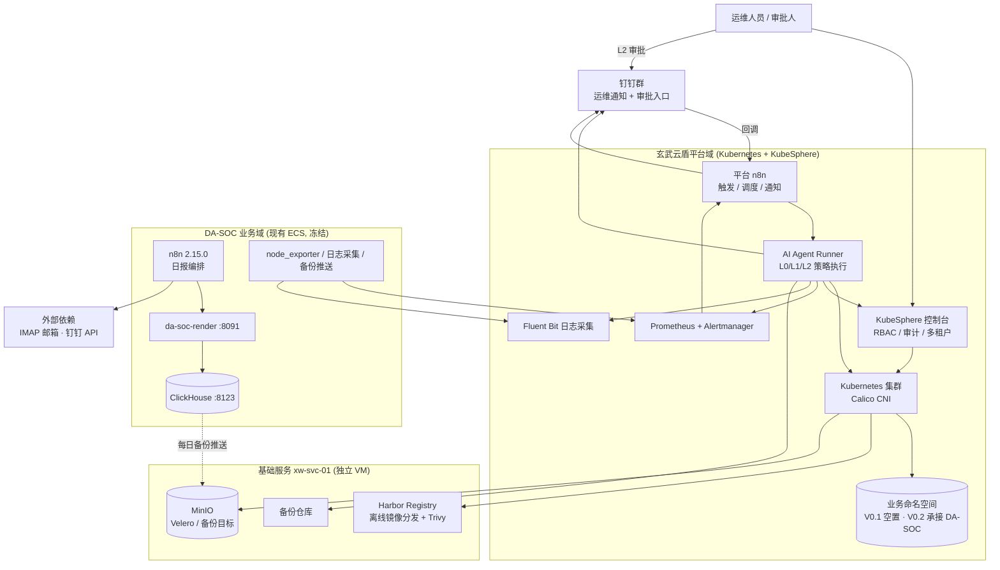

# 玄武云盾 V0.1 独立架构设计

> 编号：kimi.md（Kimi Code 输出）
> 性质：候选 V0.1 架构方案（非最终 Architecture Baseline）
> 作者立场：独立完成，未读取任何其他 Agent 输出

---

## 1. Executive Summary

本方案推荐一套 **「平台先行、业务桥接」的混合架构（Hybrid Bridge Architecture）**：

- **玄武云盾 V0.1 建设一个小而完整的 KubeSphere 私有云控制面**（4 台 VM：1 Control Plane + 2 Worker + 1 基础服务节点），承载 Harbor、可观测性、备份、AI Ops 最小闭环等平台能力。
- **DA-SOC v0.1 业务链路在 V0.1 保持冻结在现有 ECS 上，不迁移进 Kubernetes。** 平台通过轻量探针（node_exporter + 日志采集 + ClickHouse 备份拉取）将 ECS 纳入平台的「观测面」和「备份面」，通过 Harbor 解决离线镜像分发，通过 AI Ops 将 ECS 作为一等资产纳入巡检与 Task 体系。
- DA-SOC 迁移 Kubernetes 推迟到 V0.2，并以「ECS 与 K8s 并行运行、日报输出逐日比对一致」为切换前提。

核心判断：DA-SOC v0.1 是一条**已验证的、对生产通报负责的确定性业务链路**（IMAP → archive → ClickHouse SQL → render → 钉钉）。V0.1 最大的风险不是平台功能不够多，而是平台折腾导致这条链路出错。因此 V0.1 的平台建设必须与业务链路解耦，先证明「平台能被 AI 安全运维」，再谈「业务上平台」。

---

## 2. Understanding of Project Goals

从 README.md / TODO.md / 00-project 提取的目标层级：

1. **终局目标（V1.0）**：AI-Native 企业私有云与安全运营底座，"一个人 + 一组 AI Agent + 清晰的架构/策略/自动化体系"长期运维。
2. **V0.1 目标**：安全、稳定、可维护地承载 DA-SOC v0.1，并验证 AI-Native 运维模式的最小闭环。
3. **关键背景约束**：企业内部**没有成熟专职的 K8s 运维团队**。平台必须做到不依赖个人经验、文档/Git/Runbook/Agent 可驱动。
4. **方法约束**：Human 定义目标与策略；Agent 规划、执行、验证、审计；L2 高风险操作必须人工审批；一切重要操作可审计、可恢复。
5. **关系约束**：玄武云盾 ≠ DA-SOC。玄武云盾是平台，DA-SOC 是第一个业务应用。

由此得出 V0.1 成功的真正含义（不是"装完组件"）：

- 平台自身稳定、可监控、可备份、可恢复、可审计；
- DA-SOC 在 V0.1 期间**业务零回归**；
- AI Agent 能完成 L0 全自动巡检 + L1 策略内执行 + L2 审批流，全链路留痕。

---

## 3. DA-SOC v0.1 Constraints

作为平台设计的固定业务输入（来源：DA-v0.1-prompt-v6.md v6.5，经任务提示词转述）：

| 约束 | 对平台设计的含义 |
|---|---|
| 日报链路：IMAP(ALL, 不标已读) → filter → /archive → ClickHouse SQL → /render → 测试钉钉群 | 链路是**业务资产**，平台不得引入任何改变其行为的中间层 |
| 主题过滤「码号处置情况」+ From 10099.com.cn；**不得覆盖「监测bjfz邮箱广电报送信息」** | 邮箱访问纪律属于业务红线，平台 Agent 不得触碰该邮箱 |
| **不得对生产收件箱 Mark as Read** | 同上 |
| Archive 失败 → 不入库、不出图、不发送 | 失败即停是正确行为，平台监控应把"archive 失败"当正常防御性结果而非事故 |
| 无数据时输出 null /「暂无数据」，禁止用 0 填充 | 数据语义由业务定义，平台不得"优化"其展示 |
| 数字只来自 ClickHouse SQL（v_daily_winner）；**LLM 不得参与出数、出图** | AI Ops 平台在设计上也必须尊重该纪律：Agent 只观测链路健康，不改写业务数据流 |
| SQL 在 v0.1/sql/ 由 build_workflow.py 嵌入工作流 JSON（路径 A），禁止 n8n UI 改 SQL、禁止社区 ClickHouse 节点 | 业务配置即代码，平台提供 Git 与变更纪律即可 |
| 组件现状：ClickHouse（docker, host network, 127.0.0.1:8123）、da-soc-render:0.1（127.0.0.1:8091）、n8n 2.15.0（host network） | host network 是当前事实；迁移需重新论证，不能假设 |
| **ECS 无法直连 Docker Registry**，镜像靠 docker save/load 离线搬运 | 平台需提供受控镜像分发通道（→ Harbor 成为 V0.1 真实刚需，而非堆砌） |
| run_pipeline.py 等 6 个 Python 脚本保留作对照，日常编排权属于 n8n | 平台不得"为了统一"而收回业务编排权 |
| 钉钉使用 POC-06A/06C Native API，目标群只能来自凭据 | 平台侧钉钉（运维通知）与业务侧钉钉（日报）必须隔离凭据与发送通道 |

**关键推论**：DA-SOC v0.1 对平台提出的最重要约束是——**平台能力建设不得以任何方式改变、阻塞或增加这条确定性日报链路的故障面**。任何架构方案若需要 DA-SOC 在 V0.1 改部署形态，都是错误方向。

---

## 4. V0.1 Design Principles

本方案遵循以下设计原则，按优先级排序：

1. **业务连续性优先于架构纯粹性。** DA-SOC 链路冻结，平台环绕建设。
2. **控制面与数据面分离。** 平台管"看得见、管得住、可恢复"；业务管"算得对、发得出"。
3. **最小充分（Minimum Sufficient）。** 每加一个组件都回答："V0.1 不做它，DA-SOC 会出事吗？AI-Native 闭环验证会受阻吗？"
4. **单一技术栈，禁止重复建设。** 一套监控、一套日志、一个 Registry、一个触发总线（按归属划分实例）。
5. **离线环境优先设计。** 镜像、依赖、备份都必须假设外网不可达。
6. **AI 可操作性即架构要求。** 每个组件必须能通过 API/CLI 被 Agent 读取和操作，否则视为架构债。
7. **默认拒绝，明确允许。** 网络、权限、镜像来源一律收紧，例外显式登记。
8. **一切重要状态 Git 化 / 文件化。** 平台定义状态 = Git 仓库内容；运行态偏差 = Drift。

---

## 5. Recommended V0.1 Architecture

### 5.1 总体形态：混合桥接架构

```text
                        ┌─────────────────────────────────────────────┐
                        │              管理面（运维人员 / Agent）          │
                        │   SSH 堡垒路径 + KubeSphere 控制台 + DingTalk   │
                        └───────┬───────────────────────┬─────────────┘
                                │                       │
        ┌───────────────────────▼──────────┐   ┌────────▼───────────────────┐
        │   玄武云盾平台域（Kubernetes）      │   │   DA-SOC 业务域（现有 ECS）    │
        │                                    │   │                            │
        │  ┌────────────┐  ┌──────────────┐ │   │  n8n 2.15.0 (host net)      │
        │  │ xw-system   │  │ xw-ops        │ │   │    └─ 日报工作流（编排权=业务） │
        │  │ KubeSphere  │  │ 平台 n8n      │ │   │  da-soc-render:0.1 :8091   │
        │  │ Calico      │  │ AI Agent      │ │   │  ClickHouse :8123          │
        │  │ Prometheus  │  │  Runner       │ │   │  6 个对照脚本（禁用保留）      │
        │  │ Alertmanager│  └──────┬───────┘ │   │                            │
        │  └────────────┘         │          │   │  node_exporter / 日志采集    │
        │  ┌────────────┐         │          │   │  ClickHouse 备份推送         │
        │  │ 业务命名空间 │◄────────┘          │   └───────────┬────────────────┘
        │  │ （V0.1 空置, │                    │               │
        │  │  V0.2 接DA) │                    │               │
        │  └────────────┘                    │               │
        └──────────┬─────────────────────────┘               │
                   │ 拉取镜像 / 推送备份 / 采集日志与指标         │
        ┌──────────▼─────────────────────────────────────────▼──┐
        │              基础服务节点 xw-svc-01（独立 VM）              │
        │   Harbor(独立部署) │ MinIO(Velero备份目标) │ 备份仓库/NFS    │
        └──────────────────────────────────────────────────────────┘
```

### 5.2 关键架构决策（摘要，详见 §25）

- **D1：DA-SOC v0.1 不迁入 Kubernetes，V0.1 保持 ECS 冻结运行。**
- **D2：Harbor 独立部署在 svc 节点（不进 K8s），因为它是恢复路径的一部分。**
- **D3：单一可观测性栈——使用 KubeSphere 内置 Prometheus/Alertmanager + Fluent Bit 日志，不另建第二套。**
- **D4：平台侧与业务侧各一个 n8n 实例，按 IT/业务归属隔离。** 业务 n8n 不动；平台 n8n 只做平台事件的触发/通知，不做"大脑"。
- **D5：CNI 选 Calico，直接决策（不再"评估"），理由记入 ADR。**
- **D6：存储选 local-path + NFS，不上分布式存储。**
- **D7：Task Center V0.1 = Git/JSONL 文件 + 钉钉通知，不建 Web 应用。**
- **D8：ECS 通过轻量探针纳入平台观测面与备份面，成为 AI 巡检的一等资产。**

---

## 6. Logical Architecture Diagram



---

## 7. Infrastructure Architecture

### 7.1 VM 规划（测试环境最小集）

| 节点 | 角色 | 规格（建议） | 磁盘 | 说明 |
|---|---|---|---|---|
| xw-cp-01 | Control Plane（etcd 同机） | 4C / 8G / Ubuntu 22.04 LTS | 100G 系统盘 | 打 taint，不跑业务负载 |
| xw-w-01 | Worker | 8C / 16G | 100G 系统 + 200G 数据盘 | 跑平台组件 |
| xw-w-02 | Worker | 8C / 16G | 100G 系统 + 200G 数据盘 | 跑平台组件 + 故障演练对象 |
| xw-svc-01 | 基础服务节点 | 4C / 8G | 100G 系统 + 500G 数据盘 | Harbor / MinIO / 备份仓库 / 离线镜像暂存 |

合计 24C / 56G / ~1.3T。理由：

- **必须 2 个 Worker**：TODO 要求 Worker Node 故障演练，且 Prometheus/日志/平台组件需要跨节点调度才有意义。
- **必须独立 svc 节点**：Harbor 与备份目标是集群的"救生艇"，必须与集群故障域隔离（见 §11）。
- 现有 DA-SOC ECS 继续存在，作为第 5 台被纳管资产，不计入平台节点。

### 7.2 OS 与基础依赖

- OS：Ubuntu 22.04 LTS（单一周发行版，Agent 知识覆盖最好，文档生态最适合无专职团队）。
- containerd + kubeadm 安装 K8s，版本策略见 §8。
- 基础依赖清单（全部离线可获得）：chrony（NTP）、systemd 日志持久化、fail2ban（可选）、auditd。
- 时间同步：**全平台统一 chrony，xw-svc-01 兼作内网 NTP 源**；DA-SOC ECS 也指向它。日报是时间敏感业务，时间漂移必须纳入巡检。

### 7.3 命名与寻址

- 主机名规范：`xw-<role>-<seq>`（xw-cp-01 / xw-w-01 / xw-svc-01）。
- 内网 DNS：V0.1 不建 DNS 服务器，使用 `/etc/hosts` 分发 + K8s CoreDNS 负责集群内解析；`harbor.xuanwu.local`、 `minio.xuanwu.local` 等名称登记进 12-assets/asset-register.md。外部 DNS（互联网）依赖由出口策略控制。

---

## 8. Kubernetes / KubeSphere Architecture

### 8.1 Kubernetes

- **版本**：v1.30.x（kubeadm 安装，小版本跟随补丁升级；版本号写入 ADR 与 asset register）。
- **拓扑**：单 Control Plane（ stacked etcd），V0.1 测试环境可接受；HA 控制面是 V1.0 事项，但 etcd 备份必须 V0.1 就做到位（§14）。
- **Runtime**：containerd，关闭 insecure registry，仅允许 Harbor 地址。
- **核心加固**（与 README §8 红线对齐）：
  - API Server 仅监听内网管理地址，不暴露互联网；
  - etcd 仅监听本机/控制面网络；
  - EncryptionConfiguration（aescbc）加密 Secret at rest，密钥离线保存于 svc 节点 + 仓库外；
  - Audit Policy：默认 Metadata 级，对 RBAC/Secret/NetworkPolicy 变更记录 RequestResponse；
  - ServiceAccount 默认不挂载（`automountServiceAccountToken: false` 为平台命名空间默认）。
- **Namespace 规划**：

| Namespace | 用途 | 备注 |
|---|---|---|
| `xw-system` | KubeSphere / Calico / Prometheus / 日志 | 平台组件 |
| `xw-ops` | 平台 n8n、Agent Runner | AI Ops 闭环 |
| `da-soc` | V0.1 空置 | V0.2 迁移目标，V0.1 仅建立 RBAC/Quota/NetworkPolicy 骨架 |
| `ingress` | nginx ingress controller | 南北向内网入口 |

- **RBAC**：四组身份——`platform-admin`（双人持有，日常使用 ops 角色）、`xuanwu-ops`、`xuanwu-auditor`（只读+审计）、`da-soc-developer`（V0.1 仅授予 `da-soc` ns 内受限权限，为未来演练边界）。**Agent 专用 SA `xuanwu-agent`**：集群级只读 + `xw-ops` 内执行权 + 明确的禁止清单（见 §12）。
- **ResourceQuota / LimitRange**：每个业务命名空间强制；平台命名空间豁免但 requests/limits 必须填写（Admission 由 KubeSphere/PSS 约束）。

### 8.2 KubeSphere

- **版本**：KubeSphere v3.4.x（成熟稳定、文档与社区知识完备，最适合无专职团队 + AI 运维；v4 架构变动大，不作为 V0.1 赌注）。
- **启用组件**：监控（Prometheus）、告警、事件、审计、日志（Fluent Bit → Elasticsearch 单节点低堆内存配置；若资源不足则降级为 Fluent Bit → svc 节点集中存储 + Agent 按需查询，决策记入 ADR）。
- **租户映射**：1 个 Workspace `xuanwu-platform`（平台运维）+ 1 个 Workspace `da-soc`（业务，V0.1 仅结构）；Project 与 Namespace 一一对应。
- **角色模型**：platform-admin / ops / auditor / da-soc-developer 四类，与 K8s RBAC 组绑定；**禁止共享账号**，审计账号独立。
- KubeSphere 同时作为 Agent 的只读控制台 API 来源（事件、审计查询）。

### 8.3 集群生命周期

- 升级纪律：补丁级升级可随时；小版本升级 = L2 操作，走审批 + 演练环境先行。
- 集群定义文件（kubeadm config、组件版本清单）存于 `configs/cluster/`，任何变更先改定义再执行（README §20）。

---

## 9. Network Architecture

### 9.1 网络分区

| 网络 | 范围（示例） | 内容 | 可达性 |
|---|---|---|---|
| 管理网 MGMT | 192.168.10.0/24 | SSH、API Server 6443、KubeSphere 控制台、Harbor 管理面 | 仅运维终端 + Agent 可达；不与互联网互通 |
| 业务网 SVC | 192.168.20.0/24 | Ingress 80/443、Harbor 拉取端口、MinIO | MGMT 可达；业务系统经 Ingress 暴露 |
| Pod 网 | Calico 10.244.0.0/16 | Pod/Service overlay | 集群内 + 经 NetworkPolicy 明确放行的南北向 |
| DA-SOC ECS 网 | 现有 ECS 内网地址 | 现有业务链路 | 仅被平台**只读采集**（node_exporter/metrics、日志、备份推送），平台不主动控制其运行时 |

V0.1 **不建 DMZ、不建 Zero Trust**（README 已排除）；互联网出口仅允许明确清单（钉钉 API、邮箱 IMAP 由 ECS 侧既有出口承担，平台侧默认无互联网出口）。

### 9.2 访问控制矩阵（要点）

| 源 → 目的 | 策略 | 说明 |
|---|---|---|
| 运维终端 → MGMT | 允许（SSH key  only） | 禁止 root 密码登录 |
| MGMT → API 6443 / KubeSphere | 允许 | API Server 不入业务网 |
| Pod → DNS (CoreDNS 53) | 允许（default-deny 中的显式放行） | |
| Pod → 互联网 | **默认拒绝** | 例外清单登记 |
| DA-SOC ECS → MinIO（备份推送） | 仅 9000 端口，仅备份凭据 | 反向不可达 |
| 平台 → DA-SOC ECS 运行时（docker/k8s 控制） | **禁止** | 平台只观测、不遥控业务 |
| DA-SOC ECS → Harbor | 拉取允许 | 为未来镜像分发准备 |

### 9.3 NetworkPolicy 设计

- 每个命名空间默认 `default-deny` ingress + egress。
- 显式允许：DNS、ingress-controller → pod、同命名空间内必要东西向、`xw-ops` Agent → 观测端点。
- `da-soc` 命名空间 V0.1 即配置好策略骨架（虽然空置），V0.2 迁移时业务只需填充规则而非新建机制。
- 验收按 TODO 要求双测：允许的通、禁止的不通，结果写入安全验证报告。

---

## 10. Storage Architecture

**判断：DA-SOC v0.1 的数据存储（ClickHouse）不在平台上，平台 V0.1 的存储需求很小。**

| 用途 | 方案 | 理由 |
|---|---|---|
| K8s PV 默认 | **local-path-provisioner**（默认 StorageClass） | 简单、零运维、Agent 完全可操作；测试环境无跨节点迁移刚需 |
| 共享/备份存储 | svc 节点 NFS 导出 + MinIO 对象存储 | 备份与镜像暂存的落点 |
| 分布式存储（Ceph/Longhorn 等） | **V0.1 不做** | 没有业务需要它；README 明确警告过早复杂存储 |

- 备份语义分层（详见 §14）：etcd / K8s 资源（Velero→MinIO）/ 平台 PV（Velero restic→MinIO）/ **DA-SOC ClickHouse 数据（业务侧脚本导出 → 推送 MinIO，平台只提供存储与 Runbook）**。
- 存储是 V0.1 明确简化的区域；任何"为了企业级"引入分布式存储的提案应被 Red-Team 直接否决。

---

## 11. Registry Architecture

**需要，且是 V0.1 真实刚需**——不是因为有未来愿景，而是因为：

1. ECS 及集群所在环境**无法访问 Docker Registry**，现状是手工 `docker save/load`，无版本、无扫描、无审计、易错。
2. 平台自身的组件镜像、未来 DA-SOC 镜像都需要一个**受控分发通道**。

设计决策：

- **Harbor 独立部署在 xw-svc-01（docker-compose），不进 Kubernetes。** 理由：Registry 是集群的恢复路径——集群损坏时需要从 Harbor 拉镜像重建；Harbor 若在集群内，则形成"救生机在沉船上"的循环依赖。
- 镜像入库流程（离线供应链）：有网环境 `docker pull` → `docker save` → 传输 → svc 节点 `docker load` → `docker push harbor.xuanwu.local/...`。**Harbor 成为唯一入库点与唯一可信源**，节点 containerd 配置为仅信任 Harbor。
- 项目划分：`xuanwu-platform/`（平台组件）、`da-soc/`（业务镜像，V0.2 启用）。
- 安全：HTTPS（内网 CA，证书纳入 TASK-004 证书巡检）；Trivy 扫描随 Harbor 启用（V0.1 打开但仅告警不阻断，阻断策略 V0.3）；机器人账户按 CI/节点拆分，最小权限。
- Kubernetes 集成：containerd `mirrors` 指向 Harbor，禁止匿名拉取核心业务镜像；imagePullSecret 由平台统一签发。

---

## 12. Security Architecture

按"身份 / 权限 / 网络 / 容器 / Secret / 审计 / Backup"分域，并标注级别：

| 域 | V0.1 必须做 | V0.1 建议做 | 延后 |
|---|---|---|---|
| 身份 | KubeSphere 四类账号 + 独立审计账号；Agent 独立身份 `xuanwu-agent`（SA） | 账号定期复核 | SSO/LDAP（V0.5） |
| 权限 | RBAC 最小权限；禁止日常 cluster-admin；SA 不自动挂 token | 权限申请留痕（Git PR 流程） | 动态权限（V0.4+） |
| 网络 | default-deny NetworkPolicy；管理面隔离；API/etcd 不暴露 | 端口矩阵季度复核 | Zero Trust / Service Mesh（V0.5+） |
| 容器 | PSS：业务 ns `restricted`、平台 ns `baseline`；禁 privileged/hostNetwork/hostPath（例外登记） | KubeSphere 镜像来源策略强制 Harbor | Admission 策略引擎 OPA/Gatekeeper（V0.3） |
| Secret | EncryptionConfiguration at rest；钉钉/邮箱/DB 凭据仅存 Secret 或 ECS 本机既定位置，**禁止入 Git** | 凭据轮换 Runbook | Vault/External Secrets（V0.2） |
| 审计 | K8s Audit + KubeSphere 审计 + **Agent 操作 JSONL 日志（append-only，每日快照入 Git）** | 审计日志定期人工抽查 | SIEM 关联分析（V0.3） |
| Backup | 见 §14，含一次真实恢复演练 | 备份完整性校验 | 异地灾备（V1.0） |

**Agent 权限边界（核心设计）**：

- `xuanwu-agent` SA：集群级 **get/list/watch**，无 secret 读取权（通过 RBAC 拒绝对 secrets 的访问，凭据问题一律转人工）；`xw-ops` 命名空间内可 create/update（限 L1 白名单资源：Pod delete、Deployment restart/scale）。
- L2 清单硬编码在 `07-aiops/policy.yaml`：涉及 RBAC、NetworkPolicy、CNI、节点增删、存储类、备份删除等一律拒绝自动执行，只能生成计划 → 钉钉审批卡 → 人工批准后由**人执行或 Agent 在人工监护下执行**。
- Agent 的 SSH 能力：V0.1 **不给 Agent 通用 SSH**；对 ECS 只读采集由探针（pull 模式）完成，Agent 不主动登录 ECS。这是对 DA-SOC 红线的结构性保证。

---

## 13. Observability Architecture

**一套栈，由 KubeSphere 提供，不重复建设。**

| 层 | 内容 | 实现 |
|---|---|---|
| Infrastructure | 节点 CPU/内存/磁盘/inode、containerd、chrony 偏移 | Prometheus node-exporter；**ECS 同步部署 node_exporter 纳入抓取** |
| Kubernetes | API Server / etcd / scheduler / controller 指标、Node 状态 | Prometheus + kube-state-metrics |
| Pod | CPU/内存/重启/Pending/CrashLoop、requests 利用率 | Prometheus + KubeSphere 监控 |
| Application | 平台组件（Harbor、n8n、Agent Runner）可用性 | blackbox 探针（HTTP） |
| Business（DA-SOC） | **链路健康而非业务数据**：IMAP 连通、archive/render HTTP 探测、ClickHouse 存活、钉钉发送成功（由业务 n8n 上报心跳） | blackbox + 业务侧主动心跳上报 Prometheus |
| Security | 审计事件流、PSS 违规、RBAC 变更 | KubeSphere 审计 + K8s audit log |
| 日志 | 平台组件日志、K8s 审计日志、ECS 系统日志与业务容器日志 | Fluent Bit → ES（或降级方案，见 §8.2） |

**告警路径（AI Ops 闭环的入口）**：

```text
Prometheus Rule 触发
  → Alertmanager
  → webhook → 平台 n8n
  → 生成标准化 Event → AI Agent Runner
  → 分析（读取 Runbook / 上下文 / 日志）
  → 定级 L0/L1/L2 → 创建 Task
  → 钉钉通知（Critical/High/Task Created/Approval Required）
  → L1 自动执行 → 验证 → 回写 Task → 审计日志
```

- 告警分级与 TODO P1.12 的第一批规则对齐（Node Down、Disk Full、Pod CrashLoop、证书、备份失败、控制面异常）。
- **业务纪律尊重**：ClickHouse 数据正确性不归平台监控告警（业务职责）；平台只监控"链路活没活"。

---

## 14. Backup & Recovery Architecture

原则：**没有做过恢复演练的备份不算完成**（沿用 TODO，完全赞同）。

| 对象 | 方式 | 频率 | 保留 | 位置 |
|---|---|---|---|---|
| etcd | `etcdctl snapshot save` cron | 每小时 | 30 天 | svc 节点备份仓库 + 每日同步 MinIO |
| K8s 资源定义 | **Git（manifests/ 即定义）** + Velero schedule | 实时 / 每日 | Git 全量 | 仓库 + MinIO |
| 平台 PV | Velero + restic | 每日 | 14 天 | MinIO |
| Harbor | 项目导出 + 数据卷归档（Trivy DB、镜像 blobs） | 每周 | 4 周 | svc 备份仓库 |
| KubeSphere / 平台配置 | 导出 + Git 化配置 | 变更时 | Git 全量 | 仓库 |
| **DA-SOC ClickHouse 数据** | **业务侧导出脚本（业务职责）→ 推送 MinIO `da-soc-backup` bucket（平台提供存储与凭据）** | 每日（与日报节奏对齐） | 90 天 | MinIO |
| DA-SOC ECS 配置 | 平台提供 Runbook，业务执行 | 变更时 | — | — |

**恢复演练（V0.1 必做 4 项）**：

1. etcd snapshot 恢复到新控制面（演练 6 对应）；
2. Velero 恢复被误删的命名空间资源；
3. 从 MinIO 恢复 ClickHouse 数据到测试实例并查询验证（**与业务共同完成，验证"数字确定性"未被备份流程破坏**）；
4. Harbor 数据卷恢复。

备份失败 / 备份过期 / 恢复演练超期 → 直接进入告警与 Task 体系（TASK-005）。

---

## 15. AI-Native Operations Architecture

### 15.1 V0.1 目标定位

验证最小闭环：**Observe → Analyze → Plan → (Approval) → Execute → Verify → Audit**，覆盖 10 个标准任务（TODO §13 的 TASK-001~010，EDR 项除外并说明）。不做 Multi-Agent 全自动协作（V0.4），但保留 Auditor 角色的最小形态（见 15.4）。

### 15.2 Agent 如何获取状态

| 来源 | 方式 |
|---|---|
| Kubernetes / KubeSphere | `xuanwu-agent` SA token（只读为主），kubectl / API |
| Monitoring | Prometheus HTTP API（查询 + 告警） |
| Logs | 日志系统 API / kubectl logs |
| Security Events | K8s audit / KubeSphere 审计查询 |
| Git / Runbooks | 本地克隆仓库，按 README §13 顺序读取 |
| DA-SOC ECS | Prometheus 抓取探针 + 心跳上报（只读，无 SSH 控制） |

### 15.3 Agent 如何执行

| 通道 | 用途 | 级别 |
|---|---|---|
| K8s API（SA） | 重启 Pod、scale、查询 | L0/L1 |
| calicoctl / kubectl | 网络诊断（只读） | L0 |
| n8n API | 触发通知工作流、发送钉钉 | L0 |
| DingTalk API | 通知、审批卡、日报 | L0 |
| Git 写操作 | 创建 Task 文件、变更记录、更新知识 | L0/L1 |
| SSH / 节点命令 | **V0.1 不开放** | L2 一律人工 |

**n8n 与 Agent 职责**：n8n 是"手"（Trigger/Schedule/Webhook/DingTalk/API 集成）；Agent 是"脑"（理解/分析/规划/验证）。平台 n8n 不承载决策逻辑，所有分支判断在 Agent Runner 内完成，n8n 只做确定性搬运。这一区分防止"n8n 成为大脑"，也防止"所有事都丢给 Agent"。

### 15.4 Agent 如何验证 / 回滚 / 审计

- **验证**：执行后重新查询同一信号源 + 结构性检查（如 Pod Ready、HTTP 200、指标回落），验证结果写入 Task。
- **回滚**：L1 操作必须幂等或可逆（restart/scale 天然可逆）；不可逆操作一律升级 L2。恢复演练提供平台级回滚能力（§14）。
- **审计**：每次 Agent 操作追加一条 JSONL 记录（who/agent、evidence、plan、action、before/after、verify result、approval），每日快照提交 Git；**每日平台报告（TASK-010）自动包含 Agent 操作摘要**，人可抽查。

### 15.5 Task Center（V0.1 最小实现）

Task = `tasks/YYYY/MM/TASK-XXXX.json`（README §10 的 schema）+ 钉钉通知。不建 Web UI。理由：文件即状态，天然 Git 化、可审计、AI 原生可操作；Web 应用反而引入新的运维面。V0.4 再评估是否升级为服务。

---

## 16. Human / AI Responsibility Boundary

| 级别 | 定义 | V0.1 实例 |
|---|---|---|
| **L0 自动** | 只读 + 生成 + 通知 | 平台状态查询、健康巡检、日报生成、日志/事件检索、Drift 只读检测、Task 创建 |
| **L1 策略内自动** | 白名单内可逆操作，全程留痕 + 事后通知 | 重启异常 Pod（非 da-soc 运行时）、非生产 scale、清理 Evicted  Pod、重新触发失败备份作业、重新推送平台告警通知 |
| **L2 人工审批** | 生成计划与回滚方案 → 钉钉审批卡 → 批准后才执行 | 修改 RBAC / NetworkPolicy、节点增删、集群升级、存储变更、备份删除、任何触及 DA-SOC ECS 运行时的操作、任何平台到 ECS 的新增网络连通 |

与 TODO L0/L1/L2 一致；本方案的增量是把**"DA-SOC ECS 运行时控制"整体划入 L2 且默认不建通道**——这比"加白名单"更可靠，因为通道不存在就不会被误用。

---

## 17. IT / Business Boundary

| | IT / 平台负责 | 业务（DA-SOC）负责 |
|---|---|---|
| 资产 | 4 台平台 VM、集群、Harbor、MinIO、监控/日志/备份体系 | DA-SOC ECS、邮箱访问纪律、钉钉业务群 |
| 配置 | 集群定义、安全基线、Registry、平台 n8n | v0.1/sql/、build_workflow.py、业务工作流 JSON、业务 n8n |
| 数据 | 平台配置、备份存储 | ClickHouse 数据及其正确性、备份导出执行 |
| 变更 | 平台组件变更走平台审批流 | 日报链路变更走业务变更流；**业务链路变更无需平台批准，但需知会（避免平台误判为故障）** |
| 运行时 | 平台服务 SLA | 日报 SLA、无 Mark-as-Read 等红线 |

落地机制：`da-soc` 命名空间（V0.2 迁入时生效）+ ResourceQuota + NetworkPolicy + RBAC（`da-soc-developer`）+ 例外登记制度（任何越界需求进 10-decisions/）。V0.1 期间边界主要靠**网络不连通 + Agent 无通道**物理落地，而非仅靠流程约束——这是刻意设计。

---

## 18. DA-SOC Hosting Architecture

**结论：V0.1 不迁移，"承载"采取四层含义——可观测、可备份、可分发、可协助。**

| 组件 | V0.1 位置 | 平台关系 |
|---|---|---|
| ClickHouse（docker, host net） | ECS 不变 | 平台探针只读存活监控；每日数据备份推平台 MinIO |
| da-soc-render:0.1 | ECS 不变 | HTTP 探活；镜像同步进 Harbor `da-soc/` 项目（仅登记与扫描，不改运行来源） |
| n8n 2.15.0（业务编排） | ECS 不变 | 心跳上报；平台 n8n 与其零依赖 |
| 6 个 Python 对照脚本 | ECS 保留禁用 | 无 |
| 生产邮箱 IMAP | 业务侧既有出口 | 平台不触碰 |
| 钉钉日报 | 业务 Native API | 平台钉钉凭据与业务钉钉凭据分离 |

**为什么不是全部进 Kubernetes**（本节是全文最重要的一节）：

1. DA-SOC v6.5 是已冻结的业务契约，host network / 127.0.0.1 / n8n 编排都是其组成部分；迁移 = 重签契约，风险收益比极差。
2. V0.1 的平台本身还没有被证明稳定，先让未经验证的平台去承接不可失败的业务，方向反了。
3. 离线环境 + 无专职团队意味着首次 K8s 化部署的排障成本高，任何 CNI/PVC/DNS 问题都可能延误日报。

**V0.2 迁移验收门槛**（预先写死，防止到时候降低标准）：并行运行 ≥ 10 个工作日，K8s 侧日报输出与 ECS 侧**逐日零差异**；Archive 失败熔断行为一致；无数据时输出语义一致。达标后才切换。

---

## 19. Technology Stack

| 能力 | 推荐技术 | V0.1 | 原因 | 复杂度 | AI 可操作性 |
|---|---|---|---|---|---|
| Kubernetes | K8s v1.30.x + kubeadm + containerd | ✅ | 标准、AI 知识覆盖最好 | 中 | 高（kubectl/API） |
| Management | KubeSphere v3.4.x | ✅ | README 既定；控制台+RBAC+审计一体 | 中 | 中（有 API） |
| CNI | Calico | ✅ | NetworkPolicy 成熟、运维面最小；直接决策不"评估" | 低 | 高 |
| Storage | local-path-provisioner + NFS/MinIO | ✅ | 无分布式存储刚需 | 低 | 高 |
| Registry | Harbor 独立部署（docker-compose on svc 节点） | ✅ | 解决离线分发；恢复路径独立性；自带 Trivy | 中 | 高（API） |
| Monitoring | KubeSphere 内置 Prometheus + Alertmanager + node-exporter | ✅ | 单一栈，不重复建设 | 中 | 高（PromQL/API） |
| Logging | KubeSphere Fluent Bit → ES 单节点（资源不足则降级集中文件存储） | ✅ | 单一日志栈；降级路径预定义 | 中 | 高 |
| Backup | etcd cron + Velero→MinIO + Git 定义 | ✅ | 覆盖平台 + 承接业务备份 | 中 | 高 |
| Security | PSS + NetworkPolicy + RBAC + Audit + EncryptionConfig + Harbor/Trivy（告警级） | ✅ 基线 | 红线全覆盖，运营体系延后 | 中 | 高 |
| AI Ops | Agent Runner + policy.yaml + Task(JSONL/Git) + 平台 n8n + DingTalk 审批卡 | ✅ MVP | 验证闭环的最小充分集 | 中 | 本体 |

**刻意不用**（附理由）：Cilium（eBPF 运维面超出无专职团队承受力）、Rook/Ceph/Longhorn（无需求）、kube-prometheus-stack（与 KubeSphere 重复）、Vault（V0.2）、Falco/EDR（V0.3）、Istio/Linkerd（V0.5 前不考虑）、自研 Task Web 平台（文件即状态）。

---

## 20. V0.1 Scope

做：

1. 4 VM 平台基础设施 + Linux 安全基线；
2. K8s 集群 + KubeSphere + Calico + NetworkPolicy default-deny；
3. Harbor（离线供应链）+ MinIO + 备份体系 + ≥4 项恢复演练；
4. 单一可观测性栈（监控/日志/告警 → n8n → 钉钉）；
5. ECS 纳管探针（观测 + 备份推送）；
6. AI Ops MVP：10 个标准任务、L0/L1/L2 策略、Task=文件、审计 JSONL；
7. `da-soc` 命名空间骨架（RBAC/Quota/NetworkPolicy）为 V0.2 铺路；
8. Runbook 首批 12 个 + 安全验证报告 + 故障演练记录。

---

## 21. V0.1 Non-Goals

明确不做：

- DA-SOC 迁入 Kubernetes（V0.2，带并行比对门槛）；
- SIEM / EDR / Runtime Security / 完整漏洞运营（V0.3）；
- Multi-Agent 全自动协作与自动回滚平台（V0.4）；
- 多租户服务目录、第二个业务系统（V0.5）；
- HA 控制面、异地灾备（V1.0）；
- Service Mesh、Zero Trust、分布式存储、自建 DNS 服务器；
- Vault/External Secrets（V0.2）、Gatekeeper（V0.3）；
- Task Center Web UI。

判断标准（再次重申）：不做它，DA-SOC 会坏吗？AI-Native 闭环会验证不了吗？两个答案都是"不会"，就延后。

---

## 22. V0.1 → V1.0 Evolution

| 版本 | 新增 | 为什么新增 | 为什么不是 V0.1 |
|---|---|---|---|
| **V0.1** | 混合桥接平台：K8s+KubeSphere+Calico+Harbor+单栈可观测+备份+AI Ops MVP+ECS 纳管 | 承载与验证的最小充分集 | — |
| **V0.2** | **DA-SOC 迁入 `da-soc` 命名空间**（并行比对 ≥10 日零差异后切换）；Vault/External Secrets；cert-manager；L1 自动修复扩面；Drift 自动修复试点 | 平台已被证明稳定，才有资格承接业务；凭据管理需求已具体化 | V0.1 平台未经验证，先迁业务是拿不可失败的链路冒险 |
| **V0.3** | 安全平台：EDR 接入、Trivy 阻断策略、Falco 运行时安全、Gatekeeper、审计关联分析（SIEM-lite） | 业务上平台后安全运营对象才完整 | V0.1 无 EDR 数据源，建了也是空转 |
| **V0.4** | AI 运维平台：Planner/Executor/Auditor 多 Agent、变更审批工作流、自动验证与自动回滚、Drift 全面自动修复 | L1 经验积累足够后升级自主性 | 没有 L1 运行数据训练的自主闭环不可信 |
| **V0.5** | 企业私有云：第二个业务接入、多租户配额、服务目录、标准化接入流程、SLA | 平台模式被复用验证后才产品化 | 单业务时做服务目录是过度设计 |
| **V1.0** | 生产级：HA 控制面、多集群/灾备、完整审计与合规报告、SLA 体系 | 核心业务长期承载的要求 | 测试环境不需要 HA |

---

## 23. TODO.md Gap Analysis

### 保留（基本正确）

- P0 全部（项目初始化、基础文档、总体/基础设施/网络/K8s/KubeSphere 架构、治理、IT/业务边界、使用规范、安全基线、DA-SOC 接入标准）；
- P1.1 VM 准备、P1.2 Linux 安全基线、P1.3/1.4 K8s 安装与安全检查、P1.6 NetworkPolicy、P1.7/1.8 KubeSphere、P1.10~1.14 可观测性与备份恢复；
- P2 AI Ops 的 TASK-001~008、010；P2.4~2.8 事件流与钉钉入口；P3 Runbook/审计场景/安全验证/故障演练；P4 验收与 DoD。

### 修改

1. **P2.2「DA-SOC 部署」改写为「DA-SOC 接入与纳管」**：V0.1 不往 K8s 部署 DA-SOC，改为部署探针（node_exporter/日志/备份推送）+ ClickHouse 备份通道 + Harbor 镜像登记。这是与 TODO 现状最大的分歧。
2. **P1.5「评估 Cilium/Calico」改为「决策 Calico」**：评估应在架构阶段完成并落 ADR；实施阶段只安装验证，不再开评估口子（避免实施期摇摆）。
3. **编号冲突**：存在两个「P2.1」。AI Ops 一节应重新编号。
4. **TASK-009（EDR）标注为 V0.3 候选**：V0.1 测试环境无 EDR 源，明确移出 V0.1 DoD。
5. **P0.11「DA-SOC 接入标准」扩展**：除 K8s 部署清单外，必须增加 ECS 纳管标准（探针、备份推送、心跳、红线清单）。
6. **P1.13 备份增加「DA-SOC ClickHouse 每日备份」与「恢复演练含数据查询验证」**（现在只列了 etcd/K8s/平台侧）。
7. **第 25 节「明天的第一批任务」补充 TASK：离线镜像供应链流程（docker save → Harbor）与钉钉平台凭据管理**——当前 TODO 完全没有覆盖环境离线这一最硬约束。

### 删除

- 无整节删除；但删除「V0.1 内 DA-SOC K8s 化部署」这一隐含假设（并入上面修改 1）。

### 新增

1. **ECS 纳管任务包**：探针安装、Prometheus 抓取接入、备份推送凭据、心跳上报；
2. **离线供应链 SOP**：可联网暂存机 → docker save/load → Harbor push → 节点 pull 的全流程与责任人；
3. **平台钉钉通道建设**：凭据申请、审批卡交互、与业务钉钉隔离的验证；
4. **Agent 权限与通道基线**：`xuanwu-agent` SA 定义、SSH 禁用声明、policy.yaml；
5. **V0.2 迁移预研项**：并行比对方案设计（可提前设计、到 V0.2 执行）。

### 调整顺序

- P1.5 的 CNI「评估」并入 P0 架构阶段（形成 ADR）；
- 平台 n8n 与钉钉通道建设应在 AI Ops 任务（§13）之前完成，因为 TASK-001~010 依赖通知闭环；
- 恢复演练（P1.14）应在安全验证（§19）与故障演练（§20）之前完成——先证明能恢复，再演练故障；
- DA-SOC 接入（改写后）可与 AI Ops MVP 并行，二者无依赖。

---

## 24. Major Risks

| 风险 | 等级 | 缓解 |
|---|---|---|
| 平台资源不足（ES/监控吃内存）导致组件互相挤兑 | 中 | svc 节点独立 + 日志降级预案 + 容量巡检（TASK-006） |
| 离线供应链操作失误（错版本镜像入库） | 中 | Harbor 项目权限 + 入库清单双人核对 + Trivy 告警 |
| Agent L1 误操作（重启了不该重启的 Pod） | 中 | L1 白名单窄化 + 命名空间隔离 + 全程留痕 + 事后通知可逆 |
| 单控制面故障 | 中 | etcd 每小时备份 + 恢复演练 6 + V1.0 才 HA（明确接受） |
| DA-SOC 与平台边界被悄悄突破（有人让 Agent 连 ECS） | 高 | 通道物理不存在 + 例外必须走 ADR + Red-Team 专项测试 |
| KubeSphere 版本锁定带来的升级债 | 低 | 版本写入 ADR；升级列 L2 |
| 无专职团队导致文档与实际漂移 | 高 | Drift 巡检（TASK-007）+ 每日平台报告 + 「架构与实际一致」列入 DoD |

---

## 25. Important Architecture Decisions

| # | 决策 | 理由一句话 |
|---|---|---|
| D1 | DA-SOC v0.1 冻结在 ECS，V0.1 不迁移 | 不可失败的确定性链路不应被未经验证的平台承载 |
| D2 | Harbor 独立于集群外部署 | Registry 是恢复路径，不能在沉船上 |
| D3 | 可观测性只用 KubeSphere 内置栈 | 单栈原则，防组件堆砌 |
| D4 | 平台/业务各一个 n8n，按归属隔离 | 匹配 IT/业务边界，防止互相成为单点 |
| D5 | CNI=Calico，架构期直接决策 | NetworkPolicy 成熟 + 运维面最小 |
| D6 | local-path + NFS/MinIO，不上分布式存储 | 无需求驱动的"企业级"是负债 |
| D7 | Task Center = 文件 + Git + 钉钉 | 文件即状态，AI 原生可审计，不新增运维面 |
| D8 | ECS 只读纳管，Agent 无 SSH/控制通道 | 对 DA-SOC 红线做结构性保证，而非流程保证 |
| D9 | 单控制面可接受，但 etcd 备份必须小时级 | 测试环境风险可接受，数据不可丢 |
| D10 | Agent 密钥只进 EncryptionConfiguration + Secret，不进 Git | 底线要求，无例外 |

---

## 26. Recommended ADRs

1. **ADR-V01-001**：V0.1 采用混合桥接架构，DA-SOC 不迁入 Kubernetes（含 V0.2 迁移门槛条款）；
2. **ADR-V01-002**：CNI 选择 Calico；
3. **ADR-V01-003**：Harbor 独立于 K8s 部署，作为唯一镜像可信源；
4. **ADR-V01-004**：可观测性单栈（KubeSphere 内置），禁止第二套；
5. **ADR-V01-005**：Task Center 以 Git/JSONL 为状态载体，V0.1 不建 Web 平台；
6. **ADR-V01-006**：Agent 对 ECS 只读、无控制通道；
7. **ADR-V01-007**：存储采用 local-path + NFS/MinIO，拒绝分布式存储；
8. **ADR-V01-008**：K8s v1.30.x / KubeSphere v3.4.x 版本基线；
9. **ADR-V01-009**：日志方案及资源不足时的降级路径；
10. **ADR-V01-010**：L0/L1/L2 策略清单与 policy.yaml 为唯一裁决源。

---

## 27. Recommended Implementation Sequence

```text
第 0 周：ADR 落地（上述 10 条）+ TODO 修订（按 §23）+ 离线供应链 SOP
第 1 周：VM 准备 + Linux 基线（P1.1/1.2）
第 2 周：K8s + Calico + NetworkPolicy（P1.3~1.6）
第 3 周：KubeSphere + Harbor + MinIO（P1.7~1.9）+ 钉钉通道
第 4 周：可观测性栈 + 告警→n8n→钉钉闭环（P1.10~1.12）
第 5 周：备份体系 + 4 项恢复演练（P1.13/1.14）
第 5~6 周：ECS 纳管 + AI Ops MVP（10 任务）+ Runbook（P2/P3）
第 7 周：安全验证 + 故障演练 + V0.1 验收报告（P4）
```

并行线：文档与 ADR 全程 Git 化；每周 Agent 操作审计摘要人工抽查。

---

## 28. Final Architecture Recommendation

推荐 V0.1 采纳 **混合桥接架构**：一个 4 节点的小而完整 KubeSphere 平台域（控制面 + 2 Worker + 独立基础服务节点），提供 Harbor 离线供应链、单一可观测性栈、分层备份与恢复演练、以及"文件即状态"的 AI Ops 最小闭环；DA-SOC v0.1 业务链路冻结在现有 ECS，平台以只读探针、备份通道和 Runbook 将其纳入观测面与恢复面；迁移推迟至 V0.2 并以并行比对零差异为门槛。

---

## 评分（自评）

| 维度 | 1-10 |
|---|---:|
| 架构合理性 | 9 |
| V0.1 范围控制 | 9 |
| 技术选型 | 8 |
| 安全性 | 8 |
| 可实施性 | 9 |
| 长期运维性 | 9 |
| AI-Native 程度 | 8 |
| 可审计性 | 9 |
| 可恢复性 | 9 |
| DA-SOC 适配性 | 10 |
| V0.1 → V1.0 演进性 | 9 |
| **Overall Score** | **8.8** |

---

## 最终结论

### 1. 你推荐的 V0.1 是什么？

混合桥接架构：4 VM（1 CP + 2 Worker + 1 svc）的 KubeSphere 平台域 + 冻结在 ECS 的 DA-SOC，平台通过只读探针/备份通道/离线 Registry 环绕业务，AI Ops 以文件即状态的方式验证最小闭环。

### 2. V0.1 最重要的 5 个能力

1. **不破坏 DA-SOC**——业务链路冻结与平台物理隔离；
2. **离线镜像供应链（Harbor）**——解决当前最痛的真实约束；
3. **备份 + 恢复演练**——没有恢复过的备份不算数；
4. **单一可观测性栈 + 告警到钉钉的闭环**——AI Ops 的入口；
5. **L0/L1/L2 权限模型落到通道层**——Agent 对 ECS 无控制通道，L2 钉钉审批。

### 3. V0.1 最应该避免的 5 个东西

1. 把 DA-SOC 急着迁进 Kubernetes；
2. 第二套监控/日志/Registry（组件堆砌）；
3. 分布式存储、Service Mesh 等"企业级"提前消费；
4. 给 Agent 开通用 SSH/高权限通道；
5. 建 Web 版 Task Center 等新增运维面的"平台中的平台"。

### 4. 当前 TODO.md 最大的问题

**默认假设 DA-SOC 会在 V0.1 被部署进 Kubernetes（P2.2），完全没有考虑这对已冻结的、对生产通报负责的确定性链路的回归风险，也完全没有覆盖"环境离线"与"现有 ECS 纳管"这两个最硬的现实约束。** 其次是两个 P2.1 编号冲突和 TASK-009（EDR）超出 V0.1 实际资源。

### 5. DA-SOC v0.1 对平台最重要的约束

**平台不得以任何方式改变、阻塞或扩大这条确定性日报链路的故障面**——由此推出：V0.1 不迁移、Agent 无 ECS 控制通道、平台监控只盯链路健康不碰业务数据正确性、以及离线供应链必须由平台解决（因为业务已经在忍受手工 save/load）。

### 6. 如果只能做一次架构决策

**业务连续性优先于架构纯粹性：V0.1 冻结 DA-SOC 运行形态，平台先做控制面、观测面与恢复面，迁移以并行比对零差异为前提。** 这一条决策同时解决了范围控制、安全红线、可实施性三个维度的问题。

### 7. 是否建议进入下一阶段？

**A. 可以进入多 Agent 综合评审。**

项目目标清晰、DA-SOC 约束明确、README 的方向性判断（V0.1 边界、AI-Native、IT/业务边界）都合理；需要收敛的是技术路线与 TODO 的执行顺序，这正是多 Agent 评审应当解决的议题。
