# 玄武云盾 V0.1 架构裁决（ARCHITECTURE ADJUDICATION V0.1）

> **文档性质：** 架构委员会最终裁决记录（Adjudication Record）
> **裁决对象：** 5 份独立候选架构方案 → **1 份唯一 Architecture Baseline**
> **裁决依据：** `README.md`、`TODO.md`、`00-project/*`（占位）、ADR-001～ADR-008
> **配套文件：** `10-decisions/ARCHITECTURE-BASELINE-V0.1.md`（实施唯一依据）、`10-decisions/ADR/ADR-00X-*.md`
> **约束：** 本文件未修改 `TODO.md`；`TODO.md` 将在 Baseline 确定后由后续阶段重新生成

---

## 1. 裁决摘要

### 1.1 一句话架构（最终）

> **玄武云盾 V0.1 是一套由 7 台 VM 构成的单集群 Kubernetes（kubeadm v1.26.x，3 控制面 + 2 业务 Worker）平台：KubeSphere 提供管理面，Calico 提供网络策略，Harbor 与 MinIO 独立于集群部署以保住恢复路径，本地盘存储配合 Git + etcd 快照 + Velero + ClickHouse 原生备份 + 邮件重放实现可恢复性，Prometheus/Grafana/Alertmanager + Fluent Bit/Loki 构成单套可观测，Argo CD 承载 Git 定义态与回滚，平台 n8n 触发、短生命周期 Kubernetes Job 承载 Agent、Git 中的轻量 Task 记录承载状态与审计——并在 `da-soc` 命名空间内**实际承载 DA-SOC v0.1 的完整生产链路**（n8n + ClickHouse + render/archive），以"单写者切换 + 双读验证 + 12 项 Cutover Gate + 已演练的回退路径"完成迁移。**

### 1.2 裁决要点（11 条）

| # | 裁决 | 依据 |
|---|---|---|
| 1 | **V0.1 实际承载 DA-SOC v0.1**，`n8n` / `ClickHouse` / `render+archive` 全部运行在集群 `da-soc` 命名空间，成为唯一日报生产者 | ADR-001（项目负责人已决策） |
| 2 | **迁移采用"单写者 + 双读验证"**：任一时刻只有一个日报生产者；迁移期两侧可同时**只读**同一生产邮箱 | ADR-001 |
| 3 | **刷新 control plane 高可用：3 控制面（stacked etcd）+ 2 业务 Worker**，共 5 台集群 VM | 本项目首要目标是**承载业务**，控制面单点会同时中断业务运维与 AI Ops；VM 资源不是约束 |
| 4 | **Harbor 与 MinIO 均部署在集群之外**（`xw-mgmt-01` / `xw-bak-01`） | ADR-003、ADR-006：恢复路径不得位于被恢复对象的故障域内 |
| 5 | **Kubernetes = kubeadm 安装的上游 v1.26.x**（配置入 Git）；**KubeSphere 3.4.x 仅作管理面**，其自带监控/日志/审计/DevOps/Service Mesh 组件全部关闭 | ADR-011（本裁决） |
| 6 | **可观测单栈**：`kube-prometheus-stack`（唯一指标）+ `Fluent Bit → Loki`（唯一日志）+ Grafana（唯一入口）；**不引入 ES/ELK** | ADR-005 |
| 7 | **备份五路径**：Git + etcd 快照 + Velero + ClickHouse 原生 BACKUP + 文件级备份，全部落向集群外 MinIO；**4 项强制恢复演练** | ADR-006 |
| 8 | **Agent 以短生命周期 Kubernetes Job 运行**，3 个 ServiceAccount（readonly / executor / auditor），无 SSH，白名单动作，L1 自动 + L2 人工审批 | ADR-007 |
| 9 | **Task 用轻量 YAML/Markdown 文件 + Git**，V0.1 不引入 CRD、不引入独立 Task Center 服务 | ADR-008 |
| 10 | **不引入自研中间层 `xw-opsapi`** | ADR-007 §7.1（5 份方案仅 1 份提出，四项理由均有更轻量替代） |
| 11 | **引入 Argo CD**（超出已接受 ADR 清单的唯一新增组件），用于 Git 定义态同步、漂移检测与一键回滚 | §7.10（明确裁决并说明取舍） |

### 1.3 本裁决与 5 份候选方案的关系

| 方案 | 一句话定位 | 主要采纳 | 主要否决 |
|---|---|---|---|
| **codebuddy** (8.4) | 纳管 + 影子对照，生产留 ECS | 单栈纪律、KubeSphere 组件开关表、服务名改造这一"唯一必须改的业务代码"洞察、以真实告警触发闭环 | **生产不迁移（违反 ADR-001）**、Ingress 完全不部署、不用 Velero、自研 `xw-opsapi` |
| **codex** (8.6) | 单站点小规模可恢复平台 | 恢复路径独立、Golden data 思想、**禁止把生产邮箱原文送入 AI 上下文**、告警必须带 Runbook | 允许 DA-SOC 暂留 ECS（违反 ADR-001）、关键实现细节缺失（发行方式/版本/KS 组件开关/审计落点） |
| **cursor** (8.3) | 最小混合 K8s，受控入仓 | AI-Native 刻意克制、Task 落 Git、扫描不阻断首航 | 3 台 VM 无集群外服务节点、Harbor 在集群内、复用 KubeSphere 内建可观测（与单栈解耦冲突） |
| **dsh** (8.6) | 强约束边界 + 硬隔离 | 5 台 VM 独立服务/备份节点、恢复路径独立、单写者切换、RPO=24h 显式接受、GitOps 回滚 | **Task CRD**（ADR-008 明确 V0.1 不用）、把 CRD 作为唯一 Task 载体 |
| **kimi** (8.8) | 平台先行、业务桥接，DA-SOC 冻结在 ECS | **Harbor 独立于集群（"救生艇"论证）**、"通道不存在就不会被误用"、Task 文件即状态、单栈纪律 | **DA-SOC 完全不迁移（违反 ADR-001）**、Fluent Bit → ES（与"避免 ELK"冲突）、依赖 KubeSphere 内建监控 |

> **说明：** 5 份方案的自评分均在 8.3–8.8 区间，**不构成裁决依据**。裁决依据是 §6 决策矩阵（7 项加权标准）与 ADR-001 的硬约束。

---

## 2. 输入材料

### 2.1 已读取的材料

| 类别 | 文件 | 状态 |
|---|---|---|
| 项目总纲 | `README.md`（1249 行） | 已完整读取 |
| 实施清单 | `TODO.md`（1375 行） | 已完整读取 |
| 项目文档 | `00-project/VISION.md`、`GOALS.md`、`SCOPE.md`、`PRINCIPLES.md`、`VERSIONING.md` | 已读取（**全部为占位文件，无实质内容**） |
| 候选方案 | `09-implementation/00-architecture-review/codebuddy.md`（1489 行） | 已读取（含独立结构化抽取） |
| 候选方案 | `09-implementation/00-architecture-review/codex.md`（689 行） | 已读取（含独立结构化抽取） |
| 候选方案 | `09-implementation/00-architecture-review/cursor.md`（1139 行） | 已读取（含独立结构化抽取） |
| 候选方案 | `09-implementation/00-architecture-review/dsh.md`（2091 行） | 已读取（含独立结构化抽取） |
| 候选方案 | `09-implementation/00-architecture-review/kimi.md`（716 行） | 已读取（含独立结构化抽取） |

### 2.2 文件命名说明

任务书中列出的文件名为 `codebuddy(6).md` / `codex(5).md` / `cursor(7).md` / `dsh(7).md` / `kimi(5).md`；实际目录中的文件名为 `codebuddy.md` / `codex.md` / `cursor.md` / `dsh.md` / `kimi.md`（无编号后缀）。已确认二者一一对应（用户确认），本裁决按实际文件名记录。

### 2.3 尚未存在（需在后续阶段补齐）的正式文档

```text
01-architecture/    （空）
02-governance/      （空）
03-platform/        （空）
04-security/        （空）
05-operations/      （空）
06-runbooks/        （空）
07-aiops/           （空）
08-business/        （空）
11-incidents/       （空）
12-assets/          （空）
```

**裁决影响：** 因此本次裁决**不与该目录下的任何既有架构或治理文档比对**（不存在可比对对象）；Baseline 将成为这些目录内容的上位约束。

### 2.4 信息充分性判定

| 维度 | 判定 |
|---|---|
| 项目目标与边界 | ✅ README 已充分定义 |
| DA-SOC 业务约束 | ✅ 提示词给定 + 5 份方案一致确认 |
| 技术选型 | ✅ 5 份方案已给出充分证据 |
| VM / 网络规划 | ✅ 可裁决（IP 为设计示例，实施时形成正式规划表） |
| **容器镜像实时状态** | ⚠️ 需实施期核实（现有镜像 digest 未记录在任何输入材料中） |
| **现网硬件/虚拟化资源实际余量** | ⚠️ 需实施期确认（本裁决按"资源不是主要约束"设计） |
| **KubeSphere 3.4.x 与选定 K8s 补丁版本的最终兼容性** | ⚠️ 需实施期 PoC 验证（见 §25 未决问题 Q1） |

**结论：** 信息足以做出架构裁决；三项 ⚠️ 项属**实施期必须验证的前置条件**，已写入 §25 与 Baseline 的 Deployment Sequence（Phase 0）。

---

## 3. 项目事实（事实基线）

### 3.1 项目定位事实

| 事实 | 来源 |
|---|---|
| 玄武云盾 = 平台；DA-SOC = 第一个核心业务应用（不是同一个东西） | README §17 |
| 企业内部**缺少成熟专职的 Kubernetes / 云原生运维团队** | README §2 |
| 成功标准不是"组件安装完成"，而是"能稳定运行/监控/备份/恢复/审计/升级/发现异常" | README §22 |
| 目标形态：人 + 一组 AI Agent + 清晰架构策略，长期管理平台 | README §1、§26 |
| 文档即平台知识，重要状态必须 Git 化 | README §9、§13 |
| 变更原则："Change the definition, then change the platform" | README §20 |
| 故障原则："先保护业务，再恢复平台，最后分析根因" | README §21 |

### 3.2 DA-SOC 业务事实（不可改变的硬约束）

| # | 事实 / 纪律 |
|---|---|
| F1 | 目标：不改生产通报的前提下，用**一张确定性日报图**覆盖「当天 + 近 6 周 + 近 6 月」涉案号码统计，发送到**测试**钉钉群 |
| F2 | 日常链路：`IMAP(ALL，不标已读) → Filter(From 含 10099.com.cn ∧ 主题含「码号处置情况」) → POST /archive → 解析入库 → HTTP SQL → POST /render → 钉钉` |
| F3 | 一次性回补：`POP3 → /data/da-soc/raw → HTTP INSERT → ClickHouse` |
| F4 | 数字只能来自 ClickHouse SQL / `v_daily_winner`；**LLM 不得参与出数、不得参与出图** |
| F5 | 无数据必须是 `null` / `暂无数据`，**不得用 0 填充** |
| F6 | `/archive` 失败 → **不入库、不出图、不发送** |
| F7 | 钉钉使用 POC-06A / POC-06C Native API；**目标群只能来自凭据** |
| F8 | 绝不覆盖「监测bjfz邮箱广电报送信息」；**不得对生产收件箱 Mark as Read** |
| F9 | SQL 位于 `v0.1/sql/`，由 `tools/build_workflow.py` 嵌入工作流 JSON（**路径 A**）；禁止 n8n UI 改 SQL，禁止社区 ClickHouse 节点 |
| F10 | 本机 6 个 Python 脚本日常禁用仅作对照；`run_pipeline.py` 不承担生产编排；**日常编排权属于 n8n** |
| F11 | 现有形态：ClickHouse（Docker，host network，`127.0.0.1:8123`）、`da-soc-render:0.1`（`:8091`）、n8n（`ghcr.io/deluxebear/n8n:chs`，host network） |
| F12 | **ECS 当前不能直连 Docker Registry**：离线 `docker save` → 上传 → `docker load` 是既定部署手段 |

### 3.3 平台安全红线（裁决不得违反）

```text
1. Kubernetes API 不暴露互联网；etcd 不暴露业务网络与互联网；管理面只允许授权路径访问。
2. 生产禁止无必要的 cluster-admin；ServiceAccount 不得无理由高权限。
3. 容器默认禁止 privileged / hostNetwork / hostPID / hostIPC / 不必要 hostPath；
   默认非 root；必须有 requests/limits 与健康检查。
4. 网络默认拒绝、明确允许；镜像必须来自受认可 Registry 且经过基本安全检查。
5. Secret 不得明文进入 Git。
```

### 3.4 现状（执行前必须承认的事实）

| 事实 | 影响 |
|---|---|
| 除 README/TODO 外，`01-architecture/` 等 10 个目录为空 | 本裁决是这些目录内容的上位约束；执行期需产出对应文档 |
| DA-SOC **正在生产邮箱链路上运行** | 迁移必须"平行验证 + 单写者切换 + 可回退"（ADR-001） |
| 无任何已批准的 Architecture Baseline | 本次裁决即为该 Baseline 的产生动作 |
| 尚无 VM / 集群 / Registry | 全部从零建设，无历史包袱，也无既有自动化资产可复用 |

---

## 4. 五方案共识

**以下 12 项为 5 份方案独立得出的共识，本裁决全部采纳（部分补充实现细节）。**

| # | 共识 | 5 份方案的一致性 | 本裁决 |
|---|---|---|---|
| C1 | **Calico 作为 CNI**，NetworkPolicy 默认拒绝 | 5/5 | 采纳（ADR-002） |
| C2 | **不做分布式存储**（Ceph / Longhorn / GlusterFS / 分布式 ClickHouse） | 5/5 | 采纳（ADR-004） |
| C3 | **不做 Service Mesh**（Istio / Linkerd） | 5/5 | 采纳（Non-Goals） |
| C4 | **不做 SIEM / 完整 Runtime Security / EDR**（属 V0.3） | 5/5 | 采纳（Non-Goals） |
| C5 | **不做多租户 / 服务目录 / 完整 CMDB / 多集群** | 5/5 | 采纳（Non-Goals） |
| C6 | **Harbor 是唯一镜像来源**；离线导入是一等公民；禁止 `latest` | 5/5 | 采纳，并补 **digest 固定**（ADR-003） |
| C7 | **KubeSphere 作为管理面**（3.4.x 而非 4.x） | 4/5 明确（codex 未给版本，但确认使用） | 采纳（ADR-011） |
| C8 | **单套指标 + 单套日志**，不用 ELK，不用多套 | 5/5 | 采纳，明确实现为 kube-prometheus-stack + Fluent Bit + Loki（ADR-005） |
| C9 | **备份必须覆盖** etcd / K8s 资源 / ClickHouse / raw archive / n8n / 配置 / Harbor；**必须有真实恢复演练** | 5/5 | 采纳，补 Velero + MinIO + 4 项强制演练 + 显式 RPO/RTO（ADR-006） |
| C10 | **Agent 最小权限**：只读与执行权限分离、白名单动作、**不给 SSH**、L2 人工审批、不可逆操作禁止自动执行 | 5/5 | 采纳（ADR-007） |
| C11 | **不建常驻多 Agent 平台**（Planner/Executor/Auditor 编排属 V0.4） | 5/5 | 采纳（ADR-007） |
| C12 | **Git 是定义态的事实源**；配置/策略/Runbook/SQL/工作流/SQL 全部进 Git；**Secret 不明文进 Git** | 5/5 | 采纳，明确"定义态"边界与加密三段式（ADR-006 §4） |

### 4.1 共识中的两个重要"独立重复"

1. **"单栈纪律"**（拒绝第二套监控/日志/Registry/编排/Agent 平台）在 5 份方案中被反复强调，且多份方案明确指出这是 V0.1 最常见的失败模式。**本裁决将其提升为架构原则并在 Baseline §24 中固化为验收检查项。**
2. **"Agent 不得触碰业务数字"** 在 5 份方案中均由独立推理得出（不是照抄约束），并各自给出机制（DB 只读账号、RBAC 无写权限、证据引用强制）。**本裁决将其固化为三重机制**：RBAC（无写权限）+ ClickHouse 双账号 + Task 证据强制。

---

## 5. 五方案主要分歧

### 5.1 分歧全景（14 项）

| # | 分歧点 | codebuddy | codex | cursor | dsh | kimi | 本裁决 |
|---|---|---|---|---|---|---|---|
| D1 | **DA-SOC 是否迁入 K8s** | 影子（生产留 ECS） | 并行（可留 ECS） | **入仓** | **承载 + 平行验证** | 完全不迁移 | **承载（ADR-001）** |
| D2 | VM 数量（含集群外） | 4（3+备份） | 5（3+Harbor+备份） | 3 | 4（3+管理） | 4（3+服务） | **7（3CP+2W+管理+备份）** |
| D3 | **控制面 HA** | 单 CP → V0.2 3CP | 单 CP | 单 CP | 阶段一 1 台 → 双跑前 3 台 | 单 CP → V1.0 | **3 控制面** |
| D4 | 发行方式 | KubeKey 3.1.x（禁止手工 kubeadm） | 未提及 | kubeadm 或 KubeKey | kubeadm | kubeadm | **kubeadm** |
| D5 | Kubernetes 版本 | 1.27.x | 未提及 | 未提及 | 1.26.x | 1.30.x | **v1.26.x** |
| D6 | **Harbor 位置** | 集群内 | **集群外独立 VM** | 集群内 | 集群内 | **集群外** | **集群外（ADR-003）** |
| D7 | 备份工具 | restic（**不用 Velero**） | Velero + etcd + CH | Velero / 脚本 | Velero + etcd + CH | Velero + etcd + CH | **Velero + etcd + CH + 文件级** |
| D8 | 日志采集器与后端 | Loki + Promtail | Fluent Bit + Loki | KubeSphere 内建或 Loki | Loki + Promtail | **Fluent Bit + Elasticsearch** | **Fluent Bit + Loki** |
| D9 | 指标栈 | KubeSphere 可插拔监控 | KS/Prometheus/Grafana | **复用 KubeSphere Monitoring** | kube-prometheus-stack | **KubeSphere 内建**（明确不用 kube-prometheus-stack） | **kube-prometheus-stack** |
| D10 | **Task 承载** | Git + Markdown | 未定义 | Git | **Task CRD** | Git / JSON 文件 | **轻量 YAML/Markdown + Git（ADR-008）** |
| D11 | **Agent 形态** | IDE/CLI 人工触发 | 未定义（逻辑模块） | 未定义 | **短生命周期 Job** | Agent Runner（形态未定） | **短生命周期 Job（ADR-007）** |
| D12 | 自研中间层 | **`xw-opsapi`** | 无 | 无 | 无 | 无 | **不引入** |
| D13 | Ingress / LB | **完全不部署** | 未提及 | NGINX Ingress 或 KS 自带 | ingress-nginx + MetalLB | nginx ingress | **ingress-nginx + MetalLB（仅管理面）** |
| D14 | 准入策略 | Kyverno（建议项） | 未提及 | 可选 Kyverno 单策略 | **Kyverno 8 条策略** | **不使用 Kyverno** | **V0.1 不引入（PSS + Quota 替代）** |
| D15 | GitOps 工具 | 未提及 | 未提及 | 未提及 | **Argo CD** | 未提及 | **引入 Argo CD** |

### 5.2 分歧分类

| 类型 | 分歧项 | 裁决方式 |
|---|---|---|
| **已被外部决策解决** | D1 | 项目负责人已定 ADR-001；直接采纳，不再讨论 |
| **可用加权标准裁决** | D2、D3、D4、D5、D6、D7、D8、D9、D10、D11、D13、D14、D15 | 按 §6 决策矩阵逐项裁决 |
| **权重极低（可一票裁决）** | D12（`xw-opsapi`） | 仅 1/5 提出，且四项理由均有更轻量替代 → 不引入（ADR-007 §7.1） |

### 5.3 分歧的根本原因分析

**三个根本分歧：**

1. **"承载"的定义分歧（D1 的根因）：** codebuddy/kimi 把"承载"理解为"纳入治理与观测"，而 ADR-001 要求的是"实际运行业务链路"。这是**目标理解差异**，不是技术分歧 —— 因此由外部决策一票裁定。
2. **"控制面单点"的容忍度分歧（D3 的根因）：** 4 份方案接受单控制面，理由是"VM 数 + etcd 排障门槛 + 无专家团队"。**本裁决认为该理由在本项目不成立**（见 §7.4），因为：① VM 资源明确不是约束；② V0.1 已明确"必须承载业务"，控制面中断会同时中断业务与 AI Ops；③ 3 控制面的 etcd 排障难度，远低于"业务中断且无自动化运维能力"的代价。
3. **"复用 KubeSphere 还是自建可观测"的分歧（D9 的根因）：** 表面是选型分歧，实质是**"是否允许核心能力与 KubeSphere 生命周期耦合"**。本裁决选择解耦（ADR-005 §2.1 分歧 A）。

---

## 6. 决策矩阵

### 6.1 加权标准（来自任务书 §15）

| 标准 | 权重 |
|---|---:|
| 生产安全 | 25% |
| 可恢复性 | 20% |
| AI 可维护性 | 15% |
| 运维复杂度 | 15% |
| V0.1 可实施性 | 10% |
| 后续演进能力 | 10% |
| 成本 / 资源 | 5% |

### 6.2 主裁决矩阵（14 项分歧）

评分：5 = 显著优于替代方案；3 = 相当；1 = 显著劣于。**加权分 = Σ(选项分 × 权重)**，取最高者。

| # | 分歧 | 选项 A | 选项 B | 加权裁决 | 决定性理由（对应权重） |
|---|---|---|---|---|---|
| D3 | 控制面数量 | 单 CP | **3 CP** | **3 CP** | 生产安全 25% + 可恢复性 20%：控制面单点会同时中断业务运行与 AI Ops；VM 资源非约束（成本权重仅 5%） |
| D4 | 发行方式 | KubeKey | **kubeadm** | **kubeadm** | 运维复杂度 + 可恢复性：kubeadm 配置完全 Git 化、升级路径官方可控；KubeKey 抽象层厚，漂移与增量升级难被 Agent 精确控制 |
| D6 | Harbor 位置 | 集群内 | **集群外** | **集群外** | 可恢复性 20%（决定性）：集群内 Harbor 在"整集群重建"场景形成死锁；论证见 ADR-003 §2.3 |
| D7 | 备份工具 | restic only | **Velero + etcd + CH + 文件** | **Velero 组合** | 可恢复性 20%：Velero 提供命名空间级恢复与 PVC 文件系统备份，restic 不具备 K8s 对象语义；MinIO 已被 CH BACKUP 需要 |
| D8 | 日志栈 | Fluent Bit + ES | **Fluent Bit + Loki** | **Loki** | 运维复杂度 15% + 成本 5%：ES 的资源与运维负担显著高于 Loki，而 V0.1 检索需求 Loki 完全覆盖 |
| D9 | 指标栈 | KubeSphere 内建 | **kube-prometheus-stack** | **kube-prometheus-stack** | AI 可维护性 15% + 演进能力 10%：PrometheusRule CRD 可 Git 化、可被 Agent 直接读取；不与 KubeSphere 生命周期耦合 |
| D10 | Task 载体 | Task CRD | **轻量文件 + Git** | **轻量文件** | 运维复杂度 15% + 可实施性 10%：V0.1 量级（每日个位数~数十）无法发挥 CRD 优势；无 watch 消费者；人可读性更优；ADR-008 已明确 |
| D11 | Agent 形态 | IDE/CLI 人工触发 | **短生命周期 Job** | **Job** | AI 可维护性 15% + 生产安全 25%：Job 提供身份/权限/审计/超时/终止，可被告警自动触发（可重复验证闭环）；人工触发无法构成可验证闭环 |
| D13 | Ingress | 完全不部署 | **ingress-nginx + MetalLB（管理面专用）** | **部署（受限）** | 生产安全 25%：需要一个可施加来源白名单与 TLS 的统一管理入口；NodePort 暴露管理面更差；仅管理 VLAN 可达 |
| D14 | 准入策略 | Kyverno | **PSS + Quota** | **不引入 Kyverno** | 运维复杂度 15%：PSS 覆盖容器安全基线，ResourceQuota `nodeports:0`/`loadbalancers:0` 覆盖暴露面，镜像来源由 digest + 漂移检查 + Harbor 唯一性覆盖；Kyverno 的增量价值不足 |
| D15 | GitOps | 无 Argo CD | **Argo CD** | **引入** | 可恢复性 20% + AI 可维护性 15%：声明式同步 + 自动漂移检测 + 一键回滚，且 REST API 可被 Agent 读取；这是"可回滚"与"定义即事实源"的落地机制 |
| D2 | VM 数量 | 3–5 | **7**（含集群外 2 台） | **7** | 生产安全 + 可恢复性：Harbor/MinIO 必须离开集群故障域（D6 决定的必然结果）；资源非约束 |
| D5 | K8s 版本 | 1.27 / 1.30 / 未定 | **v1.26.x** | **v1.26.x** | 可实施性 10% + 生产安全 25%：必须落在 KubeSphere 3.4.x 官方支持矩阵内（1.21–1.26），且仍在安全维护期 |
| D12 | `xw-opsapi` | 引入 | **不引入** | **不引入** | 运维复杂度 15%：四项理由均有更轻量替代（ADR-007 §7.1）；新增自研组件带来构建/漏洞/升级/监控的持续成本 |

### 6.3 被裁决"否决"的候选方案要素汇总

| 被否决要素 | 来源 | 否决理由（决定性权重） |
|---|---|---|
| 生产不迁移 / 影子对照 | codebuddy、codex（部分）、kimi | 违反 ADR-001（外部决策，不由权重裁决） |
| 完全不部署 Ingress Controller | codebuddy | 生产安全 25%：管理面需要统一入口与来源白名单；无 Ingress 意味着依赖 NodePort 或跳板，反而更难审计 |
| 不部署 Velero | codebuddy | 可恢复性 20% |
| 自研 `xw-opsapi` | codebuddy | 运维复杂度 15%（1/5 提出，替代方案更轻） |
| Fluent Bit → Elasticsearch | kimi | 运维复杂度 15% + 成本 5% |
| KubeSphere 内建监控作为唯一指标栈 | kimi、cursor | AI 可维护性 15% + 演进能力 10% |
| Task CRD 作为 V0.1 Task 载体 | dsh | 运维复杂度 15% + 可实施性 10% + ADR-008 前置约束 |
| 3 台 VM（无集群外服务节点） | cursor | 可恢复性 20%（Harbor/备份进入集群故障域） |
| 单控制面 | 4 份方案 | 生产安全 25% + 可恢复性 20% |
| 关键实现细节缺失（发行方式/版本/组件开关/审计落点/备份频率） | codex | 可实施性 10%：Baseline 必须可直接执行 |

---

## 7. ADR-001 裁决（DA-SOC V0.1 Hosting Strategy）

> **完整裁决见 `10-decisions/ADR/ADR-001-da-soc-hosting.md`。本节为裁决要点与关键论证。**

### 7.1 核心裁定

> **玄武云盾 V0.1 必须实际承载 DA-SOC v0.1 的完整日常生产链路：`n8n` + `da-soc-render`（render + archive）+ `ClickHouse` 全部运行在 Kubernetes `da-soc` 命名空间内，并最终成为唯一日报生产者。现有 ECS 降级为迁移期数据源与回退保障，切换后进入冷备。**

### 7.2 逐组件部署判定（回答"到底迁移什么"）

| 组件 | 判定 | 位置 | 理由 |
|---|---|---|---|
| **ClickHouse** | ✅ 进 K8s | `da-soc`，`local-static` PV 300 GiB（Retain），固定 `xw-wk-01` | 需承载、监控、备份；host network 必须消除（平台红线禁 hostNetwork）；改为监听 8123/9000 + ClusterIP |
| **da-soc-render（render + archive）** | ✅ 进 K8s | `da-soc`，Deployment 2 副本，ClusterIP `:8091` | 无状态 HTTP 服务；**必须保持 archive 与 render 同镜像同版本**（现状隐含约束显式化） |
| **n8n（业务编排）** | ✅ 进 K8s | `da-soc`，Deployment 1 副本 + PVC 20 GiB | 编排权属于 n8n；复用**现有镜像** `ghcr.io/deluxebear/n8n:chs`（digest 固定，不升级版本） |
| **raw archive** | ⚠️ 分层 | 窗口（≥90 天）→ `da-soc` PVC 100 GiB；**全量历史 → 集群外 MinIO** | 是"可重放"的物理依据；全量不宜占用集群 PV |
| **SQL（`v0.1/sql/`）** | ✅ 进 Git | Git；运行时仅存在于工作流 JSON 中 | 路径 A：SQL 是定义，必须版本化、可评审 |
| **workflow（工作流 JSON）** | ✅ 进 K8s（只读） | Git 产物 → ConfigMap → n8n 只读加载 | 禁止 UI 改 SQL；每日比对运行中工作流与 Git 产物 |
| **Secrets** | ✅ 进 K8s（加密形态进 Git） | `da-soc` Secret；Git 只存密文 | 群 ID **只能来自凭据**；不含「监测bjfz邮箱广电报送信息」凭据 |
| **6 个 Python 脚本 / `run_pipeline.py`** | ❌ 不进 K8s | 归档到 Git 作为对照 | 日常禁用；编排权归 n8n；平台不得重新拉起它们当编排器 |
| **`tools/build_workflow.py`** | ❌ 不进 K8s | 构建机 | 构建期工具，非运行期组件 |
| **镜像构建** | ❌ 不进 K8s | 构建机 → Harbor | 构建与运行分离 |
| **邮箱访问（IMAP/POP3）** | ✅ 由集群内 n8n 承担 | 出向 993/995 | 只读语义、不设 `\Seen`；未读计数纳入监控 |
| **DingTalk 发送** | ✅ 由集群内 n8n 承担 | 出向 443 | 群 ID 只来自 Secret；迁移期平台侧**只发测试群** |
| **现有 ECS** | ⚠️ 保留降级 | 迁移期数据源 + 回退；切换后冷备 | 回退保障必须真实可运行；退役判据见 ADR-001 §8.5 |

### 7.3 Namespace 裁决

**采用 `da-soc`**（否决 `da-soc-prod`）。

理由：V0.1 只有一个 DA-SOC 环境，`-prod` 后缀会暗示存在并行环境而实际不存在，且会误导 RBAC/Quota/备份策略设计；环境区分应由集群承担，而非 namespace 后缀猜测。`da-soc` 与既有命名（`da-soc-render:0.1`、`/data/da-soc/raw`）一致。

### 7.4 网络模型裁决

```text
                    Namespace: da-soc
  ┌─────────────────────────────────────────────────────────────┐
  │  n8n ──ClusterIP:8091──► da-soc-render (render+archive)      │
  │   │                            │                             │
  │   │                            └──ClusterIP:8123──► ClickHouse│
  │   │                                                    │      │
  │   └── 出向 IMAP:993（只读，不标已读）                   └─► MinIO（集群外,9000）│
  │   └── 出向 DingTalk:443（POC-06A/06C，群 ID 来自 Secret）    │
  └─────────────────────────────────────────────────────────────┘
```

**必须逐项验证（不得因 Kubernetes 化破坏确定性）：**

| 环节 | 验证内容 |
|---|---|
| 邮箱 | 同一邮箱、同一过滤条件拉到同一封邮件集合；**拉取前后未读计数不变**；无 `STORE`/`SEEN` 类操作；不触碰指定邮箱 |
| DingTalk | 测试群收到；**生产群在迁移期零污染**；群 ID 不出现在日志/JSON/ConfigMap |
| HTTP SQL | 结果集与 ECS 同 SQL 完全一致（含排序与空值语义） |
| `/archive` | 成功/失败语义一致；失败时**不入库、不出图、不发送** |
| `/render` | 出图与 ECS 逐项一致 |
| 时间 | 6 周 / 6 月 / 当天三窗口**边界日**结果与 ECS 一致（chrony + 容器 TZ + CH timezone） |
| host network 消除 | 节点网段无法直连 8123/8091；无 NodePort；无 hostNetwork |

### 7.5 迁移 / Cutover / Rollback（10 阶段）

| Phase | 内容 | 门禁 |
|---|---|---|
| P1 | 建立 K8s 环境（集群、网络、存储、Harbor、可观测、备份） | 平台验收通过；**不触碰 ECS** |
| P2 | 镜像进入 Harbor（3 个镜像，记录 digest） | **digest 与 ECS 运行镜像逐一比对一致** |
| P3 | 部署三组件（ClickHouse 空库 + 一致 schema） | Pod Ready；**不接生产数据** |
| P4 | 导入历史数据（只读导出 → 导入；raw 归档） | **Data Parity Report：三窗口数字完全一致** |
| P5 | 导入 workflow（Git 产物 → ConfigMap → 只读加载） | 运行中工作流 = Git 产物 |
| P6 | 数据验证（三窗口独立出数比对） | 全部一致；空值语义正确 |
| P7 | 图片验证 | 出图一致 |
| P8 | DingTalk 验证（**只发测试群**） | 测试群收到；生产群零污染 |
| P9 | 切换生产入口（Cutover Gate → 单写者切换） | 首个日报由集群产出且数字正确 |
| P10 | 保留 ECS 回退能力（冷备 + Runbook + 演练） | **回退演练 ≤30 分钟完成** |

### 7.6 双跑裁决（回答"两个 n8n 能否同读生产邮箱"）

| 问题 | 裁决 |
|---|---|
| 是否允许双跑 | ✅ 允许，但定义为**"双读单写"**，不是"双写" |
| 两个 n8n 能否同读同一生产邮箱 | ✅ **可以** —— 只读语义下是幂等行为。前提：两侧均**不设置 `\Seen`**，不做任何写/删除/移动 |
| 数据是否允许双写 | ❌ **禁止**。ClickHouse 单侧权威：迁移期为 ECS，切换后为集群。不做双向复制，不做 ClickHouse 集群 |
| 如何防重复发送 | **物理隔离**：迁移期平台侧 Secret 只配置**测试群**，生产群由 ECS 独占 → 不可能重复；切换后 ECS 调度停用 |
| 如何防重复 Mark Read | 两侧均只读；**未读计数**作为一等监控指标，任一侧下降即告警并立即中止双跑 |
| 如何防 ClickHouse 污染 | 两侧各自独立实例；平台侧只写自己的库；禁止任何跨实例写入 |
| 如何防"看起来一样"的假验证 | 所有结论以**逐项数字比对报告**为准 |
| 双跑时长 | **连续 3 个自然日**三窗口全绿（任一不一致则计时归零重跑） |

> **明确否定的做法：** 让两个 n8n 都执行完整链路（都入库、都出图、都发钉钉），然后依赖人工检查避免重复。**不具备确定性，明确禁止。**

### 7.7 Cutover Gate（12 项，全部满足才允许切换）

| # | Gate | 判定标准 |
|---|---|---|
| G1 | 数据一致 | 当天 / 近 6 周 / 近 6 月三窗口与 ECS **逐项完全一致** |
| G2 | 图片一致 | 出图内容/字段/时间标注一致 |
| G3 | 业务流程一致 | 链路成功率、顺序、失败中止语义一致（连续 3 日） |
| G4 | 邮件读取行为一致 | 未读计数不变；无 `\Seen`；无写/删除 |
| G5 | DingTalk 行为一致 | 测试群收到且格式正确；生产群零污染；群 ID 来自 Secret |
| G6 | 备份成功 | etcd + Velero + ClickHouse + 配置 + raw archive + n8n 全部成功 |
| G7 | 恢复测试成功 | ClickHouse 数据恢复演练成功且数字一致 |
| G8 | 监控正常 | 节点/Pod/业务指标（含数据新鲜度）可见 |
| G9 | 日志正常 | Pod 日志、审计日志可检索 |
| G10 | 告警正常 | 人为触发 ≥3 类告警均送达 DingTalk |
| G11 | **回退路径验证成功** | 回退演练**已真实执行并成功** |
| G12 | Runbook 就绪 | 切换与回退 Runbook 明确步骤/责任人/时限/判据 |

### 7.8 切换执行（单写者切换，可逆的最小操作）

```text
T-1d  冻结变更（平台侧与业务侧停止非必要变更）
T0    确认最后双跑三窗口全绿 + 全部 12 项 Gate 通过
T1    停用 ECS 侧 DA-SOC 调度           ← 保证单写者
T2    集群 n8n 发送目标：测试群 → 生产群  ← 仅修改 Secret 引用，不改工作流
T3    启用集群侧调度（对齐原生产时间）
T4    观察首个完整日报：收到图 + 数字与基线一致
T5    记录切换完成；ECS 转冷备
```

> **关键设计：** 切换**不修改任何业务逻辑**，只做两件事 —— ① 转移调度权（单写者）；② 切换发送目标（Secret 中的群 ID）。因此切换是**可逆的最小操作**，而不是一次业务迁移。

### 7.9 回退触发条件与执行（目标 ≤30 分钟）

**必须立即回退的 9 个条件：**

| # | 触发条件 |
|---|---|
| R1 | 三窗口任一数字与基线不一致且原因不可解释 |
| R2 | `/archive` 行为异常（成功未入库 / 失败仍继续 / 部分写入） |
| R3 | `/render` 行为异常（出图失败 / 内容错误 / 字段缺失） |
| R4 | ClickHouse 数据异常（重复 / 缺失 / 乱码 / 时区偏移） |
| R5 | **邮件读取异常（未读计数下降 / 出现写删迹象）→ 立即回退并立即人工核查邮箱** |
| R6 | DingTalk 异常（发错群 / 重复发送 / 静默失败） |
| R7 | 备份异常（连续 2 次失败或备份 >26 小时） |
| R8 | **出现不可解释的数据缺失**（当日无数据但源邮件存在） |
| R9 | 当日日报在业务时限内未产出 |

**回退执行：**

```text
1. 停用集群侧调度（恢复单写者）
2. 集群 n8n 发送目标改回测试群（防止误发生产群）
3. 启用 ECS 侧原调度（镜像/数据/配置/凭据均保持可用）
4. 触发或等待 ECS 产出当日日报，确认数字正确
5. 记录 Incident：触发条件、时间线、影响、根因、改进项
6. 集群侧修复 → 重走 P6–P8 → 重新过 Gate
```

**可行性依据：** ECS 在切换期间**只被停用、未被修改**（镜像未删、数据未动、配置未改、凭据保留），因此回退是"重新启用"而非"重建"。

### 7.10 ADR-001 与 5 份方案的冲突说明（诚实记录）

**3 份方案（codebuddy / codex / kimi）在"是否实际承载 DA-SOC"上与 ADR-001 冲突。** 本裁决的处理方式：

| 处理 | 说明 |
|---|---|
| 冲突部分**否决** | "生产继续留 ECS"作为 V0.1 结论 — 违反 ADR-001 |
| 但吸收其**论证中成立的部分** | ① **平行验证与影子对照的思想** → 转化为"双读单写 + 双跑比对"（§7.6）；② **单写者与防重复的思想** → 转化为"物理隔离 + 单写者切换"（§7.6/§7.8）；③ **回退必须真实演练** → 提升为 Gate G11；④ **"通道不存在就不会被误用"** → 转化为"Agent 无 SSH、无邮箱通道"（ADR-007）；⑤ **业务代码唯一改动点（loopback 硬编码 → 服务名）** → 明确记录为迁移的**唯一业务代码改动**，并在 P3 阶段验证 |
| 必须承认的代价 | 相比"不迁移"方案，本裁决承担了更大的迁移风险窗口；因此配套了 12 项 Gate、已演练的回退路径、连续 3 日双跑比对。**这是有意识接受的风险，不是被忽略的风险。** |

---

## 8. ADR-002 ～ ADR-008 裁决

> 各 ADR 的完整论证与实施细节见 `10-decisions/ADR/`。本节给出裁决结论与关键分歧的裁定理由。

### 8.1 ADR-002：CNI = Calico

| 项 | 裁决 |
|---|---|
| CNI | **Calico**（VXLAN，保留 kube-proxy，不启用 eBPF 替换） |
| NetworkPolicy | 每个业务/平台命名空间 `default-deny`（Ingress + Egress），逐条显式放行 |
| 东西向 vs 南北向 | **东西向用 NetworkPolicy；出网（南北向）用边界防火墙/白名单**，两者不互相替代 |
| Cilium 评估时点 | V0.3（触发条件：L7 策略需求 / 流级可观测需求 / 策略规模瓶颈 / 运行时安全需求 / 节点数 >10） |
| 共识 | 5/5 一致，**无分歧** |

**关键裁决细节（原方案未统一，本裁决固化）：** VXLAN 封装、保留 kube-proxy（不启用 eBPF 替换）、不启用双栈、MTU 显式配置、Calico IPAM、版本锁定。

### 8.2 ADR-003：Harbor 独立于 Kubernetes 集群

| 项 | 裁决 |
|---|---|
| 位置 | **K8s 之外，`xw-mgmt-01`（Docker Compose）** |
| 分歧 | codebuddy/cursor/dsh = 集群内；**kimi/codex = 集群外** |
| 决定性论证 | **集群内 Harbor 在"整集群重建"场景形成死锁**（重建需要镜像，而镜像在已消失的 Harbor 里）→ 破坏 V0.1 的可恢复目标（权重 20%） |
| 代价补偿 | Harbor 虽独立部署，但仍纳入平台监控（`/metrics` 抓取）、日志（宿主机采集）、备份（ADR-006）与 Agent 只读 API 访问 |
| 组件范围 | 启用核心 + PostgreSQL + Redis + Trivy；**不启用** Notary/签名、跨实例复制、HA 多副本 |
| 扫描 | 推送扫描 + 每周重扫；**不阻断门禁**；高危漏洞产生 Task |
| digest | 所有镜像以 `repo:tag@sha256:…` 记录进 Git 版本矩阵 |
| 离线导入 | `docker save` → 传输 → `docker load` → `push Harbor` → 更新 Git 清单；**`ctr images import` 仅限 Harbor 自举阶段，就绪后关闭该通道** |
| 自身备份 | 配置导出 + 数据目录文件级备份（每周 + 每日增量，保留 4 周）+ **镜像 tar 存档兜底** |

### 8.3 ADR-004：存储 = local PV / local-path

| 项 | 裁决 |
|---|---|
| StorageClass | 仅 2 个：`local-path`（默认，Delete）、`local-static`（ClickHouse 专用，**Retain**） |
| 分布式存储 | **不采用**（Ceph / Longhorn / GlusterFS / 分布式 ClickHouse 全否） |
| 共识 | 5/5 一致，**无分歧** |
| **RPO 显式声明** | **ClickHouse RPO = 24 小时**（有意识接受的取舍） |
| 四个必须解决的故障场景 | ① 节点故障（优先恢复原节点，RTO ≤4h）；② 数据盘故障（RESTORE + 邮件重放）；③ PVC 误删（Retain + Velero）；④ 整集群重建（Git + Harbor + 备份，RTO ≤8h） |
| 重新评估触发条件 | 跨节点共享读写需求 / 漂移 SLA 要求 / Worker ≥5 / 数据进入 TB 级 / 业务方不接受 RPO=24h |

### 8.4 ADR-005：可观测 = Prometheus + Grafana + Alertmanager + Fluent Bit + Loki

| 项 | 裁决 |
|---|---|
| 指标 | **kube-prometheus-stack**（唯一） |
| 日志 | **Fluent Bit → Loki**（唯一）；无 ES/ELK |
| 可视化 | Grafana（唯一入口） |
| 分歧 A（指标栈） | 裁定 **kube-prometheus-stack** 而非 KubeSphere 内建：PrometheusRule 可 Git 化、可被 Agent 读取、不与 KubeSphere 生命周期耦合 |
| 分歧 B（日志后端） | 裁定 **Loki** 而非 Elasticsearch：ADR-005 明确"避免 ELK"；资源与运维负担差异显著 |
| 采集器 | 裁定 **Fluent Bit** 而非 Promtail（3/5 方案用 Promtail）：能同时采集 journald + 容器 stdout + 节点文件；避免在 V0.1 选择生命周期末期的采集器 |
| KubeSphere 组件 | 自带 monitoring / logging / auditing / DevOps / Service Mesh / App Store / multicluster **全部关闭** |
| 保留 | 容器/节点日志 30 天；**K8s Audit 90 天**；Prometheus 15 天（显式声明，不足以做长期趋势） |
| 业务指标 | 由**只读 metrics adapter**（CronJob，`da_soc_ro` 账号）上报元数据（数据新鲜度、最近成功时间、行数）到 Pushgateway；**不产生业务数字、不参与业务链路** |
| 告警 | 12 条（含 **A10 DASOCNoFreshData**、**A11 DASOCChainDegraded** 两条业务告警）→ Alertmanager → 平台 n8n → DingTalk 运维群；**业务日报群与运维群严格分离** |
| 纪律 | **无 Runbook 的告警不允许上线** |

### 8.5 ADR-006：备份 = Git + etcd + Velero + ClickHouse BACKUP + 文件级

| 项 | 裁决 |
|---|---|
| 五路径 | Git（定义态）/ etcd 快照（集群状态）/ Velero（资源 + 卷数据）/ ClickHouse 原生 BACKUP（业务数据）/ 文件级（raw、n8n、Harbor、平台卷） |
| 目标位置 | **集群外 MinIO（`xw-bak-01`）**；备份不得与集群同故障域 |
| 分歧（Velero） | 裁定 **使用 Velero**（codebuddy 主张不用）：其"local-path 无快照故 Velero 无用"的论证不成立 —— Velero 的核心价值是命名空间级恢复与 **PVC 文件系统备份**，恰是 local PV 场景下唯一可行的卷恢复手段（ADR-006 §2.2） |
| 覆盖率 | 17 类对象全覆盖（含 raw archive 全量历史归档与 Secret 恢复机制） |
| Secret 恢复 | **三段式**：加密形态进 Git + 静态加密 + **离线密钥托管**；凭据清单进 Git，凭据值不进 Git |
| 强制演练 | **4 项**：Velero 命名空间恢复、etcd 快照恢复（优先沙箱）、ClickHouse 数据恢复（业务关键）、DA-SOC 端到端恢复（业务关键） |
| 纪律 | **未做过真实恢复演练的备份，不算完成**（纪律：演练失败必须修复后重演） |
| RPO/RTO | 显式声明 9 类场景（见 ADR-006 §5），且必须由演练验证 |

### 8.6 ADR-007：Agent Runtime = 短生命周期 Kubernetes Job

| 项 | 裁决 |
|---|---|
| 形态 | **短生命周期 Kubernetes Job**（由平台 n8n 或 Alertmanager→n8n 触发） |
| 分歧（形态） | 裁定 Job 而非 IDE/CLI 型（codebuddy）：人工触发的 Agent **不可重复、不可定时、不可被告警自动触发**，无法验证"闭环真的成立"（权重：AI 可维护性 15%） |
| 身份 | 3 个 SA：`sa-agent-readonly`（集群只读，**无 Secret 读权限**）、`sa-agent-executor`（3 个命名空间内白名单动词）、`sa-agent-auditor`（只读 + Task 写） |
| 执行通道 | 仅 3 条：Kubernetes API / HTTP API（只读观测 + n8n webhook）/ Git 提交 |
| 明确不用 | **SSH 到节点**、Docker socket、任意 shell、MCP（V0.2 评估） |
| 白名单 | 9 条（E1–E9），其中 **E8（重启 da-soc render）仅在非日报发送窗口内为 L1，窗口内强制 L2** |
| Job 规格 | `backoffLimit: 0`、`activeDeadlineSeconds: 900`、`ttlSecondsAfterFinished: 86400`、非 root、只读根文件系统、drop ALL、资源 limits、**不挂载任何业务 Secret** |
| 验证 | 每个动作必须有**独立验证方法**；**无法写出验证方法的动作不得执行** |
| 回滚 | 声明式 → Argo CD/Git revert；Pod 类 → 无需回滚；扩缩容 → 恢复原副本数；**不可回滚动作禁止自动执行** |
| 审计 | Task + 容器日志 + K8s Audit 三方交叉；要求"仅凭 Git + Loki 可重建 Agent 的决策链" |
| **`xw-opsapi` 裁决** | **不引入**（推迟至 V0.2 且需真实需求触发）；其"观察也要留证"的思想被吸收为 Task 的**强制证据引用**字段 |

### 8.7 ADR-008：Task Model = 轻量 YAML / Markdown + Git

| 项 | 裁决 |
|---|---|
| 载体 | `tasks/YYYY/MM/TASK-<id>.yaml`（机器可读）+ `.md`（人可读） |
| 分歧 | 裁定轻量文件而非 **Task CRD**（dsh）：3/5 方案独立得出同一结论；V0.1 的 Task 量级（每日个位数~数十）与消费者特征（n8n 触发、Job 一次性读取、人阅读）无法发挥 CRD 的 watch/控制器优势；长文本不适合放 etcd；**ADR-008 已明确 V0.1 用轻量文件、V0.2 再评估** |
| 状态机 | 7 个核心状态 + 4 个异常终态（New / Analyzing / Planned / AwaitingApproval / Executing / Verifying / Closed；Failed / RolledBack / Expired / TimedOut） |
| 强制字段 | 证据（可复现查询 + 时间范围）、风险等级（**由规则推导，不由 Agent 判定**）、审批记录（含 DingTalk 消息 ID）、验证方法与结果、回滚方案 |
| 并发写 | 单一写入者（n8n + Agent Job）+ 按 Task ID 串行化 + `git pull --rebase` 重试 + 每日归档 tag |
| 演进 CRD 触发条件 | Task >50/日 / 出现 watch 消费者 / 复杂聚合需求 / 多并写者冲突频繁 / 需要字段级 RBAC |
| 明确不引入 | 独立 Task Center 服务、Task 数据库、Task Web UI、Jira/ITSM |

---

## 9. 最终技术栈

| 能力 | 最终选定 | 版本策略 | 理由（相对候选方案） |
|---|---|---|---|
| OS | Ubuntu 22.04 LTS | 5 年维护期 | 5 份方案共识；资料密度最高（对无专家团队重要） |
| 容器运行时 | containerd | 随 K8s | K8s 标准；不引入 Docker daemon |
| Kubernetes 发行 | **kubeadm** | v1.26.x（v1.26.15） | 配置完全 Git 化、升级路径官方、支持矩阵内；否决 KubeKey（抽象层厚影响漂移检测与精确升级） |
| Kubernetes 版本 | v1.26.x | 固定小版本；V0.1 内最多升 1 个 minor（L2） | 落在 KubeSphere 3.4.x 支持矩阵（1.21–1.26）内且仍在安全维护 |
| 高可用 | **3 控制面（stacked etcd）+ kube-vip（VIP）** | — | 生产安全 + 可恢复性；否决单控制面 |
| 管理面 | **KubeSphere 3.4.x（最小组件集）** | 固定版本 | 提供 Console/多用户/RBAC/审计入口；**否决 4.x**（LuBan 架构变化大）；自带 monitoring/logging/auditing/DevOps/Mesh/AppStore/multicluster **全关** |
| CNI | **Calico**（VXLAN） | 固定版本 | 5/5 共识；NetworkPolicy 成熟、排障资料密度高、无 eBPF 内核依赖 |
| Ingress | **ingress-nginx + MetalLB（L2 小 VIP 池）** | 固定版本 | **仅管理面**（KubeSphere/Grafana/Harbor UI/Alertmanager），来源白名单限管理 VLAN；否决"完全不部署"（管理面需要统一入口） |
| 存储 | **local-path + local-static（Retain）** | local-path-provisioner | 5/5 共识；不做分布式存储 |
| 对象存储 | **MinIO（集群外，`xw-bak-01`）** | 固定版本 | ClickHouse BACKUP + Velero 后端 + 归档；否决集群内 MinIO（故障域） |
| Registry | **Harbor（集群外，`xw-mgmt-01`，Docker Compose）+ Trivy** | 固定版本 | ADR-003；扫描不阻断，高危产生 Task |
| 指标 | **kube-prometheus-stack**（Prometheus Operator + Prometheus + Alertmanager + Grafana + node-exporter + kube-state-metrics + blackbox + Pushgateway） | 固定版本 | 唯一指标栈；PrometheusRule 可 Git 化、Agent 可读 |
| 日志 | **Fluent Bit（DaemonSet）→ Loki** | 固定版本 | 唯一日志栈；无 ES/ELK；Audit 保留 90 天 |
| 备份 | **Velero（+node-agent）+ etcd 快照 + ClickHouse 原生 BACKUP + 文件级 + Git** | 固定版本 | ADR-006；4 项强制演练 |
| GitOps | **Argo CD** | 固定版本 | §7.10 明确裁决；提供 Git→集群同步、漂移检测、一键回滚；REST API 可被 Agent 读取 |
| 安全准入 | **Pod Security Admission（restricted/baseline）+ ResourceQuota（nodeports=0/loadbalancers=0）+ Secret 静态加密 + K8s Audit** | 原生 | **不引入 Kyverno / OPA**（PSS + Quota 已覆盖 V0.1 关键约束，见 §6.2 D14） |
| Secrets 管理 | **K8s Secret + EncryptionConfiguration + 加密文件进 Git（Sealed/SOPS）+ 离线密钥托管** | — | 三段式（ADR-006 §4）；Vault 属 V0.2+ |
| 工作流/编排 | **平台 n8n（`xw-ops`）与业务 n8n（`da-soc`）分离实例** | 业务复用现有镜像 | 隔离 IT/业务边界，避免业务编排器成为平台大脑；两实例职责清晰 |
| Agent 运行时 | **Kubernetes Job（一次性）+ 3 SA + Agent 运行时镜像** | 镜像 digest 固定 | ADR-007 |
| Task | **轻量 YAML/Markdown + Git** | schema_version 1.0 | ADR-008 |
| LLM 接入 | 集群内可达的 LLM 网关，凭据仅在 Agent Secret | — | 凭据集中、出向可控 |
| IaC | **Git + 幂等安装脚本（Shell/Ansible）+ Argo CD** | — | 不引入 Terraform（无云 API 纳管需求） |

---

## 10. 最终 VM 拓扑

### 10.1 VM 清单（7 台 + 1 台既有 ECS）

| # | 主机名 | 角色 | vCPU | RAM | 系统盘 | 数据盘 | IP（示例） | 进 K8s | 恢复路径 | 故障影响 |
|---|---|---|---|---|---:|---|---|---:|---|---|
| 1 | `xw-cp-01` | Control Plane + etcd | 8 | 32 G | 200 G | — | 10.20.0.11 | ✅ | ✅（etcd 快照源） | etcd 失去 1/3；平台可运行 |
| 2 | `xw-cp-02` | Control Plane + etcd | 8 | 32 G | 200 G | — | 10.20.0.12 | ✅ | ✅ | 同上 |
| 3 | `xw-cp-03` | Control Plane + etcd + kube-vip | 8 | 32 G | 200 G | — | 10.20.0.13 | ✅ | ✅ | 同上 |
| 4 | `xw-wk-01` | Worker（**业务**） | 16 | 64 G | 200 G | 1 T | 10.20.0.21 | ✅ | ✅（业务数据） | **ClickHouse/n8n/raw 不可用 → 当日日报受影响（RTO ≤4h）** |
| 5 | `xw-wk-02` | Worker（**平台/可观测**） | 16 | 64 G | 200 G | 1 T | 10.20.0.22 | ✅ | ⚠️（数据可重建） | 观测不可用；**不影响业务日报链路** |
| 6 | `xw-mgmt-01` | 管理/服务节点：**Harbor**、KubeSphere 入口、跳板、NTP 源（可选） | 8 | 32 G | 200 G | 1 T | 10.20.0.10 | ❌ | ✅（**镜像供给 + 管理面**） | Harbor 不可用 → 新 Pod 无法拉取（存量 Pod 不受影响）；管理控制台不可用 |
| 7 | `xw-bak-01` | 备份/归档节点：**MinIO**、etcd 快照副本、raw 全量归档、离线镜像 tar | 4 | 8 G | 100 G | **2 T** | 10.20.0.30 | ❌ | ✅（**恢复的唯一凭据**） | 备份不可写 → 告警 A7；已有备份仍可读 |
| — | ECS（既有） | DA-SOC 迁移期数据源 + 回退保障；切换后冷备 | — | — | — | — | 现网 | ❌ | ✅（回退路径，V0.1 内保留） | 不影响集群；仅影响回退能力 |

**合计新增：68 vCPU / 264 GB RAM / 约 7.2 TB 存储（含 2 TB 备份盘）。** 未包含既有 ECS。

### 10.2 每台 VM 的必要性与不可合并性论证

| VM | 为什么需要 | 为什么不能合并 | 是否属恢复路径 |
|---|---|---|---|
| `xw-cp-01/02/03` | Kubernetes 控制面 + etcd 仲裁 | 3 台是 etcd 维持多数派的**最小值**；合并则失去 HA（回到单点） | ✅ etcd 快照源 |
| `xw-wk-01` | 承载 DA-SOC 业务（ClickHouse / n8n / render / raw） | 业务数据必须用**独立数据盘**，且不应与平台可重建组件争抢 I/O；与 `xw-wk-02` 分离可让"平台故障"不波及业务 | ✅ 业务数据所在 |
| `xw-wk-02` | 承载平台与可观测（Prometheus / Loki / 平台 n8n / Agent Job） | 观测栈 I/O 与内存占用大；与业务分离后，观测组件崩溃不影响日报链路 | ⚠️ 数据可重建 |
| `xw-mgmt-01` | **Harbor**（镜像供给）+ 管理面访问入口 | **Harbor 必须在集群故障域之外**（ADR-003）：集群重建时需要 Harbor 提供镜像。与 Worker 合并即失去该属性 | ✅ 镜像供给 |
| `xw-bak-01` | **MinIO**（备份目标）+ 归档 | **备份必须与备份对象分属不同故障域**（ADR-006）。与集群或管理节点合并都会导致"集群挂 + 备份挂" | ✅ 恢复的证据来源 |
| ECS（既有） | 回退保障（ADR-001）+ 迁移期数据源 | 无法合并（是既有资产，且位于不同环境） | ✅ 回退路径 |

**关于"VM 数量不是越多越好"的说明：** 本裁决的 7 台并非为冗余而冗余，而是**两个"恢复路径必须独立"的硬约束的直接结果**（Harbor 独立 + 备份独立），加上 etcd 多数派的最小要求（3 台）。**若合并任何一台，都会破坏一条已论证的架构属性**（§6.2 D2/D6）。

**降级方案（仅当资源确实受限时）：** 可将 `xw-mgmt-01` 与 `xw-bak-01` 合并为 1 台（Harbor + MinIO 同机，需 ≥2.5 TB 盘）。**但必须显式记录：该合并会使"Harbor 与备份"共故障域，属已接受的降级，需在 ADR 中登记。** 控制面 3 台与两台 Worker **不建议合并**。

### 10.3 OS 与基础依赖

| 项 | 裁定 |
|---|---|
| OS | Ubuntu 22.04 LTS（全节点统一） |
| 内核参数 | 关闭 swap、`ip_forward=1`、`bridge-nf-call-iptables=1`、`overlay`、`vm.max_map_count`（ClickHouse 需要） |
| 文件系统 | 系统盘 ext4；数据盘 xfs |
| 时间同步 | **chrony → 内网 NTP 源**；时区统一 `Asia/Shanghai`；NTP 偏移纳入监控（A9） |
| DNS | 内网 DNS 解析 `*.xw.internal`；集群内 CoreDNS；**不新建 DNS 服务器** |
| 主机安全基线 | 禁 root SSH、仅密钥登录、主机防火墙仅放行管理网段、auditd、最小化服务、月度补丁窗口（紧急补丁走例外） |
| 基础包 | curl / jq / git / rsync / kubectl / helm / containerd |
| 命名规范 | `xw-<role>-<nn>`；标签体系 `xuanwu.io/tier`、`xuanwu.io/owner`、`xuanwu.io/component` |

---

## 11. 最终 Kubernetes 拓扑

### 11.1 集群形态

| 项 | 裁定 |
|---|---|
| 发行方式 | **kubeadm**（`InitConfiguration` / `ClusterConfiguration` / `JoinConfiguration` / `KubeletConfiguration` 全部文件化进 Git） |
| 版本 | **v1.26.x**（补丁在建集群时取该 minor 最新安全补丁，如 v1.26.15；精确值在 Phase 0 核实并写入版本矩阵） |
| 控制面 | **3 节点 stacked etcd**；VIP `10.20.0.100:6443`（kube-vip，ARP 模式，静态 Pod） |
| Worker | 2 节点（按用途分离：业务 / 平台） |
| 控制面污点 | `NoSchedule`（业务与平台负载均不调度到控制面） |
| 节点角色标记 | `node-role.xuanwu.io/business=true`（`xw-wk-01`）、`node-role.xuanwu.io/platform=true`（`xw-wk-02`） |
| 调度约束 | DA-SOC 工作负载 `nodeSelector` 固定 `xw-wk-01`；平台与可观测固定 `xw-wk-02` |
| 预留 | 每节点 `system-reserved`（cpu 500m / mem 1Gi）、`kube-reserved`（cpu 500m / mem 1Gi）；驱逐阈值 `memory.available<500Mi`、`nodefs.available<10%` |
| 镜像 GC | `imageGCHighThresholdPercent: 80`、`imageGCLowThresholdPercent: 70` |
| apiserver 关键参数 | `--authorization-mode=Node,RBAC`（**不启用 AlwaysAllow**）、`--anonymous-auth=false`、`--audit-policy-file` + `--audit-log-*`、`--encryption-provider-config`、启用 `NodeRestriction` 与 `PodSecurity` 准入插件 |
| etcd | stacked；快照 CronJob **每 30 分钟** → 本地 2 天 + 远端 30 天 |
| 证书 | kubeadm 管理；`kubeadm certs check-expiration` 纳入巡检；续期走 Runbook（L2） |
| 生命周期 | 安装/升级/扩缩容**只通过 Git 中的 kubeadm 配置 + 幂等脚本**；V0.1 必须完成一次"从 Git 定义态重建集群"演练（或隔离环境演练） |

### 11.2 Namespace 规划（V0.1 共 8 个 + 系统）

| Namespace | 归属 | 用途 | tier | PSS |
|---|---|---|---|---|
| `kube-system` | 平台 | K8s 自身、Calico、ingress-nginx、MetalLB、kube-vip | A | baseline（例外登记） |
| `kubesphere-system` / `kubesphere-controls-system` | 平台 | KubeSphere 核心（自带监控/日志组件关闭） | A | baseline |
| `xw-obs` | 平台 | Prometheus / Alertmanager / Grafana / Fluent Bit / Loki / blackbox / Pushgateway | B | baseline |
| `xw-ops` | 平台 | 平台 n8n、Agent Job、备份 CronJob、Task 相关脚本 | B | restricted |
| `xw-system` | 平台 | Argo CD、Velero、平台策略与运维组件 | A | baseline |
| **`da-soc`** | **业务** | **DA-SOC v0.1 全部组件** | **A（业务关键）** | **restricted** |
| `default` | — | **业务禁用**（仅作探测测试用） | — | restricted |

> **说明：** Harbor 与 MinIO **不在集群内**，因此不占用 Namespace（这本身是 ADR-003/ADR-006 的直接体现）。

### 11.3 RBAC 主体清单（V0.1 全部）

| 主体 | 类型 | 权限范围 | 备注 |
|---|---|---|---|
| `platform-admin` | 人（1–2 人） | `cluster-admin` | **仅 break-glass**：日常不使用；使用需双人 + 记录 + 事后审计 |
| `platform-operator` | 人 | 平台命名空间 admin；集群级只读；**不可读 `da-soc` Secret** | 日常运维主力 |
| `da-soc-owner` | 人（业务） | `da-soc` 内 admin；**不能改 NetworkPolicy / Quota / RBAC** | 业务侧 |
| `auditor` | 人 | 集群级只读 + 审计日志读取 | 独立账号，不做日常操作 |
| `sa-agent-readonly` | SA | 集群级 view 等价 + Pod 日志读取；**无 Secret 读权限** | Agent 观测（ADR-007） |
| `sa-agent-executor` | SA | 仅 `xw-obs` / `xw-ops` / `da-soc` 内 9 条白名单动词 | Agent 受控执行 |
| `sa-agent-auditor` | SA | 只读 + Task 写 + 审计日志读 | Agent 审计 |
| `sa-n8n-platform` | SA | 仅 `xw-ops` 内 Job 创建/查询、Task 文件写入 | 触发器最小权限 |
| `sa-da-soc` | SA | 仅 `da-soc` 内自身资源 | 业务 Pod 身份 |
| `sa-backup` | SA | 仅备份相关资源与 MinIO 写入 | 备份 Job |

**强制约束：** ① `default` SA 禁止自动挂载 token（`automountServiceAccountToken: false` 默认关闭）；② 禁止任何业务或 Agent 主体持有 `cluster-admin`；③ 禁止 `ClusterRoleBinding` 到 `system:authenticated`；④ 权限变更必须走 Git（ADR + Change 记录）；⑤ **越权测试必须通过**（见 §21）。

### 11.4 ResourceQuota / LimitRange（业务命名空间）

```yaml
apiVersion: v1
kind: ResourceQuota
metadata: { name: da-soc-quota, namespace: da-soc }
spec:
  hard:
    requests.cpu: "8"
    requests.memory: 32Gi
    limits.cpu: "16"
    limits.memory: 64Gi
    persistentvolumeclaims: "6"
    requests.storage: 500Gi
    count/deployments.apps: "10"
    count/jobs.batch: "20"
    services.nodeports: "0"        # ★ 硬约束：堵死绕过 Ingress 私自暴露端口
    services.loadbalancers: "0"    # ★ 同上
---
apiVersion: v1
kind: LimitRange
metadata: { name: da-soc-defaults, namespace: da-soc }
spec:
  limits:
    - type: Container
      default:        { cpu: 500m, memory: 512Mi }
      defaultRequest: { cpu: 100m, memory: 128Mi }
      max:            { cpu: "4",  memory: 16Gi }
      min:            { cpu: 10m,  memory: 32Mi }
```

### 11.5 Pod Security 与安全准入

| Namespace | PSS 级别 |
|---|---|
| `da-soc` / `xw-ops` | `restricted`（enforce） |
| `xw-obs` / `xw-system` / `kubesphere-*` | `baseline`（+ 例外登记） |
| `kube-system` | `baseline`（+ 例外登记） |
| `default` | `restricted` |

**例外登记要求：** 每条例外必须有：对象、原因、风险、补偿措施、**消除期限**、登记 ADR 编号。**不得因为一个例外而把整个 Namespace 降级。** （已知需登记的例外见 §25 Q2：ClickHouse 在 `restricted` 下的可行性需实测。）

**V0.1 不引入 Kyverno / OPA**；镜像来源由 Harbor 唯一性 + digest 固定 + 每日漂移检查保证（§6.2 D14）。

### 11.6 集群生命周期

| 阶段 | 动作 | 风险 |
|---|---|---|
| Day-0 | OS 基线、内核参数、containerd、kubeadm 配置入 Git | L1 |
| Day-1 | 3 控制面初始化、Calico、kube-vip、MetalLB、ingress-nginx、local-path、PSS/Quota/RBAC | L1 |
| Day-2 | KubeSphere（最小组件集）、Argo CD、Harbor、MinIO、Prometheus/Loki/Alertmanager、Velero、平台 n8n、Agent 运行时 | L1 |
| Day-3 | 边界验证、连通性双向测试、越权测试 | L1 |
| 升级 | K8s minor / 组件升级（每次最多 1 个 minor） | **L2** |
| 扩缩容 | 增删节点（`drain` → 变更 → 反向验证） | **L2** |
| 退役 | 节点下线 | **L2** |

---

## 12. 最终网络架构

### 12.1 网络分区

| 区域 | 用途 | 网段（示例） | 说明 |
|---|---|---|---|
| MGMT | 管理面访问（人 → Ingress VIP / SSH） | `10.20.10.0/24` | 仅管理终端可达；与互联网不通 |
| K8S-NODE | 节点内网、apiserver VIP | `10.20.0.0/24` | 节点间通信、kube-vip VIP `10.20.0.100` |
| DMZ | **V0.1 空置** | — | 无对外服务 |
| BACKUP | 备份/归档 | `10.20.30.0/24` | 仅"集群 → 备份节点"单向可达，反向不可达 |
| Pod CIDR | Calico | `10.233.64.0/18` | 与节点网段不重叠 |
| Service CIDR | Kubernetes | `10.233.0.0/18` | 与 Pod CIDR 不重叠（实施时按 Calico 文档确认细分） |

> **IP 为设计示例**，实施时必须形成正式 IP 规划表并进 Git（`12-assets/`）。

### 12.2 访问控制矩阵（默认拒绝）

| 源 → 目的 | MGMT | 节点 | Pod | apiserver 6443 | etcd 2379 | Harbor 443 | MinIO 9000 | 邮件 993 | DingTalk 443 |
|---|---:|---:|---:|---:|---:|---:|---:|---:|---:|
| 管理终端（MGMT） | — | ✅(仅 22) | ❌ | ✅(VIP) | ❌ | ✅ | ❌ | ❌ | ❌ |
| 节点（K8S-NODE） | ❌ | ✅ | ✅ | ✅ | ✅(仅 CP 间) | ✅ | ✅(仅备份 Job) | ❌ | ❌ |
| `da-soc` Pod | ❌ | ❌ | ✅(策略内) | ❌ | ❌ | ✅(拉镜像) | ✅(仅 CH 备份) | ✅ | ✅ |
| `xw-ops` Pod（Agent/n8n） | ❌ | ❌ | ✅(策略内) | ✅ | ❌ | ✅ | ✅ | ❌ | ✅(仅 n8n) |
| `xw-obs` Pod | ❌ | ❌ | ✅(抓取) | ✅ | ❌ | ✅ | ❌ | ❌ | ❌ |
| 业务人员终端 | ❌ | ❌ | ❌ | ❌ | ❌ | ❌ | ❌ | ❌ | — |
| 互联网 | ❌ | ❌ | ❌ | ❌ | ❌ | ❌ | ❌ | ❌ | — |

**三条红线：**

1. **Kubernetes API 只从管理 VLAN（人）与集群内（组件/Agent）可达，绝不出现在互联网。**
2. **etcd 永不跨控制面节点以外的网络暴露。**
3. **`da-soc` Pod 出向仅 3 类**：集群内（render/ClickHouse）、IMAP 993、DingTalk 443（+ 备份到 MinIO）。

### 12.3 NetworkPolicy 基线

**每个业务与平台命名空间必须有：**

```yaml
apiVersion: networking.k8s.io/v1
kind: NetworkPolicy
metadata: { name: default-deny-all, namespace: <ns> }
spec:
  podSelector: {}
  policyTypes: [Ingress, Egress]
```

**`da-soc` 命名空间放行清单（8 条，全部可测试）：**

| # | 方向 | 源 → 目的 | 端口 | 用途 |
|---|---|---|---|---|
| 1 | Egress | `da-soc` → CoreDNS | 53 | 域名解析 |
| 2 | Ingress | `da-soc/n8n` → `da-soc/da-soc-render` | 8091 | `/archive`、`/render` |
| 3 | Ingress | `da-soc/n8n` → `da-soc/clickhouse` | 8123, 9000 | HTTP SQL 与写入 |
| 4 | Ingress | `xw-obs/prometheus` → `da-soc` | metrics | 抓取 |
| 5 | Egress | `da-soc/n8n` → 邮件服务器 | 993 | IMAP（**只读，不标已读**） |
| 6 | Egress | `da-soc/n8n` → DingTalk API | 443 | POC-06A/06C 发送 |
| 7 | Egress | `da-soc/clickhouse` → MinIO | 9000 | `BACKUP` |
| 8 | Egress | **仅迁移期** `da-soc/migration-job` → ECS ClickHouse | 8123 | 历史数据回补；**完成后立即删除该策略** |

**禁止：** 任何 `0.0.0.0/0` 出向放行；任何跨命名空间通配（`namespaceSelector: {}`）；任何对 `kube-system` 的非必要访问；任何 NodePort；任何 hostNetwork。

**验收方法（可证伪，必须留证）：**

| 测试 | 期望 |
|---|---|
| `n8n` Pod → `da-soc-render:8091/healthz` | 成功 |
| `da-soc-render` Pod → 邮件服务器 993 | 超时/拒绝 |
| `default` 命名空间 Pod → `clickhouse:8123` | 失败 |
| 业务人员终端 → apiserver 6443 | 失败 |
| 节点 → Pod IP 直连 8123 | 失败 |
| `da-soc` Pod → 互联网任意地址（白名单外） | 失败 |

### 12.4 南北向与出网

- **南北向（入向）：** V0.1 仅管理面（Ingress VIP → KubeSphere / Grafana / Harbor UI / Alertmanager），**来源白名单限管理 VLAN**；**无任何业务南北向入口**（DA-SOC 是内部编排型业务）。
- **出网（南北向出）：** 由**边界防火墙/安全组 IP+端口白名单**承担（不由 NetworkPolicy 承担）。白名单项：邮件服务器 993/995、DingTalk API 443、NTP、内网包源/镜像源。
- **东西向：** NetworkPolicy 唯一负责。
- **DNS：** CoreDNS 只转发到内网 DNS；不配置公网 DNS 直连。

---

## 13. 最终存储架构

| 项 | 裁定 | 依据 |
|---|---|---|
| StorageClass | `local-path`（默认，Delete）+ `local-static`（ClickHouse 专用，Retain） | ADR-004 |
| 分布式存储 | **不采用** | ADR-004 |
| ClickHouse | `local-static` PV 300 GiB，固定 `xw-wk-01` | ADR-001/004 |
| raw archive | 窗口 100 GiB PVC（`xw-wk-01`）+ **全量归档集群外 MinIO** | ADR-001/006 |
| n8n 数据 | `local-path` PVC 20 GiB | — |
| Prometheus / Loki | `local-path` PVC 100/50 GiB（`xw-wk-02`） | ADR-005 |
| MinIO | 集群外 `xw-bak-01`，宿主机 2 TB 数据盘 | ADR-006 |
| Harbor 数据 | 集群外 `xw-mgmt-01`，宿主机 1 TB 数据盘 | ADR-003 |
| 数据放置原则 | 业务数据集中 `xw-wk-01`；可重建平台数据在 `xw-wk-02` → 故障影响面清晰 | ADR-004 |
| RPO 声明 | **ClickHouse RPO = 24 小时**（显式接受） | ADR-004 §5 |
| CSI 快照 | 不使用（local-path 无快照能力） | ADR-004 |

**备份策略明细见 §14。**

---

## 14. 最终备份架构

| # | 对象 | 工具 | 频率 | 保留 | 目标 |
|---|---|---|---|---|---|
| B1 | etcd | `etcdctl snapshot save` | 每 30 分钟 | 本地 2 天 + 远端 30 天 | 本地 + MinIO |
| B2 | 平台定义态 | Git | 每次变更 | 永久 | Git（+ 远端镜像仓库） |
| B3 | K8s 资源 + 卷数据 | **Velero + node-agent（FSB）** | 每日（`da-soc`/`xw-ops`/`xw-obs`）+ 每周全量 | 30 日 / 12 周 | MinIO |
| B4 | ClickHouse 数据 | ClickHouse 原生 `BACKUP` | 每日（日报成功后） | 30 天 | MinIO |
| B5 | ClickHouse 表结构 | `SHOW CREATE TABLE` 导出 | 每日 | 永久（Git） | Git + MinIO |
| B6 | raw archive（窗口） | 文件级（restic/rsync） | 每日 | 30 天 | MinIO |
| B7 | raw archive（全量历史） | 归档（不可变对象） | 一次性 + 每日增量 | 长期 | MinIO |
| B8 | n8n 数据 | Velero（PVC） | 每日 | 14 天 | MinIO |
| B9 | 工作流 JSON | Git | 每次变更 | 永久 | Git |
| B10 | SQL 源 | Git | 每次变更 | 永久 | Git |
| B11 | Harbor 配置 + 数据 | 导出 + 文件级 + 镜像 tar 兜底 | 每周全量 + 每日增量 | 4 周 | MinIO + `xw-bak-01` |
| B12–B13 | 平台与 KubeSphere 配置 | Velero + Git | 每日 / 变更时 | 30 天 / 永久 | MinIO + Git |
| B14 | MinIO 自身数据 | 数据目录文件级备份（异盘） | 每日 | 30 天 | 独立盘 |
| B15 | 凭据恢复机制 | 加密文件进 Git + 静态加密 + 离线密钥 | 变更时 | 永久 | Git + 离线介质 |
| B16 | 审计日志 | Loki 保留策略 | — | 90 天 | Loki |
| B17 | 监控数据 | **不备份**（非恢复目标） | — | — | — |

**RPO/RTO（9 类场景）、4 项强制演练、备份有效性保障、恢复顺序** 见 ADR-006 §5–§8。

**核心纪律：** ① 备份不得与集群同故障域；② **未做过真实恢复演练的备份不算完成**；③ 备份失败/超龄 → 告警 A7 + 产生 Task；④ Secret 恢复采用"加密进 Git + 静态加密 + 离线密钥"三段式。

---

## 15. 最终安全架构

| 域 | V0.1 必须做 | V0.1 建议做 | V0.2+ |
|---|---|---|---|
| **身份** | KubeSphere 用户 + 4 类人类角色；Agent 3 个独立 SA；禁共享账号；`platform-admin` 仅 break-glass | 账号定期复核 | SSO/LDAP 集成 |
| **权限** | RBAC 最小权限；禁业务/Agent 持有 cluster-admin；`default` SA 不挂载 token；权限变更走 Git | 季度权限评审 | 动态权限、权限漂移检测 |
| **网络** | NetworkPolicy 默认拒绝 + 8 条放行；管理面隔离；apiserver/etcd 不暴露；边界防火墙出网白名单 | 端口矩阵季度复核 | Zero Trust / 微分段 |
| **容器** | PSS（restricted/baseline）+ 例外登记；requests/limits；探针；禁 privileged/hostNetwork/hostPID/hostIPC | 只读根文件系统全覆盖 | Runtime Security（Falco）/ EDR |
| **镜像** | Harbor 唯一来源；**digest 固定**；Trivy 推送扫描（不阻断）；高危产生 Task；禁止 `latest` | 镜像清单双人核对 | 漏洞门禁 + 签名 + SBOM |
| **Secret** | EncryptionConfiguration 静态加密；加密文件进 Git；离线密钥托管；凭据清单登记 | 传输/静态加密强化 | Vault / External Secrets |
| **审计** | **K8s Audit**（Metadata 默认 + 敏感资源 RequestResponse）→ Loki 90 天；KubeSphere 操作审计；**Agent 操作三方交叉审计**；变更全部走 Git | 审计定期抽样复核 | SIEM 关联分析 |
| **主机** | 禁 root SSH、密钥登录、主机防火墙、auditd、补丁窗口、时间同步、磁盘水位 | AppArmor 策略强化 | CIS 全量达标 |
| **备份安全** | 备份目标独立故障域；访问控制；恢复演练 | 备份加密 | 不可变/异地副本 |

**V0.1 安全红线（对应 README §8，全部可验证）：**

```text
1. Kubernetes API 不暴露互联网        → 由访问矩阵 + 防火墙验证
2. etcd 不暴露业务网/互联网            → 由监听地址 + 防火墙验证
3. 无必要 cluster-admin               → 由 RBAC 清单 + 越权测试验证
4. 默认禁 privileged/hostNetwork 等    → 由 PSS + 尝试创建违规 Pod 验证
5. 业务镜像必须来自 Harbor             → 由 digest 清单 + 漂移检查验证
6. 网络默认拒绝、明确允许              → 由双向连通性测试验证
7. Secret 不明文进 Git                 → 由 Git 检索 + 加密文件验证
8. 生产邮箱不得 Mark as Read           → 由未读计数监控验证
9. LLM 不得参与出数出图                → 由 RBAC + CH 双账号 + Task 证据验证
```

---

## 16. 最终 Observability 架构

| 层 | 组件 | 说明 |
|---|---|---|
| 指标 | **kube-prometheus-stack**（Prometheus + Alertmanager + Grafana + node-exporter + kube-state-metrics + blackbox + Pushgateway） | 唯一指标栈；15 天保留 |
| 日志 | **Fluent Bit（DaemonSet）→ Loki** | 唯一日志栈；Audit 90 天 |
| 可视化 | **Grafana** | 唯一入口（指标 + 日志） |
| 告警通路 | Alertmanager → 平台 n8n → **DingTalk 运维群** | 与业务日报群严格分离 |
| 业务指标 | 只读 metrics adapter → Pushgateway | **不产生业务数字** |
| KubeSphere 自带 | **关闭**（monitoring / logging / auditing） | 避免双栈 |

**12 条告警规则、六层监控内容、脱敏纪律** 见 ADR-005 §3–§4。

**核心纪律：** ① 每条告警必须能回答"谁处理 / 怎么处理 / 能否自动化"，**无 Runbook 的告警不允许上线**；② **A10（DASOCNoFreshData）与 A11（DASOCChainDegraded）是 V0.1 最有价值的告警**；③ Agent 只能只读访问观测数据，且每次观测必须留证。

---

## 17. 最终 AI Ops 架构

### 17.1 架构

```text
┌──────────────────────────────────────────────────────────────────────┐
│ 触发层：平台 n8n（唯一触发器；不做判断）                              │
│   Schedule（巡检）· Alertmanager webhook（告警）· DingTalk（查询/审批）│
└───────────────────────────┬──────────────────────────────────────────┘
                            │ 1) 生成 Task（YAML/MD，Git）2) 创建 Agent Job
                            ▼
┌──────────────────────────────────────────────────────────────────────┐
│ 状态层：Git 中的 Task（轻量 YAML + Markdown）                          │
│   7 核心状态 + 4 异常终态；证据强制；风险等级由规则推导                 │
└───────────────────────────┬──────────────────────────────────────────┘
                            │ 3) Job 读取 Task + 上下文
                            ▼
┌──────────────────────────────────────────────────────────────────────┐
│ 执行层：Agent Job（一次性容器，SA 绑定，无 SSH）                       │
│   观测(K8s API/Prom/Loki/Harbor/Velero/Git) → 分析 → 计划 → 审批 →     │
│   执行(白名单) → 验证(独立方法) → 写回 Task + 审计                     │
└───────────────────────────┬──────────────────────────────────────────┘
                            ▼
┌──────────────────────────────────────────────────────────────────────┐
│ 证据与审计层：Git（Task/定义）+ Loki（审计/日志）+ K8s Audit           │
│   要求：仅凭 Git + Loki 可重建"Agent 为什么这么做"                     │
└──────────────────────────────────────────────────────────────────────┘
```

### 17.2 Agent 观测 / 执行 / 验证 / 回滚 / 审计（五问五答）

| 问题 | 裁决 |
|---|---|
| **如何获取状态** | 只读 SA 直接访问：Kubernetes API（`-o json`）、Prometheus HTTP API、Loki HTTP API、Alertmanager API、Harbor REST API、Velero CR、Git（Runbook/ADR/架构/资产）。**不引入聚合中间层** |
| **如何执行** | 仅 3 条通道：Kubernetes API（白名单动词）、HTTP API（只读观测 + n8n webhook）、Git 提交。**无 SSH、无 Docker socket、无任意 shell、无 MCP（V0.2 评估）** |
| **如何验证** | 每个动作必须有**独立验证方法** + 明确判据（示例见 ADR-007 §6.1）；**无法写出验证方法的动作不得执行**；验证失败 → 立即回滚 |
| **如何回滚** | 声明式 → Argo CD 回退/`git revert`；Pod 类 → 控制器自愈；扩缩容 → 恢复原副本数；数据类 → **不在白名单**（L2 且默认由人执行）；不可回滚动作 → **禁止自动执行** |
| **如何审计** | Task 记录（含证据引用、审批、结果、验证）+ 容器日志 + K8s Audit 三方交叉；每次观测与执行都留证；可复盘性作为验收项 |

### 17.3 必须真实完成的 AI Ops 闭环场景（V0.1 验收，2 个）

**场景 1（L1 自动闭环）— `Pod CrashLoopBackOff`**

```text
触发：Alertmanager A6（PodCrashLoop）→ 平台 n8n → Task（L1）
1. Observe：Agent 读 Pod 状态 / 事件 / 容器日志 / 最近变更
2. Analyze：定位根因（配置错误 / 依赖不可达 / 探针不当 / OOM）
3. Plan：生成计划 + 前置条件 + dry-run + 回滚说明
4. Risk：按规则推导 = L1（非业务命名空间的可逆操作）
5. Execute：白名单动作（E1 删除异常 Pod 或 E2 重启 Deployment）
6. Verify：Pod Ready 持续 5 分钟 + 重启计数不再增长 + 告警消除
7. Audit：Task 写回（证据/计划/命令/结果/验证）+ Loki + K8s Audit
8. Close：通知 DingTalk 运维群
```

**场景 2（L2 人工审批闭环 + 失败回滚）— `Node DiskPressure` 或 `BackupStale`**

```text
触发：A2（DiskWillFillIn24h）或 A7（BackupFailed）→ Task（L2）
1–3. 同上（Observe / Analyze / Plan）
4. Risk：L2（涉及节点磁盘处置或数据类操作）
5. Approval：DingTalk 审批卡片（含影响、证据、计划、回滚、预计时长）
            → 人工批准（签名回调或轮询）→ 写入 approvals[]
6. Execute：批准后执行
7. Verify：磁盘可用空间回升 ≥ 目标 / 备份 phase=Completed 且年龄 < 26h
8. 失败路径：验证不通过 → 执行回滚 → Task 置 RolledBack → 生成 Incident
9. Audit：完整链路记录（含审批人、消息 ID、回滚记录）
```

**同时必须完成的验证项：**

| # | 验证项 | 判据 |
|---|---|---|
| V1 | L0 巡检可用 | 定时 Task 自动完成（Node/Pod/Disk/Cert/Backup/资源/日报摘要） |
| V2 | L1 自动执行可用 | 场景 1 由**真实告警**触发并自动完成 |
| V3 | L2 人工审批可用 | 场景 2 完成一次真实审批并执行 |
| V4 | 验证独立可用 | 验证方法与执行方法的信号源不同 |
| V5 | 回滚可用 | 至少一次真实的验证失败 → 回滚 → 记录 |
| V6 | 审计可复盘 | 随机抽取一次操作，**仅用 Git + Loki** 重建决策链 |
| V7 | 配置漂移可发现 | 人为修改运行态 → 24 小时内产生 Task |
| V8 | 数据新鲜度可发现 | 人为阻断数据 → A10 触发并产生 Task |

### 17.4 n8n 与 Agent 的职责边界

| n8n（手） | Agent（脑） |
|---|---|
| 定时、Webhook、邮箱、钉钉、API 集成 | 理解问题、分析、判断、规划 |
| 触发 Task 与 Agent Job | 工具调用、执行白名单动作 |
| 通知传输、审批卡片收发 | 验证结果、生成复盘 |
| **不做判断、不做根因分析、不代替 Agent 决策** | **不改变触发规则、不自我扩权、不改定义态** |

**边界铁律：Agent 可以改变平台的运行态，但不能单方面改变平台的定义态。**

---

## 18. 最终 DA-SOC Hosting Architecture

> **完整裁决见 ADR-001。本节为架构视图。**

### 18.1 逻辑架构

```mermaid
flowchart TB
    subgraph EXT["外部系统"]
        MAIL["企业邮件服务器<br/>IMAP 993（只读，ALL，不标已读）"]
        DT["DingTalk<br/>POC-06A/06C Native API"]
    end

    subgraph NS["Namespace: da-soc（业务）"]
        N8N["n8n（编排，复用既有镜像）<br/>PVC 20Gi"]
        RND["da-soc-render（render + archive）<br/>Deployment 2 副本"]
        CH["ClickHouse<br/>local-static PV 300Gi Retain"]
        RAW["raw archive 窗口 PVC 100Gi"]
        ADP["metrics adapter（只读 CronJob）"]
    end

    subgraph PLAT["平台面"]
        PROM["Prometheus / Loki / Grafana"]
        VEL["Velero"]
        ARGO["Argo CD"]
        MINIO["MinIO（集群外 xw-bak-01）"]
        HARBOR["Harbor（集群外 xw-mgmt-01）"]
        N8NP["平台 n8n（xw-ops）"]
        AGENT["Agent Job（xw-ops）"]
    end

    subgraph LEG["既有 ECS（迁移期数据源 / 回退；切换后冷备）"]
        LCH["ClickHouse"]
        LN8N["n8n"]
        LRND["render/archive"]
    end

    N8N -->|ClusterIP:8091 /archive /render| RND
    N8N -->|ClusterIP:8123 HTTP SQL| CH
    RND --> CH
    N8N -->|只读 IMAP| MAIL
    N8N -->|发送（迁移期仅测试群）| DT
    CH -->|BACKUP| MINIO
    RAW --> VEL
    ADP -->|只读查询| CH
    ADP -->|指标| PROM
    CH -.->|迁移期只读回补| LCH
    LN8N -.->|迁移期生产链路（单写者）| DT
    N8N -.->|双跑比对（只读）| LCH
    AGENT -->|只读观测| PROM
    ARGO --> NS
    N8N -->|拉镜像| HARBOR
```



### 18.2 组件清单与端口

| 组件 | 形态 | Service | 端口 | 镜像 | 备注 |
|---|---|---|---|---|---|
| n8n | Deployment 1 副本 | `n8n:5678`（ClusterIP） | 5678 | `ghcr.io/deluxebear/n8n:chs` @digest | **不升级版本**；工作流只读注入 |
| da-soc-render | Deployment 2 副本 | `da-soc-render:8091`（ClusterIP） | 8091 | `da-soc-render:0.1` @digest | **archive 与 render 必须同镜像同版本** |
| ClickHouse | Deployment 1 副本 | `clickhouse:8123,9000`（ClusterIP） | 8123 / 9000 | `clickhouse/clickhouse-server` @digest | `local-static` PV；**双账号**（writer / read-only） |
| raw archive | PVC | — | — | — | `local-path` 100 GiB + MinIO 全量归档 |
| metrics adapter | CronJob（每 5 分钟） | — | — | 平台侧自建轻量镜像 | **只读**；不参与业务链路 |
| clickhouse-backup | CronJob（每日） | — | — | 平台侧脚本镜像 | `BACKUP` → MinIO |

### 18.3 ClickHouse 双账号（把"LLM 不参与出数"变成数据库层强制）

| 账号 | 权限 | 持有者 |
|---|---|---|
| `da_soc_writer` | 对业务库表读写 | 仅 `da-soc` 内的 render / n8n 工作负载 |
| `da_soc_ro` | **只读** | Agent、metrics adapter、人工排障 |

**验证方法：** 导出 DB 权限清单 + 用 `da_soc_ro` 尝试写入必须失败（纳入安全验证）。

### 18.4 与现状的 5 个关键改造点（必须记录为架构变更）

| # | 现状 | 集群形态 | 验证 |
|---|---|---|---|
| C1 | ClickHouse host network，`127.0.0.1:8123` | Pod 网络 + ClusterIP | n8n/render 通过 Service 名访问正常；节点网段无法直连 8123；无 NodePort |
| C2 | n8n host network | Pod + 无入向入口（仅出向） | DingTalk 交互采用**出向轮询**（集群无公网入向） |
| C3 | render/archive 同镜像、本机 8091 | 同镜像 2 副本 + Service | 保持"同版本"约束（同一 Deployment，禁止分别升级） |
| C4 | 数据在本机磁盘 | `local-static` PV + Retain | 一次性回补 + 数字一致性报告 |
| C5 | 时区/时间来自宿主 | 容器 `TZ` + CH `timezone` + 节点 chrony | **三窗口边界日结果与 ECS 一致** |

> **重要洞察（来自 codebuddy，本裁决采纳）：** 迁移前**唯一必须修改的业务代码**是：把硬编码的 `127.0.0.1:8123` / `127.0.0.1:8091` 改为**服务名或环境变量**。该改造在 P3 阶段（集群内、不接生产数据）完成验证，从而把唯一的代码改动风险隔离在非生产环境。**若现有实现已使用配置项则无需改动（实施期核实）。**

### 18.5 关键约束的强制实现（8 条硬规则）

| # | 业务规则 | 平台侧强制手段 | 验证方式 |
|---|---|---|---|
| 1 | 数字只能来自 ClickHouse SQL | Agent/平台无任何补数改数路径；SQL 仅来自 Git | `aiops` SA 对 ClickHouse 写请求计数 = 0 |
| 2 | 图片只能由 render 生成 | 出图链路唯一 | 工作流定义审查 + 产物可追溯 |
| 3 | LLM 不参与出数出图 | ① RBAC 无写权限；② CH 双账号只读；③ Task 证据强制 | DB 权限导出 + Agent Job 权限清单 + 审计 |
| 4 | null / 暂无数据不得填 0 | 平台不引入任何自动补值；空值语义由业务保留 | 空窗口样例专项验证 |
| 5 | archive 失败 → 不入库/不出图/不发送 | 平台不提供绕过通路；监控显式检测该中止语义 | 人为制造 archive 失败，确认全链路中止 |
| 6 | 不得 Mark as Read / 删改生产邮件 | n8n 只读配置；无写协议出向；未读计数监控 | 拉取前后未读计数一致 |
| 7 | 不得覆盖「监测bjfz邮箱广电报送信息」 | 集群内无该邮箱凭据、无写通路 | 审计：对该邮箱的任何写尝试 |
| 8 | 生产群与测试群严格隔离 | 群 ID 只来自 Secret；迁移期只配测试群 | 生产群在迁移期收不到平台消息 |

---

## 19. 迁移 / Cutover / Rollback

**完整裁决见 ADR-001 §7–§9。本节汇总关键判据。**

### 19.1 三阶段总览

| 阶段 | 时间 | 状态 | 关键产物 |
|---|---|---|---|
| **准备期** | P1–P5 | ECS 为生产、平台建设与数据回补 | Data Parity Report、平台验收 |
| **验证期** | P6–P8 | **双读单写**：ECS 发生产群；平台只发测试群 | Dual-Run Comparison Report（连续 3 日全绿） |
| **切换期** | P9–P10 | 单写者切换 → 集群成为生产 → ECS 冷备 | Cutover Record、Rollback Rehearsal Report |

### 19.2 Cutover 12 项 Gate

见 §7.7（G1–G12）。**未全部满足不得切换。**

### 19.3 回退 9 项触发条件 + ≤30 分钟回退

见 §7.9。

### 19.4 ECS 退役判据

同时满足才可退役：① 切换后稳定 ≥30 天无 R1–R9 类事件；② 至少完成一次真实 ClickHouse 恢复与一次集群级恢复演练；③ 集群侧 raw archive 与 ClickHouse 数据经比对完整；④ 业务方书面确认日报连续正确；⑤ 退役方案经批准（含历史数据最终归置）。

---

## 20. IT / Business Boundary

### 20.1 职责划分

| 维度 | IT / 平台（玄武云盾） | 业务（DA-SOC） |
|---|---|---|
| 负责对象 | VM、OS、K8s、KubeSphere、CNI、存储、Harbor、Ingress、RBAC、NetworkPolicy、监控、日志、备份、审计、安全基线、AI Ops 平台、Argo CD | 应用代码、业务逻辑、业务数据、SQL、工作流 JSON、业务配置、业务指标、业务日志、业务 SLA |
| 变更权 | 集群级与平台命名空间 | 仅 `da-soc` 内自身资源（受 Quota/PSS/NetPol 约束） |
| 不越界 | 平台不修改业务数据、不生成业务数字、不改业务代码 | 业务不改节点/CNI/集群级 RBAC/平台策略；不绕过 Harbor；不用 NodePort；不手工破坏平台状态 |
| 争议处理 | 例外流程（ADR + 双人批准 + 期限） | 同 |

### 20.2 边界落地的 5 个机制（缺一不可）

| 机制 | 实现 | 违反时的可见证据 |
|---|---|---|
| **Namespace** | `da-soc` 独立命名空间承载全部业务对象 | 业务对象出现在其他命名空间 |
| **RBAC** | 业务主体仅对 `da-soc` 有 admin；平台主体对其只读（除非 Agent executor 白名单） | K8s Audit 中出现业务主体对非 `da-soc` 的写请求 |
| **ResourceQuota** | `da-soc-quota`（含 `nodeports: 0`、`loadbalancers: 0`） | NodePort/LB Service 创建被拒 |
| **NetworkPolicy** | `default-deny` + 8 条放行 | 周期连通性测试发现未放行连接 |
| **Pod Security** | `restricted`（业务）+ 例外登记 | 违规 Pod 创建被拒事件 |

### 20.3 业务自服务范围

**可自主（无需申请）：** 在 `da-soc` 内创建/更新 Deployment、ClusterIP Service、ConfigMap、Secret（加密）、Job、CronJob；Quota 内调整副本与资源；查看自己的日志/指标/事件；提交工作流/SQL 变更（走 Git）。

**必须申请（L2 例外流程）：** 任何 Ingress / 对外暴露；任何 NodePort / LoadBalancer；NetworkPolicy 变更；超 Quota 容量；特权容器/hostPath/hostNetwork；非 Harbor 镜像来源；访问平台命名空间或集群 API。

**绝对禁止：** 修改节点/CNI/kubelet/集群级 RBAC/平台策略/StorageClass；使用 `cluster-admin`；绕过 n8n 手工重跑业务链路并对外发送；直接改 ClickHouse 数据以"修"日报。

### 20.4 RACI（关键项）

| 事项 | IT | 业务 | 共同 |
|---|---|---|---|
| DA-SOC 可用性 | 平台侧支撑 | 应用正确性与 SLA | 端到端事故复盘 |
| DA-SOC 数据正确性 | — | ✅ 全责 | — |
| 出数纪律（不填 0、中止语义） | 提供巡检与告警 | ✅ 实现与守护 | 违规复盘 |
| 备份 / 恢复 | ✅ 能力与演练 | 声明 RPO/RTO 需求 | 演练参与 |
| 生产邮箱操作 | 提供网络与凭据管理 | ✅ 操作纪律 | — |
| 集群升级 | ✅ 决策与执行 | 提供业务窗口 | 窗口协商 |
| Agent 权限 | ✅ 定义与审计 | 业务范围内验收 | — |

---

## 21. V0.1 Scope

### 21.1 In-Scope（含验收标准）

| # | 范围项 | 验收标准 |
|---|---|---|
| S1 | 7 台 VM + OS 基线 + chrony + DNS + 主机防火墙 | Node Security Baseline Report；NTP 偏移 < 1s |
| S2 | kubeadm v1.26.x **3 控制面 HA** + 2 Worker + Calico | 节点全 Ready；单 CP 重启不影响集群；etcd 3 节点健康 |
| S3 | NetworkPolicy 默认拒绝 + 8 条放行 | 双向连通性测试全通过（§12.3） |
| S4 | KubeSphere 3.4.x（最小组件集） | 控制台仅管理 VLAN 可达；自带 monitoring/logging 已关闭（组件清单核对） |
| S5 | Namespace + RBAC + Quota + PSS | 越权测试 10 项全通过 |
| S6 | local-path + local-static + MinIO（集群外） | PVC 动态供给成功；ClickHouse PV Retain 生效 |
| S7 | Harbor（集群外）+ Trivy + digest 固定 | 业务镜像来自 Harbor；digest 与 ECS 运行镜像一致；非授权来源被检出 |
| S8 | ingress-nginx + MetalLB（仅管理面） | 管理域名可访问（仅管理 VLAN）；TLS 证书 > 30 天 |
| S9 | kube-prometheus-stack + **12 条告警** → DingTalk | 人为触发 ≥3 类告警均送达运维群 |
| S10 | Fluent Bit + Loki（含 K8s Audit 90 天） | 可按 SA/verb 检索一次 Agent 操作 |
| S11 | Velero + etcd 快照 + ClickHouse BACKUP + 文件级 | 四类备份成功；**4 项恢复演练全部通过** |
| S12 | Argo CD + Git 定义态 | 集群实际状态与 Git 一致；一次回滚演练成功 |
| S13 | AI Ops：平台 n8n + Agent Job + 3 SA + Task（Git） | §17.3 的 V1–V8 全部通过 |
| S14 | L0/L1/L2 分级 + DingTalk 审批通道 | 完成一次真实 L2 审批并执行；完成一次验证失败回滚 |
| S15 | **DA-SOC 实际承载**（n8n + ClickHouse + render/archive 全在集群） | 迁移 10 阶段完成；Cutover 12 项 Gate 全过；首个集群产出日报数字正确 |
| S16 | Runbook（≥11 篇，含 8 段结构） | 文档完整，且 ≥3 篇被真实执行验证 |
| S17 | 故障演练 8 项 + 恢复演练 4 项 | 记录完整（含失败与改进项） |
| S18 | 配置漂移检测（发现 + 告警 + Task） | 人为漂移 24 小时内产生 Task |

### 21.2 关键依赖（阻塞关系）

```text
S1 → S2 → S3/S4 → S5 → S7 → S15
S2 → S6 → S11 → S12 → S13 → S14 → S15
S7 必须在任何组件从 Harbor 拉取之前完成（Harbor 自举依赖 S6 + 离线导入通路）
S15 依赖：S5（边界）、S6/S11（存储与备份）、S7（镜像）、S9/S10（可观测）、S3（网络）、S12（回滚机制）

关键路径：S1 → S2 → S6 → S7 → S5 → S9/S10 → S11 → S12 → S13 → S15
```

### 21.3 验收纪律

1. **不以"组件安装完成"作为完成标准**（README §22）——每项验收必须给出**可验证证据**。
2. **恢复演练未通过的项目不得勾选完成。**
3. **AI Ops 闭环必须由真实告警触发**（不接受"演示式"闭环）。
4. **DA-SOC 数字一致性必须逐项比对**（不接受"看起来一样"）。

---

## 22. V0.1 Non-Goals

| # | 不做 | 为什么可以不做 |
|---|---|---|
| N1 | Ceph / Longhorn / 分布式存储 | 无共享存储需求；引入的故障模式最难被无专家团队诊断（ADR-004） |
| N2 | Istio / Linkerd / Service Mesh | 三个组件的固定调用关系；NetworkPolicy 已足够 |
| N3 | ELK / OpenSearch / 第二套日志 | 违反单栈纪律；Loki 满足全部检索需求（ADR-005） |
| N4 | 独立 SIEM / 安全事件平台 | 无安全设备规模化接入；审计需求由 K8s Audit + Loki 满足（V0.3） |
| N5 | EDR / Runtime Security（Falco） | README 将 EDR 列在 V0.3；无端点纳管需求 |
| N6 | CMDB / 完整 ITSM | 用 Git 资产清单替代；引入 CMDB 立刻需要同步机制 |
| N7 | 多租户 / 服务目录 / SLA 体系 | 只有 1 个业务；单业务的多租户设计必然过度（V0.5） |
| N8 | 多集群 / 跨地域 DR | 单站点单集群；无第二站点 |
| N9 | GPU 支持 | 无需求 |
| N10 | 复杂 Policy Engine（OPA/Gatekeeper 全量 Rego） | PSS + Quota 已覆盖 V0.1 关键约束（§6.2 D14） |
| N11 | 复杂 Multi-Agent Runtime / 自主协作 | 需先证明单 Agent + 白名单 + 审批可控（V0.4） |
| N12 | 完整供应链安全（cosign / SBOM 强制） | digest 固定 + 来源强制 + Trivy 报告已满足 V0.1 基本要求（V0.3） |
| N13 | 完整自动修复体系（无人闭环） | V0.1 必须先证明"有人的闭环"可靠（V0.4） |
| N14 | 镜像漏洞阻断门禁 | 会阻断既有镜像的修复路径；V0.1 只做"能扫、有报告、产生 Task" |
| N15 | Task CRD / Task Web UI / Task Center 服务 | 轻量文件已满足（ADR-008）；V0.2 按触发条件评估 |
| N16 | 常驻 Agent 平台 / 自研 Agent 编排 | ADR-007；Job 形态已满足身份/权限/审计/可复现 |
| N17 | 自研 `xw-opsapi` 只读聚合层 | 四项理由均有更轻量替代（ADR-007 §7.1） |
| N18 | 堡垒机产品 / Zero Trust | 管理 VLAN + 密钥登录 + 审计已满足 V0.1 |
| N19 | self-hosted DNS 服务器 | 复用企业 DNS + CoreDNS |
| N20 | cert-manager（证书自动签发） | 内部 CA + 手工签发 + 到期巡检足够（V0.2 建议） |
| N21 | Vault / External Secrets | 三段式 Secret 管理已满足（V0.3） |
| N22 | Traces / 链路追踪 | DA-SOC 链路短，无收益 |
| N23 | 监控数据长期存储（Thanos / 远端写） | V0.1 显式接受 15 天保留 |

**判断标准（贯穿全部 Non-Goals）：** 如果 V0.1 不做这个能力，会不会阻碍 DA-SOC 正常运行，或阻碍 AI-Native 运维模式验证？**若都不会 → 延后。**

---

## 23. V0.2 ～ V1.0 Evolution

| 版本 | 新增 | 为什么新增 | 为什么不是 V0.1 |
|---|---|---|---|
| **V0.1** | 7 台 VM、3 CP kubeadm 集群、KubeSphere（最小）、Calico、ingress-nginx/MetalLB、Harbor（集群外）、MinIO（集群外）、local PV、Prometheus/Grafana/Alertmanager + Fluent Bit/Loki、Velero + etcd + CH BACKUP、PSS/Quota/Audit/Secret 加密、Argo CD、平台 n8n + Agent Job + Task（Git）、**DA-SOC 实际承载** | 证明"平台能承载业务"且"AI-Native 闭环成立" | — |
| **V0.2**（可运维平台） | ① 自动巡检任务族常态化（Node/Pod/Disk/Cert/Backup/Resource/Drift/Baseline 八项）② cert-manager ③ 备份加密强制 + 恢复证据自动汇总 ④ 凭据轮换常态化 ⑤ n8n 工作流与 Git 的双向漂移检测 ⑥ Agent 工具集扩展（评估 MCP）⑦ **评估 Task CRD 演进**（按 ADR-008 §7 触发条件）⑧ 评估 `xw-opsapi`（按 ADR-007 §7.1 触发条件）⑨ 漏洞修复 SLA 与看板 ⑩ 监控长期存储评估 | V0.1 已证明能力存在，V0.2 把"日常化"做出来；此时人工触发已明显成为瓶颈 | V0.1 先把每个能力的最小闭环跑一遍，避免在未验证的能力上做自动化 |
| **V0.3**（安全平台） | ① EDR/端点安全接入 ② Runtime Security（Falco）③ 镜像签名/SBOM/cosign ④ 漏洞阻断门禁 ⑤ SIEM-lite（审计关联分析）⑥ CIS 基线常态化（kube-bench）⑦ **Cilium 重新评估**（按 ADR-002 §5 触发条件）⑧ Vault / External Secrets | 安全能力需要前置的资产可见性与日志管道；且需 EDR/扫描器等外部系统就绪 | V0.1 引入会带来"两套安全平台"与大量误报调优，且会拖延业务承载这一唯一核心目标 |
| **V0.4**（AI 运维平台） | ① Policy Engine（把风险分级规则代码化）② Planner/Executor/Auditor 多 Agent 全流水线 ③ **L2 执行权有条件下放给 Agent** ④ 自动修复（限白名单动作集）⑤ 自动验证框架 ⑥ 自动回滚 ⑦ 配置漂移自动修复（白名单）⑧ Agent 长期记忆与知识库 ⑨ 混沌/故障注入常态化 | 前三版已积累：稳定观测、可复现 Runbook、可审计 Task 历史 —— 这是自动化可信的前提 | V0.1–V0.3 的 Task 样本量不足以校准自动化决策；过早自动化会产生"错误的确定性" |
| **V0.5**（企业私有云平台） | ① 第二、第三个业务接入 ② 多租户与配额治理 ③ 服务目录/自助交付 ④ SLA 与容量/成本管理 ⑤ **分布式或共享存储（按多业务真实需求决策）** ⑥ 生命周期管理 ⑦ Harbor HA ⑧ **异地/不可变备份副本** | 需要至少 2 个真实业务才能提炼正确的抽象；单业务的多租户设计必然过度 | V0.1 只有 1 个业务，租户模型无从验证 |
| **V1.0** | ① 跨站点/灾备 ② 完整 Zero Trust 与细粒度授权 ③ 平台自愈与自优化 ④ 全量 CIS/合规基线持续符合 ⑤ 平台由 AI 承担绝大部分标准化运维（人只定义目标、策略与处理例外）⑥ 平台知识资产完备且与实际一致 | 需要前序版本沉淀的全部能力与运行数据 | — |

### 23.1 演进的可复用性检查（V0.1 决策在后续是否需要推翻）

| V0.1 决策 | V0.2–V1.0 如何演进 | 是否需要推翻 |
|---|---|---|
| kubeadm 3 CP | 升级 minor / 增加 Worker / 节点池化 | ❌ 纯加法 |
| KubeSphere（最小） | 升级版本或替换管理面（RBAC/审计不依赖它） | ❌ 可替换 |
| Calico | 评估 Cilium（NetworkPolicy 语义可平移） | ❌ 可替换 |
| local PV + MinIO | 数据可重建 + 备份在手 → 可在线迁移到共享存储 | ❌ 可迁移 |
| Task（轻量文件） | 演进为 CRD（Git 保留归档）或维持 | ❌ 纯加法 |
| Agent Job + 3 SA | 拆分更细角色、扩展工具集、V0.4 下放 L2 | ❌ 权限细化 |
| Harbor/MinIO 集群外 | 增加 HA、异地副本 | ❌ 纯加法 |
| Argo CD | App-of-Apps、多集群 | ❌ 纯加法 |
| PSS + Quota（无 Kyverno） | V0.3 引入 Kyverno/OPA 作为**增量** | ❌ 纯加法 |
| **ADR-001 承载策略** | ECS 退役 → 平台成为唯一承载 | ❌ 自然延续 |

**结论：V0.1 的每一项决策在后续版本中都是"加法或可替换"，无需推倒重来。**

---

## 24. 被否决方案及原因

### 24.1 被否决的完整方案要素

| 被否决要素 | 来源方案 | 否决理由 | 决定性权重 |
|---|---|---|---|
| DA-SOC 生产继续留 ECS / 仅纳管 / 影子对照 | codebuddy、codex（部分）、kimi | **违反 ADR-001**（外部决策，不参与加权） | — |
| DA-SOC 完全不迁移 | kimi | 同上 | — |
| 集群内 Harbor | codebuddy、cursor、dsh | 可恢复性 20%：整集群重建场景死锁（ADR-003 §2.3） | 20% |
| 不部署 Ingress Controller | codebuddy | 生产安全 25%：管理面需要统一入口 + 来源白名单；否则依赖 NodePort/跳板，更难审计 | 25% |
| 不使用 Velero | codebuddy | 可恢复性 20%：命名空间级恢复与 PVC 卷恢复无法替代（ADR-006 §2.2） | 20% |
| 自研 `xw-opsapi` | codebuddy | 运维复杂度 15%：1/5 提出；四项理由均有更轻量替代 | 15% |
| Fluent Bit → Elasticsearch | kimi | 运维复杂度 15% + 成本 5%：与 ADR-005"避免 ELK"冲突；资源与运维负担显著更高 | 20% |
| KubeSphere 内建监控作为唯一指标栈 | kimi、cursor | AI 可维护性 15% + 演进能力 10%：与 KubeSphere 生命周期耦合；规则无法 Git 化 | 25% |
| Task CRD 作为 V0.1 载体 | dsh | 运维复杂度 15% + 可实施性 10% + ADR-008 前置约束；无 watch 消费者 | 25% |
| 单控制面 | codebuddy、codex、cursor、kimi | 生产安全 25% + 可恢复性 20%：控制面中断同时影响业务运维与 AI Ops；VM 非约束 | 45% |
| 3 台 VM（无集群外服务节点） | cursor | 可恢复性 20%：Harbor 与备份进入集群故障域 | 20% |
| KubeKey 一体化安装（禁止 kubeadm） | codebuddy | 运维复杂度 15% + 可恢复性 20%：抽象层厚，漂移检测与精确升级受限 | 35% |
| 使用 Promtail 作为唯一采集器 | codebuddy、dsh | 演进能力 10%：避免在 V0.1 选择生命周期末期的采集器（Fluent Bit 能力等价） | 10% |
| 引入 Kyverno（V0.1） | dsh、codebuddy（建议） | 运维复杂度 15%：PSS + Quota 已覆盖；增量价值不足 | 15% |
| 关键实现细节缺失（发行方式/版本/KS 组件开关/审计落点/备份频率/沙箱 vs 生产演练） | codex | 可实施性 10%：Baseline 必须可直接执行 | 10% |
| Kubernetes 1.30（超出 KubeSphere 3.4 支持矩阵） | kimi | 可实施性 10% + 生产安全 25%：与 KubeSphere 3.4.x 支持矩阵不匹配 | 35% |
| 不使用 GitOps 工具 | 4 份方案未提及 | 可恢复性 20% + AI 可维护性 15%：漂移检测与一键回滚需要声明式同步机制 | 35% |

### 24.2 对"未提及"的说明（不计为否决）

多份方案对若干细节"未提及"（如 codex 未提发行方式与版本、kimi 未提 raw archive 承载、dsh 未明确 PSS 例外登记形式）。**"未提及"不等于"反对"**，本裁决的处理方式是：**按最优工程实践补齐**（记录在 Baseline 与 §25 未决问题中），而不作为否决理由。

---

## 25. 架构风险

### 25.1 风险清单（按影响排序）

| # | 风险 | 概率 | 影响 | 缓解措施 | 征兆 |
|---|---|---|---|---|---|
| R1 | **DA-SOC 迁移后出现数字不一致或链路静默失败** | 中 | 极高（错误通报） | 连续 3 日双跑逐项比对；**A10/A11 业务告警**；12 项 Gate；已演练回退 | 任一窗口不一致；A10 触发 |
| R2 | **KubeSphere 3.4.x 与 v1.26.x 补丁版本的实际兼容性** | 中 | 高 | Phase 0 做 PoC 验证；KubeSphere 仅作管理面，**关键能力（RBAC/审计/观测）不依赖它** | 安装失败 / 组件 CrashLoop |
| R3 | **离线镜像通路出错**（digest 不一致、tar 损坏、漏镜像） | 中 | 中高 | 每个镜像记录 digest 并在导入后校验；tar 附 sha256sum；分批导入 + 清单核对 | import 报错 / digest 不匹配 |
| R4 | NetworkPolicy 过严导致业务静默失败 | 中 | 高 | 双跑期发现；NetPol 变更一律 L2 + 变更后必跑连通性测试；业务链路失败必须显式告警 | A10/A11 触发 |
| R5 | **ClickHouse 在 PSS `restricted` 下无法运行**，被迫降级整个命名空间 | 中 | 中 | 优先**单条已登记例外**（仅 CH Pod 使用 baseline + 显式 capabilities/ulimit）；**绝不因一个例外把整个 Namespace 降级**；V0.2 收敛 | CH Pod 被拒绝创建 |
| R6 | Miner/数据盘故障导致 RPO=24h 数据丢失 | 中 | 中 | 显式接受（ADR-004 §5）；每日备份 + 恢复演练 + **源邮件可重放** | 节点/磁盘故障 |
| R7 | Agent 权限过大或审计不收敛 | 中 | 高 | 3 SA + 9 条白名单 + 无 SSH + `backoffLimit:0` + 超时 + **每次操作三方交叉审计** | K8s Audit 出现非预期 verb/资源 |
| R8 | 出网白名单（邮件 993 / DingTalk 443）未及时开通 | **高** | 中高（迁移延期） | **最前置依赖**：VM 阶段即提交防火墙变更申请；先做纯连通性验证 | 链路不通 |
| R9 | **V0.1 范围蔓延**（组件堆砌） | 高 | 中 | Non-Goals 22 项；每新增组件必须书面回答"不做会阻断哪项验收"；组件清单锁定 | 出现第二套监控/日志/Registry/Agent 运行时 |
| R10 | 备份节点与集群共故障域（若资源受限被合并） | 中 | 高 | 明确为**不可妥协项**；最低可接受为企业现有 NAS/S3；合并必须登记 ADR | 备份与业务同时丢失 |
| R11 | Agent Ops 闭环"走形式" | 中 | 中（核心目标未达成） | §17.3 要求由**真实告警**触发；V6 可复盘性作为验收项 | 只能演示一次，无真实价值 |
| R12 | 文档与实际状态漂移 | 高 | 中 | Argo CD 漂移检测 + 每日巡检 + "架构与实际一致"列入 DoD | 手工变更无 Git 记录 |
| R13 | KubeSphere 版本锁定带来升级债 | 低 | 中 | 版本写入版本矩阵；升级列 L2；关键能力不依赖它 | 升级窗口受限 |
| R14 | Secret 静态加密密钥丢失 | 低 | 极高 | 离线密钥托管 + 登记 + 年度可读性验证；轮换走 L2 + Runbook | apiserver 启动失败 |
| R15 | 单实例 MinIO 故障 | 中 | 中高 | MinIO 数据目录备份（异盘）+ A7 告警 + 独立故障域 | A7 触发 |

### 25.2 风险最高的三项

1. **R1（业务数字一致性）** —— 直接决定业务价值。缓解手段最重（3 日双跑 + 12 Gate + 回退演练）。
2. **R2（KubeSphere 兼容性）** —— 唯一"必须实测才能确认"的技术前提；已通过"不依赖 KubeSphere 承载关键能力"降低影响。
3. **R8（出网白名单）** —— 概率最高的外部依赖；没有任何技术手段可以替代"提前提交防火墙变更申请"。

---

## 26. 未决问题

### 26.1 必须在实施前解决（阻塞项）

| # | 问题 | 影响 | 解决方式 | 责任 |
|---|---|---|---|---|
| Q1 | **KubeSphere 3.4.x 与选定 K8s v1.26.x 补丁版本的最终兼容性**（含 Calico / MetalLB / PSS 共存） | 阻塞 S4 | Phase 0 单节点 PoC 验证；确定后写入版本矩阵 | 平台 |
| Q2 | **ClickHouse 在 PSS `restricted` 下能否运行** | 可能需要 1 条例外 → 影响 S5 | PoC 实测；若不可行，登记单条例外（含消除期限） | 平台 |
| Q3 | **现有镜像的精确 digest**（`clickhouse/clickhouse-server`、`da-soc-render:0.1`、`ghcr.io/deluxebear/n8n:chs`） | 阻塞 S7/P2 | 在现有 ECS 上 `docker inspect` 记录 digest，写入版本矩阵 | 业务 + 平台 |
| Q4 | **出网白名单开放**（邮件 993/995、DingTalk 443、NTP、内网包源） | 阻塞 S15 与全部外部链路 | 提交防火墙/安全组变更申请；先做连通性验证 | 平台 + 网络 |
| Q5 | **VM 资源获批**（68 vCPU / 264 GB / ~7.2 TB） | 阻塞 S1 | 资源申请与确认；若不批，采用降级方案（合并 `xw-mgmt-01` 与 `xw-bak-01`，登记 ADR） | 项目负责人 |
| Q6 | **生产邮箱的访问归属**（切换后由集群 n8n 承担） | 阻塞 P9 切换 | 业务方确认（ADR-001 §7.2 已裁定归属，需业务签字） | 业务负责人 |
| Q7 | **DA-SOC 现有实现是否已使用配置项**（`127.0.0.1:8123/8091` 是否硬编码） | 影响 P3 工作量 | 实施期核查代码/工作流；若硬编码则改造为环境变量（唯一业务代码改动） | 业务 |
| Q8 | **IP 规划与命名最终确认**（本裁决中为示例） | 影响 S1 | 形成正式 IP 规划表与命名规范，进 Git | 平台 + 网络 |

### 26.2 可在实施中并行解决（非阻塞）

| # | 问题 | 解决方式 |
|---|---|---|
| Q9 | ScheduleClass MTU 精确取值（VXLAN 封装开销） | 按底层网络实测确认并写入版本矩阵 |
| Q10 | 容器镜像运行时是否使用自建 Agent 镜像或复用现有 CLI 镜像 | Phase 3 决策并记录（属实现细节） |
| Q11 | Loki 容量与保留的实测调优 | 运行 2 周后按实际日志量调整 |
| Q12 | 业务时限（DA-SOC 日报要求完成时间）的精确值 | 业务方提供；用于 A10 阈值与 E8 的"发送窗口"判定 |
| Q13 | 6 个 Python 脚本的最终归档位置 | 归档到 Git；位置由实施期确定 |
| Q14 | ECS 退役的具体时点 | 由 ADR-001 §8.5 判据触发，V0.1 结束前评审 |

### 26.3 刻意留待 V0.2 决策

| # | 问题 | 决策触发条件 |
|---|---|---|
| Q15 | Task 是否演进为 CRD | ADR-008 §7 五条触发条件任一 |
| Q16 | 是否引入 `xw-opsapi` | ADR-007 §7.1 三条触发条件任一 |
| Q17 | 是否引入 cert-manager | 证书签发/轮换成为实际负担时 |
| Q18 | 是否迁移到 Grafana Alloy（替代 Fluent Bit） | Alloy 成熟度与 Fluent Bit 运维成本对比后 |
| Q19 | Prometheus 长期存储（Thanos/远端写） | 出现跨月趋势分析的真实需求时 |

---

## 27. 最终架构结论

### 27.1 最终架构陈述（一句话架构）

> **玄武云盾 V0.1 是一个由 7 台 VM 承载的、以 kubeadm 安装的单集群 Kubernetes（v1.26.x，3 控制面 + 2 业务 Worker）私有云平台：KubeSphere 3.4.x 提供管理面，Calico 提供默认拒绝的网络边界，Harbor 与 MinIO 部署在集群之外以确保恢复路径独立，节点本地存储配合 Git + etcd 快照 + Velero + ClickHouse 原生备份 + 源邮件重放实现"可重建、可恢复、可重放"，kube-prometheus-stack 与 Fluent Bit/Loki 构成唯一一套指标与日志，Argo CD 让 Git 成为定义态的唯一事实源并提供一键回滚，平台 n8n 负责触发、短生命周期 Kubernetes Job 承载 Agent、Git 中的轻量 Task 记录承载状态与审计——并在此平台之上**实际承载 DA-SOC v0.1 的完整生产链路（n8n + ClickHouse + render/archive）**，通过"双读单写并行验证 → 12 项 Cutover Gate → 单写者切换 → 已演练的 ≤30 分钟回退路径"完成迁移，最终由"3 个最小权限 ServiceAccount + 9 条白名单动作 + L1 自动/L2 人工审批 + 三方交叉审计"验证 AI-Native 运维闭环。**

**技术架构定义（分解）：**

| 维度 | 定义 |
|---|---|
| 规模 | 1 个集群、7 台 VM、2 个集群外服务节点、8 个 Namespace |
| 业务承载 | 1 个业务（DA-SOC v0.1），3 个组件全部在集群内运行 |
| 高可用 | 控制面 HA（3 CP）；**业务数据不 HA**（单副本 + RPO 24h，显式接受） |
| 边界机制 | Namespace + RBAC + ResourceQuota + NetworkPolicy（default-deny）+ PSS |
| 恢复机制 | Git + etcd 快照 + Velero + CH BACKUP + 文件级 + 邮件重放；4 项强制演练 |
| 审计机制 | K8s Audit（90 天）+ Git（Task 与定义）+ Agent 三方交叉审计 |
| AI 机制 | 平台 n8n 触发 + Agent Job 执行 + Task 文件承载 + 3 SA 最小权限 + L0/L1/L2 分级 |
| 可信基线 | 7 台 VM 全部定义在 Git；集群可从 Git 重建 |

### 27.2 最终裁决清单（回答任务的 22 问）

| 问题 | 裁决 |
|---|---|
| **部署多少台 VM？** | **7 台**（3 CP + 2 Worker + 1 管理/服务 + 1 备份），加既有 ECS 作为迁移期数据源与回退 |
| **Kubernetes 怎么部署？** | **kubeadm 安装上游 v1.26.x**；3 控制面 stacked etcd + kube-vip VIP；2 Worker；配置全部文件化进 Git |
| **KubeSphere 怎么部署？** | **3.4.x，最小组件集**（monitoring/logging/auditing/DevOps/Mesh/AppStore/multicluster 全关），仅作管理面与 RBAC/审计入口；关键能力不依赖它 |
| **Calico 怎么部署？** | 官方 manifest，**VXLAN 模式**，保留 kube-proxy，Pod CIDR `10.233.64.0/18`；NetworkPolicy 默认拒绝 + 显式放行 |
| **Harbor 在哪里？** | **集群外 `xw-mgmt-01`**（Docker Compose），`harbor.xw.internal`；Trivy 扫描不阻断；digest 固定；离线导入为一等公民 |
| **存储怎么做？** | **`local-path`（默认）+ `local-static`（ClickHouse，Retain）**；raw 窗口在 PVC、全量在集群外 MinIO；**不做分布式存储**；RPO 24h 显式接受 |
| **监控怎么做？** | **kube-prometheus-stack**：# 唯一指标栈，**12 条告警**（含 2 条业务告警）→ Alertmanager → 平台 n8n → DingTalk 运维群；Prometheus 保留 15 天 |
| **日志怎么做？** | **Fluent Bit（DaemonSet）→ Loki**：唯一日志栈，无 ES/ELK；容器/节点 30 天、**K8s Audit 90 天**；Grafana 唯一入口 |
| **备份怎么做？** | **Git + etcd 快照（30 分钟）+ Velero + ClickHouse 原生 BACKUP + 文件级**，全部落向**集群外 MinIO**；**4 项强制恢复演练**；RPO/RTO 9 类场景显式声明 |
| **安全怎么做？** | PSS（restricted/baseline）+ ResourceQuota（nodeports/lb = 0）+ **Secret 静态加密 + 加密文件进 Git + 离线密钥** + K8s Audit + 管理面限管理 VLAN + 边界防火墙出网白名单；**不引入 Kyverno/OPA** |
| **AI Agent 怎么运行？** | **短生命周期 Kubernetes Job**：3 个 SA（readonly/executor/auditor），9 条白名单动作，无 SSH，`backoffLimit:0` + 超时 + 只读根文件系统；L1 自动、L2 人工审批 |
| **Task 怎么管理？** | **Git 中的轻量 YAML + Markdown**（`tasks/YYYY/MM/`），7 核心状态 + 4 异常终态；**不引入 CRD / 独立服务 / Web UI** |
| **n8n 放在哪里？** | **两个实例**：业务 n8n 在 `da-soc`（DA-SOC 编排权），平台 n8n 在 `xw-ops`（触发/通知/审批），职责与凭据隔离 |
| **DA-SOC 的 n8n / ClickHouse / render、archive 放在哪里？** | **全部在集群 `da-soc` Namespace 内**：n8n（Deployment + PVC）、ClickHouse（Deployment + `local-static` PV 300Gi）、da-soc-render（Deployment 2 副本）；raw archive 窗口在 PVC、全量在集群外 MinIO |
| **DA-SOC 如何迁移？** | **10 阶段**：环境 → Harbor 镜像（digest 比对）→ 部署 → 历史数据导入 → workflow 导入 → 数据验证 → 图片验证 → DingTalk 验证（测试群）→ 切换 → ECS 冷备 |
| **如何切换？** | **单写者切换**：停 ECS 调度 → 改 Secret 中群 ID（测试群→生产群）→ 启集群调度 → 观察首个日报。**不修改任何业务逻辑** |
| **如何回退？** | 9 项触发条件任一出现即回退；**≤30 分钟**：停集群调度 → 群 ID 改回测试群 → 启 ECS 调度 → 确认日报；ECS 期间只被停用未被修改 |
| **如何验证？** | **12 项 Cutover Gate** + 连续 3 日双跑逐项数字比对 + 未读计数验证 + 4 项恢复演练 + 8 项故障演练 + 10 项越权测试 + 8 项 AI Ops 验证（§17.3） |
| **V0.1 到底做到什么程度？** | 平台可持续运行且可恢复；DA-SOC 在集群上实际产出正确日报；AI-Native 闭环有 2 个真实场景（L1 自动 + L2 审批）通过验证；**不做** §22 的 23 项能力 |
| **V0.2 再做什么？** | 自动巡检常态化、cert-manager、备份加密、漂移检测、Agent 工具集扩展、**评估 Task CRD 与 `xw-opsapi`**、漏洞 SLA |
| **是否需要 `xw-opsapi`？** | **不需要（推迟）**；四项理由均有更轻量替代；触发条件见 ADR-007 §7.1 |
| **Git 是否是 Source of Truth？** | **是（定义态唯一事实源）**；架构/治理/策略/Runbook/清单/RBAC/NetPol/Quota/工作流/SQL/资产/ADR/Task 全部进 Git；**Secret 仅以加密形态进 Git**；运行态由 Argo CD 与 Git 同步，漂移即产生 Task |
| **是否建议进入下一阶段？** | **是** —— 见 §27.3 |

### 27.3 是否建议进入下一阶段

> **结论：A. 可以进入实施准备（Implementation Preparation）。**

**理由：**

1. **唯一方案已产出**：本裁决 + Baseline + 8 份 ADR 构成完整的唯一架构依据，无多方案残留（Rule 1 满足）。
2. **ADR-001 已闭环**：V0.1 实际承载 DA-SOC，且迁移/验证/切换/回退四件事都有明确判据（10 阶段 + 12 Gate + 9 触发条件 + ≤30 分钟回退）。
3. **每个组件都有理由**（Rule 3 满足）：14 项技术选型全部经 §6.2 加权裁决，**唯一的"清单外新增组件"是 Argo CD，已明确裁决并说明取舍**。
4. **每个被否决方案都给出了原因**（Rule 4 满足）：§24.1 覆盖 17 项被否决要素及决定性权重。
5. **实施可行**（Rule 5）：Deployment Sequence 已分解到 Phase 0–7，且依赖关系明确；关键路径已标出。
6. **恢复已设计**（Rule 6）：5 条备份路径 + 4 项强制演练 + 9 类 RPO/RTO 声明。
7. **AI 长期维护已考虑**（Rule 7）：Agent 有身份/权限/白名单/验证/回滚/审计/可复盘性要求。
8. **DA-SOC 确定性已保护**（Rule 8）：8 条硬规则 + 三重机制 + 双跑逐项比对。
9. **未因测试环境降低安全标准**（Rule 9）：风险分级规则默认 L2、PSS、默认拒绝、审计 90 天、Secret 三段式。
10. **未把 V0.1 做成大而全**（Rule 10）：23 项 Non-Goals；每项新增组件都必须回答"不做会阻断哪项验收"。

**进入实施前必须完成的前置动作（Phase 0）：**

| # | 动作 | 阻塞对象 |
|---|---|---|
| 1 | 关闭未决问题 Q1–Q8（§26.1） | S1、S4、S5、S7、S15 |
| 2 | 提交出网白名单与防火墙变更申请 | 全部外部链路 |
| 3 | 生产版本矩阵与镜像 digest 清单（含精确版本） | S7、P2 |
| 4 | 确认 VM 资源获批（或确认降级方案并登记 ADR） | S1 |
| 5 | 产出 `02-governance/`（治理、IT/业务边界、使用规范、安全基线）与 `06-runbooks/` 首批 Runbook | 实施纪律 |
| 6 | 依据本 Baseline **重新生成** `TODO.md`（本次任务未修改 TODO） | 实施排期 |

**不选择 B（需补充信息）的原因：** 信息充分性已在 §2.4 判定；8 项未决问题均为**实施期可独立验证**的具体项（PoC、资源申请、digest 记录），不构成架构层面的信息缺失。

**不选择 C（项目目标需重新定义）的原因：** 项目目标自洽且清晰（README §16 + ADR-001）；问题只在执行口径，而执行口径已由本裁决与 Baseline 明确。

---

**裁决结束。**

| 项 | 内容 |
|---|---|
| **裁决结论** | 采纳 §27.1 的最终架构；产出 1 份 Baseline + 8 份 ADR |
| **未修改** | `TODO.md`（按任务约束，待下一阶段依据 Baseline 重新生成） |
| **未实施** | 未创建任何 VM / 集群 / 组件；本阶段仅完成架构裁决与 Baseline |
| **下一步** | Phase 0（前置条件闭环）→ 依据 `10-decisions/ARCHITECTURE-BASELINE-V0.1.md` 实施 |
