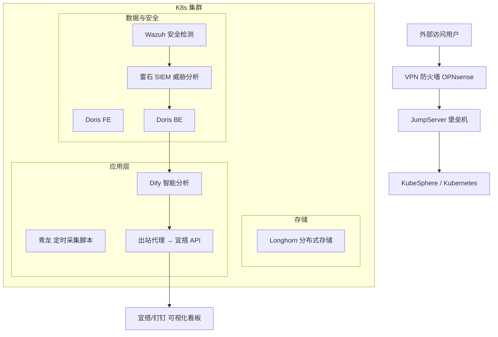

# 🐢 Xuanwu SecureOps Stack （玄武云盾）

**一个基于开源组件的低成本、安全、可扩展的私有云与安全运营中心（SOC）一体化平台。**

> 🏢 适用于：政企、国企、运营商、科研机构  
> 💡 特点：私有化部署 · 可持续升级 · 可审计可视化 · 无需公网依赖  

---

## 🚀 项目简介

**Xuanwu SecureOps Stack（玄武云盾）** 是一个开源的安全私有云与SOC一体化平台，  
结合 **KubeSphere + Longhorn + Apache Doris + Wazuh + 雷石 + Dify + JumpServer + 钉钉/宜搭**，  
提供从 **数据采集 → 安全检测 → 智能分析 → 可视化协作** 的全链路能力。

### 🌟 核心目标
- 🔁 **自动化运维**：一键安装、升级、迁移、启停脚本化；
- 🧠 **智能安全分析**：AI 自动生成告警摘要、安全周报；
- 🔒 **多层防护体系**：VPN、堡垒机、防火墙三重防线；
- 📊 **统一可视化**：SOC 告警、数据分析、运维指标统一展示；
- 🔧 **持续演进**：组件全部容器化，Helm + ArgoCD 支撑持续升级。

---

## 🧱 系统架构



---

## 🧩 核心组件

| 模块 | 组件 | 功能 |
|------|------|------|
| 容器编排 | **KubeSphere** | 可视化 K8s 管理、CI/CD、监控告警 |
| 分布式存储 | **Longhorn** | 高可用块存储、快照与备份 |
| 数据分析 | **Apache Doris** | 高性能 OLAP，日志与分析查询引擎 |
| 调度任务 | **青龙** | 定时数据采集、脚本化调度 |
| 安全检测 | **Wazuh** | 主机/终端检测、规则/合规检测 |
| 威胁情报 | **雷石 SIEM** | 日志关联分析、威胁情报集成 |
| 智能分析 | **Dify** | AI 报告、自动摘要与态势感知 |
| 防护体系 | **JumpServer + OPNsense + VPN** | 堡垒机、访问控制、防火墙、加密通道 |
| 展示协作 | **宜搭 + 钉钉** | 安全事件工单、可视化看板 |

---

## ⚙️ 快速部署（示例）

> 所有组件基于 Helm Chart，可一键部署。

```bash
git clone https://github.com/your-org/xuanwu-secureops-stack.git
cd xuanwu-secureops-stack
chmod +x scripts/install.sh
./scripts/install.sh
```

- 默认部署组件：
  - KubeSphere, Longhorn, Doris, Wazuh, 雷石, Dify, JumpServer
- 日志与监控默认接入：Loki + Prometheus
- 所有配置位于 `configs/values/*.yaml`

---

## 🧰 统一运维规范

| 分类 | 能力 | 实现方式 |
|------|------|-----------|
| **部署脚本化** | 一键安装/升级/回滚 | Helm + install.sh |
| **持续升级** | 自动拉取新版本镜像 | ArgoCD + upgrade.sh |
| **迁移备份** | 数据卷可迁移 | Longhorn Snapshot/Backup |
| **启停命令化** | 统一启停控制 | start-all.sh / stop-all.sh |
| **统一日志** | 运行/登录日志集中采集 | FluentBit + Wazuh + Loki |
| **身份认证** | 钉钉扫码登录 | OAuth2 Proxy + Dingtalk OIDC |
| **监控告警** | 集中可视化告警 | Prometheus + 宜搭看板 |

---

## 🔒 安全与合规特性

- 🧩 **访问控制**：VPN + 防火墙 + 堡垒机三重防线  
- 🧠 **安全检测**：Wazuh 检测系统与容器异常行为  
- 🛰️ **威胁情报**：雷石接入本地/国家级威胁情报源  
- 🔄 **日志留痕**：所有操作统一汇总 Doris 与 Loki  
- 📈 **AI 辅助分析**：Dify 结合大模型生成安全报告  

---

## 🧱 目录结构

```
SecureOps-Stack/
├── docs/                  # 架构、安装、日志、迁移等文档
├── manifests/             # 各组件的 Helm / YAML 模板
├── scripts/               # 安装、升级、备份、启停脚本
├── configs/               # values.yaml、认证配置、监控规则
└── .github/workflows/     # 自动化部署 CI/CD
```

---

## 🧩 项目许可证
- License: **Mulan PSL v2**
- 允许商用、修改、再发布，需保留原始声明。

---

## 🧠 社区与路线图

- ✅ **v1.0** 基础版（可部署可用）  
- 🔄 **v1.1** 增加可视化监控与安全态势看板  
- 🧠 **v1.2** 集成国产大模型接口（智谱、通义、文心）  
- 🔐 **v1.3** 增强 SOAR 自动响应与安全审计链  

欢迎参与贡献，共建国产安全生态。  
> GitHub Issues / Discussions 将用于需求征集与社区共创。  

---

## 🧑‍💻 联系与贡献

- 📫 贡献方式：Fork → Branch → PR  
- 🧑‍🤝‍🧑 社区支持：钉钉开源群 / 微信群 / GitHub Discussions  
- 📄 文档官网（规划中）：`https://xuanwu-secureops.io`  

---

**玄武云盾（Xuanwu SecureOps Stack）**  
> 🐢 以安全为基，以智能为核，以低成本构建可持续演进的私有云安全平台。
