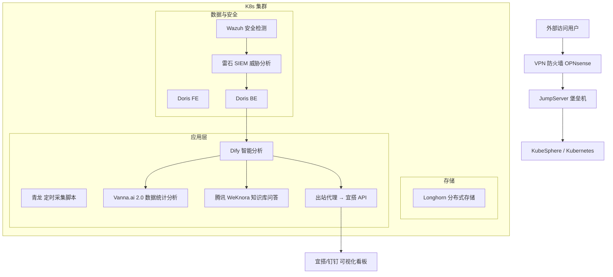

# 🐢 Xuanwu SecureOps Stack （玄武云盾）

**一个基于开源组件的低成本、安全、可扩展的私有云与安全运营中心（SOC）一体化平台。**

> 🏢 适用于：政企、国企、运营商、科研机构  
> 💡 特点：私有化部署 · 可持续升级 · 可审计可视化 · 无需公网依赖  

---

## 🚀 项目简介

**Xuanwu SecureOps Stack（玄武云盾）** 是一个开源的安全私有云与SOC一体化平台，
结合 **KubeSphere + Longhorn + Apache Doris + Wazuh + 雷石 + Dify + Vanna.ai 2.0 + 腾讯 WeKnora + JumpServer + 钉钉/宜搭**，
提供从 **数据采集 → 安全检测 → 智能分析 → 数据洞察 → 知识问答 → 可视化协作** 的全链路能力。

### 🌟 核心目标
- 🔁 **自动化运维**：一键安装、升级、迁移、启停脚本化；
- 🧠 **智能安全分析**：AI 自动生成告警摘要、安全周报；
- 🔒 **多层防护体系**：VPN、堡垒机、防火墙三重防线；
- 📊 **统一可视化**：SOC 告警、数据分析、运维指标统一展示；
- 🔧 **持续演进**：组件全部容器化，Helm + ArgoCD 支撑持续升级。

---

## 📦 版本信息

- **当前版本**：v1.0.0
- **发布日期**：2024-XX-XX
- **支持的 Kubernetes 版本**：1.20 - 1.28
- **支持的 Helm 版本**：3.8+
- **最新更新**：查看 [CHANGELOG.md](CHANGELOG.md)（如存在）

---

## 🧱 系统架构


```mermaid
graph TD
    U1[外部访问用户] --> VPN[VPN 防火墙 OPNsense]
    VPN --> BH[JumpServer 堡垒机]
    BH --> K8s[KubeSphere / Kubernetes]

    subgraph "K8s 集群"
        subgraph 存储
            LH[Longhorn 分布式存储]
        end

        subgraph "数据与安全"
            FE[Doris FE]
            BE[Doris BE]
            WZ[Wazuh 安全检测]
            LS[雷石 SIEM 威胁分析]
        end

        subgraph 应用层
            QL[青龙 定时采集脚本]
            DF[Dify 智能分析]
            VNA[Vanna.ai 2.0 数据统计分析]
            WEK[腾讯 WeKnora 知识库问答]
            OUT[出站代理 → 宜搭 API]
        end
    end

    DF --> VNA
    DF --> WEK
    BE --> DF --> OUT --> YD[宜搭/钉钉 可视化看板]
    WZ --> LS --> BE
```

---

## 🧩 核心组件

| 模块 | 组件 | 功能 |
|------|------|------|
| 容器编排 | **KubeSphere** | 可视化 K8s 管理、CI/CD、监控告警 |
| 分布式存储 | **Longhorn** | 高可用块存储、快照与备份 |
| 数据分析 | **Apache Doris** | 高性能 OLAP，日志与分析查询引擎 |
| 调度任务 | **青龙** | 定时数据采集、脚本化调度 |
| 安全检测 | **Wazuh** | 主机/终端检测、规则/合规检测 |
| 威胁情报 | **雷石 SIEM** | 日志关联分析、威胁情报集成 |
| 智能分析 | **Dify** | AI 报告、自动摘要与态势感知 |
| 数据洞察 | **Vanna.ai 2.0** | SQL 驱动的数据统计与分析插件 |
| 知识库问答 | **腾讯 WeKnora** | 私域知识库管理与问答协作 |
| 防护体系 | **JumpServer + OPNsense + VPN** | 堡垒机、访问控制、防火墙、加密通道 |
| 展示协作 | **宜搭 + 钉钉** | 安全事件工单、可视化看板 |

---

## ⚡ 快速开始（5 分钟体验）

> 仅用于验证部署，生产环境请参考完整部署步骤。

```bash
# 1. 克隆仓库
git clone https://github.com/your-org/xuanwu-secureops-stack.git
cd xuanwu-secureops-stack

# 2. 配置最小环境变量
cp .env.example .env
# 编辑 .env，填入必要的连接信息

# 3. 一键部署（开发模式）
make dev-deploy
# 或直接运行: ./scripts/install.sh --dev
```

> 💡 提示：开发模式使用本地存储，不依赖云服务，适合本地测试。

---

## 📋 前置条件

### 系统要求
- **Kubernetes**：v1.20+（推荐 v1.24+）
- **Helm**：v3.8+
- **存储**：至少 100GB 可用空间（Longhorn 分布式存储）
- **网络**：内网带宽建议 ≥ 100Mbps
- **硬件资源**：至少 3 节点，每节点 8C32G

### 权限要求
- Kubernetes 集群管理员权限
- 命名空间创建权限（默认使用 `xuanwu` 命名空间）
- 钉钉/宜搭管理员权限（如需 SSO 集成）

### 部署前检查清单

- [ ] Kubernetes 集群版本符合要求（v1.20+）
- [ ] Helm 已安装（v3.8+）
- [ ] 存储类（StorageClass）已配置
- [ ] 网络策略允许必要流量
- [ ] 权限配置正确（集群 RBAC）
- [ ] 域名/证书准备（如需 HTTPS）
- [ ] 备份策略已规划

---

## ⚙️ 快速部署

> 所有组件基于 Helm Chart，可一键部署。

```bash
git clone https://github.com/your-org/xuanwu-secureops-stack.git
cd xuanwu-secureops-stack
chmod +x scripts/install.sh
./scripts/install.sh
```

- 默认部署组件：
  - KubeSphere, Longhorn, Doris, Wazuh, 雷石, Dify, Vanna.ai 2.0, 腾讯 WeKnora, JumpServer
- 日志与监控默认接入：Loki + Prometheus
- 所有配置位于 `configs/values/*.yaml`

### 配置示例

#### Dify 配置（`configs/dify/values.yaml`）
```yaml
database:
  type: mysql
  host: doris-fe-service
  port: 9030
  user: root
  password: ""  # 建议使用 Secret

api:
  baseUrl: http://dify-service:5001
  
workflow:
  vanna:
    endpoint: http://vanna-service:8000
  weknora:
    endpoint: http://weknora-service:8080
    apiKey: ""  # 建议使用 Secret
```

#### 青龙任务配置示例（`configs/qinglong/tasks.json`）
```json
{
  "name": "采集安全事件",
  "command": "python /scripts/collect_security_events.py",
  "schedule": "0 */1 * * *",
  "env": {
    "DORIS_HOST": "doris-fe-service",
    "DORIS_DB": "security_db"
  }
}
```

### 🔐 环境变量配置

#### Dify 环境变量
| 变量名 | 说明 | 示例 |
|--------|------|------|
| `DIFY_DB_HOST` | 数据库地址 | `doris-fe-service` |
| `DIFY_DB_PORT` | 数据库端口 | `9030` |
| `DIFY_DB_USER` | 数据库用户 | `root` |
| `DIFY_DB_PASSWORD` | 数据库密码 | `***` |
| `DIFY_API_BASE_URL` | API 基础地址 | `http://dify-service:5001` |

#### 青龙环境变量
| 变量名 | 说明 | 示例 |
|--------|------|------|
| `QL_DORIS_HOST` | Doris 连接地址 | `doris-fe-service` |
| `QL_DORIS_DB` | 目标数据库名 | `security_db` |
| `QL_LOG_LEVEL` | 日志级别 | `INFO` |

### 验证部署

#### 检查 Pod 状态
```bash
kubectl get pods -A | grep -E 'qinglong|dify|wazuh|doris'
```

#### 检查服务连通性
```bash
# 测试 Dify API
curl http://dify-service:5001/api/health

# 测试 Doris 连接
mysql -h doris-fe-service -P 9030 -u root -e "SHOW FRONTENDS;"
```

#### 查看日志
```bash
# 查看青龙日志
kubectl logs -f deployment/qinglong -n xuanwu

# 查看 Dify 日志
kubectl logs -f deployment/dify -n xuanwu
```

---

## 🧰 统一运维规范

| 分类 | 能力 | 实现方式 |
|------|------|-----------|
| **部署脚本化** | 一键安装/升级/回滚 | Helm + install.sh |
| **持续升级** | 自动拉取新版本镜像 | ArgoCD + upgrade.sh |
| **迁移备份** | 数据卷可迁移 | Longhorn Snapshot/Backup |
| **启停命令化** | 统一启停控制 | start-all.sh / stop-all.sh |
| **统一日志** | 运行/登录日志集中采集 | FluentBit + Wazuh + Loki |
| **身份认证** | 钉钉扫码登录 | OAuth2 Proxy + Dingtalk OIDC |
| **监控告警** | 集中可视化告警 | Prometheus + 宜搭看板 |

---

## 🔒 安全与合规特性

- 🧩 **访问控制**：VPN + 防火墙 + 堡垒机三重防线  
- 🧠 **安全检测**：Wazuh 检测系统与容器异常行为  
- 🛰️ **威胁情报**：雷石接入本地/国家级威胁情报源  
- 🔄 **日志留痕**：所有操作统一汇总 Doris 与 Loki  
- 📈 **AI 辅助分析**：Dify 联动 Vanna.ai 2.0 生成数据洞察与安全报告
- 📚 **知识库赋能**：腾讯 WeKnora 管理问答知识库支持安全协作

### 🔒 安全最佳实践

#### 访问控制
- **最小权限原则**：Kubernetes RBAC 仅授予必要权限
- **网络隔离**：使用 NetworkPolicy 隔离不同层级服务
- **白名单机制**：数据库仅允许应用 Pod IP 段访问

#### 密钥管理
- **使用 Secret**：敏感信息存储在 K8s Secret，不写入代码
```bash
# 示例：创建 Secret
kubectl create secret generic db-credentials \
  --from-literal=username=root \
  --from-literal=password=<secure-password> \
  -n xuanwu
```

#### 日志审计
- **操作日志**：所有 K8s API 调用记录在审计日志
- **访问日志**：VPN、堡垒机访问日志统一汇总至 Doris/Loki
- **合规存储**：日志保留 180 天（满足等保要求）

### 📜 合规性支持

#### 等保要求
- ✅ **三级等保**：满足等保三级技术要求
- ✅ **日志留存**：操作日志保留 ≥ 180 天
- ✅ **身份认证**：支持钉钉 SSO 统一身份
- ✅ **访问审计**：堡垒机记录所有运维操作

#### 数据合规
- ✅ **数据加密**：传输加密（TLS 1.2+），存储加密（Longhorn 加密）
- ✅ **数据备份**：每日自动快照，支持异地备份
- ✅ **数据脱敏**：敏感数据查询支持脱敏（需配置规则）

---

## 🎯 典型应用场景

### 场景 1：安全告警自动分析
1. Wazuh 检测到异常行为 → 推送至雷石 SIEM
2. 雷石分析后写入 Doris `sec_events` 表
3. Dify 定时查询新增告警 → 调用 LLM 生成摘要
4. 结果推送至钉钉群，并更新宜搭看板

### 场景 2：安全周报自动生成
1. 青龙定时任务（每周一 9:00）触发
2. Dify 查询 Doris 过去 7 天安全事件
3. Vanna.ai 2.0 生成统计图表（攻击趋势、Top 威胁）
4. Dify 调用 LLM 生成结构化周报
5. 推送至钉钉 + 宜搭，同时录入 WeKnora 知识库

### 场景 3：知识库问答辅助处置
1. 安全分析员在 WeKnora 提问："如何处置挖矿病毒？"
2. WeKnora 查询知识库返回处置步骤
3. 如无答案，调用 Dify 生成建议
4. 将问答结果录入知识库，形成知识沉淀

---

## 🧱 目录结构

```
SecureOps-Stack/
├── docs/                  # 架构、安装、日志、迁移等文档
├── manifests/             # 各组件的 Helm / YAML 模板
├── scripts/               # 安装、升级、备份、启停脚本
├── configs/               # values.yaml、认证配置、监控规则
└── .github/workflows/     # 自动化部署 CI/CD
```

---

## 🧩 项目许可证
- License: **Mulan PSL v2**
- 允许商用、修改、再发布，需保留原始声明。

---

## 🧠 社区与路线图

- ✅ **v1.0** 基础版（可部署可用）  
- 🔄 **v1.1** 增加可视化监控与安全态势看板  
- 🧠 **v1.2** 集成国产大模型接口（智谱、通义、文心）  
- 🔐 **v1.3** 增强 SOAR 自动响应与安全审计链  

欢迎参与贡献，共建国产安全生态。  
> GitHub Issues / Discussions 将用于需求征集与社区共创。  

---

## 🔧 故障排查

### 常见问题

#### Q1: Pod 启动失败，提示存储卷挂载错误
**原因**：PVC 未创建或存储类配置错误  
**解决**：
```bash
# 检查 PVC
kubectl get pvc -n xuanwu
# 检查 StorageClass
kubectl get storageclass
# 检查 Longhorn 是否正常运行
kubectl get pods -n longhorn-system
```

#### Q2: Dify 无法连接 Doris/MySQL
**原因**：网络策略或服务发现未配置  
**解决**：
- 检查服务端点可达性：`kubectl get svc -n xuanwu`
- 验证 NetworkPolicy 规则
- 确认数据库白名单包含 Pod IP 段

#### Q3: 钉钉 SSO 登录失败
**原因**：OAuth 回调地址配置错误  
**解决**：检查钉钉应用配置中的回调地址是否与部署环境匹配

#### Q4: Wazuh Agent 无法连接 Manager
**原因**：网络策略或防火墙规则限制  
**解决**：检查 Wazuh Manager 服务端口（1514, 1515）是否开放

---

## 🗑️ 卸载步骤

### 清理 Helm 部署
```bash
helm uninstall qinglong -n xuanwu
helm uninstall dify -n xuanwu
helm uninstall wazuh -n xuanwu
helm uninstall doris -n xuanwu
# ... 卸载其他组件
```

### 清理 PVC（谨慎操作）
```bash
# ⚠️ 警告：这将删除所有数据
kubectl delete pvc -n xuanwu --all
```

### 清理命名空间
```bash
kubectl delete namespace xuanwu
```

---

## 🧑‍💻 联系与贡献

### 文档贡献
- 发现问题？提交 [Issue](https://github.com/your-org/xuanwu-secureops-stack/issues)
- 改进建议？查看 [贡献指南](CONTRIBUTING.md)（如存在）
- 文档翻译？参考 [翻译指南](docs/i18n.md)（如存在）

### 代码贡献
- Fork → 创建特性分支 → 提交 PR
- 代码规范：遵循项目 [代码风格](docs/coding-standards.md)（如存在）
- 提交规范：遵循 [Conventional Commits](https://www.conventionalcommits.org/)

### 社区支持
- 📫 贡献方式：Fork → Branch → PR  
- 🧑‍🤝‍🧑 社区支持：钉钉开源群 / 微信群 / GitHub Discussions  
- 📄 文档官网（规划中）：`https://xuanwu-secureops.io`  

---

## 📚 术语表

| 术语 | 英文 | 说明 |
|------|------|------|
| 玄武云盾 | Xuanwu SecureOps Stack | 本项目的完整名称 |
| SOC | Security Operations Center | 安全运营中心 |
| EDR | Endpoint Detection and Response | 终端检测与响应 |
| SIEM | Security Information and Event Management | 安全信息与事件管理 |
| SSO | Single Sign-On | 单点登录 |
| OLAP | Online Analytical Processing | 在线分析处理 |

---

**玄武云盾（Xuanwu SecureOps Stack）**
> 🐢 以安全为基，以智能为核，以低成本构建可持续演进的私有云安全平台。
> 📚 借助 Vanna.ai 2.0 与腾讯 WeKnora 打通数据洞察与知识问答闭环。
