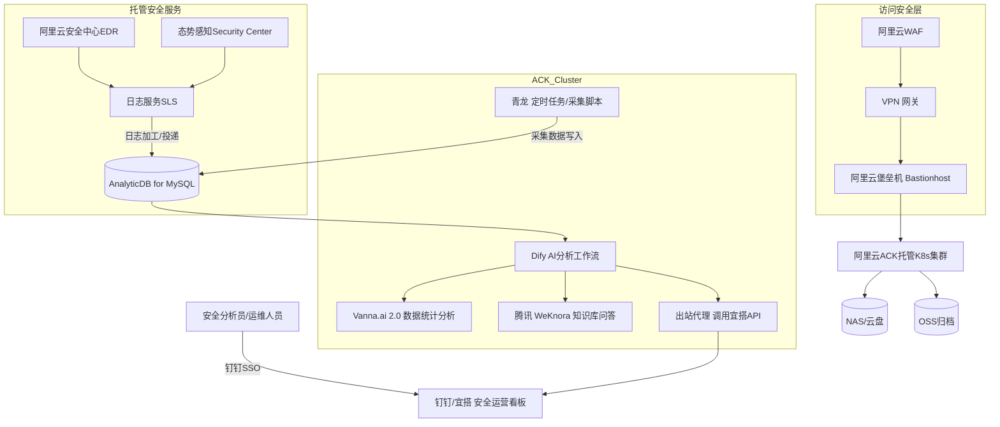

# 🐢 玄武云盾 · 阿里云安全原生版  
**Xuanwu SecureOps Stack · Apsara Edition**

> 基于阿里云原生安全服务打造的低成本、安全可视化、智能化私有云安全运营平台（SOC + 数据分析一体化）。

---

## 🚀 项目简介

**玄武云盾（Xuanwu SecureOps Stack）** 是一个开源安全运营与数据分析一体化平台。  
此版本基于 **阿里云安全生态** 实现全托管部署，无需自建 Wazuh、雷石、Loki、Doris 等复杂组件。

系统通过阿里云 **WAF + VPN + 堡垒机 + 安全中心 + 态势感知 + 日志服务 + ADB + Dify + Vanna.ai 2.0 + 腾讯 WeKnora + 钉钉/宜搭**
实现了从数据采集 → 日志分析 → 智能报告 → 数据洞察 → 知识问答 → 可视化协作的完整闭环。

---

## 📦 版本信息

- **当前版本**：v1.0.0
- **发布日期**：2024-XX-XX
- **支持的 Kubernetes 版本**：1.20 - 1.28
- **支持的 Helm 版本**：3.8+
- **阿里云 ACK 版本**：建议使用托管版 ACK v1.24+

---

## 🧱 系统架构



---

## 🧩 组件清单

| 层级 | 服务 | 功能定位 |
|------|------|-----------|
| **访问安全层** | WAF + VPN 网关 + 堡垒机 | 网络防护、远程接入、运维审计 |
| **容器运行层** | 阿里云 ACK | 承载自定义服务（青龙、Dify、Vanna.ai 2.0、WeKnora、代理） |
| **采集层** | 青龙 | 定时采集数据（API/数据库/系统） |
| **数据分析层** | AnalyticDB for MySQL | 高性能 OLAP 分析引擎 |
| **日志与安全层** | 日志服务 SLS | 统一日志收集、分析、投递 |
| **威胁检测层** | 安全中心 (EDR) + 态势感知 (SAS) | 主机防护、漏洞检测、威胁情报 |
| **AI分析层** | Dify | 智能分析、自然语言报告、触发插件编排 |
| **数据洞察层** | Vanna.ai 2.0 | SQL 辅助的数据统计与图表分析 |
| **知识库问答层** | 腾讯 WeKnora | 安全知识库管理与问答工作台 |
| **展示协作层** | 宜搭 / 钉钉 | 告警可视化、工单流转 |

---

## 🧠 数据流闭环

1️⃣ **采集层**  
- 青龙采集业务与安全数据写入 ADB。  
- EDR 与 SAS 采集主机与云资源安全事件。  

2️⃣ **日志汇聚层**  
- 所有日志进入 SLS → 做加工与清洗 → 投递到 ADB。  

3️⃣ **智能分析层**
- Dify 通过 SQL 查询 ADB 数据 → 调用 Vanna.ai 2.0 进行数据统计与可视化洞察。
- Dify 联动大模型生成结构化安全报告。

4️⃣ **展示协作层**
- Dify 输出结果推送到 宜搭 安全看板，并同步给腾讯 WeKnora 形成知识库问答条目。
- 钉钉机器人推送告警与报告，WeKnora 提供知识库问答支撑处置。

---

## ⚡ 快速开始（5 分钟体验）

> 仅用于验证部署，生产环境请参考完整部署步骤。

```bash
# 1. 克隆仓库
git clone https://github.com/your-org/xuanwu-secureops-stack.git
cd xuanwu-secureops-stack

# 2. 配置最小环境变量
cp .env.example .env
# 编辑 .env，填入阿里云必要的连接信息

# 3. 一键部署（开发模式）
make dev-deploy
# 或直接运行: ./scripts/install.sh --dev
```

> 💡 提示：开发模式使用本地存储，不依赖云服务，适合本地测试。

---

## 📋 前置条件

### 系统要求
- **Kubernetes**：阿里云 ACK v1.20+（推荐 v1.24+）
- **Helm**：v3.8+
- **存储**：至少 100GB 可用空间（NAS 文件存储）
- **网络**：内网带宽建议 ≥ 100Mbps
- **硬件资源**：参考"云上部署最小配置"章节

### 权限要求
- Kubernetes 集群管理员权限
- 阿里云账号服务开通权限（ACK、NAS、OSS、SLS、ADB、WAF、VPN、堡垒机、安全中心）
- RAM 用户权限（如需细粒度权限控制）
- 钉钉/宜搭管理员权限（如需 SSO 集成）

### 部署前检查清单

- [ ] Kubernetes 集群版本符合要求（v1.20+）
- [ ] Helm 已安装（v3.8+）
- [ ] 云服务已开通（ACK、NAS、OSS、SLS、ADB、WAF、VPN、堡垒机、安全中心）
- [ ] 网络策略允许必要流量
- [ ] 权限配置正确（RAM/集群 RBAC）
- [ ] 域名/证书准备（如需 HTTPS）
- [ ] 备份策略已规划
- [ ] 统一身份体系已配置（RAM + 钉钉SSO）

---

## ⚙️ 部署步骤

### Step 1: 云资源准备
- 开通阿里云服务：ACK、NAS、OSS、SLS、ADB、WAF、VPN、堡垒机、安全中心（含态势感知）；
- 配置统一身份体系（RAM + 钉钉SSO）。

### Step 2: 部署容器
```bash
# 在阿里云 ACK 中部署核心服务
helm install qinglong ./charts/qinglong
helm install dify ./charts/dify
helm install outbound ./charts/outbound
```
- 可选：为 Vanna.ai 2.0 与腾讯 WeKnora 准备独立的 Deployment/Service，并在 Dify 中配置对应的外接连接地址。

### Step 3: 日志接入
- 在 SLS 中创建 Project / Logstore；  
- 启用 ACK 日志采集（Logtail DaemonSet）；  
- 建立 SLS 投递任务 → ADB 表。

### Step 4: 配置 AnalyticDB
```sql
CREATE TABLE sec_events (
  id BIGINT AUTO_INCREMENT PRIMARY KEY,
  ts DATETIME,
  src VARCHAR(64),
  type VARCHAR(64),
  severity VARCHAR(16),
  msg TEXT
);
```

### Step 5: Dify 连接 ADB
- 配置 MySQL 数据源（ADB 连接串）；
- 编排 SQL → Vanna.ai 2.0 → LLM → 输出卡片 的工作流；
- 输出数据写入宜搭表或钉钉机器人，并同步推送至腾讯 WeKnora 知识库。
- 在 Dify 中配置 WeKnora API/凭证，实现知识问答与工作台联动。

### Step 6: 验证部署

#### 检查 Pod 状态
```bash
kubectl get pods -A | grep -E 'qinglong|dify|outbound'
```

#### 检查服务连通性
```bash
# 测试 Dify API
curl http://dify-service:5001/api/health

# 测试 ADB 连接
mysql -h <adb-endpoint> -u <user> -p -e "SHOW TABLES;"
```

#### 查看日志
```bash
# 查看青龙日志
kubectl logs -f deployment/qinglong -n xuanwu

# 查看 Dify 日志
kubectl logs -f deployment/dify -n xuanwu
```

### 配置示例

#### Dify 配置（`configs/dify/values.yaml`）
```yaml
database:
  type: mysql
  host: adb-xxx.mysql.polardb.rds.aliyuncs.com
  port: 3306
  user: dify_user
  password: "***"  # 建议使用 Secret

api:
  baseUrl: http://dify-service:5001
  
workflow:
  vanna:
    endpoint: http://vanna-service:8000
  weknora:
    endpoint: http://weknora-service:8080
    apiKey: "***"  # 建议使用 Secret
```

#### 青龙任务配置示例（`configs/qinglong/tasks.json`）
```json
{
  "name": "采集安全事件",
  "command": "python /scripts/collect_security_events.py",
  "schedule": "0 */1 * * *",
  "env": {
    "ADB_HOST": "adb-xxx.mysql.polardb.rds.aliyuncs.com",
    "ADB_DB": "security_db"
  }
}
```

### 🔐 环境变量配置

#### Dify 环境变量
| 变量名 | 说明 | 示例 |
|--------|------|------|
| `DIFY_DB_HOST` | 数据库地址 | `adb-xxx.mysql.polardb.rds.aliyuncs.com` |
| `DIFY_DB_PORT` | 数据库端口 | `3306` |
| `DIFY_DB_USER` | 数据库用户 | `dify_user` |
| `DIFY_DB_PASSWORD` | 数据库密码 | `***` |
| `DIFY_API_BASE_URL` | API 基础地址 | `http://dify-service:5001` |

#### 青龙环境变量
| 变量名 | 说明 | 示例 |
|--------|------|------|
| `QL_ADB_HOST` | ADB 连接地址 | `adb-xxx.mysql.polardb.rds.aliyuncs.com` |
| `QL_ADB_DB` | 目标数据库名 | `security_db` |
| `QL_LOG_LEVEL` | 日志级别 | `INFO` |

---

## 🔒 安全与运维规范

| 领域 | 策略 |
|------|-------|
| **访问控制** | WAF、VPN、堡垒机三级防护 |
| **主机防护** | EDR 统一威胁检测与修复 |
| **日志合规** | SLS 集中存储，OSS 归档 |
| **数据安全** | ADB 持久加密，NAS/OSS 快照备份 |
| **AI安全** | Dify 仅通过内网访问 ADB，不暴露公网 |
| **身份认证** | 全系统钉钉扫码SSO |
| **自动升级** | ACK + Helm + ADB 托管更新 |
| **告警通知** | SLS/SAS → 钉钉机器人/宜搭看板 |

### 🔒 安全最佳实践

#### 访问控制
- **最小权限原则**：RAM 用户仅授予必要权限
- **网络隔离**：使用 VPC 子网隔离不同层级服务
- **白名单机制**：数据库仅允许应用 Pod IP 段访问

#### 密钥管理
- **使用 Secret**：敏感信息存储在 K8s Secret，不写入代码
```bash
# 示例：创建 Secret
kubectl create secret generic adb-credentials \
  --from-literal=username=dify_user \
  --from-literal=password=<secure-password> \
  -n xuanwu
```

#### 日志审计
- **操作日志**：所有 K8s API 调用记录在审计日志
- **访问日志**：WAF、VPN、堡垒机访问日志统一汇总至 SLS
- **合规存储**：日志保留 180 天（满足等保要求）

### 📜 合规性支持

#### 等保要求
- ✅ **三级等保**：满足等保三级技术要求
- ✅ **日志留存**：操作日志保留 ≥ 180 天
- ✅ **身份认证**：支持钉钉 SSO 统一身份
- ✅ **访问审计**：堡垒机记录所有运维操作

#### 数据合规
- ✅ **数据加密**：传输加密（TLS 1.2+），存储加密（ADB 透明加密）
- ✅ **数据备份**：每日自动快照，支持异地备份
- ✅ **数据脱敏**：敏感数据查询支持脱敏（需配置规则）

---

## 🧩 优势总结

| 维度 | 优势 |
|------|------|
| 🧱 架构轻量 | 无需自建 Wazuh/雷石/Doris |
| 🔒 安全可靠 | 全托管安全中心 + WAF + VPN |
| 🧠 智能分析 | ADB + Dify + Vanna.ai 2.0 自动生成数据洞察与安全报告 |
| 📊 可视化 | 宜搭/钉钉 工单+看板一体化 |
| 📚 知识沉淀 | 腾讯 WeKnora 持续积累安全问答知识库 |
| ⚙️ 易维护 | 云上服务运维自动化 |
| 🔁 可迁移 | 保留 K8s 架构，可平滑回私有云 |

---

## 📈 云上部署最小配置

| 模块 | 规格建议 |
|------|-----------|
| ACK 集群 | 3节点 8C32G |
| ADB MySQL | 按量型 4C16G 起 |
| SLS | 1 Project + 多 Logstore |
| NAS 存储 | 500GB 起步 |
| EDR + SAS | 默认启用全局检测 |
| Dify | 2C4G 容器即可 |
| Vanna.ai 2.0 | 2C4G 容器（或云托管服务） |
| 腾讯 WeKnora | SaaS 集成，建议专线或 VPN 访问 |
| 宜搭/钉钉 | SaaS 集成 |

---

## 💰 成本估算（按月，仅供参考）

| 服务 | 规格 | 估算成本（元/月） |
|------|------|------------------|
| ACK 集群（3节点） | 8C32G 按量付费 | ~3,000 |
| ADB for MySQL | 4C16G 按量付费 | ~800 |
| NAS 存储 | 500GB | ~150 |
| SLS 日志服务 | 100GB/天 | ~300 |
| EDR + SAS | 按资产数 | ~500 |
| WAF + VPN + 堡垒机 | 基础版 | ~1,500 |
| **总计** | | **~6,250** |

> ⚠️ 实际成本受使用量、地域、折扣等因素影响，请以阿里云控制台为准。

---

## 📈 性能指标

### 数据处理能力
- **日志吞吐**：支持 10万条/秒（SLS → ADB）
- **查询响应**：ADB 查询延迟 < 100ms（P95）
- **并发分析**：Dify 工作流支持 50 并发

### 存储容量
- **日志保留**：默认 30 天（SLS），长期归档至 OSS
- **数据库容量**：建议 ADB 初始 500GB，按需扩容

### 可用性
- **服务 SLA**：目标 99.9%（依赖云服务 SLA）
- **数据备份**：每日自动快照（NAS/OSS）

---

## 🎯 典型应用场景

### 场景 1：安全告警自动分析
1. EDR 检测到异常行为 → 推送至 SLS
2. SLS 投递事件至 ADB `sec_events` 表
3. Dify 定时查询新增告警 → 调用 LLM 生成摘要
4. 结果推送至钉钉群，并更新宜搭看板

### 场景 2：安全周报自动生成
1. 青龙定时任务（每周一 9:00）触发
2. Dify 查询 ADB 过去 7 天安全事件
3. Vanna.ai 2.0 生成统计图表（攻击趋势、Top 威胁）
4. Dify 调用 LLM 生成结构化周报
5. 推送至钉钉 + 宜搭，同时录入 WeKnora 知识库

### 场景 3：知识库问答辅助处置
1. 安全分析员在 WeKnora 提问："如何处置挖矿病毒？"
2. WeKnora 查询知识库返回处置步骤
3. 如无答案，调用 Dify 生成建议
4. 将问答结果录入知识库，形成知识沉淀

---

## 🔧 故障排查

### 常见问题

#### Q1: Pod 启动失败，提示存储卷挂载错误
**原因**：PVC 未创建或存储类配置错误  
**解决**：
```bash
# 检查 PVC
kubectl get pvc -n xuanwu
# 检查 StorageClass
kubectl get storageclass
```

#### Q2: Dify 无法连接 ADB/MySQL
**原因**：网络策略或白名单未配置  
**解决**：
- 检查服务端点可达性
- 验证安全组规则（阿里云版本）
- 确认数据库白名单包含 Pod IP 段

#### Q3: 钉钉 SSO 登录失败
**原因**：OAuth 回调地址配置错误  
**解决**：检查钉钉应用配置中的回调地址是否与部署环境匹配

#### Q4: SLS 日志投递失败
**原因**：ADB 表结构不匹配或权限不足  
**解决**：
- 检查 SLS 投递任务配置
- 验证 ADB 表结构与日志格式匹配
- 确认 RAM 用户具有 ADB 写入权限

---

## 🗑️ 卸载步骤

### 清理 Helm 部署
```bash
helm uninstall qinglong -n xuanwu
helm uninstall dify -n xuanwu
helm uninstall outbound -n xuanwu
```

### 清理 PVC（谨慎操作）
```bash
# ⚠️ 警告：这将删除所有数据
kubectl delete pvc -n xuanwu --all
```

### 清理命名空间
```bash
kubectl delete namespace xuanwu
```

---

## 🧩 一句话总结

> **玄武云盾 · 阿里云安全原生版（Xuanwu SecureOps Stack · Apsara Edition）**  
> 以阿里云 **WAF + VPN + 堡垒机 + EDR + 态势感知 + SLS + ADB + Dify + Vanna.ai 2.0 + 腾讯 WeKnora + 钉钉/宜搭**
> 打造一个 **零自建、零暴露、智能化、安全可视化** 的云上安全运营与分析平台。

---

## 📜 许可证
- License: **Mulan PSL v2**
- 可自由商用、修改、再发布，需保留原始声明。

---

## 🤝 参与共建

### 文档贡献
- 发现问题？提交 [Issue](https://github.com/your-org/xuanwu-secureops-stack/issues)
- 改进建议？查看 [贡献指南](CONTRIBUTING.md)（如存在）
- 文档翻译？参考 [翻译指南](docs/i18n.md)（如存在）

### 代码贡献
- Fork → 创建特性分支 → 提交 PR
- 代码规范：遵循项目 [代码风格](docs/coding-standards.md)（如存在）
- 提交规范：遵循 [Conventional Commits](https://www.conventionalcommits.org/)

### 社区支持
- Fork & PR 贡献模板与工作流  
- 欢迎在 GitHub Discussions 分享安全场景与最佳实践  

---

## 📚 术语表

| 术语 | 英文 | 说明 |
|------|------|------|
| 玄武云盾 | Xuanwu SecureOps Stack | 本项目的完整名称 |
| SOC | Security Operations Center | 安全运营中心 |
| EDR | Endpoint Detection and Response | 终端检测与响应 |
| SLS | Simple Log Service | 阿里云日志服务 |
| ADB | AnalyticDB for MySQL | 分析型数据库 |
| SSO | Single Sign-On | 单点登录 |
| ACK | Alibaba Cloud Container Service for Kubernetes | 阿里云容器服务 |

---

**玄武云盾 Xuanwu SecureOps Stack**
> 🐢 安全为基 · 智能为核 · 以低成本构建可持续演进的云上安全平台。
> 📚 联动 Vanna.ai 2.0 与腾讯 WeKnora，沉淀安全数据洞察与知识问答资产。
